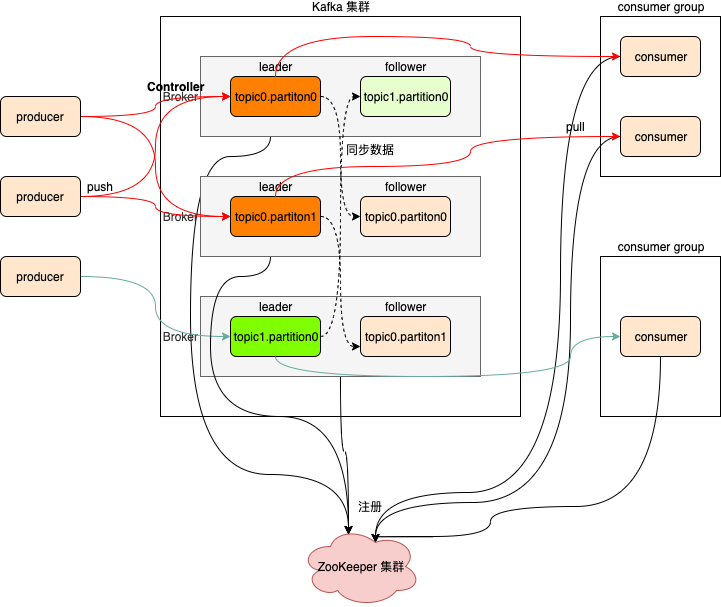
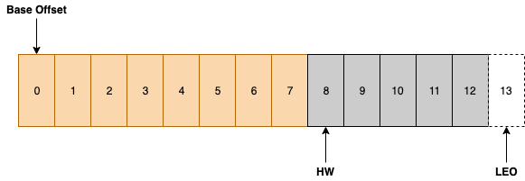

# 消息系统

## 为什么要有消息系统

**解耦**
允许你独立的扩展或修改两边的处理过程，只要确保它们遵守同样的接口约束。系统不直接调用，降低依赖，特别是不在线也能保持通信最终完成。

**冗余**
消息队列把数据进行持久化直到它们已经被完全处理，通过这一方式规避了数据丢失风险。许多消息队列所采用的"插入-获取-删除"范式中，在把一个消息从队列中删除之前，需要你的处理系统明确的指出该消息已经被处理完毕，从而确保你的数据被安全的保存直到你使用完毕。

**扩展性**
因为消息队列解耦了你的处理过程，所以增大消息入队和处理的频率是很容易的，只要另外增加处理过程即可。

**灵活性 & 峰值处理能力**
在访问量剧增的情况下，应用仍然需要继续发挥作用，但是这样的突发流量并不常见。如果为以能处理这类峰值访问为标准来投入资源随时待命无疑是巨大的浪费。使用消息队列能够使关键组件顶住突发的访问压力，而不会因为突发的超负荷的请求而完全崩溃。压力大的时候，缓冲部分请求消息，类似于背压处理。 

**可恢复性**
系统的一部分组件失效时，不会影响到整个系统。消息队列降低了进程间的耦合度，所以即使一个处理消息的进程挂掉，加入队列中的消息仍然可以在系统恢复后被处理。

**顺序保证**
在大多使用场景下，数据处理的顺序都很重要。大部分消息队列本来就是排序的，并且能保证数据会按照特定的顺序来处理。（Kafka 保证一个 Partition 内的消息的有序性）

- 分区、多线程、预读可能会导致消息无序

**缓冲**
有助于控制和优化数据流经过系统的速度，解决生产消息和消费消息的处理速度不一致的情况。

**异步通信**
很多时候，用户不想也不需要立即处理消息。消息队列提供了<font color=red>异步处理</font>机制，允许用户把一个消息放入队列，但并不立即处理它。想向队列中放入多少消息就放多少，然后在需要的时候再去处理它们。异步通信，减少线程等待，特别是处理批量等大事务、耗时操作。 


## 核心概念

Kafka最初由Linkedin公司开发，是一个**分布式**、**分区的**、**多副本的**、**多订阅者**，**基于zookeeper协调**的分布式日志系统（也可以当做MQ系统），常见可以用于web/nginx日志、访问日志，消息服务等等，Linkedin于2010年贡献给了Apache基金会并成为顶级开源项目。

kafka是一个分布式消息队列。具有高性能、持久化、多副本备份、横向扩展能力。生产者往队列里写消息，消费者从队列里取消息进行业务逻辑。Kafka就是一种<font color=red>发布-订阅模式</font>。将消息保存在磁盘中，以顺序读写方式访问磁盘，避免随机读写导致性能瓶颈。


## 特性

- 高吞吐、低延迟

  kakfa 最大的特点就是收发消息非常快，kafka 每秒可以处理几十万条消息，它的最低延迟只有几毫秒。

- 高伸缩性

  每个主题（topic）包含多个分区（partition），主题中的分区可以分布在不同的主机（broker）中。

- 持久性、可靠性

  Kafka 能够允许数据的持久化存储，消息被持久化到磁盘，并支持数据备份防止数据丢失。

- 容错性

  允许集群中的节点失败，某个节点宕机，Kafka 集群能够正常工作。

- 高并发

  支持数千个客户端同时读写。


## 消息处理模式

- 点对点：PTP，Point-To-Point 对应于 Queue，一个消息对应一个消费者
- 发布订阅：PubSub，Publish-Subscribe 对应于 Topic，一个消息对应多个消费者


## 消息处理的保障

三种QoS，<font color=red>平衡可靠性和性能</font>

注意：这是消息语义的，不是业务语义的

- At most once（0-1），至多一次，消息可能丢失但是不会重复发送

- At least once（1-*），至少一次，**消息不会丢失**，但是可能会重复
  - 建议使用此种策略，可以在业务层面保证消息的唯一性，如：幂等，去重（RoaringBitmap）

- Exactly once（1），精确一次，每条消息肯定会被传输一次且仅一次

消息处理的事务性

- 通过确认机制实现事务性

- 可以被事务管理器管理，甚至可以支持XA


## 消息协议

### STOMP

面向流文本的消息传输协议（STOMP，Streaming Text Oriented Messaging Protocol），是 WebSocket 通信标准。在通常的发布－订阅语义之上，它通过 begin/publish/commit 序列以及 acknowledgement 机制来提供消息可靠投递。

由于协议简单且易于实现，几乎所有的编程语言都有 STOMP 的客户端实现。但是在消息大小和处理速度方面并无优势。

### JMS

Java 消息服务（JMS，Java Messaging Service），是协议同时也是 Java 消息服务规范的标准实现，同时也是 Java 企业版（J2EE）规范的一部分。

### AMQP

高级消息队列协议（AMQP，Advanced Message Queuing Protocol）是各种消息队列协议中的佼佼者。RabbitMQ 和 HornetQ 都是实现该协议的流行中间件。

### MQTT

MQTT（Message Queue Telemetry Transport）是一种二进制协议，主要用于服务器和那些低功耗的物联网设备（IoT）之间的通信。

它位于 TCP 协议的上层，除了提供发布－订阅这一基本功能外，也提供一些其它特性：不同的消息投递保障（delivery guarantee），“至少一次”和“最多一次”。通过存储最后一个被确认接受的消息来实现重连后的消息恢复。它非常轻量级，并且从设计和实现层面都适合用于不稳定的网络环境中。


## 消息队列的通用结构

- 客户端应用层：发送和接收消息的API
- 消息模型层：消息、连接、会话、事务等
- 消息处理层：消息交互逻辑定义、持久化
- 网络传输层：序列化协议、传输协议、可靠机制
- 安全层
- 管理层


# Kafka核心原理

## 集群架构



- producer

  消息生产者，发布消息到Kafka集群的终端或服务。

- consumer

  从Kafka集群中消费消息的终端或服务。

- consumer group

  - 每个 consumer 都属于一个 consumer group。
  - 每条消息只能被 consumer group 中的一个 Consumer 消费，但可以被多个 consumer group 中的 consumer消费。
  - 组内相当于queue，组间相当于topic

- broker

  Kafka集群中包含的服务器，一个broker就表示kafka集群中的一个节点。

- topic

  - 每条发布到Kafka集群的消息属于的类别，即==Kafka是面向 topic 的==。更通俗的说Topic就像一个消息队列，生产者可以向其写入消息，消费者可以从中读取消息，一个Topic支持多个生产者或消费者同时订阅它，所以其扩展性很好。
  - 每条消息都要指定一个topic。
  - <font color=red>逻辑概念</font>

- partition

  - 每个 topic 包含一个或多个partition。Kafka分配的单位是partition。
  - <font color=red>物理概念</font>，每个topic包含一个或多个partition，一个partition对应一个文件夹，这个文件夹下存储partition的数据和索引文件，每个partition内部是有序的。
  - 消费者组的不同消费者不允许消费同一个partition。
  - 每条消息可被不同的消费者组消费，但只可被消费者组的一个消费者消费。
  - 如果 `消费者数 > partition` ，则多余的空闲；如果 `消费者数 < partition`，则会有消费者消费多个partition。
  - 目的是将逻辑topic打散，提高并发性
  - 单机不建议大量topic/partition，单个partition顺序写，多个partition并发写，会造成磁盘随机读写

- replica

  <font color=red>partition的副本，保障 partition 的高可用</font>。所谓副本（Replica），本质就是一个只能追加写消息的提交日志。根据 Kafka 副本机制的定义，同一个分区下的所有副本保存有相同的消息序列，这些副本分散保存在不同的 Broker 上，从而能够对抗部分 Broker 宕机带来的数据不可用。其中包含leader副本和follower副本。

- leader

  每个partition有多个副本，其中有且仅有一个作为Leader，Leader是当前负责数据的读写的partition。producer 和 consumer 只跟 leader 交互。

- follower

  Follower跟随Leader，所有写请求都通过Leader路由，数据变更会广播给所有Follower，Follower与Leader保持数据同步。如果Leader失效，则从Follower中选举出一个新的Leader。

- controller

  - 集群运行时，broker向ZooKeeper注册并选举出一个controller。
  - controller负责Leader Partition的选举、感知集群中的其他broker、管理集群中的元数据。

- zookeeper

  - Kafka 通过 zookeeper 来存储集群的meta元数据信息。
  - 一旦controller所在broker宕机，此时临时节点消失，集群里其他broker会一直监听这个临时节点，发现临时节点消失了，就争抢再次创建临时节点，保证有一台新的broker会成为controller角色。

- offset

  消费者在对应分区上已经消费的消息数（位置），offset保存的地方跟kafka版本有关系。

  - kafka0.8 版本之前offset保存在zookeeper上。
  - kafka0.8 版本之后offset保存在kafka集群上。它是把消费者消费topic的位置保存在kafka集群内部有一个默认的topic，名称叫 __consumer_offsets，它默认有50个分区。

- ISR

  replica机制可以保证Kafka集群的高可用，但无法保证数据的一致性（不丢失）。如leader宕机，此时还没有把数据同步到follower上，即使选举出follower作为新的leader，但未同步的数据却丢失了。

  ISR（in-sync replica）就是同leader partition保持同步的follower partition的数量，只有处于ISR列表中的follower才可以在leader宕机之后被选举为新的leader，因为在这个ISR列表里代表他的数据同leader是同步的。


## 命令行的管理使用

- 创建topic

  ```shell
  bin/kafka-topics.sh --create --partitions 2 --replication-factor 2 --topic test --zookeeper node01:2181,node02:2181,node03:2181
  ```

- 查询topic

  ```shell
  bin/kafka-topics.sh --list --zookeeper node01:2181,node02:2181,node03:2181
  ```

- 查询topic的描述信息

  ```shell
  bin/kafka-topics.sh --describe --topic test --zookeeper node01:2181,node02:2181,node03:2181
  ```

- 删除topic

  ```shell
  bin/kafka-topics.sh --delete --topic test --zookeeper node01:2181,node02:2181,node03:2181
  ```

- 模拟生产者写入数据到topic中

  ```shell
  # ctrl+c 退出
  bin/kafka-console-producer.sh --broker-list node01:9092,node02:9092,node03:9092 --topic test
  ```

- 模拟消费者拉取topic中的数据

  <font color=red>可以查看push数据情况</font>

  ```shell
  # offset -> ZooKeeper
  bin/kafka-console-consumer.sh --zookeeper node01:2181,node02:2181,node03:2181 --topic test --from-beginning
  
  # offset -> kafka broker(推荐)
  bin/kafka-console-consumer.sh --bootstrap-server node01:9092,node02:9092,node03:9092 --topic test --from-beginning
  ```

  

## 分区策略

kafka的分区策略决定了producer生产者产生的一条消息最后会写入到topic的哪一个分区中。

### 指定具体的分区号

```java
producer.send(new ProducerRecord<>(UtilFactory.TOPIC_TEST, 0, String.valueOf(0), String.valueOf(0)));
```


### 按照key的hashcode（kafka规则）分区

- key的作用是使消息进入特定分区

```java
// 相同key到同一个分区
// 分区=hashcode(key)%分区数
producer.send(new ProducerRecord<>(UtilFactory.TOPIC_TEST, "key-1", "rain"));
producer.send(new ProducerRecord<>(UtilFactory.TOPIC_TEST, "key-0", "yo2"));
producer.send(new ProducerRecord<>(UtilFactory.TOPIC_TEST, "key-0", "lucky"));
producer.send(new ProducerRecord<>(UtilFactory.TOPIC_TEST, "key-1", "big rice"));
```


### 不指定key按照value轮循分区

```java
for (int i = 0; i < 10; i++) {
	producer.send(new ProducerRecord<>(UtilFactory.TOPIC_TEST, String.valueOf(i)));
}
```


### 自定义分区

- 自定义分区实现

  <font color=red>注意此处同 `按照key的hashcode（kafka规则）分区` 分区策略有区别，前一个是针对key直接hashcode求余分区数得到所属分区，后一个有自己的规则，但可以保证相同的key去到同一个分区</font>。

  ```java
  public class CustomHashPartition implements Partitioner {
  
      @Override
      public int partition(String topic, Object key, byte[] keyBytes, Object value, byte[] valueBytes, Cluster cluster) {
          int size = cluster.partitionCountForTopic(UtilFactory.TOPIC_TEST);
  
          return Math.abs(key.hashCode() % size);
      }
  
      @Override
      public void close() {
  
      }
  
      @Override
      public void configure(Map<String, ?> configs) {
  
      }
  }
  ```

- 测试

  ```java
  Map<String, String> props = new HashMap<>();
  props.put("partitioner.class", "com.sciatta.hadoop.kafka.example.partition.CustomHashPartition");
  
  producer = UtilFactory.getKafkaProducer(props);
  
  for (int i = 0; i < 10; i++) {
  	producer.send(new ProducerRecord<>(UtilFactory.TOPIC_TEST, String.valueOf(i), String.valueOf(i)));
  }
  
  producer.close();
  ```

  

## 文件存储机制

- 同一个topic下有多个不同的partition，每个partition为一个目录，partition命名的规则是topic的名称加上一个序号，**序号从0开始**，如：`test-0`。

- 每一个partition目录下的文件被平均切割成大小相等（默认一个文件是1G，可以手动去设置）的数据文件，每一个数据文件都被称为一个段（segment file），但每个段消息数量不一定相等，这种特性能够使得老的segment可以被快速清除。默认保留7天的数据。
- 每次满1G后，再写入到一个新的文件中。
- 每个partition只需要支持顺序读写就可以。如：00000000000000000000.log是最早产生的文件，该文件达到1G后又产生了新的00000000000002025849.log文件，新的数据会写入到这个新的文件里面。这个文件到达1G后，数据又会写入到下一个文件中。也就是说它只会往文件的末尾追加数据，这就是顺序写的过程，生产者只会对每一个partition做数据的追加（写操作）。


### 数据消费有序性问题

在分布式场景下，一个topic中包含多个partition，每一个partition分布在不同的broker上，只能做到**每一个partition内部间隔有序**，不能做到全局有序。如果只有一个partition，当然就可以实现全局有序，但与分布式，负载均衡的理念相违背。


### segment文件

- 生产者生产的消息按照一定的分区策略被发送到topic中的不同partition，partition在磁盘上就是一个目录，该目录名是topic的名称加上一个序号。
  - 在这个partition目录下，有两类文件，一类是以log为后缀的文件，一类是以index为后缀的文件，每一个log文件和一个index文件相对应，这一对文件就是一个segment file，也就是一个段。（<font color=red>segment file=log file+index file</font>）
  - 其中的log文件就是数据文件，里面存放的就是消息，而index文件是索引文件，索引文件记录了元数据信息。
  - log文件达到1G后滚动生成新的log文件。
- segment文件命名的规则：partition全局的第一个segment从0（20个0）开始，后续的每一个segment文件名是上一个segment文件中最后一条消息的offset值。
  - 这样设计的好处是方便定位消费某一条是offset的消息。也就是说，首先把所有的log文件名排序，然后通过二分查找法定位offset所在的log文件，然后在index文件中找到offset所对应数据在log文件中的物理偏移位置。


### 如何快速查询数据

- Kafka把topic中一个parition大文件分成多个小文件段，通过多个小文件段，就容易定期清除或删除已经消费完文件，减少磁盘占用。
- 通过索引信息可以快速定位message。
  - index文件内容是 `x,y` 形式，其中x是当前log的第x条数据（查找的offset - log的文件名），y是所在log文件的物理偏移位置。
  - 在index文件中x不连续，稀疏存储，index文件保存在内存中，提高查询效率。
  - 如果查找第z条数据，查找小于z的最大x值，然后通过x在log文件中的物理偏移位置，顺序扫描，找到第z条数据。
  - log文件中的一条消息数据的固定物理结构包括：offset（8 Bytes）、message size（4 Bytes）、crc32（4 Bytes）、magic（1 Byte）、attributes（1 Byte）、key length（4 Bytes）、key（K Bytes）、payload length（4 Bytes）、value bytes payload（K Bytes）。
- 通过index元数据全部映射到memory，可以避免segment file的IO磁盘操作。
- 通过索引文件稀疏存储，可以大幅降低index文件元数据占用空间大小。


## 高吞吐、低延时的原因

Kafka是大数据领域无处不在的消息中间件，目前广泛使用在企业内部的实时数据管道，并帮助企业构建自己的流计算应用程序。Kafka虽然是基于磁盘做的数据存储，但却具有高性能、高吞吐、低延时的特点，其吞吐量动辄几万、几十上百万，这其中的原由值得我们一探究竟。

### 顺序读写

磁盘顺序读写性能要高于内存的随机读写。

- 不管是内存还是磁盘，快或慢关键在于寻址的方式，磁盘分为顺序读写与随机读写，内存也一样分为顺序读写与随机读写。基于磁盘的随机读写确实很慢，但磁盘的顺序读写性能却很高，一般而言要高出磁盘随机读写三个数量级，一些情况下磁盘顺序读写性能甚至要高于内存随机读写。
- 磁盘的顺序读写是磁盘使用模式中最有规律的，并且操作系统也对这种模式做了大量优化，Kafka就是使用了磁盘顺序读写来提升的性能。Kafka的message是不断追加到本地磁盘文件末尾的，而不是随机的写入，这使得Kafka写入吞吐量得到了显著提升。


### Page Cache（页缓存）

为了优化读写性能，Kafka利用了操作系统本身的Page Cache，就是利用操作系统自身的内存而不是JVM空间内存。这样做的好处有：

- 避免Object消耗：如果是使用Java堆，Java对象的内存消耗比较大，通常是所存储数据的两倍甚至更多。
- 避免GC问题：随着JVM中数据不断增多，垃圾回收将会变得复杂与缓慢，使用系统缓存就不会存在GC问题。


### 零拷贝

零拷贝并不是不需要拷贝，而是减少不必要的拷贝次数。通常是说在IO读写过程中。Kafka利用linux操作系统的 "零拷贝（zero-copy）" 机制在消费端做的优化。

- 传统方式，读取磁盘文件并进行网络发送，经过的四次数据copy是非常繁琐的（内核态和用户态切换）。实际IO读写，需要进行IO中断，需要CPU响应中断（上下文切换），尽管后来引入DMA（Direct Memory Access）来接管CPU的中断请求（DMA可以绕过CPU，由硬件自己去直接访问系统主内存），但四次copy是存在“不必要的拷贝”的。
- 读取磁盘文件后，不需要做其他处理，直接用网络发送出去。


### 分区分段


### 索引优化


### 批量读写


### 网络通讯

batch+request

- batch 发向同一个topic的同一个partition
- request 不同topic，不同partition，但发向同一个broker


## 内核原理

### HW&LEO基本概念

1. Base Offset：是起始位移，该副本中第一条消息的offset，如下图，这里的起始位移是0，如果一个日志文件写满1G后（默认1G后会log rolling），这个起始位移就不是0开始了。
2. HW（high watermark）：副本的高水印值，replica中leader副本和follower副本都会有这个值，通过它可以得知副本中**已提交**或**已备份**消息的范围，leader副本中的HW，决定了消费者能消费的最新消息能到哪个offset。如下图所示，HW值为8，代表offset为 [0,8) 的8条消息都可以被消费到，它们是对消费者可见的，而[8,13) 这5条消息由于未提交，对消费者是不可见的。注意HW最多达到LEO值，这时消费的消息范围就是[0,13) 。
3. LEO（log end offset）：日志末端位移，**代表日志文件中下一条待写入消息的offset**，这个offset上实际是没有消息的。不管是leader副本还是follower副本，都有这个值。当leader副本收到生产者的一条消息，LEO通常会自增1，而follower副本需要从leader副本fetch到数据后，才会增加它的LEO，最后leader副本会比较自己的LEO以及满足条件的follower（remote）副本上的LEO，选取两者中较小值作为新的HW，来更新自己的HW值。
4. ISR（in-sync replica）：就是同leader partition保持同步的follower partition的数量，只有处于ISR列表中的follower才可以在leader宕机之后被选举为新的leader，因为在这个ISR列表里代表他的数据同leader是同步的。



### HW&LEO更新流程

LEO和HW的更新，需要区分leader副本和follower副本。

- LEO 包括leader副本和follower副本。

  - leader LEO：leader的LEO就保存在其所在的broker的缓存里，当leader副本log文件写入消息后，就会更新自己的LEO。
  - remote LEO和follower LEO：remote LEO是保存在leader副本上的follower副本的LEO，可以看出leader副本上保存所有副本的LEO，当然也包括自己的。follower LEO就是follower副本的LEO，因此follower相关的LEO需要考虑两种情况:
    - 如果是remote LEO，更新前leader需要确认follower的fetch请求包含的offset，这个offset就是follower副本的LEO，根据它对remote LEO进行更新。如果未收到fetch请求，或者fetch请求在请求队列中排队，则不做更新。==可以看出在leader副本给follower副本返回数据之前，remote LEO就先更新了==。
    - 如果是follower LEO，它的更新是在follower副本得到leader副本发送的数据并随后写入到log文件，就会更新自己的LEO。

- HW 包括leader副本和follower副本。

  - leader HW：它的更新是有条件的：

    - producer向leader写消息，会尝试更新。
    - leader处理follower的fetch请求，先读取log数据，然后尝试更新HW。
    - 副本成为leader副本时，会尝试更新HW。
    - broker崩溃可能会波及leader副本，也需要尝试更新。

    更新时会比较所有满足条件的副本的LEO，包括自己的LEO和remote LEO，选取最小值作为更新后的leader HW。这里的满足条件时：

    - 处于ISR中
    - 副本LEO落后于leader LEO的时长不大于replica.lag.time.max.ms参数值（默认值是10秒），或者落后Leader的条数不大于预定值replica.lag.max.messages（默认值是4000）

  - follower HW：更新发生在follower副本更新LEO之后，一旦follower向log写完数据，它就会尝试更新HW值。比较自己的LEO值与fetch响应中leader副本的HW值，取最小者作为follower副本的HW值。可以看出，如果follower的LEO值超过了leader的HW值，那么follower HW值是不会超过leader HW值的。


### producer消息发送流程


消息发送过程中，涉及两个线程协同工作。主线程首先将业务数据封装成ProducerRecord对象，之后调用send()方法将消息放入RecordAccumulator（消息收集器，也是主线程和sender线程共享的缓冲区）中暂存。Sender线程负责将消息信息构成请求，最终执行网络I/O的线程，它从RecordAccumulator中取出消息并批量发送出去。

1. ProducerInterceptors对消息进行拦截。
2. Serializer对消息的key和value进行序列化。
3. Partitioner为消息选择合适的Partition。
4. RecordAccumulator收集消息，实现批量发送。RecordAccumulator是一个缓冲区，可以缓存一批数据，==把topic的每一个分区数据存在一个队列中，然后封装消息成一个一个的batch批次==，最后实现数据分批次批量发送。
5. Sender从RecordAccumulator获取消息。
6. 构造ClientRequest。
7. 将ClientRequest交给NetworkClient准备发送。
8. NetworkClient将请求送入KafkaChannel的缓存。
9. 执行网络I/O，发送请求到kafka集群。
10. 收到响应，调用ClientRequest的回调函数。
11. 调用RecordBatch的回调函数，最终调用每个消息上注册的回调函数。


### consumer 消费原理

#### Coordinator

Coordinator一般指的是运行在broker上的group Coordinator，用于管理Consumer Group中各个成员，每个KafkaServer都有一个GroupCoordinator实例，管理多个消费者组，主要用于offset位移管理和Consumer Rebalance。

##### Coordinator存储的信息

对于每个Consumer Group，Coordinator会存储以下信息：

1. 对每个存在的topic，可以有多个消费组group订阅同一个topic（对应消息系统中的广播）
2. 对每个Consumer Group，元数据如下：
   - 订阅的topics列表
   - Consumer Group配置信息，包括session timeout等
   - 组中每个Consumer的元数据。包括主机名，consumer id
   - 每个正在消费的topic partition的当前offsets
   - Partition的ownership元数据，包括consumer消费的partitions映射关系

##### 如何确定consumer group的coordinator

consumer group如何确定自己的coordinator是谁呢？ 简单来说分为两步：

1. 确定consumer group位移信息写入 `__consumer_offsets` 这个topic的哪个分区。具体计算公式： `__consumers_offsets-partition = Math.abs(groupId.hashCode() % groupMetadataTopicPartitionCount)`

   注意：groupMetadataTopicPartitionCount由offsets.topic.num.partitions指定，默认是50个分区。

2. 该分区leader所在的broker就是被选定的coordinator


#### offset管理

老版本的位移是提交到zookeeper中的，目录结构是：`/consumers/<group.id>/offsets/<topic>/<partitionId>`，但是zookeeper并不适合进行大批量的读写操作，尤其是写操作。

因此，kafka提供了另一种解决方案：增加 `__consumer_offsets`，将offset信息写入这个topic，摆脱对zookeeper的依赖。`__consumer_offsets` 中的消息保存了每个consumer group某一时刻提交的offset信息，key是group.id+topic+分区号，value是offset。`__consumers_offsets` 配置了compact策略，使得它总是能够保存最新的位移信息，既控制了该topic总体的日志容量，也能实现保存最新offset的目的。


#### Rebalance

rebalance本质上是一种协议，规定了一个consumer group下的所有consumer如何达成一致来分配订阅topic的每个分区。比如某个group下有20个consumer，它订阅了一个具有100个分区的topic。正常情况下，Kafka平均会为每个consumer分配5个分区。这个分配的过程就叫rebalance。

##### 触发条件

1. 组成员发生变更。如：新consumer加入组、已有consumer主动离开组或已有consumer崩溃。
2. 订阅主题数发生变更。
3. 订阅主题的分区数发生变更。

##### 协议（protocol）

rebalance本质上是一组协议。group与coordinator共同使用它来完成group的rebalance。目前kafka提供了5个协议来处理与consumer group coordination相关的问题：

- Heartbeat请求：consumer需要定期给coordinator发送心跳来表明自己还活着
- LeaveGroup请求：主动告诉coordinator我要离开consumer group
- SyncGroup请求：group leader把分配方案告诉组内所有成员
- JoinGroup请求：成员请求加入组
- DescribeGroup请求：显示组的所有信息，包括成员信息，协议名称，分配方案，订阅信息等。通常该请求是给管理员使用

##### liveness

consumer如何向coordinator证明自己还活着？ 通过定时向coordinator发送Heartbeat请求。如果超过了设定的超时时间，那么coordinator就认为这个consumer已经挂了。一旦coordinator认为某个consumer挂了，那么它就会开启新一轮rebalance，并且在当前其他consumer的心跳response中添加“REBALANCE_IN_PROGRESS”，告诉其他consumer重新申请加入组。

##### Rebalance过程

rebalance的前提是coordinator已经确定。总体而言，rebalance分为2步：Join和Sync。

1. Join， 顾名思义就是加入组。这一步中，所有成员都向coordinator发送JoinGroup请求，请求入组。一旦所有成员都发送了JoinGroup请求，coordinator会从中选择一个consumer担任leader的角色，并把组成员信息以及订阅信息发给leader——注意leader和coordinator不是一个概念。leader负责消费分配方案的制定。
2. Sync，这一步leader开始分配消费方案，即哪个consumer负责消费哪些topic的哪些partition。一旦完成分配，leader会将这个方案封装进SyncGroup请求中发给coordinator，非leader也会发SyncGroup请求，只是内容为空。coordinator接收到分配方案之后会把方案塞进SyncGroup的response中发给各个consumer。这样组内的所有成员就都知道自己应该消费哪些分区了。


##### Rebalance分配方案策略

###### 分配方案策略

假设topic有12个分区分别是：p0，p1，p2，p3，p4，p5，p6，p7，p8，p9，p10，p11；三个消费者分别是：c1，c2，c3

- RangeAssignor 范围策略（默认）

  c1：p0，p1，p2，p3

  c2：p4，p5，p6，p7

  c3：p8，p9，p10，p11

  假设c1宕机：

  ~~c1~~

  c2：p0，p1，p2，p3，p4，p5

  c3：p6，p7，p8，p9，p10，p11

- RoundRobinAssignor 轮询策略

  c1：p0，p3，p6，p9

  c2：p1，p4，p7，p10

  c3：p2，p5，p8，p11

  假设c1宕机：

  ~~c1~~

  c2：p0，p2，p4，p6，p8，p10

  c3：p1，p3，p5，p7，p9，p11

以上两种方案，假设c1宕机，触发Rebalance，都会出现无视历史分配方案的缺陷。

- StickyAssignor 黏性策略

  c1：p0，p1，p2，p3

  c2：p4，p5，p6，p7

  c3：p8，p9，p10，p11

  假设c1宕机：

  ~~c1~~

  c2：p0，p1，p4，p5，p6，p7

  c3：p2，p3，p8，p9，p10，p11

采用了”有黏性”的策略对所有consumer实例进行分配，可以规避极端情况下的数据倾斜并且在两次rebalance间最大限度地维持了之前的分配方案。

###### 使用场景和配置

如果group下所有consumer实例的订阅是相同的，那么使用round-robin会带来更公平的分配方案，否则使用range策略的效果更好。

用户可以根据consumer参数 `partition.assignment.strategy` 来进行设置。


## 核心参数

### Producer

- 常见异常处理
  - LeaderNotAvailableException
    - Leader副本不可用，导致写入数据失败，等待Leader重新选举。
  - NotControllerException
    - Controller不可用，等待Controller重新选举。
  - NetworkException
    - 网络异常。
  - retries
    - 重新发送数据的次数。默认为0，表示不重试。
  - retry.backoff.ms
    - 两次重试之间的时间间隔。默认为100ms。
  - <font color=red>max.in.flight.requests.per.connection 顺序保证</font>
    - 每个网络连接已经发送但还没有收到服务端响应的请求个数最大值。
    - 消息重试是可能导致消息乱序的（**如果乱序的消息属于不同分区，则不会出现问题；但如果属于同一个分区，则会违反分区内间隔有序规范**），可以使用 `max.in.flight.requests.per.connection` 参数设置为1，这样可以保证producer必须把一个请求发送的数据发送成功了再发送后面的请求。避免数据出现乱序。
- 提升消息吞吐量
  - buffer.memory
    - 设置发送消息的缓冲区。默认值是33554432（32MB）。
    - 如果发送消息出去的速度小于写入消息进去的速度，就会导致缓冲区写满，此时生产消息就会阻塞。
  - compression.type
    - producer用于压缩数据的压缩类型。默认是none表示无压缩。可以指定gzip、snappy。
    - 压缩最好用于批量处理，批量处理消息越多，压缩性能越好。
  - batch.size
    - producer批处理消息记录数，以减少请求次数。改善client与server之间的性能。默认是16384Bytes，即16kB，也就是一个batch满了16kB就发送出去。
    - 如果batch太小，会导致频繁网络请求，吞吐量下降；如果batch太大，会导致一条消息需要等待很久才能被发送出去，而且会让内存缓冲区有很大压力，过多数据缓冲在内存里。
  - linger.ms
    - 消息等待发送时间。默认是0，消息被立即发送。
    - 假设设置为100毫秒，消息进入一个batch，如果100毫秒内，这个batch满了16kB（默认size），自然就会发送出去；但是如果100毫秒内，batch没满，那么也必须把消息发送出去。即不能让消息的发送延迟时间太长，避免给内存造成过大压力。
- 请求超时
  - max.request.size
    - 控制发送出去的消息的大小，默认是1048576字节（1MB）。
    - 很多消息可能会超过1MB，一般企业设置为10MB。
  - request.timeout.ms
    - 请求发送后的超时时间限制，默认是30秒。如果30秒收不到响应，那么就会抛出一个TimeoutException。
- <font color=red>ACK参数 可靠性保证</font>
  - acks
    - 0。生产者发数据，不需要等待Leader应答，数据丢失的风险最高，但吞吐量也是最高的。对于一些实时数据分析场景，对数据准确性要求不高的场景适用。
    - 1。需要等待Leader应答，刷写到Leader的磁盘。在Leader还没有同步Follower数据时宕机，也会存在丢失数据的可能。
    - -1 或 all。需要等待Leader应答，并且Leader已同步ISR列表中的<font color=red>最小副本数</font>。数据最安全，但性能最差。
  - min.insync.replicas
    - ISR列表最小副本数。最小为2，才能保证数据不会丢失。


### Broker

server.properties配置文件核心参数

- broker.id

  每个broker都必须设置唯一id。

- log.dirs

  kafka所有数据写入这个目录下的磁盘文件中，如果说机器上有多块物理硬盘，那么可以把多个目录挂载到不同的物理硬盘上，然后这里可以设置多个目录，这样kafka可以将数据分散到多块物理硬盘，多个硬盘的磁头可以并行写，这样可以提升吞吐量。

- zookeeper.connect

  指向ZooKeeper集群。

- listeners

  broker监听客户端发起请求的端口号，默认是9092。

- unclean.leader.election.enable

  默认是false（1.0版本之后），只能选举ISR列表的follower成为新的leader。

- delete.topic.enable

  默认true，允许删除topic。

- log.retention.hours

  保留数据时间（默认168小时，即7天）。


### Consumer

- heartbeat.interval.ms

  默认值：3000 consumer心跳时间，必须得保持心跳才能知道consumer是否故障了，然后如果故障之后，就会通过心跳下发rebalance的指令给其他的consumer通知他们进行rebalance的操作。

- session.timeout.ms

  默认值：10000	 kafka多长时间感知不到一个consumer就认为他故障了，默认是10秒。

- max.poll.interval.ms

  默认值：300000 如果在两次poll操作之间，超过了这个时间，那么就会认为这个consume处理能力不足，会被踢出消费组，分区分配给其他Consumer去消费。

- fetch.max.bytes

  默认值：1048576 获取一条消息最大的字节数，一般建议设置大一些。

- max.poll.records

  默认值：500条 一次poll返回消息的最大条数。

- connections.max.idle.ms

  默认值：540000 consumer跟broker的socket连接如果空闲超过了一定的时间，此时就会自动回收连接，但是下次消费就要重新建立socket连接，这个建议设置为-1，不去回收。

- auto.offset.reset

  默认值：latest

  - earliest: 当各分区有已提交的offset时，从提交的offset开始消费；无提交的offset时，从头开始消费。
  - latest: 当各分区下有已提交的offset时，从提交的offset开始消费；无提交的offset时，消费新产生的该分区下的数据。
  - none: topic各分区都存在已提交的offset时，从offset后开始消费；只要有一个分区不存在已提交的offset，则抛出异常。

- enable.auto.commit

  默认值：true 设置为自动提交offset。

- auto.commit.interval.ms

  默认值：60 * 1000 自动提交偏移量的时间间隔。


# Kafka系统集成

## 整合flume

### flume 配置

flume-kafka.conf

```properties
a1.sources = r1
a1.channels = c1
a1.sinks = k1

a1.sources.r1.type = exec
a1.sources.r1.command = tail -F /home/hadoop/flumedatas/taillogs/access_log
a1.sources.r1.channels = c1

a1.channels.c1.type = memory
a1.channels.c1.capacity = 1000
a1.channels.c1.transactionCapacity = 100

a1.sinks.k1.channel = c1
a1.sinks.k1.type = org.apache.flume.sink.kafka.KafkaSink
a1.sinks.k1.kafka.topic = flumetest
a1.sinks.k1.kafka.bootstrap.servers = node01:9092,node02:9092,node03:9092
a1.sinks.k1.kafka.flumeBatchSize = 20
a1.sinks.k1.kafka.producer.acks = 1
```

### 创建topic

```shell
bin/kafka-topics.sh --create --topic flumetest --partitions 2 --replication-factor 2  --zookeeper node01:2181,node02:2181,node03:2181
```

### 启动flume

```shell
flume-ng agent -n a1 -c /bigdata/install/apache-flume-1.6.0-cdh5.14.2-bin/conf -f flume-kafka.conf -Dflume.root.logger=info,console
```

### 向flume发送数据

```shell
echo "hello" >> /home/hadoop/flumedatas/taillogs/access_log
echo "flume to kafka" >> /home/hadoop/flumedatas/taillogs/access_log
```

### 验证kafka数据写入成功

```shell
bin/kafka-console-consumer.sh --topic flumetest --bootstrap-server node01:9092,node02:9092,node03:9092  --from-beginning
```

