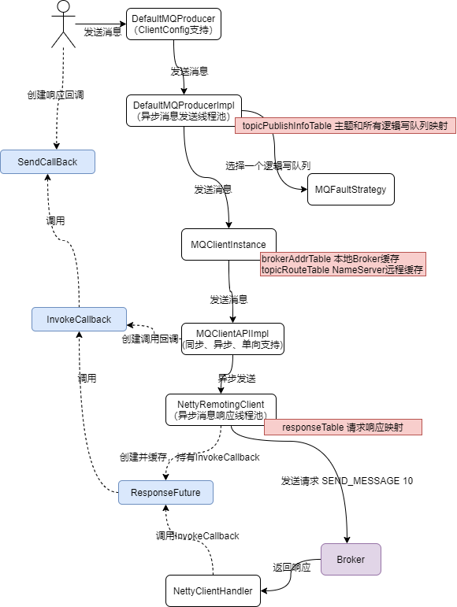
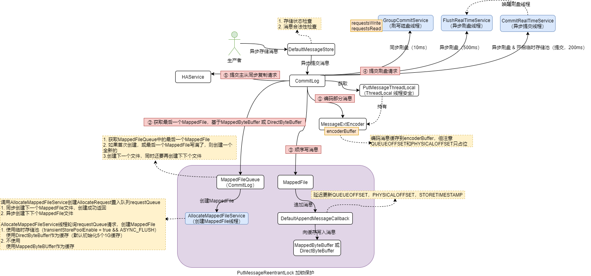

源码使用

基于 4.9.3 版本

- git clone git@github.com:yxyyyt/rocketmq.git
- cd rocketmq
- git checkout -b rocketmq-all-4.9.3.yxyyyt rocketmq-all-4.9.3 根据某一tag创建branch
- git push -u origin rocketmq-all-4.9.3.yxyyyt 提交本地分支到远程


# 配置运行

## 开发环境

### 单Broker

- 建立开发环境运行时目录 D:\data\rocketmq ，并创建 conf、logs、store目录

  - conf 拷贝 distribution 模块下conf的文件

    broker.conf（增加配置 namesrvAddr = 127.0.0.1:9876）、logback_broker.xml、logback_namesrv.xml、logback_tools.xml、tools.yml

- Name Server

  - NamesrvStartup

    JVM 参数：-Duser.home=D:\data\rocketmq

    环境变量：ROCKETMQ_HOME=D:\data\rocketmq

- Broker

  - BrokerStartup

    JVM 参数：-Duser.home=D:\data\rocketmq

    环境变量：ROCKETMQ_HOME=D:\data\rocketmq

    程序参数：-c D:\data\rocketmq\conf\broker.conf

- Client

  - Producer

    设置name server地址：producer.setNamesrvAddr("127.0.0.1:9876");

  - Consumer

    设置name server地址：consumer.setNamesrvAddr("127.0.0.1:9876");

- MQAdmin

  - MQAdminStartup

    JVM 参数：-Duser.home=D:\data\rocketmq

    环境变量：ROCKETMQ_HOME=D:\data\rocketmq

    程序参数：-n 127.0.0.1:9876


## 运行环境


# 模型

## 配置模型

### NameServer

#### 路由缓存

```java
// 一个topic所对应的queue data列表；一个queue data对应一个broker name，包含读队列数和写队列数，即topic分布在那些broker name中
HashMap<String/* topic */, List<QueueData>> topicQueueTable;

// 一个broker name 对应一个broker data；broker data包含所属的cluster，broker name，从属的所有broker，broker可以通过id获取broker的地址；master broker的id是0
HashMap<String/* brokerName */, BrokerData> brokerAddrTable;

// 一个cluster对应多个broker name
HashMap<String/* clusterName */, Set<String/* brokerName */>> clusterAddrTable;

// 一个broker地址对应一个brokerLiveInfo，brokerLiveInfo表示broker的活跃信息，包括版本，时间戳，ha地址，连接缓存
HashMap<String/* brokerAddr */, BrokerLiveInfo> brokerLiveTable;

// 一个broker地址上的filter server列表
HashMap<String/* brokerAddr */, List<String>/* Filter Server */> filterServerTable;
```

- 通过topic查询**topicQueueTable**，可以找到topic所在的所有broker name；通过broker name查询**brokerAddrTable**，可以查到所有从属的broker，通过broker id获得哪一个地址是master broker
- 通过cluster查询**clusterAddrTable**，可以找到cluster的所有broker name；通过通过broker name查询**brokerAddrTable**，可以查到所有从属的broker，通过broker地址查询**brokerLiveTable**，可以查到当前broker的活跃信息


#### 模型关系

- 1个topic对应N个queue data，queue data是broker name的抽象；即broker name上包含多个读写队列
- 1个broker name对应N个broker，抽象为一个broker 组；组内的多个broker提供HA支持，1个master broker提供读写，其他slave broker提供备份和HA；broker name的所有broker包含相同读写队列数据
- 1个cluster对应N个broker name


### Broker

#### 配置数据

- consumerOffset.json

  消费者组对于某一个topic上各个队列的消费进度管理

  <topic@consumerGroup, <queueId, offset>>

  ```json
  {
  	"offsetTable":{
  		"TopicTest@please_rename_unique_group_name_4":{0:0,1:1,2:0,3:0
  		},
  		"%RETRY%please_rename_unique_group_name_4@please_rename_unique_group_name_4":{0:0
  		}
  	}
  }
  ```

  

- topics.json

  broker上的所有主题

  <topicName, topicConfig>

  <timestamp, counter>

  ```json
  {
  	"dataVersion":{
  		"counter":5,
  		"timestamp":1682946169710
  	},
  	"topicConfigTable":{
  		"TopicTest":{
  			"order":false,
  			"perm":6,
  			"readQueueNums":4,
  			"topicFilterType":"SINGLE_TAG",
  			"topicName":"TopicTest",
  			"topicSysFlag":0,
  			"writeQueueNums":4
  		},
  		"TBW102":{
  			"order":false,
  			"perm":7,
  			"readQueueNums":8,
  			"topicFilterType":"SINGLE_TAG",
  			"topicName":"TBW102",
  			"topicSysFlag":0,
  			"writeQueueNums":8
  		}
  	}
  }
  ```

  

- subscriptionGroup.json

  和broker签订消费消息的消费者组配置

  <timestamp, counter>

  <subscriptionGroupName, subscriptionGroupConfig>

  ```json
  {
  	"dataVersion":{
  		"counter":1,
  		"timestamp":1682943444719
  	},
  	"subscriptionGroupTable":{
  		"SELF_TEST_C_GROUP":{
  			"brokerId":0,
  			"consumeBroadcastEnable":true,
  			"consumeEnable":true,
  			"consumeFromMinEnable":true,
  			"groupName":"SELF_TEST_C_GROUP",
  			"notifyConsumerIdsChangedEnable":true,
  			"retryMaxTimes":16,
  			"retryQueueNums":1,
  			"whichBrokerWhenConsumeSlowly":1
  		},
  		"please_rename_unique_group_name_4":{
  			"brokerId":0,
  			"consumeBroadcastEnable":true,
  			"consumeEnable":true,
  			"consumeFromMinEnable":true,
  			"groupName":"please_rename_unique_group_name_4",
  			"notifyConsumerIdsChangedEnable":true,
  			"retryMaxTimes":16,
  			"retryQueueNums":1,
  			"whichBrokerWhenConsumeSlowly":1
  		}
  	}
  }
  ```

  

- consumerFilter.json

  ```json
  {
  	"filterDataByTopic":{}
  }
  ```


- delayOffset.json

  延迟消息中延迟级别和消费到的偏移量映射
  
  ```json
  {
  	"offsetTable":{}
  }
  ```
  
  

## 部署模型

Broker上的队列（副本）HA是通过主从架构BrokerName保证；负载均衡是通过Cluster中不同BrokerName的Master节点保证。

- 启动 NameServer

  NameServer启动后监听端口，等待Broker、Producer、Consumer连接，相当于一个路由控制中心。几乎无状态

- 启动 Broker

  - 与==所有== NameServer 保持长连接，定时发送心跳包。心跳包中包含当前 Broker 信息以及管理的所有 Topic 信息。注册成功后，NameServer 集群中就有 Topic跟Broker 的映射关系
  - Slave Broker 定期同步 Master Broker 的路由配置信息

- 创建 Topic 时需要指定该 Topic 要存储在哪些 Broker 上、或直接提供cluster name；也可以在发送消息时自动创建Topic；

  - Broker创建Topic成功后，向所有NameServer上报路由

- 生产者发送消息

  - Producer 与 NameServer 集群中的==其中一个==节点建立长连接，定期从 NameServer 获取关注Topic路由信息
  - 向关注Topic的 ==Master Broker建立长连接==（可能包含多个，即一个topic对应多个broker name；或关注多个topic），周期发送心跳

- 消费者接收消息

  - Consumer 与 NameServer 集群中的==其中一个==节点建立长连接，定期从 NameServer 获取订阅 Topic 路由信息
  - 向订阅Topic的 ==Master、Slave Broker建立长连接==，且定时向 Master、Slave Broker发送心跳


# 主题

## 命令创建

### 命令提示

- mqadmin 显示子命令集合

```tex
The most commonly used mqadmin commands are:
   updateTopic          Update or create topic
   deleteTopic          Delete topic from broker and NameServer.
   updateSubGroup       Update or create subscription group
   deleteSubGroup       Delete subscription group from broker.
   updateBrokerConfig   Update broker's config
   updateTopicPerm      Update topic perm
   topicRoute           Examine topic route info
   topicStatus          Examine topic Status info
   topicClusterList     get cluster info for topic
   brokerStatus         Fetch broker runtime status data
   queryMsgById         Query Message by Id
   queryMsgByKey        Query Message by Key
   queryMsgByUniqueKey  Query Message by Unique key
   queryMsgByOffset     Query Message by offset
   QueryMsgTraceById    query a message trace
   printMsg             Print Message Detail
   printMsgByQueue      Print Message Detail
   sendMsgStatus        send msg to broker.
   brokerConsumeStats   Fetch broker consume stats data
   producerConnection   Query producer's socket connection and client version
   consumerConnection   Query consumer's socket connection, client version and subscription
   consumerProgress     Query consumers's progress, speed
   consumerStatus       Query consumer's internal data structure
   cloneGroupOffset     clone offset from other group.
   clusterList          List all of clusters
   topicList            Fetch all topic list from name server
   updateKvConfig       Create or update KV config.
   deleteKvConfig       Delete KV config.
   wipeWritePerm        Wipe write perm of broker in all name server you defined in the -n param
   addWritePerm         Add write perm of broker in all name server you defined in the -n param
   resetOffsetByTime    Reset consumer offset by timestamp(without client restart).
   skipAccumulatedMessage Skip all messages that are accumulated (not consumed) currently
   updateOrderConf      Create or update or delete order conf
   cleanExpiredCQ       Clean expired ConsumeQueue on broker.
   cleanUnusedTopic     Clean unused topic on broker.
   startMonitoring      Start Monitoring
   statsAll             Topic and Consumer tps stats
   allocateMQ           Allocate MQ
   checkMsgSendRT       check message send response time
   clusterRT            List All clusters Message Send RT
   getNamesrvConfig     Get configs of name server.
   updateNamesrvConfig  Update configs of name server.
   getBrokerConfig      Get broker config by cluster or special broker!
   getConsumerConfig    Get consumer config by subscription group name!
   queryCq              Query cq command.
   sendMessage          Send a message
   consumeMessage       Consume message
   updateAclConfig      Update acl config yaml file in broker
   deleteAccessConfig   Delete Acl Config Account in broker
   clusterAclConfigVersion List all of acl config version information in cluster
   updateGlobalWhiteAddr Update global white address for acl Config File in broker
   getAccessConfigSubCommand List all of acl config information in cluster
   exportMetadata       export metadata
   exportConfigs        export configs
   exportMetrics        export metrics
```


- mqadmin updateTopic 显示子命令参数提示

```tex
usage: mqadmin updateTopic -b <arg> | -c <arg>  [-h] [-n <arg>] [-o <arg>] [-p <arg>] [-r <arg>] [-s <arg>] -t
       <arg> [-u <arg>] [-w <arg>]
 -b,--brokerAddr <arg>       create topic to which broker
 -c,--clusterName <arg>      create topic to which cluster
 -h,--help                   Print help
 -n,--namesrvAddr <arg>      Name server address list, eg: '192.168.0.1:9876;192.168.0.2:9876'
 -o,--order <arg>            set topic's order(true|false)
 -p,--perm <arg>             set topic's permission(2|4|6), intro[2:W 4:R; 6:RW]
 -r,--readQueueNums <arg>    set read queue nums
 -s,--hasUnitSub <arg>       has unit sub (true|false)
 -t,--topic <arg>            topic name
 -u,--unit <arg>             is unit topic (true|false)
 -w,--writeQueueNums <arg>   set write queue nums
```


### 创建 topic 命令

```tex
-- 通过cluster name创建topic
mqadmin updateTopic -c DefaultCluster -n 127.0.0.1:9876 -t Topic_Cluster_1 -r 4 -w 4

-- 通过broker addr 创建topic
mqadmin updateTopic -b 192.168.1.6:10911 -n 127.0.0.1:9876 -t Topic_Broker_1 -r 8 -w 8
```


### 通过cluster name创建topic

- 从任意一个name server请求，获取cluster name对应的所有brokerName下的master列表
- 遍历所有brokerName所属的master，分别创建topic
- 所有broker本地持久化后，分别向所有name server请求，上报topic路由


### 通过broker addr创建topic

- 客户端和broker请求，在指定的broker上创建topic
- broker本地持久化后，向所有name server请求，上报topic路由


## 消息创建

Client发送消息

- 通过指定的topic向任意一个name server请求获取路由信息，如果topic不存在，则获取TBW102系统topic的路由信息

TBW102所属的Broker接受消息

- 处理生产者消息请求前，对消息相关检查确认topic是否已创建，如果topic不存在，则创建topic
- broker本地持久化后，向所有name server请求，上报topic路由


# 生产者

## 基本概念

Topic 与 Tag 都是业务上用来归类的标识，区别在于 Topic 是一级分类，而 Tag 可以理解为是二级分类。使用 Tag 可以实现对 Topic 中的消息进行过滤。

Apache RocketMQ 每个消息可以在业务层面的设置唯一标识码 keys 字段，方便将来定位消息丢失问题。 Broker 端会为每个消息创建索引（哈希索引），应用可以通过 topic、key 来查询这条消息内容，以及消息被谁消费。由于是哈希索引，务必保证 key 尽可能唯一，这样可以避免潜在的哈希冲突。

```java
// 订单Id
String orderId = "20034568923546";
message.setKeys(orderId);
```


## 普通消息

### 消息发送

#### 同步

消息发送方发出一条消息后，会在收到服务端同步响应之后才发下一条消息的通讯方式。


#### 异步

发送方发出一条消息后，不等服务端返回响应，接着发送下一条消息的通讯方式。异步发送需要实现**异步发送回调接口**（SendCallback）。




#### 单向

发送方只负责发送消息，不等待服务端返回响应且没有回调函数触发，即只发送请求不等待应答。


### 使用建议

- 设置全局唯一业务索引键，方便问题追踪


## 顺序消息

### 生产顺序性

将顺序消息发送至Broker后，会保证设置了**同一分区键**的消息，按照发送顺序存储在同一队列中。即保证同一个逻辑队列内部的有序性，但Topic内部整体无序。调用 `SendResult send(Message msg, MessageQueueSelector selector, Object arg)` 方法。

- ==MessageQueueSelector 由客户端自定义选择策略；代替MQFaultStrategy==


### 顺序消息的一致性

如果一个Broker掉线，那么此时队列总数是否会发化？

如果发生变化（可用性），那么同一个 ShardingKey 的消息就会发送到不同的队列上（逻辑队列数变化），造成乱序。如果不发生变化（一致性），那消息将会发送到掉线Broker的队列上，必然是失败的。因此 Apache RocketMQ 提供了两种模式，如果要保证严格顺序而不是可用性，创建 Topic 是要指定 `-o` 参数（--order）为true，表示顺序消息。

其次要保证NameServer中的配置 `orderMessageEnable` 和 `returnOrderTopicConfigToBroker` 必须是 true。如果上述任意一个条件不满足，则是保证可用性而不是严格顺序。


## 延迟消息

延迟一定时间后才投递到Consumer进行消费。

- Producer 设置**延迟投递等级**属性 `DELAY`
- Broker 
  - 提交commitLog时会判断延迟投递等级属性，如果是延迟消息则
    - 更换topic为SCHEDULE_TOPIC_XXXX
    - 更换queueId为 delayLevel-1 （0~17）
  - ScheduleMessageService
    - 每一个延迟级别一个定时任务，周期检查延迟消息是否到期，如果到期则分发到原topic的queue

### 延迟等级

一共支持18个等级的延迟投递。

| 投递等级（delay level） | 延迟时间 | 投递等级（delay level） | 延迟时间 |
| ----------------------- | -------- | ----------------------- | -------- |
| 1                       | 1s       | 10                      | 6min     |
| 2                       | 5s       | 11                      | 7min     |
| 3                       | 10s      | 12                      | 8min     |
| 4                       | 30s      | 13                      | 9min     |
| 5                       | 1min     | 14                      | 10min    |
| 6                       | 2min     | 15                      | 20min    |
| 7                       | 3min     | 16                      | 30min    |
| 8                       | 4min     | 17                      | 1h       |
| 9                       | 5min     | 18                      | 2h       |

调用 `message.setDelayTimeLevel(3);` 设置延迟级别


### 使用建议

- 延时消息的实现逻辑需要先经过**定时存储等待触发**，延时时间到达后才会被投递给消费者。因此，如果将大量延时消息的定时时间设置为同一时刻，则到达该时刻后会有大量消息同时需要被处理，会造成系统压力过大，导致消息分发延迟，影响定时精度。


## 批量消息

在对吞吐率有一定要求的情况下，Apache RocketMQ可以将一些消息聚成一批以后进行发送，可以增加吞吐率，并减少API和网络调用次数。

将消息打包成 `Collection<Message> msgs` 传入方法中即可，需要注意批量消息的大小不能超过 4MB（否则需要自行分割），其次同一批 batch 中 topic 必须相同，不支持事务、延迟消息。

- 封装为MessageBatch


## 事务消息


### 发送步骤

1. 生产者将半事务消息发送至 `RocketMQ Broker`。
   - ==生产者发送消息设置属性 TRAN_MSG==
2. `RocketMQ Broker` 将消息持久化成功之后，向生产者返回 Ack 确认消息已经发送成功，此时消息暂不能投递，为半事务消息。
   - Broker 的 **SendMessageProcessor** 负责处理半消息，==更换topic为RMQ_SYS_TRANS_HALF_TOPIC==，持久化CommitLog暂时对消费者不可见
3. 生产者开始执行本地事务逻辑。
   - 调用事务监听器执行 transactionListener.executeLocalTransaction
4. 生产者根据本地事务执行结果向服务端提交二次确认结果（Commit或是Rollback），服务端收到二次确认结果为Commit，则将半事务消息标记为可投递，并投递给消费者；若是Rollback，则将回滚事务，不会将半事务消息投递给消费者。
   - ==向Broker提交END_TRANSACTION请求==
     - COMMIT_MESSAGE，提交二次确认结果Commit
     - ROLLBACK_MESSAGE，提交二次确认结果Rollback
     - UNKNOW，提交二次确认结果Unknown，需要Broker补偿回查二次确认结果
   - Broker 的 **EndTransactionProcessor** 负责处理二次确认结果
     - Commit
       - 重新投递到原来的Topic
       - 删除半消息；为半消息创建op消息，并==向topic为RMQ_SYS_TRANS_OP_HALF_TOPIC投递op消息（body是半消息的offset），op消息表示事务消息已决，未决的半消息需要回查补偿==；（**写入commitLog的半消息无法删除，只能顺序消费**）
     - Rollback，删除半消息，为半消息创建op消息
     - Unknown，等待稍后Broker回查补偿
5. 在断网或者是生产者应用重启的特殊情况下，若服务端未收到发送者提交的二次确认结果，或服务端收到的二次确认结果为Unknown未知状态，经过固定时间后，服务端将对消息生产者即生产者集群中任一生产者实例发起消息回查。
   - 半消息如果超过了最大回查次数（15次）或 存储已不再保存半消息，则“丢弃”消息，扔到 ==TRANS_CHECK_MAX_TIME_TOPIC== 
   - 半消息如果超时未收到op消息（6s），则当前半消息重入队列，同时向一个生产者（轮询）发起查询本地事务单向请求
     - 生产者收到请求后，由 **ClientRemotingProcessor** 调用事务监听器执行 transactionListener.checkLocalTransactionState 检查本地事务状态。之后重新执行步骤4


### 开发步骤

事务消息的发送不再使用 DefaultMQProducer，而是使用 `TransactionMQProducer` 进行发送。实现 `TransactionListener` 接口，并传入 `TransactionMQProducer`。

```java
public interface TransactionListener {
    /**
     * When send transactional prepare(half) message succeed, this method will be invoked to execute local transaction.
     *
     * @param msg Half(prepare) message
     * @param arg Custom business parameter
     * @return Transaction state
     */
    LocalTransactionState executeLocalTransaction(final Message msg, final Object arg);

    /**
     * When no response to prepare(half) message. broker will send check message to check the transaction status, and this
     * method will be invoked to get local transaction status.
     *
     * @param msg Check message
     * @return Transaction state
     */
    LocalTransactionState checkLocalTransaction(final MessageExt msg);
}
```


# 消费者

## 基本概念

消费模式

- 集群消费模式：当使用集群消费模式时，RocketMQ 认为任意一条消息只需要被消费组内的任意一个消费者处理即可。
- 广播消费模式：当使用广播消费模式时，RocketMQ 会将每条消息推送给消费组所有的消费者，保证消息至少被每个消费者消费一次。同一个 ConsumerGroup 中的每个 Consumer 实例都处理全部的队列。需要注意的是，广播模式下因为每个 Consumer 实例都需要处理全部的消息，因此这种模式仅推荐在通知推送、配置同步类小流量场景使用。

负载均衡

- 平均分配
- 机房优先分配
- 一致性Hash分配

消费位点

在Apache RocketMQ中每个队列都会记录自己的最小位点、最大位点。针对于消费组，还有消费位点的概念，在集群模式下，消费位点是由客户端提给交服务端保存的，在广播模式下，消费位点是由客户端自己保存的。

一般情况下消费位点正常更新，不会出现消息重复，但如果消费者发生崩溃或有新的消费者加入群组，就会触发**重平衡**，重平衡完成后，==每个消费者可能会分配到新的队列，而不是之前处理的队列==。为了能继续之前的工作，消费者需要读取每个队列最后一次的提交的消费位点，然后从消费位点处继续拉取消息。但在实际执行过程中，由于==客户端提交给服务端的消费位点并不是实时的，所以重平衡就可能会导致消息少量重复==。


## Push模式消费（推）

### 并发消费


通过在注册消费回调接口时传入MessageListenerConcurrently接口的实现来完成。在并发消费中，可能会有**多个线程同时消费一个队列的消息**，因此即使发送端通过发送顺序消息保证消息在同一个队列中按照FIFO的顺序，也无法保证消息实际被顺序消费。

- RebalanceService（==周期运行重平衡==） 负责为消费者组内的消费者分配MessageQueue用于消费，**每一个MessageQueue对应唯一消费者**，一个消费者可能消费一个或多个MessageQueue；为PullMessageService分发PullRequest

- PullMessageService（==自旋拉取消息==）从阻塞队列中获取PullRequest，向Broker拉取消息

  - 如果立即拉取到，则Broker会直接返回
  - 否则，Broker没有数据返回；会把请求先缓存起来定时查询消息，直到有消息或超时返回；生产者回调PullCallback，把拉取到的消息缓存到ProcessQueue

- ConsumeMessageConcurrentlyService（==处理消息==）把消息按批次（默认一个批次1个消息）封装到ConsumeRequest提交到消息处理线程池并发消费

  - ConsumeRequest回调MessageListenerConcurrently（客户端实现）消费这批消息

  - ConsumeRequest根据消费结果更新消费位点及异常消息处理

    - 消费成功 CONSUME_SUCCESS（包括部分消费成功）
    - 重新消费 RECONSUME_LATER（全部消费失败）

    将消费失败的消息回传Broker（SendMessageProcessor），稍后重新消费，发送到**%RETRY%主题**；如果超过最大消费次数或不需要重新消费，则发送到%DLQ%主题；

    - 消费成功和回传成功的消息，从ProcessQueue中删除，获取当前缓存消息的最小位点（并行消费，更新最小未消费位点），更新本地位点缓存（减少网络通信，可能会出现重复消费）；后续定时更新位点到Broker。
    - 回传失败的消息，延迟5s重新封装为ConsumeRequest提交到线程池，本地重试消费

    ==对于**%RETRY%主题**消息的消费==

    - Broker的CommitLog如果发现%RETRY%主题的消息设置了延迟级别DELAY，则先把消息发送到SCHEDULE_TOPIC_XXXX主题；待延迟到期后，再发送到%RETRY%主题
    - 消费者在启动过程中会订阅%RETRY%主题的消息


### 顺序消费

与并发消费API层面只有一处不同，在注册消费回调接口时传入MessageListenerOrderly接口的实现。

- ConsumeMessageOrderlyService启动，为所有分配的MessageQueue向Broker发送LOCK_BATCH_MQ请求
  - Broker的AdminBrokerProcessor负责处理请求，锁定MessageQueue，消费者收到响应后锁定相应的ProcessQueue
- ProcessQueue缓存拉取到的消息时，如果当前有线程任务正在执行，则只缓存拉取到的消息；否则，向消息处理线程池提交ConsumeRequest异步处理。可保证一个MessageQueue任意时刻只有一个线程在处理消息（顺序消费消息），而多个MessageQueue并行处理
  - 从ProcessQueue获取一批待顺序消费的消息，调用客户端MessageListenerOrderly消费
  - 处理消费结果，更新本地offset缓存；如果消费成功，则继续自旋从ProcessQueue获取消息进行消费
    - SUCCESS 消费成功；提交位点，继续消费
    - SUSPEND_CURRENT_QUEUE_A_MOMENT 消费失败；延迟一定时间（客户端指定）重新提交ConsumeRequest到线程池，后续重新消费失败的消息；为防止顺序消息消费失败被跳过，默认无限重试


### 消息过滤

指消息生产者向Topic中发送消息时，设置消息属性对消息进行分类，消费者订阅Topic时，根据消息属性设置过滤条件对消息进行过滤，只有符合过滤条件的消息才会被投递到消费端进行消费。

消费者订阅Topic时若未设置过滤条件，无论消息发送时是否有设置过滤属性，Topic中的所有消息都将被投递到消费端进行消费。

| 过滤方式  | 说明                                                         | 场景                                                         |
| --------- | ------------------------------------------------------------ | ------------------------------------------------------------ |
| Tag过滤   | 消费者订阅的Tag和发送者设置的消息Tag相互匹配，则消息被投递给消费端进行消费。 | 简单过滤场景。一条消息支持设置一个Tag，仅需要对Topic中的消息进行一级分类并过滤时可以使用此方式。 |
| SQL92过滤 | 发送者设置Tag或消息属性，消费者订阅满足SQL92过滤表达式的消息被投递给消费端进行消费。 | 复杂过滤场景。一条消息支持设置多个属性，可根据SQL语法自定义组合多种类型的表达式对消息进行多级分类并实现多维度的过滤。 |


### 消息重试

顺序消费和并发消费的重试机制并不相同，顺序消费消费失败后会先在客户端本地重试直到最大重试次数，这样可以避免消费失败的消息被跳过，消费下一条消息而打乱顺序消费的顺序，而==并发消费消费失败后会将消费失败的消息重新投递回服务端==，再等待服务端重新投递回来，在这期间会正常消费队列后面的消息。

并发消费失败后并不是投递回原Topic，而是投递到一个特殊Topic，其命名为%RETRY%ConsumerGroupName，集群模式下并发消费每一个ConsumerGroup会对应一个特殊Topic，并会订阅该Topic。 

| 消费类型 | 重试间隔                                                     | 最大重试次数                                                 |
| -------- | ------------------------------------------------------------ | ------------------------------------------------------------ |
| 顺序消费 | 间隔时间可通过自定义设置，SuspendCurrentQueueTimeMillis      | 最大重试次数可通过自定义参数MaxReconsumeTimes取值进行配置。该参数取值无最大限制。若未设置参数值，默认最大重试次数为Integer.MAX |
| 并发消费 | 间隔时间根据重试次数阶梯变化，取值范围：1秒～2小时。不支持自定义配置 | 最大重试次数可通过自定义参数MaxReconsumeTimes取值进行配置。默认值为16次，该参数取值无最大限制，建议使用默认值 |

并发消费重试间隔

| 第几次重试 | 与上次重试的间隔时间 | 第几次重试 | 与上次重试的间隔时间 |
| ---------- | -------------------- | ---------- | -------------------- |
| 1          | 10s                  | 9          | 7min                 |
| 2          | 30s                  | 10         | 8min                 |
| 3          | 1min                 | 11         | 9min                 |
| 4          | 2min                 | 12         | 10min                |
| 5          | 3min                 | 13         | 20min                |
| 6          | 4min                 | 14         | 30min                |
| 7          | 5min                 | 15         | 1h                   |
| 8          | 6min                 | 16         | 2h                   |


### 死信队列

==当一条消息初次消费失败，RocketMQ会自动进行消息重试，**达到最大重试次数后**，若消费依然失败，则表明消费者在正常情况下无法正确地消费该消息。此时，该消息不会立刻被丢弃，而是将其发送到该消费者对应的特殊队列中，这类消息称为死信消息（Dead-Letter Message），存储死信消息的特殊队列称为死信队列（Dead-Letter Queue）==，死信队列是死信Topic下分区数唯一的单独队列。如果产生了死信消息，那对应的ConsumerGroup的死信Topic名称为%DLQ%ConsumerGroupName，死信队列的消息将不会再被消费。


## Pull模式消费（拉）

### Pull Consumer

不提供相关的订阅方法

- 首先调用 DefaultMQPullConsumer.fetchMessageQueuesInBalance(topic) 获取指定topic的MessageQueue集合

- 然后调用 DefaultMQPullConsumer.pull 方法**指定队列**进行拉取消息（类同Push模式，从缓存中获取）。消费消息成功后，**并需要自己更新位点**（可以调用**DefaultMQPullConsumer.updateConsumeOffset**）。


### Lite Pull Consumer

提供了Subscribe和Assign两种方式

- Subscribe

  初始化 DefaultLitePullConsumer 并设置 ConsumerGroupName，调用subscribe方法订阅topic并启动

  - 当RebalanceImpl重平衡完成，MessageQueue有变更时，回调MessageQueueListener监听器；MessageQueueListenerImpl负责通过划分到的MessageQueue**创建PullTaskImpl自动拉取消息**；拉取到的消息缓存到ProcessQueue，创建ConsumeRequest将此批消息缓存到consumeRequestCache中

  客户端自旋调用 DefaultLitePullConsumer.poll ，从consumeRequestCache中获取ConsumeRequest消费消息，默认在客户端消费前自动提交位点。

  不需要指定Topic的MessageQueue，系统会重平衡划分MessageQueue，为每个MessageQueue创建PullTaskImpl，并发拉取消息。

- Assign

  与Subscribe模式不同的是，Assign模式下没有自动的负载均衡机制，需要用户自行指定需要拉取的队列，先用fetchMessageQueues获取了Topic下的队列，调用了seek方法，将第一个队列拉取的位点设置从10开始。紧接着进入循环不停地调用poll方法拉取消息，拉取到消息后调用commitSync方法手动提交位点到Broker。


# 存储原理

- 某个commit log会存储多个topic消息，而每个topic有可能会将消息划分至多个队列中；commit log按顺序依次存储消息，而某个topic的消息在commit log中大概率也是不连续的，而consume queue的作用便是将某个topic下同一个队列的消息依次标识，便于消费时顺序消费
- 除了正常的生产、消费消息外，RocketMQ还提供了根据msg key进行查询的功能，将消息key相同的消息一并查出；我们当然可以通过扫描全量的commit log将相同msg key类型的消息过滤出来，但性能堪忧，而且涉及大量的IO运算；IndexFile便是为了实现快速查找目标消息而衍生的索引文件


## 消息 CommitLog

### 数据格式

| 字段                                | 类型  | 大小    | 说明                                                         |
| ----------------------------------- | ----- | ------- | ------------------------------------------------------------ |
| msg total len                       | int   | 4       | 整个消息体所占用的字节数的大小                               |
| msg magic                           | int   | 4       | 魔数，是固定值，有MESSAGE_MAGIC_CODE和BLANK_MAGIC_CODE       |
| msg CRC                             | int   | 4       | 消息体的校验码，用于防止网络、硬件等故障导致数据与发送时不一样带来的问题 |
| <font color=red>queue id</font>     | int   | 4       | 消息发到了哪个MessageQueue                                   |
| msg flag                            | int   | 4       | 创建Message对象时由生产者通过构造器设定的flag值              |
| <font color=red>queue offset</font> | long  | 8       | 在当前队列中的偏移量（延迟更新）                             |
| pyhsical offset                     | long  | 8       | 在存储文件中的偏移量（延迟更新）                             |
| sys flag                            | int   | 4       | 生产者相关的信息标识                                         |
| msg born timestamp                  | long  | 8       | 消息创建时间                                                 |
| **born inet4**                      |       | 4 / 16  | 消息生产者的host； ipv4占用4byte，ipv6占16byte               |
| msg store timestamp                 | long  | 8       | 消息存储时间（延迟更新）                                     |
| **broker inet4**                    |       | 4 / 16  | 消息存储的机器的host； ipv4占用4byte，ipv6占16byte           |
| reconsume times                     | int   | 4       | 重复消费次数                                                 |
| transaction offset                  | long  | 8       | 消息事务相关偏移量                                           |
| body len                            | int   | 4       | 消息体的长度                                                 |
| **body content**                    |       | 0-N     | 消息体的内容                                                 |
| topic name len                      | byte  | 1       | 主题名的长度                                                 |
| **topic name content**              |       | 1-127   | 主题名的内容                                                 |
| prop len                            | short | 2       | properties的长度                                             |
| **properties content**              |       | 0-32767 | properties的内容                                             |


### 消息协议

- 单文件默认1G
- 文件名为起始偏移量，长度为 20 位，左边补零
- 消息顺序写入，随机读取


### 落盘策略

对于是否使用DirectByteBuffer作为一层缓存。优点是，不需要频繁操作MappedByteBuffer，会发生系统态和用户态切换，效率较高；但是，如果应用宕机，可能会丢失只存在于堆外内存中的数据。


#### 同步刷盘

- 初始化

  - MappedFile底层基于MappedByteBuffer作为缓存

- 写入MappedByteBuffer成功后

  - WaitStoreMsgOK=true，默认开启；刷写成功后，唤醒等待的客户端

    - 创建 GroupCommitRequest 提交到 **GroupCommitService**，其缓存到 requestsWrite 链表中

    - 每隔10ms，交换requestsWrite和requestsRead两个链表（读写分离），刷写磁盘

  - 唤醒阻塞的GroupCommitService，直接返回刷盘成功。之后异步刷写磁盘


#### 异步刷盘

- 初始化
  - ==当 transientStorePoolEnable = true 时，开启临时存储==，MappedFile底层基于DirectByteBuffer
  - 否则，基于MappedByteBuffer作为缓存
- 写入MappedByteBuffer成功后
  - 没有开启临时存储，唤醒 **FlushRealTimeService**
    - 每500ms刷盘一次（MappedByteBuffer），且待刷盘数据需要超过4页
    - 如果10s内都没有刷盘，则不限制页数，直接刷写磁盘
  - 否则，唤醒 **CommitRealTimeService**
    - 每200ms刷盘一次（DirectByteBuffer中的待刷盘数据利用FileChannel刷写到OS Cache），且待刷盘数据需要超过4页
    - 如果10s内都没有刷盘，则不限制页数，直接刷写到OS Cache
    - 调用 **FlushRealTimeService** 刷写OS Cache
  - 之后直接返回刷盘成功


### 核心流程




## 索引 ConsumeQueue & Index

### 核心流程


### ConsumeQueue

#### 数据格式

| 字段     | 类型 | 大小 | 说明                                       |
| -------- | ---- | ---- | ------------------------------------------ |
| offset   | long | 8    | CommitLog 文件中的偏移量（全局物理偏移量） |
| size     | int  | 4    | 消息长度                                   |
| tagsCode | long | 8    | 消息 Tag 的 hashcode 值                    |


#### ConsumeQueue索引协议

定位基于 **Topic** 的 CommitLog 索引文件

- 每一个存储单元固定是 20 个字节，一个文件存储 30W 个单元，支持随机访问，一个文件的大小约 5.72M
- 文件名为起始偏移量，长度为 20 位，左边补零


### IndexFile

#### 数据格式

| 字段          | 类型 | 大小          | 说明                                                         |
| ------------- | ---- | ------------- | ------------------------------------------------------------ |
| head          |      | 40            | 开始时间 8<br />结束时间 8<br />最小物理偏离量 8<br />最大物理偏离量 8<br />hash slot 数量 4（最好情况500w，最差情况1；500w是固定值）<br />index数量 4（如果当前索引文件已经构建完毕，那么该值是固定值2000万） |
| slot          |      | 500w * 4      | 当前slot内最近一条消息的存储位置 4                           |
| index content |      | 500w * 4 * 20 | key的hash值 4<br />CommitLog 文件中的偏移量（全局物理偏移量） 8<br />时间差（当前消息与最早消息时间差） 4<br />上一条消息的索引的存储位置 4 |


#### Index索引协议

通过 **key**（ UniqueKey 或 自定义Key ） 或 **时间区间** 高效查询消息

- IndexFile 使用时间戳来命名；IndexFile是按照创建时间来命名的，根据消息key进行匹配查询的时候，要带上时间参数，文件名起到了快速定位索引数据位置的作用
- 文件总大小为：40 + 500w * 4 + 500w * 4 * 20 = 420000040byte ≈ 400M


#### 索引查询

当一条新的消息索引进来时，首先定位当前消息命中的**slot**，该slot存储着最近一条消息的存储位置。

- 如果这个slot没有存储，则将消息的索引数据append至文件尾部的同时，将最新索引数据位置更新到slot
- 如果这个slot有存储，则将消息的索引数据append至文件尾部的同时，将最新索引数据的next指向上一条索引位置（slot存储的），最后将最新索引数据位置更新到slot，这样便形成了一条当前slot按照时间存入的倒序的链表


## 消息查询

### CommitLog

通过全局物理Offset，确定所属MappedFile（整除）；再通过全局物理Offset计算MappedFile单文件中的位置（求余）获取到消息


### ConsumeQueue

消费者消费消息。

通过ConsumeQueue的全局物理Offset，确定所属MappedFile（整除）；再通过全局物理Offset计算MappedFile单文件中的位置（求余）;然后通过CommitLog的offset和size获取到消息。


### IndexFile

通过 key 或 UNIQ_KEY 查询 时间区间内的 **多条消息**；

先匹配时间范围，再匹配key（Hash slot）

- key
  - 生产者发送消息前设置的业务key
  - `msg.setKeys("Key1");` 多个key用空格分隔
- UNIQ_KEY
  - 生产者发送消息前自动生成
  - 消息生命周期中唯一
  - `MessageClientIDSetter.setUniqID(msg);` 
  - 生成规则：**ip + pid + classLoaderHashCode + 时间差 + 计数**
- MessageId
  - Broker收到消息后自动生成
  - 重复消息持久化，UNIQ_KEY相同，但MessageId不同
  - `Supplier<String> msgIdSupplier = () -> {};`
  - 生成规则：**ip + port + commitLogOffset**


## 主从同步

主从数据同步并不是传统的客户端驱动，如客户端告诉服务端从哪里开始同步，服务端拿到数据传输给客户端；接着客户端再去服务端同步。

RocketMQ则是客户端请求同步后，服务端间隔一定时间主动向客户端推送同步数据，客户端定时汇报同步进度给服务端，通知阻塞的生产者线程。


## DLedger消息

