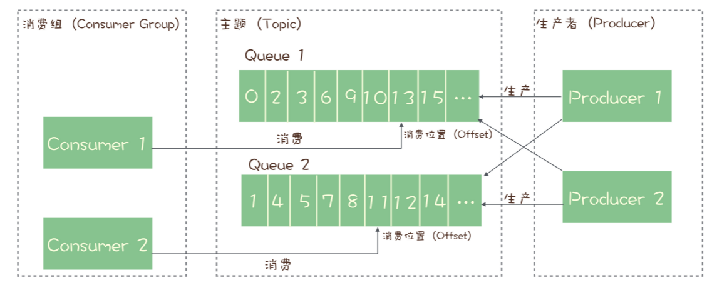
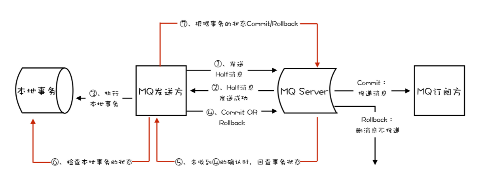

# 消息队列解决的问题

- 异步处理
- 流量控制，削峰填谷
  - 消息队列积压消息
  - 令牌桶
- 服务解耦

# 消息队列选型

## 标准

- 开源
- 流行，有一定社区活跃度
- 消息可靠投递
- 支持集群
- 性能

## 消息队列产品

- RabbitMQ
  - Erlang，语言小众
  - 支持 AMQP 协议
  - **消息堆积处理不好，性能下降**
  - 性能差，几万~十几万消息 / 秒
- RocketMQ
  - 有着不错的性能，稳定性和可靠性
  - 非常活跃的中文社区
  - **毫秒级响应延时**
  - 几十万消息 / 秒
  - 与周边生态系统的集成和兼容程度要略逊一筹
- Kafka
  - 经过多年的发展，在数据可靠性、稳定性和功能特性等方面都可以满足绝大多数场景的需求
  - 与周边生态系统的兼容性是最好的
  - 几十万消息 / 秒
  - **异步批量**性能高，同步收发消息的响应时延比较高。不太适合在线业务场景

# 消息模型

## RabbitMQ

- RabbitMQ使用**队列模式**，通过Exchange路由到多个队列，实现一条消息被多个消费者消费

## RocketMQ

RocketMQ使用的消息模型是标准的**发布 - 订阅模型**。

主题 / 队列

- 每个主题包含多个队列，通过多个队列来实现多实现并行生产和消费。需要注意的是， RocketMQ 只在队列上保证消息的有序性，主题层面是无法保证消息的严格顺序的。
- 主题中的队列可以分布到不同的Broker中。

消费者组

- 订阅者的概念是通过消费组（Consumer Group）来体现的。每个消费组都消费主题中一份完整的消息，不同消费组之间消费进度彼此不受影响。
- 每个消费组内部维护自己的一组消费位置，每个队列对应一个消费位置。消费位置在服务端保存，并且消费位置和消费者是没有关系的。

消费者

- 消费组中包含多个消费者，同一个组内的消费者是竞争消费的关系，每个消费者负责消费组内的一部分消息。
- 消费组中的每一个消费者只能对应主题中的一个队列。
- 若 队列 > 消费者 ，则一个消费者会消费多个队列；若 队列 < 消费者，多余的消费者会空闲，起不到水平扩展的作用。

## Kafka

- 消息模型和 RocketMQ 完全一样
- 在 Kafka 中，队列这个概念的名称不一样，Kafka 中对应的 名称是“分区（Partition）”，含义和功能是没有任何区别的

# 消息队列中的事务

消息队列中的“事务”，主要解决的是消息生产者和消息消费者的数据一致性问题。

常见的分布式事务实现

- 2PC（Two-phase Commit，也叫二阶段提交）

- TCC(Try-Confirm-Cancel) 

- 事务消息

  

  1. 开启事务
  2. 发送半消息（事务提交前，对于消费者，这个消息是不可见的）
  3. **执行本地事务**
  4. 提交或回滚（可能MQ会失败）
     - Kafka，直接抛出异常。业务系统反复重复提交，直到成功；或删除之前创建的订单进行补偿
     - 如果出现网络异常，RocketMQ的Broker没有收到提交或回滚的请求，Broker会定期（==如何保证在发送方commit或rollback失败后反查？本地长事务如何避免？==——Broker会定期查询，此时Producer可能已经提交本地事务成功，或者失败、正在提交长事务，则给Broker的状态是UNKNOWN）去Producer（此时Producer为Server）反查这个事务对应的本地事务状态。然后根据反查结果决定提交或回滚这个事务。
  5. 投递消息

# 确保消息不丢失

生产阶段: 在这个阶段，从消息在 Producer 创建出来，经过网络传输发送到 Broker 端。 

- 请求确认机制。需要捕获消息发送的错误，并重发消息。

存储阶段: 在这个阶段，消息在 Broker 端存储，如果是集群，消息会在这个阶段被复制 到其他的副本上。 

- 单机下配置 Broker （**刷盘**）参数，在收到消息后，将消息写入磁盘后再给 Producer 返回确认响应
- 如果是 Broker 是由多个节点组成的集群，需要将 Broker 集群配置成至少将消息发送到 2 个以上的节点（**复制**），再给客户端回复发送确认响应

消费阶段: 在这个阶段，Consumer 从 Broker 上拉取消息，经过网络传输发送到 Consumer 上。

- 客户端从 Broker 拉取消息后，执行用户的消费业务逻辑，成功后，才会给 Broker 发送消费确认响应

# 消费幂等性

在 MQTT（Message Queuing Telemetry Transport，消息队列遥测传输协议）协议中，给出了三种传递消息时能够提供的服务质量标准，这三种服务质量从低到高依次是

- At most once: 至多一次。消息在传递时，最多会被送达一次。换一个说法就是，没什么消息可靠性保证，允许丢消息。一般都是一些对消息可靠性要求不太高的监控场景使用，比如每分钟上报一次机房温度数据，可以接受数据少量丢失。
- **At least once**: 至少一次。消息在传递时，至少会被送达一次。也就是说，不允许丢消息，但是允许有少量重复消息出现。
- Exactly once：恰好一次。消息在传递时，只会被送达一次，不允许丢失也不允许重复，这个是最高的等级。

一个幂等操作的特点是，其任意多次执行所产生的影响均与一次执行的影响相同。

- 利用数据库的唯一约束实现幂等
- 为更新的数据设置前置条件：发消息前的数据版本，更新后版本+1（乐观锁）
- 记录并检查操作，“Token 机制或者 GUID（全局唯 一 ID）机制：在发送消息时，给每条消息指定一个全局唯一的 ID，消费时，先根据这个 ID 检查这条消息是否有被消费过，如果没有消费过，才更新数据，然后将消费状态置为已消费。（实现难度和复杂度高，不推荐使用）

# 消息积压该如何处理

优化性能来避免消息积压

- 发送端

  - 批量（吞吐量）：离线计算

  - 并发（延时）：实时业务

- 消费端

  在设计系统的时候，一定要保证消费端的消费性能要高于生产端的发送性能，这样的系统才能健康的持续运行

  - 优化消费业务逻辑

  - 水平扩容，增加消费端的并发数；**在扩容 Consumer 的实例数量的同时， 必须同步扩容主题中的分区（也叫队列）数量，确保 Consumer 的实例数和分区数量是相等的**

    如果 Consumer 的实例数量超过分区数量，这样的扩容实际上是没有效果的。因为对于消费者来说，在每个分区上实际上只能支持单线程消费。

生产问题

- 扩容消费端
- 系统降级，通过关闭一些不重要的业务，减少发送方发送的数据量
- 消费异常日志
- 消费端死锁或者卡在等待某些资源上

# 消息队列底层关键技术

## 异步设计提升系统性能

### 异步设计思想

异步是一种程序设计的思想，使用异步模式设计的程序可以显著减少线程等待，从而在高吞吐量的场景中，极大提升系统的整体性能，显著降低时延。

异步思想就是，当我们要执行一项比较耗时的操作时，不去等待操作结束，而是给这个操作一个命令：“当操作完成后，接下来去执行什么。”

异步编程模型，虽然并不能加快程序本身的速度，但可以减少或者避免线程等待，只用很少的线程就可以达到超高的吞吐能力。（==线程执行完毕后，处理接下来的请求，不需要阻塞等待，回调谁去触发调用？==——线程池执行任务，根据RPC结果，可以执行回调参数对象）

### 异步网络传输

IO 密集型系统大部分时间都在执行 IO 操作，这个 IO 操作主要包括网络 IO 和磁盘 IO，以 及与计算机连接的一些外围设备的访问。

与之相对的计算密集型系统，大部分时间都是在使用 CPU 执行计算操作。我们开发的业务系统，很少有非常耗时的计算，更多的是网络收发数据，读写磁盘和数据库这些 IO 操作。这样的系统基本上都是 IO 密集型系统，特别适合 使用异步的设计来提升系统性能。

- 发送数据的时候同步发送就可以了，没有必要异步。因为，只要发送数据的速度没有超过网卡传输速度的上限，就是向内存缓存中写数据。
- 接收数据，数据准备（不确定） + 复制数据 Netty

## 序列化与反序列化

要想使用网络框架的 API 来传输结构化的数据，必须得先实现结构化的数据与字节流之间的双向转换。

在选择序列化实现的时候，需要综合考虑数据可读性，实现复杂度， 性能和信息密度这四个因素

- json 可读性好，性能要求不高
- Kryo 二进制序列化实现，实现的复杂度和 JSON 序列化是差不多的，都很简单，但是序列化性能更好，信息密度也更高，代价就是失去了可读性

## 传输协议

传输协议就是应用程序之间对话的语言。

- 半包、粘包

- 双工通信，数据包编号，保证请求和响应的对应关系

  - **单工**

    在单工模式下，通信是单向的，即数据流向一个方向。设备只能发送数据而不能接收数据，或者可以接收数据但不能发送数据。

  - **半双工**

    半双工允许双向通信，但不能同时进行，信号在介质上双向传播，但一次只能向一个方向传播，由于信号仅沿一个方向传播，因此设备可以在给定时间发送或接收数据，设置为半双工的网卡在发送数据时无法接收数据。

  - **全双工**

    允许同时在两个方向上进行通信，它将可用通道分为两部分，一部分用于发送数据，另一部分用于接收数据。由于发送和接收数据有单独的路径，因此设备可以在给定时间同时执行这两项任务。

## 内存管理

垃圾回收是不可控的，而且是无法避免的。但是，可以通过一些方法来降低垃圾回收的频率，减少进程暂停的时长。

- 减少一次性对象的创建
- 对于需要频繁使用，占用内存较大的一次性对象，我们可以考虑自行回收并重用这些对象，来减轻垃圾回收的压力

## 高性能IO

- 异步批量
- 顺序读写磁盘
- 利用 PageCache（磁盘文件在内存中的缓存） 加速消息读写
- ZeroCopy（Server从磁盘获取数据，原样发出，不需要加工处理，这种场景就可以使用零拷贝）

## 缓存策略

### 数据一致性

**读写缓存**（PageCache）的这种设计，它天然就是不可靠的，是一种牺牲数据一致性换取性能的设计（未同步掉电）。（消息队列）

**读缓存**使用于读多写少场景。（范围广）

- 更新数据同时更新缓存
- 定期更新全部缓存
- 缓存中数据设置过期时间，自然过期

Kafka 它并不是只靠磁盘来保证数据的可靠性，它更依赖的是，在不同节点上的**多副本**来解决数据可靠性问题，这样即使某个服务器掉电丢失一部分文件内容，它也可以从其他节点上找到正确的数据，不会丢消息。

### 缓存置换策略

- LRU
- 注意读入大量历史数据淘汰新数据，导致缓存命中率急速下降的问题。增加“位置”权重。

## 锁

保护共享数据，协调异步线程

### 悲观锁

如果能不用锁，就不用锁；如果你不确定是不是应该用锁，那也不要用锁。只有在并发环境中，共享资源不支持并发访问，或者说并发访问共享资源会导致系统错误的情况下，才需要使用锁。

### 乐观锁

硬件同步原语 CAS

## 数据压缩

数据压缩不仅能节省存储空间，还可以用于提升网络传输性能。

不压缩直接传输需要的时间是： 传输未压缩数据的耗时。 

使用数据压缩需要的时间是： 压缩耗时 + 传输压缩数据耗时 + 解压耗时。其中，压缩耗时和解压耗时都是计算密集型操作，是否压缩需要综合考虑服务器是否是IO瓶颈，CPU空闲，这种场景适用于压缩。

压缩算法；在选择压缩算法的时候，需要综合考虑**压缩时间**和**压缩率**两个因素，被压缩数据的内容也是影响压缩时间和压缩率的重要因素

- 有损压缩：压缩音视频
- 无损压缩

Kafka 在生产者上，对每批消息进行压缩，批消息在服务端不解压，消费者在收到消息之后再进行解压。简单地说，Kafka 的 压缩和解压都是在客户端完成的。

# 源码分析

## RocketMQ Producer

客户端是一个单独的 Module，在 rocketmq/client 目录中。

Producer 的所有测试用例都在同一个测试类"org.apache.rocketmq.client.producer.DefaultMQProducerTest"中，看一下这个测试类中的所有单元测试方法，大致可以了解到 Producer 的主要功能。

- DefaultMQProducerImpl：Producer 的内部实现类，大部分 Producer 的业务逻 辑，也就是发消息的逻辑，都在这个类中。
- MQClientInstance：这个类中封装了客户端一些通用的业务逻辑，无论是 Producer 还是 Consumer，最终需要与服务端交互时，都需要调用这个类中的方法；
- MQClientAPIImpl：这个类中封装了客户端与服务端的 RPC，对调用者隐藏了真正网络通信部分的具体实现；
- NettyRemotingClient：RocketMQ 各进程之间网络通信的底层实现类。

## Kafka Consumer

Kafka 消费模型要点

- Kafka 的每个 Consumer（消费者）实例属于一个 ConsumerGroup（消费组）； 
- 在消费时，ConsumerGroup 中的每个 Consumer 独占一个或多个 Partition（分 区）； 
- 对于每个 ConsumerGroup，在任意时刻，每个 Partition 至多有 1 个 Consumer 在消费； 
- 每个 ConsumerGroup 都有一个 Coordinator(协调者）负责分配 Consumer 和 Partition 的对应关系，当 Partition 或是 Consumer 发生变更是，会触发 reblance（重新分配）过程，重新分配 Consumer 与 Partition 的对应关系； 
- Consumer 维护与 Coordinator 之间的心跳，这样 Coordinator 就能感知到 Consumer 的状态，在 Consumer 故障的时候及时触发 rebalance。

Kafka 的 Consumer 入口类KafkaConsumer。

消费流程大体是

- 订阅
- Consumer 与 Coordinator 协商，确定消费哪些 Partition 
- 拉取消息

## 消息复制实现

### RocketMQ

**传统的主从复制方式**

在 RocketMQ 中，复制的基本单位是 Broker，也就是服务端的进程。复制采用的也是主从方式，通常情况下配置成一主一从，也可以支持一主多从。

RocketMQ 提供了两种复制方式

- 一种是异步复制，消息先发送到主节点上，就返回“写 入成功”，然后消息再异步复制到从节点上。

  不会丢失消息。

  在 RocketMQ 中，Broker 的主从关系是通过配置固定的，不支持动态切换。如果主节点宕机，**生产者就不能再生产消息了**，消费者可以自动切换到从节点继续进行消费。这时候， 即使有一些消息没有来得及复制到从节点上，这些消息依然躺在主节点的磁盘上，除非是主节点的磁盘坏了，否则等主节点重新恢复服务的时候，这些消息依然可以继续复制到从节点上，也可以继续消费，不会丢消息，消息的顺序也是没有问题的。

  **RocketMQ 的这种主从复制方式，牺牲了可用性，换取了比较好的性能和数据一致性（CAP -> CP）**。

- 另外一种方式是同步双写，消息同步双写到主从节点上，主从都写成功，才返回“写入成功”。

这两种方式本质上的区别是，写入多少个副本再返回“写入成功”的问题，异步复制需要的副本数是 1，同步双写需要的副本数是 2。

**Dledger**

RocketMQ 引入 Dledger，使用新的复制方式，可以很好地解决严格顺序和高可用只能选择一个的问题。

Dledger 在写入消息的时候，要求至少消息复制到半数以上的节点之后，才给客户端返回写入成功，并且它是支持通过选举来动态切换主节点的。在选举时，总会把数据和主节点一样的从节点选为新的主节点， 这样就保证了数据的一致性，既不会丢消息，还可以保证严格顺序。

选举过程中不能提供服务。最少需要 3 个节点才能保证数据一致性，3 节点时，只能保证 1 个节点宕机时可用，如果 2 个节点同时宕机，即使还有 1 个节点存活也无法提供服务，资源的利用率比较低。另外，由于至少要复制到半数以上的节点才返回写入成功，性能上也不如主从异步复制的方式快。

### Kafka

Kafka 中，复制的基本单位是分区。每个分区的几个副本之间，构成一个小的复制集群， Broker 只是这些分区副本的容器，所以 **Kafka 的 Broker 是不分主从的，而分主从的是分区**。

分区的多个副本中也是采用一主多从的方式。Kafka 在写入消息的时候，采用的也是异步复制的方式。消息在写入到主节点之后，并不会马上返回写入成功，而是等待足够多的节点都 复制成功后再返回。在 Kafka 中这个“足够多”是多少呢？Kafka 的设计哲学是，让用户自己来决定。 Kafka 为这个“足够多”创造了一个专有名词：ISR（In Sync Replicas)，翻译过来就 是“保持数据同步的副本”。ISR 的数量是可配的，但需要注意的是，这个 ISR 中是包含主节点的。

Kafka 使用 ZooKeeper 来监控每个分区的多个节点，如果发现某个分区的主节点宕机了， Kafka 会利用 ZooKeeper 来选出一个新的主节点，这样解决了可用性的问题。 选举的时候，会从所有 ISR 节点中来选新的主节点，这样可以保证数据一致性。

## 协调服务实现

### RocketMQ

在 RocketMQ 中，NameServer 是一个独立的进程，为 Broker、生产者和消费者提供服务。NameServer 最主要的功能就是，为客户端提供寻址服务，协助客户端找到主题对应的 Broker 地址。此外，NameServer 还负责监控每个 Broker 的存活状态。

NameServer 支持只部署一个节点，也支持部署多个节点组成一个集群，这样可以避免单点故障。在集群模式下，NameServer 各节点之间是不需要任何通信的，也不会通过任何方式互相感知，每个节点都可以独立提供全部服务。

-  Broker -> NameServer 

  每个 Broker 都需要和所有的 NameServer 节点进行通信。当 Broker 保存的 Topic 信息 发生变化的时候，它会主动通知所有的 NameServer 更新路由信息，为了保证数据一致 性，Broker 还会定时给所有的 NameServer 节点上报路由信息。这个上报路由信息的 RPC 请求，也同时起到 Broker 与 NameServer 之间的心跳作用，NameServer 依靠这个 心跳来确定 Broker 的健康状态。

- Producer / Consumer -> NameServer 

  生产者和消费者，只需要选择任意一个 NameServer 节点来查询路由信息就可以了。客户端 在生产或消费某个主题的消息之前，会先从 NameServer 上查询这个主题的路由信息，然 后根据路由信息获取到当前主题和队列对应的 Broker 物理地址，再连接到 Broker 节点上 进行生产或消费。

- 异常处理

  如果 NameServer 检测到与 Broker 的连接中断了，NameServer 会认为这个 Broker 不 再能提供服务。NameServer 会立即把这个 Broker 从路由信息中移除掉，避免客户端连接 到一个不可用的 Broker 上去。而客户端在与 Broker 通信失败之后，会重新去 NameServer 上拉取路由信息，然后连接到其他 Broker 上继续生产或消费消息，这样就实 现了自动切换失效 Broker 的功能。

总体结构

- NamesrvStartup：程序入口。 
- NamesrvController：NameServer 的总控制器，负责所有服务的生命周期管理。 
- RouteInfoManager：NameServer 最核心的实现类，负责保存和管理集群路由信息。 
- BrokerHousekeepingService：监控 Broker 连接状态的代理类。 
- DefaultRequestProcessor：负责处理客户端和 Broker 发送过来的 RPC 请求的处理器。 
- ClusterTestRequestProcessor：用于测试的请求处理器。

### Kafka

Kafka 选择使用 ZooKeeper 分布式协调服务来实现和 RocketMQ 的 NameServer 差不多的功能。

- Zookeeper 存储几百M数据后，稳定性和性能会急剧下降
- Zookeeper 选举很慢，选举过程中停止对外提供服务

Kafka 的客户端不会直连ZooKeeper，而是在需要的时候，通过 RPC 请求去 Broker 上拉取它关心的主题的元数据，然后保存到客户端的元数据缓存中，以便支撑客户端生产和消费。

Kafka 在每个 Broker 中都维护了一份和 ZooKeeper 中一样的元数据缓存，并不是每次客 户端请求元数据就去读一次 ZooKeeper。由于 ZooKeeper 提供了 Watcher 这种监控机 制，Kafka 可以感知到 ZooKeeper 中的元数据变化，从而及时更新 Broker 中的元数据缓 存。

## 事务实现

### RocketMQ

RocketMQ 中的事务，它解决的问题是**确保执行本地事务和发消息这两个操作，要么都成功，要么都失败**。并且，RocketMQ 增加了一个事务反查的机制，来尽量提高事务执行的成功率和数据一致性。

### Kafka

而 Kafka 中的事务，它解决的问题是，确保在一个事务中发送的多条消息，要么都成功， 要么都失败。注意，这里面的多条消息不一定要在同一个主题和分区中，可以是发往多个主题和分区的消息。当然，你可以在 Kafka 的事务执行过程中，加入本地事务，来实现和 RocketMQ 中事务类似的效果，但是 Kafka 是没有事务反查机制。

**Kafka 的事务是用于实现它 的 Exactly Once 机制，应用于实时计算的场景中**。Kafka 的 Exactly Once 机制，是为了解决在“读数据 - 计算 - 保存结果”这样 的计算过程中数据不重不丢。数据必须来自 Kafka 并且计算结果都必须保存到 Kafka 中，才可以享受到 Kafka 的 Excactly Once 机制。

Kafka 事务两阶段提交流程

- 准备阶段，生产者发消息给协调者开启事务，然后消息发送到每个分区上（消费者看不到）。
- 提交阶段，生产者发消息给协调者提交事务，协调者给每个分区发一 条“事务结束”的消息（消费者可以看到），完成分布式事务提交。
