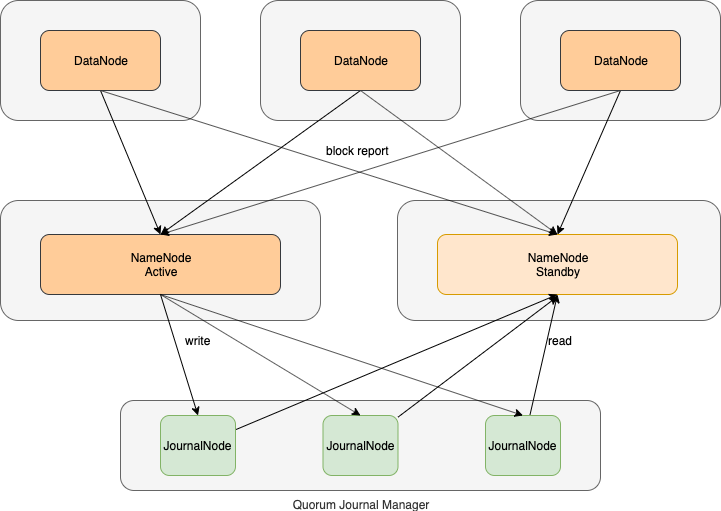

# 概述

ZooKeeper是一个集中的服务，用于维护配置信息、命名、提供分布式同步和提供组服务。所有这些类型的服务都以某种形式被分布式应用程序使用

- 开发人员需花较多的精力实现如何使多个程序协同工作的逻辑，导致没有时间更好的思考实现程序本身的逻辑
- 由于实现这类服务的困难，应用程序最初通常会忽略它们，这使得它们在出现更改时变得脆弱，并且难以管理
- 即使正确地实现了这些服务，在部署应用程序时，这些服务的不同实现也会导致管理复杂性
- 分布式框架中协同工作的逻辑是共性的需求


ZooKeeper简单易用，能够很好的解决分布式框架在运行中，出现的各种协调问题

- 集群主备切换
- 节点的上下线感知
- 统一命名服务
- 状态同步服务
- 集群管理
- 分布式应用配置管理


ZooKeeper集群也是主从架构

- 主角色：leader，负责集群写操作
- 从角色：follower或observer，统称为learner
  - follower，负责读操作，leader选举
  - observer，负责读操作
    - 增加follower提高读能力，但会降低写能力，必须有半数follower写操作成功
    - 增加observer提高读能力，但又不会降低写的吞吐量


# zkCli 命令行

Zookeeper有一个类似Linux系统的**简版文件系统**，目录结构是树状结构。

```bash
# 连接ZooKeeper集群
# -server 客户端随机连接三个服务器中的一个
zkCli.sh -server node01:2181,node02:2181,node03:2181

# 帮助命令
help

# 退出
quit

# 列出文件列表
ls /

# 创建节点并指定数据；若没有指定节点数据，则无法创建节点；不可一次创建多级节点
create /test hello

# 获取节点的数据
get /test

# 修改节点的数据
set /test yes

# 删除节点；若有子节点，则不可删除
delete /test

# 删除当前节点和所有子节点
rmr /test
```


# 基本概念

## 通信方式

分布式通信方式

1. 直接通过网络连接的方式进行通信
2. 通过**共享存储**的方式，来进行通信或数据的传输

ZooKeeper使用第二种方式，提供分布式协调服务。


## 数据结构

ZooKeeper = 简版文件系统(Znode) + 原语 + 通知机制(Watcher)

- ZK文件系统，基于类似于文件系统的**目录节点树**方式的数据存储
- 原语，可简单理解成ZooKeeper的基本命令
- Watcher 监听器


## 数据节点 ZNode

ZNode 分为四类

|            | 持久节点  | 临时节点     |
| ---------- | --------- | ------------ |
| 非有序节点 | create    | create -e    |
| 有序节点   | create -s | create -s -e |

- <font color=red>临时节点不能有子节点</font>


### 持久节点

持久节点一旦创建，一直存在，只有通过删除命令才可以删除

```bash
# 创建节点 /zk_test，并设置数据 my_data
create /zk_test my_data

# 持久节点，只有显示的调用命令才能删除
delete /zk_test
```


### 临时节点

临时节点的生命周期同客户端**会话**session绑定，一旦会话失效，临时节点被删除

```bash
# client1 上创建临时节点
create -e /tmp tmpdata

# client2 上查看client1创建的临时节点
# 此时存在
ls /

# client1断开连接
close

# client2 上查看
# 临时节点被自动删除
ls /
```


### 有序节点

一旦节点被标记上这个属性，那么在这个节点被创建时，ZooKeeper 就会自动在其节点后面追加上一个整型数字

- 这个整数是一个由父节点维护的自增数字。
- 提供了创建唯一名字的ZNode的方式

<font color=red>为防止多个客户端在同一个目录下创建同名ZNode导致失败的问题</font>

```bash
# /tmp0000000006
create -s /tmp t
```


## 会话 Session

### 什么是会话

- 客户端要对ZooKeeper集群进行读写操作，得先与某一ZooKeeper服务器（任意一个均可）建立<font color=red>TCP长连接</font>；此TCP长连接称为建立一个会话Session。

- 每个会话有超时时间：SessionTimeout。当客户端与集群建立会话后，如果超过SessionTimeout时间，两者间没有通信，会话超时。


### 会话的特点

- 客户端打开一个Session中的请求以FIFO（先进先出）的顺序执行。如客户端client01与集群建立会话后，先发出一个create请求，再发出一个get请求；那么在执行时，会先执行create，再执行get。
- 若打开两个Session，则无法保证Session间请求FIFO执行；只能保证一个session中请求的FIFO。


### 会话的声明周期


- Client创建连接，首先是未连接转态，随着初始化后，进入连接中状态。当Client同ZooKeeper集群的某一个Server连接，则进入已连接状态。业务处理结束，Client主动关闭Session连接，此时进入已关闭状态。
- 当Client无法接收到Server的响应时，首先进入连接中状态，再次同ZooKeeper集群的另外一个Server连接，如果连接成功，则进入已连接状态；如果始终无法与任意一个Server连接，则关闭Session连接进入已关闭状态。


## 请求 Request

读写请求

- 通过客户端向ZooKeeper集群中写数据
- 通过客户端从ZooKeeper集群中读数据


## 事务zxid

- 事务

  - 客户端的写请求，会对ZooKeeper中的数据做出更改，如增删改的操作
  - 每次写请求，会生成一次事务
  - 每个事务有一个全局唯一的事务ID，用 ZXID 表示，全局自增

- 事务特点

  - ACID：原子性atomicity | 一致性consistency | 隔离性isolation | 持久性durability

- ZXID结构

  - 通常是一个64位的数字。由**epoch+counter**组成

  - epoch、counter各32位

    ```bash
    # 当前leader是选举出来的第几任，如13
    /bigdata/install/zookeeper-3.4.5-cdh5.14.2/zkdatas/version-2/currentEpoch
    
    # 创建一个znode
    create -e /temp temp
    get /temp
    
    # counter = 00000023
    # epoch = d
    # 第13任leader的第23个事务
    # c 创建 m 修改 p 修改子节点
    cZxid = 0xd00000023
    mZxid = 0xd00000023
    pZxid = 0xd00000023
    ```

    

## 监视与通知 Watcher

Watcher是客户端在服务器端注册的事件监听器；Watcher用于监听znode上的某些事件，如znode数据修改、节点增删等；当监听到事件后，Watcher会触发通知客户端。<font color=red>注意：Watcher是一个单次触发的操作</font>。

- 节点上下线感知

  Watcher + 临时节点

  ```bash
  # client1 创建临时节点
  create -e /temp temp
  
  # client2 监控临时节点
  ls /temp watcher
  
  # client1 模拟下线
  close
  
  # client2 获得通知
  # WATCHER::
  # WatchedEvent state:SyncConnected type:NodeDeleted path:/temp
  ```


# 应用场景

## HDFS HA 方案

NameNode存在单点故障问题，一旦NameNode宕机，直接导致HDFS无法对外提供服务。为了解决此问题，可以增加一个备份NameNode，当主NameNode宕机，备NameNode自动快速切换响应外部请求。另外，元数据存在于NameNode的内存中，也存在了如何共享内存元数据的问题。

Hadoop 2.x 版本提出了高可用（High Availability，HA）解决方案。

### 主备切换


- ZKFC 涉及角色
  - 每个NameNode节点上各有一个ZKFC进程
  - ZKFC即 **ZKFailoverController**，作为独立进程存在，负责控制NameNode的主备切换
  - ZKFC会监控NameNode的健康状况，当发现Active NameNode异常时，通过Zookeeper集群进行NameNode主备选举，完成Active和Standby状态的切换
    - ZKFC在启动时，同时会初始化HealthMonitor和ActiveStandbyElector服务；同时会向HealthMonitor和ActiveStandbyElector注册相应的回调方法
    - **HealthMonitor**定时调用NameNode的HAServiceProtocol RPC接口（monitorHealth和getServiceStatus），监控NameNode的健康状态，并向ZKFC反馈
    - **ActiveStandbyElector**接收ZKFC的选举请求，通过Zookeeper自动完成NameNode主备选举
    - 选举完成后回调ZKFC的主备切换方法对NameNode进行Active和Standby状态的切换

- 主备选举过程

  **全新集群选举**

  - 启动两个NameNode和ZKFC
  - 两个ZKFC通过各自ActiveStandbyElector发起NameNode的主备选举，这个过程利用Zookeeper的写一致性和临时节点机制实现
  - 当发起一次**主备**选举时，ActiveStandbyElector会尝试在Zookeeper创建临时节点`/hadoop-ha/${dfs.nameservices}/ActiveStandbyElectorLock`，Zookeeper的写一致性保证最终只会有一个ActiveStandbyElector创建成功
  - ActiveStandbyElector从ZooKeeper获得选举结果
  - 创建成功的 ActiveStandbyElector回调ZKFC的回调方法，将对应的NameNode切换为Active NameNode状态
  - 而创建失败的ActiveStandbyElector回调ZKFC的回调方法，将对应的NameNode切换为Standby NameNode状态
  - <font color=red>不管是否选举成功，所有ActiveStandbyElector都会在临时节点ActiveStandbyElectorLock上注册一个Watcher监听器，来监听这个节点的状态变化事件</font>

  **非全新集群选举**

  - 如果Active NameNode对应的HealthMonitor检测到NameNode状态异常时，通知对应ZKFC
  - ZKFC会调用 ActiveStandbyElector 方法，删除在Zookeeper上创建的临时节点ActiveStandbyElectorLock（或者ActvieStandbyElector与ZooKeeper的session断开，临时节点也会被删除，但有可能此时原Active NameNode仍然是active状态）
  - 此时，Standby NameNode的ActiveStandbyElector注册的Watcher就会监听到此节点的 NodeDeleted事件。
  - 收到这个事件后，此ActiveStandbyElector发起主备选举，成功创建临时节点ActiveStandbyElectorLock，如果创建成功，则Standby NameNode被选举为Active NameNode

- 如何防止脑裂（加入BreadCrumb，引入隔离机制）
  在分布式系统中 **双主** 现象又称为脑裂，由于Zookeeper的 ”假死”、长时间的垃圾回收或其它原因都可能导致 <font color=red>双</font>Active NameNode 现象，此时两个NameNode都可以对外提供服务，无法保证数据一致性。对于生产环境，这种情况的出现是毁灭性的，必须通过自带的 **隔离（Fencing）**机制预防此类情况。

  **正常状态**

  - ActiveStandbyElector成功创建ActiveStandbyElectorLock临时节点后，会创建另一个ActiveBreadCrumb持久节点
  - ActiveBreadCrumb持久节点保存了Active NameNode的地址信息
  - 当Active NameNode在正常的状态下断开Zookeeper Session，会一并删除临时节点ActiveStandbyElectorLock、持久节点ActiveBreadCrumb

  **异常状态**

  - 但如果ActiveStandbyElector在异常的状态下关闭Zookeeper Session（此时有可能由于active NameNode与ZooKeeper通信不畅导致，所以此时NameNode**还处于active状态**），那么持久节点ActiveBreadCrumb会保留下来
  - 当另一个NameNode要由standby变成active状态时，会发现上一个Active NameNode遗留下来的ActiveBreadCrumb节点，那么会回调 ZKFC 的方法对旧的Active NameNode进行fencing

    1. 首先ZKFC会尝试调用旧Active NameNode的HAServiceProtocol RPC接口的transitionToStandby方法，看能否将其状态切换为Standby
    2. 如果transitionToStandby方法切换状态失败，那么就需要执行Hadoop自带的隔离措施，Hadoop目前主要提供两种隔离措施：
       - sshfence：SSH to the Active NameNode and kill the process
       - shellfence：run an arbitrary shell command to fence the Active NameNode
    3. 只有成功地fencing之后，选举成功的ActiveStandbyElector才会回调ZKFC的becomeActive方法，然后ZKFS调用transitionToActive将对应的NameNode切换为Active，开始对外提供服务


### 元数据同步



集群启动后一个NN处于active状态，并提供服务，处理客户端和DataNode的请求，并把editlog写到本地和share editlog（可以是NFS，QJM等）中。另外一个NN处于Standby状态，它启动的时候加载fsimage，然后周期性的从share editlog中获取editlog，保持与active的状态同步。为了实现standby在active挂掉后迅速提供服务，需要DN同时向两个NN汇报，使得standby保存block to datanode信息，因为NN启动中最费时的工作是处理所有datanode的blockreport。

- 在主备切换过程中，新的Active NameNode必须确保与原Active NamNode元数据同步完成，才能对外提供服务
- HA集群中不需要运行SecondaryNameNode、CheckpointNode或者BackupNode。事实上，HA架构中运行上述节点，将会出错


## 分布式锁

在单一进程多线程环境下，争抢共享资源，可以利用JUC完美解决。但随着系统发展，单一进程系统进一步发展为多进程分布式系统，这样就产生了如何解决共享资源争抢冲突的问题。可以借助ZooKeeper实现分布式锁方案。

- 方案一（惊群问题，监控同一个临时节点）

  

  1. Client 1、2、3同时向ZooKeeper请求创建临时节点 /lock，默认是无序节点，只有Client 1 创建成功，其他Client创建失败，因此Client 1 获得锁可以使用共享资源，而其他Client对该节点设置watcher等待通知事件
  2. Client 1 任务结束，删除 /lock 或者 关闭同ZooKeeper的session连接
  3. ZooKeeper会通知Client 2和Client 3，有删除节点事件
  4. Client 2和Client 3同时向ZooKeeper请求创建临时节点 /lock，Client 3创建成功，而Client2创建失败，Client2继续对该节点设置watcher等待通知事件

  方案一会产生**惊群问题**，多个进程请求共享资源但无法同时获得锁，未获得锁的进程只有休眠等待通知。一旦多个进程同时得到通知，全部进程会无序CPU调度，网络通信争抢锁，但此时又<font color=red>只会有一个进程获得锁</font>，当有大量争抢进程时，会导致计算和网络资源的浪费。

  

- 方案二（监控上一个临时有序节点）

  
  1. Client 1、2、3同时向ZooKeeper询问root持久节点/group是否创建，如果未创建，则只会有一个进程创建root节点。Client 1创建/group根节点，然后创建临时有序节点/group/lock0000000001，然后Client1发现是第一个子节点，则获得锁；Client 2创建临时有序节点/group/lock0000000002，发现不是第一个子节点，则设置上一个/group/lock0000000001节点watcher等待通知；Client 3创建临时有序节点/group/lock0000000003，发现不是第一个子节点，则设置上一个/group/lock0000000002节点watcher等待通知
  2. Client 1 任务结束，删除 /group/lock0000000001 或者 关闭同ZooKeeper的session连接
  3. Client 2 获得通知，检查是否是第一个子节点，如果是则获得锁处理任务；否则，继续监听上一个子节点（Client 1可能异常结束，但非第一个节点）
  4. Client 2 任务结束，删除 /group/lock0000000002
  5. Client 3 获得通知，检查是否是第一个子节点，如果是则获得锁处理任务

  方案二多个进程获得锁顺序依赖于并发创建临时有序子节点顺序。此方案不失并发性，进程又可调度有序。


# 核心原理

## ZAB算法

### 仲裁quorum

- 什么是仲裁quorum

  发起proposal时，只要多数派同意，即可生效

- 为什么要仲裁

  不需要所有的服务器都响应proposal就能生效，可以提高集群的响应速度

- quorum数如何选择

  集群节点数 / 2 + 1

  如3节点集群：quorum = 3 / 2 + 1 = 2


### 脑裂

  - 网络分区

    网络通信故障，集群被分成了2部分

  - 脑裂

    原leader处于一个分区，而另外一个分区选举出新的leader，此时集群出现2个leader，导致集群紊乱。

-  <font color=red>防止脑裂导致集群中出现多个leader</font>

  为什么规则要求 `可用节点数 > 集群总结点数 / 2` ？如果不这样限制，在集群出现脑裂的时候，可能会出现多个子集群同时服务的情况（即子集群各组选举出自己的leader）， 这样对整个zookeeper集群来说是紊乱的。换句话说，如果遵守上述规则进行选举，即使出现脑裂，集群最多也只能出现一个子集群可以提供服务的情况。

### ZAB算法

分布式一致性协议

- `Paxos` 偏向于理论、对如何应用到工程实践提及较少

- `Raft` 在2013年提出，提出的时间虽然不长，但已经有很多系统基于Raft实现

- `Zab` 的全称是 **Zookeeper atomic broadcast protocol** ，是Zookeeper内部用到的一致性协议。相比Paxos，Zab最大的特点是保证强一致性(strong consistency，或叫线性一致性linearizable consistency)。Zab协议有两种模式

  - **恢复模式（选主）**

    因为ZooKeeper也是主从架构，当ZooKeeper集群没有主的角色leader时，从众多服务器中选举leader时，处于此模式。主要处理内部矛盾，我们称之为**安内**
  
  - **广播模式（同步）**
  
    当集群有了leader后，客户端向ZooKeeper集群读写数据时，集群处于此模式。主要处理外部矛盾，我们称之为**攘外**

Zab 和 Raft 算法相似，区别如下

- Zab心跳从follower到leader；Raft从leader到follower
- Zab任期称为epoch；Raft任期称为term

Raft 动图演示地址： `http://thesecretlivesofdata.com/raft/` 

 

### ZooKeeper服务器个数

**仲裁模式**下，服务器个数选择为<font color=red>奇数</font>（可以保证脑裂状态下，至少有一个集群是可用的，即可对外提供服务）。

zookeeper选举的规则：leader选举要求 **可用节点数 > 总节点数 / 2** 。


- 防止脑裂导致集群不可用

假设5个节点发生脑裂，划分成2个子集群

| A集群 | B集群 |
| ----- | ----- |
| 1     | 4     |
| 2     | 3     |
| 3     | 2     |
| 4     | 1     |

若满足leader选举要求，可用节点数 = 5 / 2 + 1 = 3，此时多种脑裂情况都会有一个子集群提供服务。


假设4个节点发生脑裂，划分成2个子集群

| A集群 | B集群 |
| ----- | ----- |
| 1     | 3     |
| 2     | 2     |
| 3     | 1     |

若满足leader选举要求，可用节点数 = 4 / 2 + 1 = 3，<font color=red>此时若两个子集群均匀划分，A和B集群都无法满足lead选举的要求</font>。


- 在容错能力相同情况下，奇数节点更节省资源

  - 假设4个节点

    可用节点数 = 4 / 2 + 1 = 3，允许1个节点宕机

  - 假设5个节点

    可用节点数 = 5 / 2 + 1 = 3，<font color=red>允许2个节点宕机</font>

  - 假设6个节点

    可用节点数 = 6 / 2 + 1 = 4，<font color=red>允许2个节点宕机</font>

  <font color=red>5节点和6节点集群相比，容错能力相同，都允许有2个节点宕机，但5节点的quorum更小，响应速度更快且更节省资源；5节点和4节点集群相比，quorum相同，但5节点的容错能力更强</font>。


## 读写操作（攘外）

### 读操作


1. 客户端与一个follower建立Session连接，向ZooKeeper集群读取数据，如 `get /test`
2. follower返回客户端 `/test` ZNode信息


### 写操作


1. 客户端与一个follower建立Session连接，向ZooKeeper集群写入数据，如 `create /test test`；如果客户端与一个leader建立Session连接，并收到写入请求，则执行第3步
2. follower“权限”不够，询问“领导”leader，将写入数据请求转发给leader
3. leader收到请求后非常“民主”，向所有follower发出 `proposal ` 提案（zxid） `create /test test`，包括leader自己。follower和leader收到提案后先记录下来（保存在历史队列），返回ack
4. 当有超过半数的 `quorum` （包括leader自己，quorum = N / 2 + 1）同意提案，则leader首先 `commit` 提交提案（持久化），创建 `/test` ZNode
5. 然后leader通知所有follower `commit` 提交提案，follower各自创建 `/test` ZNode
6. 请求的那个follower持久化成功后，响应客户端写入数据成功


## 选举（安内）

### 全新集群leader选举


以3台机器组成ZooKeeper集群为例，**当集群中有超过半数机器启动后，才可以选举leader**。在选举过程中，每个Server都要广播投票，投票信息结构为 (sid, zxid)。Server接收到投票信息后开始Player Killing，PK逻辑是先比较zxid，大的获胜；如果相等，再比较sid，大的获胜。


ZooKeeper服务器的4中状态

- looking：服务器处于寻找leader状态
- leading：服务器作为leader的状态
- following：服务器作为follower的状态
- observing：服务器作为observer的状态


选举流程（假设Server1，Server2，Server3依次启动）

1. 启动Server1，投票给自己，投票信息是(1, 0)，投票信息不变且没有过半数，没有选举出leader，仍为looking状态
2. 启动Server2，Server2先在集群中查找是否已经选举出leader，若没有选举出leader，则开始进入选举投票流程，Server2的投票信息是(2, 0)
3. Server1，Server2向集群中服务器广播自己的投票信息
4. 处理投票
   - Server1给自己投票(1, 0)，接收到Server2投票(2, 0)，PK，结果是(2, 0)，Server1更新投票信息是(2, 0)
   - Server2给自己投票(2, 0)，接收到Server1投票(1, 0)，PK，结果是(2, 0)，Server2结果不变

5. Server1，Server2向集群中服务器广播自己的投票结果，此轮投票结束
   - Server1两票都是(2, 0)，票数超过半数（quorum = N / 2 + 1），Server2当选leader
   - Server2两票都是(2, 0)，票数超过半数，Server2当选leader
6. Server2将服务器状态从looking改变为leading，成为leader，同时向集群中服务器广播
7. Server1收到广播信息后，将服务器状态从looking改变为following，成为follower
8. 启动Server3，Server3先在集群中查找是否已经选举出leader，发现已选举出leader，则不再选举，直接将服务器状态从looking改变为following，成为follower


## 选举成功后状态同步

<font color=red>当Leader完成选举后，Follower需要与新的Leader同步数据</font>。

在Leader端做如下工作

- Leader会构建一个NEWLEADER封包，包括当前最大的zxid，发送给所有的Follower或者Observer
- Leader给每个Follower创建一个线程LearnerHandler来负责处理每个Follower的数据同步请求，<font color=red>同时主线程开始阻塞，只有超过一半的Follower同步完成，同步过程才完成，Leader才能成为真正的Leader</font>
- 根据同步算法进行同步操作

在Follower端做如下工作

- 选举完成后，尝试与Leader建立同步连接，如果一段时间没有连接上就报错超时，重新回到选举状态

- 向Leader发送FOLLOWERINFO封包，带上自己最大的zxid

- 根据同步算法进行同步操作

具体使用哪种同步算法取决于Follower当前最大的zxid，在Leader端会维护最小事务id `minCommittedLog` 和最大事务id `maxCommittedLog` 两个zxid，`minComittedLog` 是没有被快照存储的日志文件的第一条（每次快照储存完，会重新生成一个事务日志文件），`maxCommittedLog` 是事务日志中最大的事务。Zookeeper中实现了以下数据同步算法

- 直接差异化同步（DIFF同步）
- 仅回滚同步（TRUNC），即删除多余的事务日志，比如原来的Leader节点宕机后又重新加入，可能存在它自己写入并提交但是其他节点还没来得及提交的数据
- 先回滚（TRUNC）再差异化（DIFF）同步
- 全量同步（SNAP）


### DIFF

假设Leader端未被快照存储的zxid为0x500000001、0x500000002、0x500000003、0x500000004、0x500000005，此时Follower端最大已提交的zxid（即peerLastZxid）为0x500000003，因此需要把0x500000004、0x500000005同步给Follower，直接使用差异化同步（DIFF）即可。

Follower端同步过程如下：

1. Follower端首先收到DIFF指令，进入DIFF同步阶段
2. Follower收到同步的数据和提交命令，并应用到内存数据库当中
3. 同步完成后，Leader会发送一个NEWLEADER指令，通知Follower已经将最新的数据同步给Follower了，Follower收到NEWLEADER指令后反馈一个ack消息，表明自己已经同步完成

单个Follower同步完成后，Leader会进入集群的”过半策略”等待状态，当有超过一半的Follower都同步完成以后，Leader会向已经完成同步的Follower发送UPTODATE指令，用于通知Follower已经完成数据同步，可以对外提供服务了，最后Follower收到Leader的UPTODATE指令后，会终止数据同步流程，向Leader再次反馈一个ack消息。


### TRUNC + DIFF

Leader在本地提交事务完成，还没来得及把事务提交提议发送给其他节点前宕机了。假设集群有三个节点，分别是A、B、C，没有宕机前Leader是B，已经发送过0x500000001和0x500000002的数据修改提议和事务提交提议，并且发送了0x500000003的数据修改提议，但在B节点发送事务提交提议（leader已提交）之前，B宕机了，B最新的数据是0x500000003，但发送给A和C的事务提议失败了，A和C的最新数据依然是0x500000002，B宕机后，A和C会进行Leader选举，假设C成为新的Leader，并且进行过两次数据修改，对应的zxid为0x600000001、0x600000002（epoch自增），然而此时B机器恢复后加入新集群，重新进行数据同步，对B来说，peerLastZxid为0x500000003，对于当前的Leader C来说，minCommitedLog=0x500000001, maxCommittedLog=0x600000002（总共是0x500000001、0x500000002、0x600000001、0x600000002未被快照的事务）。这种情况下使用（TRUNC + DIFF）的同步方式，同步过程如下：

1. B恢复并且向已有的集群（AC）注册后，向C发起同步连接的请求
2. B向Leader C发送FOLLOWERINFO封包，带上Follower自己最大的zxid（0x500000003）
3. C发现自己没有0x500000003这个事务提交记录，就向B发送TRUNC指令，让B回滚到0x500000002
4. B回滚完成后，向C发送信息包，确认完成，并说明当前的zxid为0x500000002
5. C向B发送DIFF同步指令
6. B收到DIFF指令后进入同步状态，并向C发送ACK确认包
7. C陆续把对应的差异数据修改提议和Commit提议发给B，当数据发送完成后，再发送通知包给B
8. B将数据修改提议应用于内存数据结构并Commit，当收到C通知已经同步完成后，B给回应ACK，并且结束同步


### SNAP

当集群中某个节点宕机时间过长，在恢复并且加入集群时，集群中数据的事务日志文件已经生成多个，此时leader的minCommittedLog比该节点宕机时的最大zxid还要大（leader已生成快照）。例如假设ABC集群中B宕机，几天后才恢复，此时minCommittedLog为0x6000008731，而peerLastZxid为0x500000003，这种情况下采用全量同步（SNAP）的方式，同步过程如下：

1. 当Leader C发现B的peerLastZxid小于minCommittedLog时，向B发送SNAP指令
2. B收到同步指令，进入同步阶段
3. Leader C会从内存数据库中获取全量的数据发送给B
4. B获取数据处理完成后，C还会把全量同步期间产生的最新的数据修改提议和Commit提议以增量（DIFF）的方式发送给B

