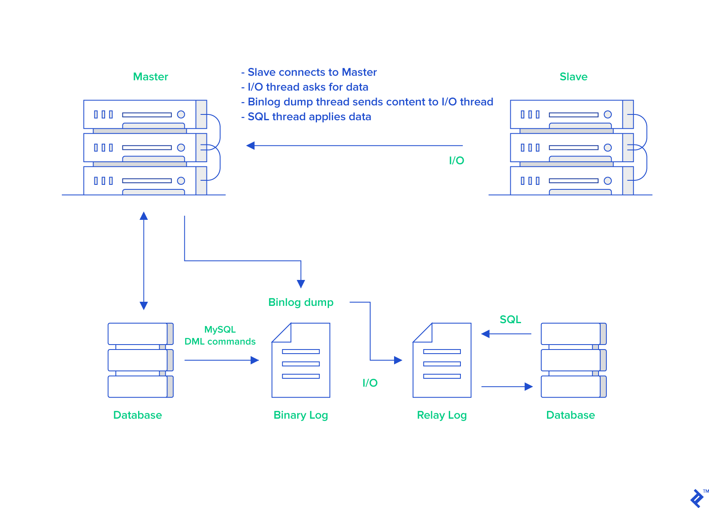
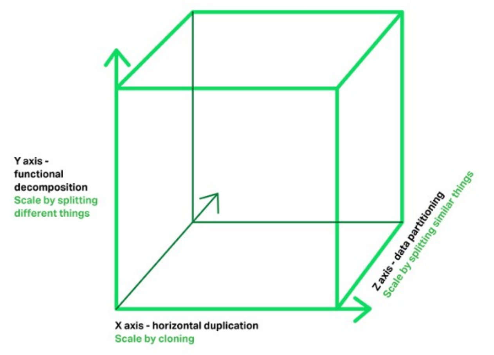

# 概述

## 数据库设计范式

- 第一范式（1NF）关系 R 属于第一范式，当且仅当R中的每一个属性A的值域只包含原子项

  **消除重复数据**，即每一列都是不可再分的基本数据项；<font color=red>每个列都是原子的，不可再分</font>。

- 第二范式（2NF）在满足 1NF 的基础上，消除非主属性对码的部分函数依赖

  **消除部分依赖**，表中没有列只与主键的部分相关，即每一行都被主键唯一标识；每个列都有主键。<font color=red>主键约束</font>。

- 第三范式（3NF）在满足 2NF 的基础上，消除非主属性对码的传递函数依赖

  **消除传递依赖**，消除表中列不依赖主键，而是依赖表中的非主键列的情况，即没有列是与主键不相关的。从表只引用主表的主键，即表中每列都和主键相关。<font color=red>外键约束</font>。

- BC 范式（BCNF）在满足 3NF 的基础上，消除主属性对码的部分和传递函数依赖

- 第四范式（4NF）消除非平凡的多值依赖

- 第五范式（5NF）消除一些不合适的连接依赖


## 结构化查询语言

- 数据查询语言（DQL Data Query Language）其语句也称为“数据检索语句”，用以从表中获得数据，确定数据怎样在应用程序给出。保留字 SELECT 是 DQL（也是所有 SQL）用得最多的动词，其他 DQL 常用的保留字有 WHERE，ORDER BY，GROUP BY 和 HAVING。这些 DQL 保留字常与其它类型的 SQL 语句一起使用。
- 数据操作语言（DML Data Manipulation Language）其语句包括动词 INSERT、UPDATE 和 DELETE。它们分别用于添加、修改和删除。
- 事务控制语言（TCL）它的语句能确保被 DML 语句影响的表的所有行及时得以更新。包括COMMIT（提交）命令、SAVEPOINT（保存点）命令、ROLLBACK（回滚）命令。
- 数据控制语言（DCL）它的语句通过 GRANT 或 REVOKE 实现权限控制，确定单个用户和用户组对数据库对象的访问。某些 RDBMS 可用 GRANT 或 REVOKE 控制对表单个列的访问。
- 数据定义语言（DDL）其语句包括动词 CREATE, ALTER 和 DROP。在数据库中创建新表或修改、删除表（CREAT TABLE 或 DROP TABLE）；为表加入索引等。
- 指针控制语言（CCL）它的语句像 DECLARE CURSOR，FETCH INTO 和 UPDATE WHERE CURRENT 用于对一个或多个表单独行的操作。


## 数据库设计优化

- 如何恰当选择引擎

  myisam 适用于对读写性能要求高，但对数据一致性要求低的场景

  innodb 支持行锁，事务

  memory 临时表

  TokuDB 高压缩比，可在线添加索引不影响读写，支持ACID特性和事务

- 库表如何命名

  有意义

- 如何选择恰当数据类型

  **明确、尽量小**

- 文件、图片是否要存入到数据库

  建议存放结构化数据；读多写少的数据也可

- 时间日期的存储问题

  存放**时间戳**，int或long类型或string类型

- 数值的精度问题

  字符串存放，应用负责转换

- 是否使用外键、触发器

  不建议，应用保证。性能高

- 是否可以冗余字段

  高效查询可以适当冗余

- 是否使用游标、变量、视图、自定义函数、存储过程

  不建议，维护、调试成本高，移植性差

- 自增主键的使用问题

  - 分布式不建议

  - 为什么单调递增

    InnoDB引擎使用聚集索引，数据记录本身被存于主索引（一颗B+Tree）的叶子节点上，这就要求同一个叶子节点内（大小为一个内存页或磁盘页）的各条数据记录按主键顺序存放。因此每当有一条新的记录插入时，MySQL会根据其主键将其插入适当的节点和位置，如果页面达到装载因子（InnoDB默认为15/16），则开辟一个新的页（节点）。

    - 如果表使用自增主键，那么每次插入新的记录，记录就会顺序添加到当前索引节点的后续位置，当一页写满，就会自动开辟一个新的页。这样就会形成一个**紧凑的索引结构**，近似顺序填满。由于每次插入时也不需要移动已有数据，因此效率很高，也不会增加很多开销在维护索引上。
    - 如果使用非自增主键（如果身份证号或学号等），由于每次插入主键的值近似于随机，因此每次新纪录都要被插到现有索引页的中间某个位置：此时MySQL不得不为了将新记录插到合适位置而移动数据，甚至目标页面可能已经被回写到磁盘上而从缓存中清掉，此时又要从磁盘上读回来，这增加了很多开销，同时频繁的移动、分页操作造成了大量的碎片，得到了不够紧凑的索引结构，后续不得不通过OPTIMIZE TABLE来重建表并优化填充页面。

    在使用InnoDB存储引擎时，如果没有特别的需要，建议使用一个与业务无关的自增字段作为主键。mysql 在频繁地更新、删除操作，会产生碎片。而含碎片比较大的表，查询效率会降低。此时需对表进行优化，这样才会使查询变得更有效率。

    

- 能够在线修改表结构（DDL 操作）

  不建议，会锁表。备份也会锁表，尽量在无业务处理时操作

- 逻辑删除还是物理删除

  重要数据需要审计，增加字段表示逻辑删除

- 要不要加 create_time，update_time 时间戳

  建议，增量复制

- 数据库碎片问题

  插入和删除都会导致碎片，优化压缩

- 如何快速导入导出、备份数据

  批量导入导出内建命令

  批量导入时先删除索引、外键，导入数据后，再添加


## SQL语句的执行顺序

### 语法

```mysql
SELECT
    [ALL | DISTINCT | DISTINCTROW ]
    [HIGH_PRIORITY]
    [STRAIGHT_JOIN]
    [SQL_SMALL_RESULT] [SQL_BIG_RESULT] [SQL_BUFFER_RESULT]
    [SQL_CACHE | SQL_NO_CACHE] [SQL_CALC_FOUND_ROWS]
    select_expr [, select_expr] ...
    [into_option]
    [FROM table_references
      [PARTITION partition_list]]
    [WHERE where_condition]
    [GROUP BY {col_name | expr | position}
      [ASC | DESC], ... [WITH ROLLUP]]
    [HAVING where_condition]
    [ORDER BY {col_name | expr | position}
      [ASC | DESC], ...]
    [LIMIT {[offset,] row_count | row_count OFFSET offset}]
    [PROCEDURE procedure_name(argument_list)]
    [into_option]
    [FOR UPDATE | LOCK IN SHARE MODE]

into_option: {
    INTO OUTFILE 'file_name'
        [CHARACTER SET charset_name]
        export_options
  | INTO DUMPFILE 'file_name'
  | INTO var_name [, var_name] ...
}
```


### 执行顺序

1. from
2. on
   - 先on过滤条件之后，才会join生成临时表
3. join
4. where
   - 临时表生成之后，根据限制条件从临时表中筛选
   - 在分组（聚集函数）之前筛选数据
5. group by
   - 分组之后，执行聚集函数
   - GROUP BY 子句出现在 WHERE 子句之后，ORDER BY 子句之前
   - 除了汇总字段外，SELECT 语句中的每一字段都必须在 GROUP BY 子句中给出；
   - NULL 的行会单独分为一组；
   - 大多数 SQL 实现不支持 GROUP BY 列具有可变长度的数据类型。
6. having
   - 聚合函数执行之后对分组数据进一步筛选，同group by一起使用，不可单独使用
   - WHERE 过滤行，HAVING 过滤分组，行过滤先于分组过滤
7. select
   - 如果有group by使用的话，select查询的字段可能是group by后跟的分组字段，也有可能是对字段聚合函数计算的结果
8. distinct
9. order by
   - group by和orderby可以实现组内排序，即 `group by A,B order by A,B`
10. limit


# 数据类型

## 数值类型

| 类型         | 大小                                     | 用途            | 范围（有符号）                                               | 范围（无符号）                                               |
| :----------- | :--------------------------------------- | :-------------- | ------------------------------------------------------------ | ------------------------------------------------------------ |
| TINYINT      | 1 byte                                   | 小整数值        | (-128，127)                                                  | (0，255)                                                     |
| SMALLINT     | 2 bytes                                  | 大整数值        | (-32 768，32 767)                                            | (0，65 535)                                                  |
| MEDIUMINT    | 3 bytes                                  | 大整数值        | (-8 388 608，8 388 607)                                      | (0，16 777 215)                                              |
| INT或INTEGER | 4 bytes                                  | 大整数值        | (-2 147 483 648，2 147 483 647)                              | (0，4 294 967 295)                                           |
| BIGINT       | 8 bytes                                  | 极大整数值      | (-9,223,372,036,854,775,808，9 223 372 036 854 775 807)      | (0，18 446 744 073 709 551 615)                              |
| FLOAT        | 4 bytes                                  | 单精度 浮点数值 | (-3.402 823 466 E+38，-1.175 494 351 E-38)，0，(1.175 494 351 E-38，3.402 823 466 351 E+38) | 0，(1.175 494 351 E-38，3.402 823 466 E+38)                  |
| DOUBLE       | 8 bytes                                  | 双精度 浮点数值 | (-1.797 693 134 862 315 7 E+308，-2.225 073 858 507 201 4 E-308)，0，(2.225 073 858 507 201 4 E-308，1.797 693 134 862 315 7 E+308) | 0，(2.225 073 858 507 201 4 E-308，1.797 693 134 862 315 7 E+308) |
| DECIMAL      | 对DECIMAL(M,D) ，如果M>D，为M+2否则为D+2 | 高精度小数值    | 依赖于M和D的值                                               | 依赖于M和D的值                                               |


## 字符串类型

- char(n) 和 varchar(n) 中括号中 n 代表字符的个数，并不代表字节个数，比如 CHAR(30) 就可以存储 30 个字符

| 类型       | 大小                  | 用途                            |
| :--------- | :-------------------- | :------------------------------ |
| CHAR       | 0-255 bytes           | 定长字符串                      |
| VARCHAR    | 0-65535 bytes         | 变长字符串                      |
| TINYBLOB   | 0-255 bytes           | 不超过 255 个字符的二进制字符串 |
| TINYTEXT   | 0-255 bytes           | 短文本字符串                    |
| BLOB       | 0-65 535 bytes        | 二进制形式的长文本数据          |
| TEXT       | 0-65 535 bytes        | 长文本数据                      |
| MEDIUMBLOB | 0-16 777 215 bytes    | 二进制形式的中等长度文本数据    |
| MEDIUMTEXT | 0-16 777 215 bytes    | 中等长度文本数据                |
| LONGBLOB   | 0-4 294 967 295 bytes | 二进制形式的极大文本数据        |
| LONGTEXT   | 0-4 294 967 295 bytes | 极大文本数据                    |


## 日期和时间类型

| 型        | 大小 ( bytes) | 范围                                      | 格式                | 用途                                 |
| :-------- | :------------ | :---------------------------------------- | :------------------ | :----------------------------------- |
| DATE      | 3             | 1000-01-01/9999-12-31                     | YYYY-MM-DD          | 日期值                               |
| TIME      | 3             | '-838:59:59'/'838:59:59'                  | HH:MM:SS            | 时间值或持续时间                     |
| YEAR      | 1             | 1901/2155                                 | YYYY                | 年份值                               |
| DATETIME  | 8             | 1000-01-01 00:00:00 ~ 9999-12-31 23:59:59 | YYYY-MM-DD HH:MM:SS | 混合日期和时间值，和时区无关         |
| TIMESTAMP | 4             | 1970-01-01 00:00:01 ~ 2037-12-31 23:59:59 | YYYYMMDD HHMMSS     | 混合日期和时间值，时间戳，和时区相关 |

- 建议使用TIMESTAMP，因为它比 DATETIME 空间效率更高，同时还和时区相关


# 架构

**Server层**包括连接器、查询缓存、分析器、优化器、执行器等，涵盖了MySQL的大多数核心服务功能，以及所有的内置函数（如日期、时间、数学、加密等），所有跨存储引擎的功能都在这一层实现，如存储过程、触发器、视图等。

**存储引擎层**负责数据的存储和提取，其架构模式时插件式的，支持InnoDB，MyISAM，Memory等。


## 查询流程

1. 同连接器建立连接，获取权限
2. 查询缓存；如果查询能够在缓存中找到，那么这个value会被直接返回给客户端；如果不在缓存中，则继续后面的执行阶段；执行完成后，执行结果会被存入查询缓存中
   - 但大多数情况建议不要使用查询缓存，查询缓存的失效非常频繁，只要有对一个表的更新，这个表上的所有查询缓存都会被清空。对于更新压力大的数据库，查询缓存的命中率非常低。MySQL8.0直接将查询缓存功能删除。
3. 对SQL语句解析，进行词法和语法分析（做什么）
4. 确定执行方案，选择索引（如何做）
5. 权限验证。如果有权限，就打开表执行。打开表的时候，执行器就会根据表的引擎定义，去使用这个引擎提供的接口
   - 对于查询的字段没有索引，则会调用InnoDB引擎取这个表的第一行，进行判断，如果满足条件则存入记录集；如果不满足则跳过；继续调用引擎接口取下一行。直到这个表的最后一行；最后执行器将满足条件的行组成记录集作为结果集返回给客户端。


### 优化查询访问

- 减少请求数据量
- 使用覆盖索引，减少回表
- 切分大查询，即避免长事务
- 切分大连接查询
  - 减少锁竞争；
  - 在应用层进行连接，可以更容易对数据库进行拆分，从而更容易做到高性能和可伸缩。


## 更新流程

包括增、删、改

1. 同连接器建立连接，获取权限
2. 清空和这个表相关的查询缓存
3. 对SQL语句解析，进行词法和语法分析
4. 确定执行方案，选择索引
5. 执行器负责具体执行，找到这一行，然后更新
   - 执行器调用引擎获取数据，如果所在的数据页在内存中，直接返回给执行器；否则，从磁盘读入内存，然后再返回
   - 执行器拿到数据，更新数据，将得到的新数据调用引擎接口写入这行数据
   - 引擎将这行数据记录到redo log中，然后更新内存。此时redo log处于prepare状态。然后告知执行器执行完成，可以提交事务
   - 执行器生成这个操作的binlog，写入磁盘
   - 执行器调用引擎的提交事务接口，引擎把redo log修改为commit状态


## redo log

<font color=red>redo log是InnoDB引擎特有的日志</font>。当有一条记录需要更新的时候，**InnoDB引擎会先把记录写到redo log（内存 redo log buffer）里，并更新内存（数据页 Buffer pool 16KB）**。同时，**InnoDB引擎会在适当的时候，将这个操作记录更新到磁盘里面（redo.file）**。redo log是物理日志，记录的是“在某个数据页做了什么修改”。循环写日志，空间固定。<font color=red>用于崩溃恢复</font>。

redo log有容量限制，如可以配置一组4个文件（ib_logfile_x），每个文件大小1GB，从头开始写，写到末尾又回到开头循环写。write pos是当前记录的位置，一边写一边后移；checkpoint是当前要擦除的位置，也是往后推移并且循环的，擦除记录前要把记录更新到数据文件。write pos和checkpoint之间空着的部分可以用来记录新的操作。如果write pos追上checkpoint，表示空间已满，不能再执行新的更新，因此需要把checkpoint向前推进。

有了redo log，InnoDB可以保证即使数据库发生异常重启，之前**提交的记录**也不会丢失，这个能力称为**crash-safe**。

<font color=red>那为什么redo log具有crash-safe的能力，而binlog没有，binlog记录的是全量日志，通过参数也可以保证事务提交时刷盘？</font>redo log 是循环追加日志，数据刷盘成功后的日志会从内存和redo log中删除；而binlog是一份全量的日志。当Mysql异常重启后，只需要恢复redo log中的日志即可恢复现场；然而binlog，Mysql是不知道从哪里开始恢复的。


### 刷盘时机

InnoDB存储引擎为redo log的刷盘策略提供了 `innodb_flush_log_at_trx_commit` 参数，它支持三种策略：

1. 设置为 0 的时候，表示每次事务提交时不进行刷盘操作
2. 设置为 1 的时候，表示每次事务提交时都将进行刷盘操作（默认值）
3. 设置为 2 的时候，表示每次事务提交时都只把 redo log buffer 内容写入 page cache

`innodb_flush_log_at_trx_commit` 参数默认为 1 ，也就是说当事务提交时会调用 fsync 对 redo log 进行刷盘；当参数为0时，可能会丢失1s的数据；当参数为2时，如果仅仅只是MySQL挂了不会有任何数据丢失，但是宕机可能会有1秒数据的丢失。**建议使用默认值1**。


### 刷盘频率

- InnoDB存储引擎有一个后台线程，每隔1秒，就会把 redo log buffer 中的内容写到文件系统缓存（page cache），然后调用 fsync 刷盘。
- 当 redo log buffer 占用的空间即将达到 `innodb_log_buffer_size` 一半的时候，后台线程会主动刷盘。


## binlog

<font color=red>binlog（归档日志，不会擦掉之前的记录）是Server层的日志</font>。所有引擎都可以使用。binlog是逻辑日志，记录的是这个语句的原始逻辑。可以追加写入，当写到一定大小会切换到下一个，不会覆盖以前的日志。<font color=red>用于主从同步，基于时间点的恢复</font>。

- `sync_binlog` 设置为1。每次事务的binlog都直接持久化磁盘。保证MySQL异常重启之后数据不丢失；为0的时候，表示每次提交事务都只write（文件系统缓存 page cache），由系统自行判断什么时候执行fsync（磁盘）。


### 日志有三种格式

可以通过 `binlog_format`参数指定

- statement：记录的内容是SQL语句原文
- row：记录的内容不再是简单的SQL语句了，还包含操作的具体数据。row格式记录的内容看不到详细信息，要通过mysqlbinlog工具解析
  - 占用空间，恢复与同步时会更消耗IO资源，影响执行速度
- mixed：MySQL会判断这条SQL语句是否可能引起数据不一致，如果是，就用row格式，否则就用statement格式


### 写入机制

事务执行过程中，先把日志写到binlog cache，**事务提交**的时候，再把binlog cache写到binlog文件或page cache中。因为一个事务的binlog不能被拆开，无论这个事务多大，也要确保一次性写入，所以系统会给每个线程分配一个块内存作为binlog cache。可以通过`binlog_cache_size`参数控制单个线程 **binlog cache** 大小，如果存储内容超过了这个参数，就要暂存到磁盘（Swap）。


### 两阶段提交

为了保证 redo log 和 binlog 日志之间的逻辑一致。

- 如果先写redo log，此时MySQL重启，当前库多一条数据，日后数据恢复时或从库同步，binlog少一条数据。
- 如果先写binlog ，此时MySQL重启，当前库少一条数据。日后数据恢复时或从库同步，binlog多一条数据。
- 因此，需要先写 redo log prepare，再写binlog，最后写 redo log commit
  - 如果写redo log prepare之后MySQL重启，发现binlog没有，事务不接受，redo log prepare回滚
  - 如果写binlog之后MySQL重启，发现事务已经提交（能通过事务id找到对应的binlog日志），所以MySQL认为事务是完整的，就会提交事务恢复数据


# 锁

## 锁类型

### 读写锁

- 互斥锁（Exclusive），简写为 X 锁，又称写锁
- 共享锁（Shared），简写为 S 锁，又称读锁

有以下两个规定

- 一个事务对数据对象 A 加了 X 锁，就可以对 A 进行读取和更新。加锁期间其它事务不能对 A 加任何锁。
- 一个事务对数据对象 A 加了 S 锁，可以对 A 进行读取操作，但是不能进行更新操作。加锁期间其它事务能对 A 加 S 锁，但是不能加 X 锁。

锁的兼容关系

|      | X锁  | S锁  |
| ---- | ---- | ---- |
| X锁  | X    | X    |
| S锁  | X    | √    |


### 意向锁

使用意向锁（Intention Locks）可以更容易地支持多粒度锁。

在存在行级锁和表级锁的情况下，事务 T 想要对**表 A **加 X 锁，就需要先检测是否有其它事务对表 A 或者表 A 中的任意一行加了锁，那么就**需要对表 A 的每一行都检测一次**，这是非常耗时的。

意向锁在原来的 X/S 锁之上引入了 IX/IS，IX/IS 都是**表锁**，用来表示**一个事务想要在表中的某个数据行上加 X 锁或 S 锁**。有以下两个规定

- 一个事务在获得某个数据行对象的 S 锁之前，必须先获得表的 IS 锁或者更强的锁；
- 一个事务在获得某个数据行对象的 X 锁之前，必须先获得表的 IX 锁。

通过引入意向锁，事务 T 想要对表 A 加 X 锁，只需要先检测是否有其它事务对表 A 加了 X/IX/S/IS 锁，如果加了就表示有其它事务正在使用这个表或者表中某一行的锁，因此事务 T 加 X 锁失败。（避免遍历所有记录）

锁的兼容性

|      | X锁  | IX锁 | S锁  | IS锁 |
| ---- | ---- | ---- | ---- | ---- |
| X锁  | X    | X    | X    | X    |
| IX锁 | X    | √    | X    | √    |
| S锁  | X    | X    | √    | √    |
| IS锁 | X    | √    | √    | √    |

- 任意 IS/IX 锁之间都是兼容的，因为它们只表示想要对表的某一行加锁，而不是真正的对表加锁；
- 这里兼容关系针对的是表级锁，而表级的 IX 锁和行级的 X 锁兼容，两个事务可以对两个数据行加 X 锁。（事务 T1 想要对数据行 R1 加 X 锁，事务 T2 想要对同一个表的数据行 R2 加 X 锁，两个事务都需要对该表加 IX 锁，但是 IX 锁是兼容的，并且 IX 锁与行级的 X 锁也是兼容的，因此两个事务都能加锁成功，对同一个表中的两个数据行做修改。）


### 临键锁

Next-Key Locks 是 MySQL 的 InnoDB 存储引擎的一种锁实现。

MVCC 不能解决幻读问题，Next-Key Locks 就是为了解决这个问题而存在的。在可重复读（REPEATABLE READ）隔离级别下，使用 MVCC + Next-Key Locks 可以解决幻读问题。

##### Record Locks

锁定一个记录上的索引，而不是记录本身。

如果表没有设置索引，InnoDB 会自动在主键上创建隐藏的聚簇索引，因此 Record Locks 依然可以使用。

##### Gap Locks

锁定索引之间的间隙，但是不包含索引本身。例如当一个事务执行以下语句，其它事务就不能在 t.c 中插入 15。

```sql
SELECT c FROM t WHERE c BETWEEN 10 and 20 FOR UPDATE;
```

##### Next-Key Locks

它是 Record Locks 和 Gap Locks 的结合，不仅锁定一个记录上的索引，也锁定索引之间的间隙。它锁定一个前开后闭区间，例如一个索引包含以下值：10, 11, 13, and 20，那么就需要锁定以下区间：

```sql
(-∞, 10]
(10, 11]
(11, 13]
(13, 20]
(20, +∞)
```


## 锁范围

根据加锁的范围，可以分为全局锁、表级锁和行锁。

应该尽量只锁定需要修改的那部分数据，而不是所有的资源。锁定的数据量越少，发生锁争用的可能就越小，系统的并发程度就越高。但是加锁需要消耗资源，锁的各种操作（包括获取锁、释放锁、以及检查锁状态）都会增加系统开销。因此锁粒度越小，系统开销就越大。在选择锁粒度时，需要在锁开销和并发程度之间做一个权衡。


### 全局锁

对整个数据库实例加锁 `flush tables with read lock`。加全局读锁，这个数据库处于只读状态，之后其他线程语句会被阻塞。包括数据更新（增删改），数据定义（建表，修改表结构）和更新类事务的提交语句。

典型使用场景是**全库逻辑备份**（导出select）。

- 如果在主库上备份，备份期间，不可执行更新，业务停摆
- 如果在从库上备份，备份期间，从库不能执行主库同步过来的binlog，会导致主从延迟

还有一种是mysqldump使用参数 `-single-transaction` 导数据之前会开启一个事务，来确保**一致性视图**。而由于MVCC的支持，这个过程中数据是可以正常更新的。<font color=red>但需要引擎支持，如MyISAM不支持事务，就需要使用FTWRL</font>。


### 表级锁

- 表锁

  语法：`lock tables ... read / write` ，可以用 unlock tables 主动释放锁，也可以在客户端断开的时候自动释放。

  线程A执行 lock tables t1 read, t2 write

  - 其他线程写t1，读写t2阻塞
  - 线程A在 unlock tables 之前，只能执行读t1，读写t2，写t1不允许，也不能访问其他表

- 元数据锁（meta data lock MDL）

  不需要显式使用，在访问一个表的时候会被自动加上。当对一个表增删改查时，首先要加MDL读锁；当对表结构变更时，加MDL写锁；

  读锁不互斥，可以多个线程同时对一个表增删改查；读写锁，写锁之间是互斥的，如果两个线程同时给一个表加字段，其中一个线程要阻塞。

  

  **给小表加字段，导致整个库挂掉**

  - sessionA开始一个**事务**，执行查询（MDL读锁）
  - sessionB执行查询（MDL读锁；正常）
  - sessionC给表增加字段（MDL写锁；阻塞）
  - sessionD执行查询（MDL读锁；阻塞）

  <font color=red>事务中的MDL锁，在语句执行前申请，语句执行后不会马上释放，需要等待事务提交后再释放（长事务）</font>。当有**大量请求**（热点表）或者**应用有超时重试功能**（新启动一个session再请求）时，数据库很快线程爆满。

  如何安全的给小表加字段？

  - 注意长事务，kill长事务或暂停DDL
  - 注意热点表，增加字段时加超时时间，拿不到MDL写锁也不要阻塞。 `alter table ... wait N / nowait add column`


### 行锁

<font color=red>加锁当前读，不加锁快照读</font>。

- 读取记录加S锁

  select * from table where id = ? lock in share mode（显式锁）

- 读取记录加X锁

  select * from table where id = ? for update（显式锁）

- 使用时直接加锁

  update table set x=y where id = ?（隐式锁）

  当设置事务自动提交时，更新完后释放锁；当不是自动提交时，只有在事务提交或回滚后才会释放锁。


**死锁和死锁检测**

当出现死锁后两种策略

- 设置超时时间 `innodb_lock_wait_timeout` 默认50s；设置过大不可行，但如果设置过小，会把简单的锁等待误伤
- 死锁检测 `innodb_deadlock_detect` 默认为on；但会出现CPU利用率高，每秒执行不了几个事务，每一个线程的死锁检测时间复杂度是O(n)，如果是1000个线程操作同一行，死锁检测就是100万。


**锁升级**

- MySQL不走索引，行锁升级为表锁
- 非唯一索引记录数超过一定数量（>=表记录的1/2），行锁升级为表锁


**性能优化**

- 如果事务中锁定多个行，要把可能造成锁冲突，影响并发度的锁尽量放在后面。（两阶段锁）
- 控制并发（死锁检测）
  - 进入引擎前排队
  - 业务逻辑控制，把一行拆成多行，提高并发度


## 锁协议

### 一级锁协议

事务 T 要修改数据 A 时必须加 X 锁，直到 T 结束才释放锁。

可以解决丢失修改问题，因为不能同时有两个事务对同一个数据进行修改，那么事务的修改就不会被覆盖。


### 二级锁协议

在一级的基础上，要求读取数据 A 时必须加 S 锁，读取完马上释放 S 锁。

可以解决读脏数据问题，因为如果一个事务在对数据 A 进行修改，根据 1 级封锁协议，会加 X 锁，那么就不能再加 S 锁了，也就是不会读入数据。


### 三级锁协议

在二级的基础上，要求读取数据 A 时必须加 S 锁，直到事务结束了才能释放 S 锁。

可以解决不可重复读的问题，因为读 A 时，其它事务不能对 A 加 X 锁，从而避免了在读的期间数据发生改变。


### 两阶段锁协议

加锁和解锁分为两个阶段进行。行锁在需要的时候加上，但并不是不需要了就立刻释放，需要等待事务结束后才释放。


# MVCC 多版本并发控制

多版本并发控制（Multi-Version Concurrency Control, MVCC）是 MySQL 的 InnoDB 存储引擎实现隔离级别的一种具体方式，用于实现读已提交和可重复读这两种隔离级别。而未提交读隔离级别总是读取最新的数据行，要求很低，无需使用 MVCC。可串行化隔离级别需要对所有读取的行都加锁，单纯使用 MVCC 无法实现。


## 基本思想

加锁能解决多个事务同时执行时出现的并发一致性问题。在实际场景中读操作往往多于写操作，因此又引入了读写锁来避免不必要的加锁操作，例如读和读没有互斥关系。读写锁中读和写操作仍然是互斥的，而 MVCC 利用了多版本的思想，写操作更新最新的版本快照，而读操作去读旧版本快照，没有互斥关系，这一点和 CopyOnWrite 类似。

**在 MVCC 中事务的修改操作（DELETE、INSERT、UPDATE）会为数据行新增一个版本快照。**

脏读和不可重复读最根本的原因是事务读取到其它事务未提交的修改。在事务进行读取操作时，为了**解决脏读和不可重复读问题，MVCC 规定只能读取已经提交的快照**。当然一个事务可以读取自身未提交的快照，这不算是脏读。


## 非锁定读实现

MVCC 的实现依赖于：**隐藏字段、Read View、undo log**。在内部实现中，InnoDB 通过数据行的 DB_TRX_ID 和 Read View 来判断数据的可见性，如不可见，则通过数据行的 DB_ROLL_PTR 找到 undo log 中的历史版本。每个事务读到的数据版本可能是不一样的，在同一个事务中，用户只能看到该事务创建 Read View 之前已经提交的修改和该事务本身做的修改


### 隐藏自段

在内部，InnoDB 存储引擎为每行数据添加了三个隐藏字段：

- `DB_TRX_ID（6字节）`：表示最后一次插入或更新该行的事务 id。此外，`delete` 操作在内部被视为更新，只不过会在记录头 `Record header` 中的 `deleted_flag` 字段将其标记为已删除
- `DB_ROLL_PTR（7字节）` 回滚指针，指向该行的 `undo log` 。如果该行未被更新，则为空
- `DB_ROW_ID（6字节）`：如果没有设置主键且该表没有唯一非空索引时，`InnoDB` 会使用该 id 来生成聚簇索引


### ReadView

<font color=red>MVCC 维护了一个 ReadView 结构，主要包含了当前系统未提交的事务列表 TRX_IDs {TRX_ID_1, TRX_ID_2, ...}（不包括当前事务自己和已提交的事务），还有该列表的最小值 TRX_ID_MIN 和 TRX_ID_MAX（最大的事务 ID+1，即下一个将被分配的事务 ID）。当TRX_IDs 列表为空时，TRX_ID_MIN 等于 TRX_ID_MAX</font>。

在进行 SELECT 操作时，根据数据行（**当前最新数据行版本开始判断**）快照的 TRX_ID 与 TRX_ID_MIN 和 TRX_ID_MAX 之间的关系，从而判断数据行快照是否可以使用（**若不可用，沿回滚指针判断下一个历史版本**）：

- TRX_ID < TRX_ID_MIN，表示该数据行快照时在当前所有未提交事务之前进行更改的，因此可以使用。
- TRX_ID > TRX_ID_MAX，表示该数据行快照是在事务启动之后被更改的，因此不可使用。
- TRX_ID_MIN <= TRX_ID <= TRX_ID_MAX，需要根据隔离级别再进行判断：
  - 读已提交（**每一次查询都会新生成一个ReadView**）：如果 TRX_ID 在 TRX_IDs 列表中，表示该数据行快照对应的事务还未提交，则该快照不可使用。否则表示已经提交，可以使用。
  - 可重复读（**只在第一次查询前生成一个ReadView**）：都不可以使用。因为如果可以使用的话，那么其它事务也可以读到这个数据行快照并进行修改，那么当前事务再去读这个数据行得到的值就会发生改变，也就是出现了不可重复读问题。

在数据行快照不可使用的情况下，需要沿着 Undo Log 的回滚指针 ROLL_PTR 找到下一个快照，再进行上面的判断。


### Undo 日志

MVCC 的多版本指的是多个版本的快照，**快照存储在 Undo 日志中**，该日志通过回滚指针 ROLL_PTR 把一个数据行的所有快照连接起来。主要有两个作用：

- 当事务回滚时用于将数据恢复到修改前的样子
- 另一个作用是 MVCC ，当读取记录时，若该记录被其他事务占用或当前版本对该事务不可见，则可以通过 undo log 读取之前的版本数据，以此实现非锁定读

不同事务或者相同事务的对同一记录行的修改，会使该记录行的 undo log 成为一条链表，**链首就是最新的记录，链尾就是最早的旧记录**。


## 快照读与当前读

### 快照读

MVCC 的 SELECT 操作是快照中的数据，不需要进行加锁操作。

```
SELECT * FROM table ...;
```


### 当前读

MVCC 其它会对数据库进行修改的操作（INSERT、UPDATE、DELETE）需要进行加锁操作，从而读取最新的数据。可以看到 MVCC 并不是完全不用加锁，而只是避免了 SELECT 的加锁操作。

在进行 SELECT 操作时，可以强制指定进行加锁操作。以下第一个语句需要加 S 锁，第二个需要加 X 锁。

<font color=red>只要加锁，就是当前读。</font>

```sql
SELECT * FROM table WHERE ? lock in share mode;
SELECT * FROM table WHERE ? for update;
```


### MVCC + Next-key-Lock 防止幻读

InnoDB 存储引擎在 RR 级别下通过 MVCC 和 Next-key Lock 来解决幻读问题：

- 执行普通 select，此时会以 MVCC 快照读的方式读取数据

  在快照读的情况下，RR 隔离级别只会在事务开启后的第一次查询生成 Read View ，并使用至事务提交。所以在生成 Read View 之后其它事务所做的更新、插入记录版本对当前事务并不可见，实现了可重复读和防止快照读下的 “幻读”

- 执行 select...for update/lock in share mode、insert、update、delete 等当前读

  在当前读下，读取的都是最新的数据，如果其它事务有插入新的记录，并且刚好在当前事务查询范围内，就会产生幻读！InnoDB 使用 Next-key Lock 来防止这种情况。当执行当前读时，会锁定读取到的记录的同时，锁定它们的间隙，防止其它事务在查询范围内插入数据


# 索引

## 语法

```mysql
CREATE [UNIQUE|FULLTEXT|SPATIAL] INDEX index_name [USING index_type] ON tbl_name (index_col_name,...)
-- index_col_name：col_name [(length)] [ASC | DESC]
-- index_type：存储引擎MyISAM允许的索引类型BTREE，存储引擎InnoDB允许的索引类型BTREE，存储引擎MEMORY/HEAP允许的索引类型HASH,BTREE
```

- 主键索引（PRIMARY KEY）
- 唯一索引（UNIQUE）唯一索引也是一种约束。**唯一索引的属性列不能出现重复的数据，但是允许数据为 NULL，一张表允许创建多个唯一索引。** 建立唯一索引的目的大部分时候都是为了该属性列的数据的唯一性，而不是为了查询效率。
- 普通索引（INDEX）**普通索引的唯一作用就是为了快速查询数据，一张表允许创建多个普通索引，并允许数据重复和 NULL。**
- 前缀索引（INDEX）前缀索引只适用于字符串类型的数据。前缀索引是对文本的前几个字符创建索引，相比普通索引建立的数据更小， 因为只取前几个字符。
- 全文索引（FULLTEXT）全文索引主要是为了检索大文本数据中的关键字的信息，是目前搜索引擎数据库使用的一种技术。Mysql5.6 之前只有 MYISAM 引擎支持全文索引，5.6 之后 InnoDB 也支持了全文索引。
- 多列索引（INDEX）是指在创建索引时，所关联的字段不是一个字段，而是多个字段。虽然可以通过所关联的字段进行查询，但是只有查询条件中使用了所关联字段中的**第一个字段**，多列索引才会被使用


## 常见模型

**索引是在存储引擎层实现的**。

- 哈希表

  - 适用于等值查询，如Memcached一些NoSQL引擎；无法用于部分查找和范围查找
  - 无法用于排序与分组
  - 会产生碰撞，如果是无序插入链表，在范围查询时，需要对这个数组遍历，性能低下

- 有序数组

  - 在等值查询和范围查询场景中的性能优秀
  - 插入数据时，有序数组需要挪动数组元素，成本高
  - 有序数组索引只适用于静态存储引擎

- 二叉搜索树

  - 搜索效率高，时间复杂度是O(logN)；更新的时间复杂度也是O(logN)，需要保持这棵树是平衡二叉树
  - 索引不仅存储于内存，还存在于磁盘，一次查询需要随机访问磁盘上的多个数据块，性能低

- N叉树

  - N取决于数据块的大小。InnoDB一个整数字段索引，N差不多是1200。树高是4，可以存1200的3次方，差不多是17亿。树根的数据块总是在内存中，一个10亿行的表上一个整数字段的索引，查找一个值最多需要访问3次磁盘。

- B+ Tree

  - 数据结构

    B Tree 指的是 Balance Tree，也就是平衡树。平衡树是一颗查找树，并且所有叶子节点位于同一层。

    B+ Tree 是基于 B Tree 和叶子节点顺序访问指针进行实现，它具有 B Tree 的平衡性，并且通过顺序访问指针来提高区间查询的性能。在 B+ Tree 中，一个节点中的 key 从左到右非递减排列，如果某个指针的左右相邻 key 分别是 keyi 和 keyi+1，且不为 null，则该指针指向节点的所有 key 大于等于 keyi 且小于等于 keyi+1

  - 操作

    进行查找操作时，首先在根节点进行二分查找，找到一个 key 所在的指针，然后递归地在指针所指向的节点进行查找。直到查找到叶子节点，然后在叶子节点上进行二分查找，找出 key 所对应的 data。

    插入删除操作会破坏平衡树的平衡性，因此在进行插入删除操作之后，需要对树进行分裂、合并、旋转等操作来维护平衡性。

  - 与红黑树比较

    红黑树等平衡树也可以用来实现索引，但是文件系统及数据库系统普遍采用 B+ Tree 作为索引结构，这是因为使用 B+ 树访问磁盘数据有更高的性能。

    - B+ 树有更低的树高

      平衡树的树高 O(h)=O(logdN)，其中 d 为每个节点的出度。红黑树的出度为 2，而 B+ Tree 的出度一般都非常大，所以红黑树的树高 h 很明显比 B+ Tree 大非常多。

    - 磁盘访问原理

      操作系统一般将内存和磁盘分割成固定大小的块，每一块称为一页，内存与磁盘以页为单位交换数据。数据库系统将索引的一个节点的大小设置为页的大小，使得一次 I/O 就能完全载入一个节点。

      如果数据不在同一个磁盘块上，那么通常需要移动制动手臂进行寻道，而制动手臂因为其物理结构导致了移动效率低下，从而增加磁盘数据读取时间。B+ 树相对于红黑树有更低的树高，进行寻道的次数与树高成正比，在同一个磁盘块上进行访问只需要很短的磁盘旋转时间，所以 B+ 树更适合磁盘数据的读取。

    - 磁盘预读特性

      为了减少磁盘 I/O 操作，磁盘往往不是严格按需读取，而是每次都会预读。预读过程中，磁盘进行顺序读取，顺序读取不需要进行磁盘寻道，并且只需要很短的磁盘旋转时间，速度会非常快。并且可以利用预读特性，相邻的节点也能够被预先载入。


## 索引失效

```mysql
-- 创建数据库
CREATE DATABASE IF NOT EXISTS mall;
USE mall;

-- 创建表
DROP TABLE IF EXISTS mall.users;
CREATE TABLE IF NOT EXISTS mall.users
(
    id        INT UNSIGNED NOT NULL AUTO_INCREMENT,
    name      VARCHAR(20)  ,
    nickname  VARCHAR(20)  ,
    password  VARCHAR(20)  NOT NULL,
    id_number VARCHAR(18)  NOT NULL,
    PRIMARY KEY (id)
) ENGINE = InnoDB
  DEFAULT CHARSET = utf8;

-- 创建多列索引
create index nnp_index on users(name,nickname,password);

-- 显示当前表的索引
show index from users;
```


### explain

- id：SELECT识别符

- <font color=red>select_type：查询的类型</font>

  - SIMPLE：简单SELECT，不使用UNION或子查询等
  - PRIMARY：复杂查询中最外层的select
  - UNION：在union关键字随后的selelct。
  - SUBQUERY：包含在select中的子查询（不在from子句中）
  - DERIVED：包含在from子句中的子查询。MySQL会将结果存放在一个临时表中，也称为派生表。

- table：访问数据库中表名称

- partitions：匹配的分区

- type：关联类型或访问类型，即MySQL决定如何查找表中的行，查找数据行对应的大概范围

  system>const>eq_ref>ref>range>index>All

  - **ALL**：全表扫描，意味着MySQL需要从头到尾去查找所需要的行。这种情况下需要增加索引来进行优化
  - **index**：扫描全表索引，通常比All快一些
  - **range**：范围扫描通常出现在in(), between,>,<,>=等操作中。使用一个索引来检索给定范围的行
  - **ref**：相比eq_ref，不适用唯一索引，而是使用普通索引或者唯一索引的部分前缀，索引要和某个值相比较，可能会找到多个符合条件的行
  - **eq_ref**：primay key或 unique key索引的所有部分被连接使用，最多只会返回一条符合条件的记录
  - const、system：mysql能对查询的某部分进行优化并将其转换成一个常量（可看成是show warnings的结果）。用于primay key或unique key的所有列与常数比较时，所以表最多有一个匹配行，读取1次，速读较快。system 是const的特例，表中只有一行元素匹配时为system
  - NULL：MySQL能够在优化阶段分解查询语句，在执行阶段用不着再访问表或索引

- possible_keys：表示查询时，可能使用的索引

  - 可能会出现possible_keys有列，而key显示为NULL的情况，这种情况是因为表中的数据不多，MySQL认为索引对此查询帮助不大，选择了全表扫描

- <font color=red>key：表示实际使用的索引</font>

- key_len：这一列显示了mysql在索引里使用的字节数，通过这个值可以估算出具体使用了索引中的哪些列

- ref：这一列显示了在key列记录的索引中，表查找值所用到的列或常量，常见的有： const(常量)，字段名等。一般是查询条件或关联条件中等号右边的值，如果是常量那么ref列是const，非常量的话ref列就是字段名

- <font color=red>rows：这一列是mysql估计要读取并检测的行数，注意这个不是结果集的行数</font>

- filtered：按表条件过滤的行百分比

- Extra：执行情况的描述和说明

  - Using index：使用覆盖索引（结果集的字段是索引）
  - Using index condition：查询的列不完全被索引覆盖，where条件中是一个前导的范围
  - Using where：使用where语句来处理结果，查询的列未被索引覆盖
  - Using temporary：mysql需要创建一张临时表来处理查询。出现这种情况一般要进行优化，首先要想到是索引优化。
  - Using filesort：将用外部排序而不是索引排序，数据较小时从内存排序，否则需要在磁盘完成排序。这种情况下一般也是要考虑使用索引来优化的。
  - select tables optimized away：使用某些聚合函数（比如：max、min）来访问存在索引的某个字段


### 失效分析

- 多列索引，最左列丢失
  - explain select * from users where name='a' and nickname='b' and password='c';（索引）
  - explain select * from users where nickname='b' and password='c';（索引失效）
  - explain select * from users where name='a'  and nickname='b';（索引）
- 函数，索引列不能是表达式的一部分，也不能是函数的参数
  - explain select * from users where left(name,4)='a';（索引失效）
- 隐式转换，字符串不加单引号
  - explain select * from users where name=0;（索引失效，默认字符转换为数字）
  - explain select * from users where name='0';（索引）
- like %xxx 前缀模糊匹配
  -  explain select * from users where name like '%a';（索引失效）
  -  explain select * from users where name like 'a%';（索引）
- is not null
  - explain select * from users where name is null;（索引）
  - explain select * from users where name is not null;（索引失效）
- !=、<>
  - explain select * from users where name != 'a';（索引失效）
  - explain select * from users where name <> 'a';（索引失效）


# 事务

多条SQL要么全部成功，要么全部失败。<font color=red>需要解决读写冲突的并发问题。</font>

**事务支持是在引擎层实现的**。


## 执行引擎

| 存储引擎 | 存储限制 | 事务 | 索引 | 锁的粒度 | 数据压缩 | 外键 |
| -------- | -------- | ---- | ---- | -------- | -------- | ---- |
| myisam   | 256TB    | -    | 支持 | 表锁     | 支持     | -    |
| innodb   | 64TB     | 支持 | 支持 | 行锁     | -        | 支持 |
| memory   | 有       | -    | 支持 | 表锁     | -        | -    |
| archive  | 无       | -    | -    | 行锁     | 支持     | -    |

innodb是MySQL 默认的事务型存储引擎，只有在需要它不支持的特性时，才考虑使用其它存储引擎。

实现了四个标准的隔离级别，默认级别是可重复读（REPEATABLE READ）。在可重复读隔离级别下，通过多版本并发控制（MVCC）+ Next-Key Locking 防止幻读。


## 事务可靠性模型 ACID

- Atomicity

  原子性，一次事务中的操作要么全部成功，要么全部失败。

  使用 **undo log(回滚日志)** 来保证事务的**原子性**。

- Consistency

  一致性，跨表、跨行、跨事务，数据库始终保持一致状态。

  保证了事务的持久性、原子性、隔离性之后，一致性才能得到保障。

- Isolation

  隔离性，可见性，保护事务不会互相干扰，包含4种隔离级别。

  通过 **锁机制**、**MVCC** 等手段来保证事务的隔离性。MySQL默认支持的隔离级别是 **`REPEATABLE-READ`**

- Durability

  持久性，事务提交成功后，不会丢数据。如电源故障，系统崩溃。

  使用 **redo log(重做日志)** 保证事务的**持久性**。


## 启动事务时机

InnoDB在实现MVCC时用到了一致性视图，即consistent read view，用于支持RC（read committed）和RR（repeatable read）隔离级别。一致性视图没有物理结构，作用是事务执行期间用来定义”我能看到什么数据“

- begin / start transaction 执行第一个操作InnoDB表的语句时，事务启动，创建一致性视图
- start transaction with consistent snapshot  马上启动事务，创建一致性视图（对RR有效；而对于RC，每执行一个语句创建一个视图）


## 一致性视图可见性

InnoDB每个事务有一个唯一的事务ID，在事务开始的时候向InnoDB申请，申请顺序严格递增。而每行数据有多个版本，每次事务更新数据的时候，都会生成一个新的数据版本，并把事务ID记为row trx_id。同时，旧数据的版本要保留。数据表中的一行记录可能有多个版本（row），每个版本有自己的row trx_id。

在每次生成一个新版本数据的同时，会生成undo log（回滚日志）。因此，<font color=red>历史版本可以通过当前版本和undo log计算而来</font>。

对于一个视图来说，除了自己更新的总是可见外，**针对查询**有三种情况

1. 版本未提交，不可见
2. 版本已提交，但是视图是在视图创建后提交的，不可见
3. 版本已提交，而且是在视图创建前提交的，可见

注意，<font color=red>update更新数据都是先读后写，只能读当前版本（已提交事务；如没有提交，会阻塞等待）的值，称为当前读</font>。若select语句加锁（lock in share mode / for update），也是当前读。


## 并发一致性问题

- 丢失修改

  T1事务开始 -> T1读数据 -> T2事务开始 -> T2读数据 -> T1累加1 ->  T1写数据 -> T2累加1 ->  T2写数据

  T1累加值被T2覆盖，T1的修改丢失

- 读脏数据

  T1事务开始 -> T2事务开始 -> T2修改数据 -> T1读到T2修改的数据 -> T2回滚

- 不可重复读

  T1事务开始 -> T1读数据 -> T2事务开始 -> T2修改数据 -> T1读数据

  T1未提交事务前，读取的两次数据不一样

- 幻读

  T1事务开始 -> T1读一个范围数据 -> T2事务开始 -> T2在这个范围内插入/删除数据 -> T1读这个范围数据

  T1未提交事务前，读取的两次范围数据不一样（**本质是不可重复读**）


## 隔离级别

当数据库有多个事务同时执行时，就可能出现脏读（dirty read）、不可重复读（non-repeatable read）、幻读（phantom read），为了解决这些问题，就有了”隔离级别“。隔离越严，效率越低。需要<font  color=red>平衡一致性和性能。</font>


### 读未提交 READ UNCOMMITTED

一个事务还没有提交，它做的变更就能被别的事务看到。**直接返回记录的最新值，没有视图的概念**。

- <font color=blue>很少使用</font>，不能保证一致性

- 脏读(dirty read) ：使用到从未被确认的数据。例如：早期版本、回滚

- 锁

  - 以非锁定方式执行
  - 可能的问题：脏读、不可重复读、幻读

- 演示

  数据准备

  ```mysql
  -- 创建数据库
  create database if not exists lockdb;
  use lockdb;
  
  -- 创建表
  drop table if exists lockdb.locks;
  create table if not exists lockdb.locks
  (
    id int unsigned not null,
    name int unsigned,
    num int unsigned,
    primary key(id)
  ) ENGINE = InnoDB
    DEFAULT CHARSET = utf8;
  create index idx_name on locks(name); -- 普通索引
  
  insert into locks(id, name, num) values(1,100,10);
  insert into locks(id, name, num) values(2,400,20);
  insert into locks(id, name, num) values(3,400,30);
  insert into locks(id, name, num) values(8,800,20);
  
  -- 显示表结构
  -- 或 show columns from locks;
  desc locks;
  
  -- 显示表数据，按列显示
  select * from locks\G;
  
  -- 查询全局的事务隔离级别
  SELECT @@global.tx_isolation;
  
  -- 查询当前会话的事务级别
  SELECT @@session.tx_isolation;
  
  -- 设置隔离级别
  -- SET [SESSION | GLOBAL] TRANSACTION ISOLATION LEVEL {READ UNCOMMITTED | READ COMMITTED | REPEATABLE READ | SERIALIZABLE}
  ```

  没有间隙锁，只有记录锁

  ```mysql
  -- 设置隔离级别
  set session transaction isolation level read uncommitted;
  
  -- 所有测试需要加事务 begin; commit; rollback;
  
  -- 聚簇索引	
  -- 快照读
  begin; select * from locks where id=1;
  -- 快照读
  begin; select * from locks where id>2;
  
  -- 当前读
  -- t1 1 获得S锁
  -- t2 1 可以获得S锁，写会阻塞（本质是要获得X锁）
  begin; select * from locks where id=1 lock in share mode;
  
  -- 当前读
  -- t1 3 8 获得S锁
  -- t2 3 8 可以获得S锁，写会阻塞，其他记录没有限制
  begin; select * from locks where id>2 lock in share mode;
  
  -- 当前读
  -- t1 1 获得X锁
  -- t2 1 不可以获得S锁，不可以获得X锁
  begin; select * from locks where id=1 for update;
  
  -- t1 3 8 获得X锁
  -- t2 3 8 不可以获得S锁，不可以获得X锁
  begin; select * from locks where id>2 for update;
  
  
  -- 非聚簇索引：锁 非聚簇索引+聚簇索引
  
  
  -- 非索引：通过聚簇索引进行全表扫描，全表加锁，不符合条件的立即释放锁
  ```

  

### 读已提交 READ COMMITTED

一个事务提交之后，它做的修改才会被其他事务看到。实现上，**视图是在每个SQL语句开始执行的时候创建的**。

- Oracle默认隔离级别

- 幻读(Phantom)：加锁后，不锁定间隙，其他事务可以 INSERT

- 锁

  - 锁定索引记录，而不锁定记录之间的间隙
  - 可能的问题：不可重复读、幻读

- 演示

  ```mysql
  -- 设置隔离级别
  set session transaction isolation level read committed;
  
  -- 可以解决脏读
  ```

  

### 可重复读 REPEATABLE READ

一个事务执行过程中看到的数据，总是和这个事务在启动时看到的数据是一致的。当然在可重复读隔离级别下，未提交变更对其他事务是不可见的。实现上，**在事务启动时在数据库里面创建一个视图**，访问的时候以视图的逻辑结果为准。

- <font color=red>InnoDB 的默认隔离级别，使用临键锁实现，可避免幻读。</font>

- 演示

  - 聚簇索引：当锁定精确记录时，索引上只有记录锁；当锁定范围时，索引上除了记录锁，索引间还会有间隙锁
  - 非聚簇索引
    - 唯一索引：聚簇索引和非聚簇索引上都会有记录锁，对于锁定范围时，非聚簇索引上会有间隙锁
    - 普通索引：聚簇索引和非聚簇索引上都会有记录锁，对于精确记录或范围，非聚簇索引上会有间隙锁
  - 非索引：对于精确记录或范围，所有记录的聚簇索引会有记录锁，所有范围会有间隙锁，**相当于锁表**
  - 在一个事务内对表作update/delete**范围**操作，查询条件是索引，会加记录锁+间隙锁（<font color=red>~~禁止~~</font>），<font color=red>要尽量缩小范围并在索引上查询</font>

  ```mysql
  # 设置隔离级别
  
  set session transaction isolation level REPEATABLE READ;
  
  -- 聚簇索引
  -- 快照读
  begin; select * from locks where id=1;
  -- 快照读
  begin; select * from locks where id>2;
  
  -- 当前读
  -- t1 1 获得S锁
  -- t2 1 可以获得S锁，不可以获得X锁
  begin; select * from locks where id=1 lock in share mode;
  
  -- 当前读
  -- t1 3 8 获得S锁
  -- t2 3 8 可以获得S锁，不可以获得X锁(update/delete)，在(2,3) (3,8) (8,+∞)存在间隙锁(insert)  ==》  解决幻读
  begin; select * from locks where id>2 lock in share mode;
  
  -- 当前读
  -- t1 1 获得X锁
  -- t2 1 不可以获得S锁，不可以获得X锁
  begin; select * from locks where id=1 for update;
  
  -- t1 3 8 获得X锁
  -- t2 3 8 不可以获得S锁，不可以获得X锁(update/delete)，在(2,3) (3,8) (8,+∞)存在间隙锁(insert)
  begin; select * from locks where id>2 for update;
  
  -- 对不存在记录加X锁，(3,8) 之间存在间隙锁
  begin;select * from locks where id=6 for update;
  -- (8,+∞)存在间隙锁
  begin;select * from locks where id>10 for update;
  
  -- 非聚簇索引
  -- 1、唯一索引：锁 非聚簇索引+聚簇索引
  -- 2、普通索引：
  -- 400和2、3 +X锁， (100,400) (400,800) +间隙锁
  begin;select * from locks where name=400 for update;
  -- 不存在记录 (400,800) +间隙锁
  begin;select * from locks where name=600 for update;
  -- 不存在记录 (800,+∞) +间隙锁
  begin;select * from locks where name>900 for update;
  
  -- 非索引
  -- 1 2 3 8 +X锁
  -- (-∞,1) (1,2) (2,3) (3,8) (8,+∞) +间隙锁
  begin;select * from locks where num=20 for update;
  ```


### 可串行化：SERIALIZABLE

对于同一行记录，写会加写锁，读会加读锁。当出现锁冲突时，后访问的事务必须等待前一个事务执行完成，才能继续执行。**直接用加锁的方式来避免并行访问**。

- 最严格的级别，事务串行执行，资源消耗最大


# 从单机到集群

随着数据量的增大，读写并发的增加，系统可用性要求的提升，单机MySQL问题

- 容量有限，难以扩容——数据库拆分，分库分表

- 读写压力，QPS 过大，特别是分析类需求会影响到业务事务——多机集群，主从复制，读写分离

- 可用性不足，宕机问题——故障转移

过渡到MySQL集群后又会出现问题

- 数据一致性——分布式事务（XA/柔性事务）


## 主从复制

2000年，MySQL 3.23.15版本引入了复制

2002年，MySQL 4.0.2版本分离 IO 和 SQL 线程，引入了 relay log

2010年，MySQL 5.5版本引入半同步复制

2016年，MySQL 在5.7.17中引入 InnoDB Group Replication


### 主从复制流程



1. Slave的**IO线程**向Master请求数据
2. Master的**Binlog线程**发送数据给Slave的**IO线程**
3. Slave的**IO线程**将数据储存为Relaylog
4. Slave的**SQL线程**负责重放Relaylog


### 读写分离

主服务器处理写操作以及实时性要求比较高的读操作，而从服务器处理读操作。

读写分离能提高性能的原因在于：

- 主从服务器负责各自的读和写，极大程度缓解了锁的争用；
- 从服务器可以使用 MyISAM，提升查询性能以及节约系统开销；
- 增加冗余，提高可用性。

读写分离常用代理方式来实现，代理服务器接收应用层传来的读写请求，然后决定转发到哪个服务器。


### 局限性

- 主从延迟问题

- 应用侧需要配合读写分离框架

- 不能解决高可用问题


### Mysql Asynchronous Replication 异步复制

主库写Binlog和从库回放Binlog完全是异步的，主库不关心从库是否同步成功。当网络或机器故障时，会造成两边数据不一致。

#### 配置master

```shell
# 运行master 
docker run -itd -v /Users/yangxiaoyu/work/test/mysqldatas/exchange:/exchange -v /Users/yangxiaoyu/work/test/mysqldatas/master:/var/lib/mysql --name master -p 3306:3306 -e MYSQL_ROOT_PASSWORD=root mysql:5.7.32

# 开启binlog，设置server，开启日志
docker exec master bash -c "echo 'log-bin=/var/lib/mysql/mysql-bin' >> /etc/mysql/mysql.conf.d/mysqld.cnf"
docker exec master bash -c "echo 'server-id=1' >> /etc/mysql/mysql.conf.d/mysqld.cnf"
docker exec master bash -c "echo 'log-error=/var/log/mysql/error.log' >> /etc/mysql/mysql.conf.d/mysqld.cnf"
docker restart master

# 登录master
docker exec -it master /bin/bash

# 确认是否生效
# 1、binlog目录
mysql-bin.000001
mysql-bin.index
# 2、mysql参数
show variables like '%log_bin%';

# 'user_name'@'host_name' % 允许用户连接任意的主机
# IDENTIFIED BY password
CREATE USER 'repl'@'%' IDENTIFIED BY 'repl';

# privilege: REPLICATION SLAVE
# ON *.* 数据库名.表名
GRANT REPLICATION SLAVE ON *.* TO 'repl'@'%';

# 内存->数据库
flush privileges;

# 确认binlog文件File，起始位置Position，slave需要此参数
show master status;
```

#### 配置slave1

```shell
# 运行slave
docker run -itd -v /Users/yangxiaoyu/work/test/mysqldatas/exchange:/exchange -v /Users/yangxiaoyu/work/test/mysqldatas/slave1:/var/lib/mysql --name slave1 -p 3307:3306 -e MYSQL_ROOT_PASSWORD=root mysql:5.7.32

# 设置server
docker exec slave1 bash -c "echo 'server-id=2' >> /etc/mysql/mysql.conf.d/mysqld.cnf"
# log-error可以查看slave启动异常原因
docker exec slave1 bash -c "echo 'log-error=/var/log/mysql/error.log' >> /etc/mysql/mysql.conf.d/mysqld.cnf"
docker restart slave1

# 登录slave
docker exec -it slave1 /bin/bash

# 登录mysql
mysql -uroot -p

# 关联master
# 注意 docker bridge 是一个局域网，需要master的ip
# 重新设置，需要 stop slave，然后再 start slave
CHANGE MASTER TO
    MASTER_HOST='172.17.0.2',  
    MASTER_PORT = 3306,
    MASTER_USER='repl',      
    MASTER_PASSWORD='repl',   
    MASTER_LOG_FILE='mysql-bin.000001',
    MASTER_LOG_POS=747;
    
# 启动slave
start slave;
    
# 确认slave状态，也可以查看slave启动异常原因
# Slave_IO_Running: Yes
# Slave_SQL_Running: Yes
# 这两个必须都为yes
show slave status\G
```

#### 配置slave2

```shell
# 运行slave
docker run -itd -v /Users/yangxiaoyu/work/test/mysqldatas/exchange:/exchange -v /Users/yangxiaoyu/work/test/mysqldatas/slave2:/var/lib/mysql --name slave2 -p 3308:3306 -e MYSQL_ROOT_PASSWORD=root mysql:5.7.32

# 设置server
docker exec slave2 bash -c "echo 'server-id=3' >> /etc/mysql/mysql.conf.d/mysqld.cnf"
# log-error可以查看slave启动异常原因
docker exec slave2 bash -c "echo 'log-error=/var/log/mysql/error.log' >> /etc/mysql/mysql.conf.d/mysqld.cnf"
docker restart slave2

# 登录slave
docker exec -it slave2 /bin/bash

# 登录mysql
mysql -uroot -p

# 关联master
# 注意 docker bridge 是一个局域网，需要master的ip
# 重新设置，需要 stop slave，然后再 start slave
CHANGE MASTER TO
    MASTER_HOST='172.17.0.2',  
    MASTER_PORT = 3306,
    MASTER_USER='repl',      
    MASTER_PASSWORD='repl',   
    MASTER_LOG_FILE='mysql-bin.000001',
    MASTER_LOG_POS=747;
    
# 启动slave
start slave;

# 确认slave状态，也可以查看slave启动异常原因
# Slave_IO_Running: Yes
# Slave_SQL_Running: Yes
# 这两个必须都为yes
show slave status\G
```

#### 测试

```mysql
# master执行，slave同步；slave执行，master无感知，因此从库用户给予只读权限

# 创建数据库
create database test;

# 使用数据库
use test;

# 创建表
create table t1(id bigint, name varchar(10));

# 插入数据
insert into t1 values(1,'a'),(2,'b');

# 删除数据
delete from t1 where id=1;

# 更新数据
update t1 set name='c' where id=2;

# 查询数据
select * from t1;

# 修改表结构
alter table t1 add column age bigint;

# 删除表
drop table t1;

# 删除数据库
drop database test;
```


### Mysql Semisynchronous Replication 半同步复制

主库写Binlog后，至少接收到一个从库的ACK，才会提交事务，保证Source和至少一个Replica是最终一致的。（需要启用插件）


### Mysql Fully synchronous replication 全同步复制

主库写⼊binlog后强制同步⽇志到从库，所有的从库都执⾏完成后才返回给客户端，但是很显然这个⽅式的话性能会受到严重影响。


### Mysql Group Replication 组复制

基于分布式Paxos协议实现组复制，保证数据一致性。


## 高可用

高可用意味着更少的不可服务时间。

- 读写分离，提升读的处理能力

- 故障转移，提供 failover 能力


1年 = 365天 = 8760小时

99 = 8760 * 1% = 8760 * 0.01 = 87.6小时

99.9 = 8760 * 0.1% = 8760 * 0.001 = 8.76小时

99.99 = 8760 * 0.0001 = 0.876小时 = 0.876 * 60 = 52.6分钟

99.999 = 8760 * 0.00001 = 0.0876小时 = 0.0876 * 60 = 5.26分钟


### Mysql Group Replication 组复制

- 特点

  - 高一致性：基于分布式Paxos协议实现组复制，保证数据一致性
  - 高容错性：自动检测机制，只要不是大多数节点都宕机就可以继续工作，内置防脑裂保护机制
  - 高扩展性：节点的增加与移除会自动更新组成员信息，新节点加入后，自动从其他节点同步增量数据，直到与其他节点数据一致
  - 高灵活性：提供单主模式和多主模式，单主模式在主库宕机后能够自动选主，所有写入都在主节点进行，多主模式支持多节点写入

- 适用场景

  - 弹性复制

  - 高可用分片

- 部署要求
  - 执行引擎为innodb
  - 表必须有主键或者非空的唯一索引
  - 只支持IPV4网络
  - 必须开启binlog 


#### 创建MGR服务器

```shell
# 创建专用网络
docker network create --driver=bridge --subnet=172.72.0.0/24 mynet

# 创建mgr1节点
docker run -itd -v /Users/yangxiaoyu/work/test/mysqldatas/exchange:/exchange -v /Users/yangxiaoyu/work/test/mysqldatas/mgr1:/var/lib/mysql --name mgr1 --hostname mgr1 --net=mynet --ip=172.72.0.100 -p 3306:3306 -e MYSQL_ROOT_PASSWORD=root mysql:5.7.32

# 创建mgr2节点
docker run -itd -v /Users/yangxiaoyu/work/test/mysqldatas/exchange:/exchange -v /Users/yangxiaoyu/work/test/mysqldatas/mgr2:/var/lib/mysql --name mgr2 --hostname mgr2 --net=mynet --ip=172.72.0.101 -p 3307:3306 -e MYSQL_ROOT_PASSWORD=root mysql:5.7.32

# 创建mgr3节点
docker run -itd -v /Users/yangxiaoyu/work/test/mysqldatas/exchange:/exchange -v /Users/yangxiaoyu/work/test/mysqldatas/mgr3:/var/lib/mysql --name mgr3 --hostname mgr3 --net=mynet --ip=172.72.0.102 -p 3308:3306 -e MYSQL_ROOT_PASSWORD=root mysql:5.7.32
```


#### 修改mysqld.cnf

- <font color=red>`server-id` 各节点不能重复</font>
- `log-error` 记录错误日志方便排查问题
- `log-bin` 开启binlog
- `binlog_format=ROW` binlog行模式
- `binlog_checksum=NONE` 禁用二进制日志事件校验
- `log_slave_updates=ON` 级联复制
- **`skip-name-resolve` 忽略域名解析**
- `gtid_mode=ON` 开启gtid全局事务
- `enforce_gtid_consistency=ON` 强制GTID的一致性
- `master_info_repository=TABLE` 将master.info元数据保存在系统表中
- `relay_log_info_repository=TABLE` 将relay.info元数据保存在系统表中
- `transaction_write_set_extraction=XXHASH64` 使用哈希算法将其编码为散列
- **`loose-group_replication_group_name="7c160b7a-fc0f-11ea-9e8c-00163e08fe16"` 加入的组名，有效的UUID，不同实例的配置文件中该参数相同**
- `loose-group_replication_start_on_boot=off` 在启动服务器时不自动启动组复制
- <font color=red>`loose-group_replication_local_address= "172.72.0.100:33061"` 以本机端口33061接受来自组中成员的传入连接</font>
- <font color=red>`loose-group_replication_group_seeds= "172.72.0.100:33061,172.72.0.101:33061,172.72.0.102:33061"` 组中成员的访问列表</font>
- `loose-group_replication_ip_whitelist="172.72.0.100,172.72.0.101,172.72.0.102"` 白名单，允许连接到组
- `loose-group_replication_bootstrap_group=off` 不启用引导组
- <font color=red>`loose-group_replication_member_weight=50` 控制单主模式切换顺序，值越大优先被选为主</font>

````shell
# mgr1
docker exec mgr1 bash -c "echo 'server-id=1' >> /etc/mysql/mysql.conf.d/mysqld.cnf"
docker exec mgr1 bash -c "echo 'log-error=/var/log/mysql/error.log' >> /etc/mysql/mysql.conf.d/mysqld.cnf"
docker exec mgr1 bash -c "echo 'log-bin=/var/lib/mysql/mysql-bin' >> /etc/mysql/mysql.conf.d/mysqld.cnf"
docker exec mgr1 bash -c "echo 'binlog_format=ROW' >> /etc/mysql/mysql.conf.d/mysqld.cnf"
docker exec mgr1 bash -c "echo 'binlog_checksum=NONE' >> /etc/mysql/mysql.conf.d/mysqld.cnf"
docker exec mgr1 bash -c "echo 'log_slave_updates=ON' >> /etc/mysql/mysql.conf.d/mysqld.cnf"
docker exec mgr1 bash -c "echo 'skip_name_resolve' >> /etc/mysql/mysql.conf.d/mysqld.cnf"
docker exec mgr1 bash -c "echo 'gtid_mode=ON' >> /etc/mysql/mysql.conf.d/mysqld.cnf"
docker exec mgr1 bash -c "echo 'enforce_gtid_consistency=ON' >> /etc/mysql/mysql.conf.d/mysqld.cnf"
docker exec mgr1 bash -c "echo 'master_info_repository=TABLE' >> /etc/mysql/mysql.conf.d/mysqld.cnf"
docker exec mgr1 bash -c "echo 'relay_log_info_repository=TABLE' >> /etc/mysql/mysql.conf.d/mysqld.cnf"
docker exec mgr1 bash -c "echo 'transaction_write_set_extraction=XXHASH64' >> /etc/mysql/mysql.conf.d/mysqld.cnf"
docker exec mgr1 bash -c "echo 'loose-group_replication_group_name="7c160b7a-fc0f-11ea-9e8c-00163e08fe16"' >> /etc/mysql/mysql.conf.d/mysqld.cnf"
docker exec mgr1 bash -c "echo 'loose-group_replication_start_on_boot=off' >> /etc/mysql/mysql.conf.d/mysqld.cnf"
docker exec mgr1 bash -c "echo 'loose-group_replication_local_address="172.72.0.100:33061"' >> /etc/mysql/mysql.conf.d/mysqld.cnf"
docker exec mgr1 bash -c "echo 'loose-group_replication_group_seeds="172.72.0.100:33061,172.72.0.101:33061,172.72.0.102:33061"' >> /etc/mysql/mysql.conf.d/mysqld.cnf"
docker exec mgr1 bash -c "echo 'loose-group_replication_ip_whitelist="172.72.0.100,172.72.0.101,172.72.0.102"' >> /etc/mysql/mysql.conf.d/mysqld.cnf"
docker exec mgr1 bash -c "echo 'loose-group_replication_bootstrap_group=off' >> /etc/mysql/mysql.conf.d/mysqld.cnf"
docker exec mgr1 bash -c "echo 'loose-group_replication_member_weight=50' >> /etc/mysql/mysql.conf.d/mysqld.cnf"

# mgr2
docker exec mgr2 bash -c "echo 'server-id=2' >> /etc/mysql/mysql.conf.d/mysqld.cnf"
docker exec mgr2 bash -c "echo 'log-error=/var/log/mysql/error.log' >> /etc/mysql/mysql.conf.d/mysqld.cnf"
docker exec mgr2 bash -c "echo 'log-bin=/var/lib/mysql/mysql-bin' >> /etc/mysql/mysql.conf.d/mysqld.cnf"
docker exec mgr2 bash -c "echo 'binlog_format=ROW' >> /etc/mysql/mysql.conf.d/mysqld.cnf"
docker exec mgr2 bash -c "echo 'binlog_checksum=NONE' >> /etc/mysql/mysql.conf.d/mysqld.cnf"
docker exec mgr2 bash -c "echo 'log_slave_updates=ON' >> /etc/mysql/mysql.conf.d/mysqld.cnf"
docker exec mgr2 bash -c "echo 'skip_name_resolve' >> /etc/mysql/mysql.conf.d/mysqld.cnf"
docker exec mgr2 bash -c "echo 'gtid_mode=ON' >> /etc/mysql/mysql.conf.d/mysqld.cnf"
docker exec mgr2 bash -c "echo 'enforce_gtid_consistency=ON' >> /etc/mysql/mysql.conf.d/mysqld.cnf"
docker exec mgr2 bash -c "echo 'master_info_repository=TABLE' >> /etc/mysql/mysql.conf.d/mysqld.cnf"
docker exec mgr2 bash -c "echo 'relay_log_info_repository=TABLE' >> /etc/mysql/mysql.conf.d/mysqld.cnf"
docker exec mgr2 bash -c "echo 'transaction_write_set_extraction=XXHASH64' >> /etc/mysql/mysql.conf.d/mysqld.cnf"
docker exec mgr2 bash -c "echo 'loose-group_replication_group_name="7c160b7a-fc0f-11ea-9e8c-00163e08fe16"' >> /etc/mysql/mysql.conf.d/mysqld.cnf"
docker exec mgr2 bash -c "echo 'loose-group_replication_start_on_boot=off' >> /etc/mysql/mysql.conf.d/mysqld.cnf"
docker exec mgr2 bash -c "echo 'loose-group_replication_local_address="172.72.0.101:33061"' >> /etc/mysql/mysql.conf.d/mysqld.cnf"
docker exec mgr2 bash -c "echo 'loose-group_replication_group_seeds="172.72.0.100:33061,172.72.0.101:33061,172.72.0.102:33061"' >> /etc/mysql/mysql.conf.d/mysqld.cnf"
docker exec mgr2 bash -c "echo 'loose-group_replication_ip_whitelist="172.72.0.100,172.72.0.101,172.72.0.102"' >> /etc/mysql/mysql.conf.d/mysqld.cnf"
docker exec mgr2 bash -c "echo 'loose-group_replication_bootstrap_group=off' >> /etc/mysql/mysql.conf.d/mysqld.cnf"
docker exec mgr2 bash -c "echo 'loose-group_replication_member_weight=30' >> /etc/mysql/mysql.conf.d/mysqld.cnf"

# mgr3
docker exec mgr3 bash -c "echo 'server-id=3' >> /etc/mysql/mysql.conf.d/mysqld.cnf"
docker exec mgr3 bash -c "echo 'log-error=/var/log/mysql/error.log' >> /etc/mysql/mysql.conf.d/mysqld.cnf"
docker exec mgr3 bash -c "echo 'log-bin=/var/lib/mysql/mysql-bin' >> /etc/mysql/mysql.conf.d/mysqld.cnf"
docker exec mgr3 bash -c "echo 'binlog_format=ROW' >> /etc/mysql/mysql.conf.d/mysqld.cnf"
docker exec mgr3 bash -c "echo 'binlog_checksum=NONE' >> /etc/mysql/mysql.conf.d/mysqld.cnf"
docker exec mgr3 bash -c "echo 'log_slave_updates=ON' >> /etc/mysql/mysql.conf.d/mysqld.cnf"
docker exec mgr3 bash -c "echo 'skip_name_resolve' >> /etc/mysql/mysql.conf.d/mysqld.cnf"
docker exec mgr3 bash -c "echo 'gtid_mode=ON' >> /etc/mysql/mysql.conf.d/mysqld.cnf"
docker exec mgr3 bash -c "echo 'enforce_gtid_consistency=ON' >> /etc/mysql/mysql.conf.d/mysqld.cnf"
docker exec mgr3 bash -c "echo 'master_info_repository=TABLE' >> /etc/mysql/mysql.conf.d/mysqld.cnf"
docker exec mgr3 bash -c "echo 'relay_log_info_repository=TABLE' >> /etc/mysql/mysql.conf.d/mysqld.cnf"
docker exec mgr3 bash -c "echo 'transaction_write_set_extraction=XXHASH64' >> /etc/mysql/mysql.conf.d/mysqld.cnf"
docker exec mgr3 bash -c "echo 'loose-group_replication_group_name="7c160b7a-fc0f-11ea-9e8c-00163e08fe16"' >> /etc/mysql/mysql.conf.d/mysqld.cnf"
docker exec mgr3 bash -c "echo 'loose-group_replication_start_on_boot=off' >> /etc/mysql/mysql.conf.d/mysqld.cnf"
docker exec mgr3 bash -c "echo 'loose-group_replication_local_address="172.72.0.102:33061"' >> /etc/mysql/mysql.conf.d/mysqld.cnf"
docker exec mgr3 bash -c "echo 'loose-group_replication_group_seeds="172.72.0.100:33061,172.72.0.101:33061,172.72.0.102:33061"' >> /etc/mysql/mysql.conf.d/mysqld.cnf"
docker exec mgr3 bash -c "echo 'loose-group_replication_ip_whitelist="172.72.0.100,172.72.0.101,172.72.0.102"' >> /etc/mysql/mysql.conf.d/mysqld.cnf"
docker exec mgr3 bash -c "echo 'loose-group_replication_bootstrap_group=off' >> /etc/mysql/mysql.conf.d/mysqld.cnf"
docker exec mgr3 bash -c "echo 'loose-group_replication_member_weight=40' >> /etc/mysql/mysql.conf.d/mysqld.cnf"
````


#### 重启Mysql

````shell
docker restart mgr1 mgr2 mgr3

# 登录mgr1
docker exec -it mgr1 /bin/bash

# 登录mgr2
docker exec -it mgr2 /bin/bash

# 登录mgr3
docker exec -it mgr3 /bin/bash

# 查看主机信息
mysql -uroot -proot -e "select @@hostname,@@server_id,@@server_uuid"
````


#### 安装MGR插件

- 所有节点执行

```mysql
# 登录mysql
mysql -uroot -proot

# 安装插件
# 卸载插件 UNINSTALL PLUGIN group_replication;
INSTALL PLUGIN group_replication SONAME 'group_replication.so';

# 查看插件
show plugins;
```


#### 设置复制用户

- 所有节点执行

```mysql
# 关闭binlog
SET SQL_LOG_BIN=0;
CREATE USER repl@'%' IDENTIFIED BY 'repl';
GRANT REPLICATION SLAVE ON *.* TO repl@'%';
FLUSH PRIVILEGES;
# 开启binlog
SET SQL_LOG_BIN=1;

# 启动组复制
CHANGE MASTER TO MASTER_USER='repl', MASTER_PASSWORD='repl' FOR CHANNEL 'group_replication_recovery';
```


#### 启动MGR单主模式

```mysql
# mgr1
# 启用引导组，此节点选为主节点
SET GLOBAL group_replication_bootstrap_group=ON;
START GROUP_REPLICATION;
SET GLOBAL group_replication_bootstrap_group=OFF;

# mgr2
START GROUP_REPLICATION;

# mgr3
START GROUP_REPLICATION;

-- 查看MGR组信息 
select member_id, member_host, member_port, member_state, if(gs.VARIABLE_NAME is not null, 'primary','secondary') as member_role from performance_schema.replication_group_members as rgm left join performance_schema.global_status as gs on gs.VARIABLE_NAME='group_replication_primary_member' and gs.VARIABLE_VALUE=rgm.member_id;

+--------------------------------------+-------------+-------------+--------------+-------------+
| member_id                            | member_host | member_port | member_state | member_role |
+--------------------------------------+-------------+-------------+--------------+-------------+
| 54299c9b-571f-11eb-aba6-0242ac480064 | mgr1        |        3306 | ONLINE       | primary     |
| a249f474-571f-11eb-9604-0242ac480065 | mgr2        |        3306 | ONLINE       | secondary   |
| a676b93f-571f-11eb-af62-0242ac480066 | mgr3        |        3306 | ONLINE       | secondary   |
+--------------------------------------+-------------+-------------+--------------+-------------+
```


#### 测试

- mgr1（主）执行，mgr2、mgr3同步；mrg1可读写，mgr2、mgr3只能读

  ```mysql
  # mgr1 执行
  create database test;
  use test;
  create table t1(
    id bigint auto_increment, 
    name varchar(10), 
    primary key(id)
  ) ENGINE = InnoDB
    DEFAULT CHARSET = utf8;
  insert into t1(name) values('a'),('b');
  ```

- mgr1下线，mgr3权重大，被选中为主

  ```mysql
  select member_id, member_host, member_port, member_state, if(gs.VARIABLE_NAME is not null, 'primary','secondary') as member_role from performance_schema.replication_group_members as rgm left join performance_schema.global_status as gs on gs.VARIABLE_NAME='group_replication_primary_member' and gs.VARIABLE_VALUE=rgm.member_id;
  
  +--------------------------------------+-------------+-------------+--------------+-------------+
  | member_id                            | member_host | member_port | member_state | member_role |
  +--------------------------------------+-------------+-------------+--------------+-------------+
  | a676b93f-571f-11eb-af62-0242ac480066 | mgr3        |        3306 | ONLINE       | primary     |
  | a249f474-571f-11eb-9604-0242ac480065 | mgr2        |        3306 | ONLINE       | secondary   |
  +--------------------------------------+-------------+-------------+--------------+-------------+
  
  # mgr3执行，mgr2同步
  insert into t1(name) values('c');
  ```

- mgr1上线，mgr1选为从节点，同步最新数据；mgr1只能读

  ```mysql
  # mgr1执行
  START GROUP_REPLICATION;
  ```


## 分库分表



X轴：通过clone整个系统复制，集群

Y轴：通过解耦不同功能复制，业务拆分

Z轴：通过拆分不同数据扩展，数据分片


### 数据库垂直拆分

<font color=red>对数据库和表结构拆分。</font>

垂直分库分表 => 分布式服务化 => 微服务架构

- 垂直拆分（拆库）：将一个数据库，拆分成多个提供不同业务数据处理能力的数据库。

  将表分摊到多个数据库。

- 垂直拆分（拆表）：如果单表数据量过大，还可能需要对单表进行拆分（区分常用字段和不常用字段）。

  将宽表分拆为多个可关联的子表。

优点

- 单库（单表）变小，便于管理和维护

- 对性能和容量有提升作用

- 改造后，系统和数据复杂度降低

- 可以作为微服务改造的基础

缺点

- 库变多，管理变复杂
- 对业务系统有较强的侵入性
- 改造过程复杂，容易出故障
- 拆分到一定程度就无法继续拆分

### 数据库水平拆分

<font color=red>对表数据拆分（Sharding）。</font>

- 水平拆分（按主键分库分表）：水平拆分就是直接对数据进行分片，有分库和分表两个具体方式，但是都只是降低单个节点数据量，但不改变数据本身的结构。这样对业务系统本身的代码逻辑来说，就不需要做特别大的改动，甚至可以基于一些中间件做到透明。
- 水平拆分（按时间分库分表）：数据有时间属性，按照时间维度来拆分。如当前数据表和历史数据表，甚至按季度，按月，按天来划分不同的表。这样按照时间维度来查询数据时，就可以直接定位到当前的这个子表。
- 强制按条件指定分库分表：如配置某些用户（VIP）的数据进入单独的库表，其他数据默认处理。
- 自定义方式分库分表：指定某些条件的数据进入到某些库或表。

优点

- 解决容量问题
- 比垂直拆分对系统影响小
- 部分提升性能和稳定性

缺点

- 集群规模大，管理复杂

- 复杂 SQL 支持问题（业务侵入性、性能）

  - 可以将原来的连接分解成多个单表查询，然后在用户程序中进行连接

- 数据迁移问题

- 事务一致性问题

  - 使用分布式事务来解决，比如 XA 接口

- ID唯一性

  - 使用全局唯一 ID（GUID）

  - 为每个分片指定一个 ID 范围

  - 分布式 ID 生成器 (如 Twitter 的 Snowflake 算法) **8字节**

    雪花算法：0（正数） + 41（时间戳，毫秒级，开始时间可以设置，可以维持69年） + 5（机房，小于32） + 5（机器，，小于32；机房和机器最多1024台机器） +  12 （序列号，毫秒级 4096并发）


## 分布式事务

分布式条件下，多个节点操作的整体事务一致性。 

特别是在微服务场景下，业务A和业务B关联，事务A成功，事务B失败，由于跨系统，就会导致不被感知。此时从整体来看，数据是不一致的。 

### XA（刚性事务）

基于数据库本身支持的XA分布式事务协议。

- 应用程序(Application Program ，简称 AP)：用于定义事务边界(即定义事务的开始和结束)，并且在事务边界内对资源进行操作。
  - AP使用来自一组RM的资源
- 资源管理器(Resource Manager，简称 RM)：如数据库、文件系统等，并提供访问资源的方式。
- 事务管理器(Transaction Manager ，简称 TM)：负责分配事务唯一标识，监控事务的执行进度，并负责事务的提交、回滚等。
  - AP通过TX接口定义事务边界
  - TM和RMs交换事务信息

MySQL 从5.0.3开始支持InnoDB引擎的 XA 分布式事务，MySQL Connector/J 从5.0.0版本开始支持XA。`show engines;` 查看引擎对于XA的支持情况。在 DTP 模型中，MySQL 属于资源管理器(RM)。分布式事务中存在多个 RM，由事务管理器 TM 来统一进行协调。

- `XA { START | BEGIN } xid  [JOIN | RESUME]` 开启XA事务，如果使用的是XA START而不是XA BEGIN，那么不支持[JOIN | RESUME]，xid是一个唯一值，表示事务分支标识
- `XA END xid [ SUSPEND [ FOR MIGRATE ] ]` 结束一个XA事务，不支持[ SUSPEND [ FOR MIGRATE ] ]
- `XA PREPARE xid` 准备提交（<font color=red>写本地事务，但不commit</font>）
- `XA COMMIT xid [ ONE PHASE ]` 提交，如果使用了ONE PHASE，表示使用一阶段提交。两阶段提交协议中，如果只有一个RM参与，那么可以优化为一阶段提交（<font color=red>更新本地事务；多个RM逐一commit，会出现某一时刻的数据不一致</font>）
- `XA ROLLBACK xid` 回滚
- `XA RECOVER [ CONVERT XID ]` 列出所有处于PREPARE阶段的XA事务

XA事务和非XA事务（即本地事务）是互斥的。如已经执行了XA START 命令来开启一个XA事务，则本地事务不会被启动。直到XA事务被提交或被回滚为止。相反，如果已经执行了START TRANSACTION启动一个本地事务，则XA语句不能被使用，直到该事务被提交或回滚为止。


#### 2PC & 3PC

- 2PC：prepare和commit两个步骤（加锁，性能差），协调者有单点故障问题；只有协调者有超时时间，参与者会一直锁定资源
- 3PC：canCommit，preCommit，doCommit三个步骤，协调者和参与者都有超时时间，canCommit和preCommit两个阶段超时会回滚。doCommit阶段，若超时，参与者会自动提交（canCommit成功，doCommit成功概率大）；若出现网络分区，可能会出现数据不一致的问题


### BASE（柔性事务）

如果将实现了 ACID 的事务要素的事务称为刚性事务的话，那么基于 BASE 事务要素的事务则称为柔性事务。 

BASE 是基本可用、柔性状态和最终一致性这三个要素的缩写。

- 基本可用（Basically Available）保证分布式事务参与方不一定同时在线。

- 柔性状态（Soft state）则允许系统状态更新有一定的延时，这个延时对客户来说不一定能够察觉。

- 最终一致性（Eventually consistent）通常是通过消息传递的方式保证系统的最终一致性。 

在 ACID 事务中对隔离性的要求很高，在事务执行过程中，必须将所有的资源锁定。 柔性事务的理念则是通过业务逻辑将互斥锁操作从资源层面上移至业务层面。<font color=red>通过放宽对强一致性要求， 来换取系统吞吐量的提升</font>。

#### 补偿型（同步）

##### TCC

通过手动补偿处理。

TCC模式即将每个服务业务操作分为两个阶段，第一个阶段检查并预留相关资源，第二阶段根据所有服务业务的Try状态来操作，如果都成功，则进行Confirm操作，如果任意一个Try发生错误，则全部Cancel。

 TCC使用要求就是业务接口都必须实现三段逻辑： 

1. 准备操作 Try：完成所有业务检查，**预留**必须的业务资源。
2. 确认操作 Confirm：真正执行的业务逻辑，不做任何业务检查，只使用 Try 阶段预留的业务资源。因此， 只要 Try 操作成功，Confirm 必须能成功。另外，Confirm 操作需满足幂等性，保证一笔分布式事务能且只能成功一次。
3. 取消操作 Cancel：释放 Try 阶段预留的业务资源。同样的，Cancel 操作也需要满足幂等性。

##### AT

通过自动补偿处理。两阶段提交，自动生成反向SQL。

##### Saga

Saga模型是把⼀个分布式事务（长事务）拆分为多个本地事务，每个本地事务都有相应的执行模块和补偿模块（对应TCC中的Confirm和Cancel），当Saga事务中任意⼀个本地事务出错时，可以通过调用相关的补偿⽅法恢复之前的事务，达到事务最终⼀致性。


#### 通知型（异步）

MQ半消息、本地消息表实现

##### MQ事务消息（异步确保型）

主要用于内部系统，可控

##### 最大努力通知型

主要用于外部系统，不可控，环境复杂
