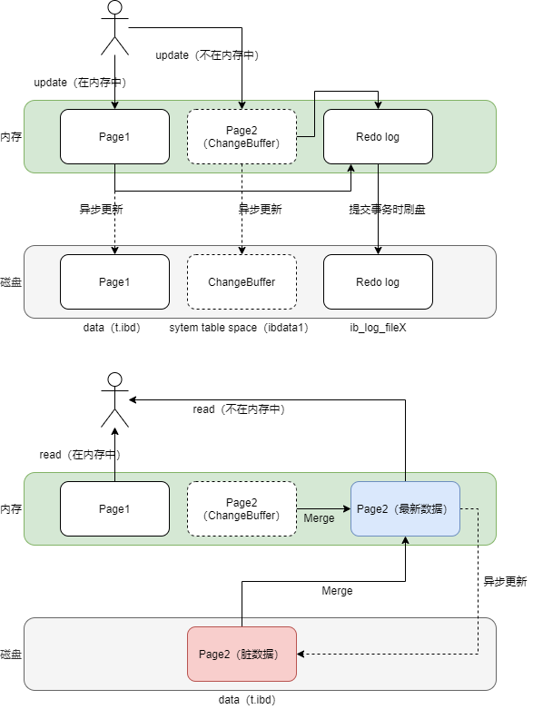

# 为什么你改了我看不到

## 隔离级别

在实现上，数据库里面会创建一个**视图**，访问的时候以视图的逻辑结果为准。

在“可重复 读”隔离级别下，这个视图是在事务启动时创建的，整个事务存在期间都用这个视图。

在“读提交”隔离级别下，这个视图是在每个 SQL 语句开始执行的时候创建的。

在“读未提交”隔离级别下，直接返回记录上的最新值，没有视图概念。

而“串行化”隔离级别下直接用加锁（读锁或写锁）的方式来避免并行访问。


## 事务启动方式

长事务会导致

1. 大量回滚日志；
2. 锁资源占用；所以要**避免长事务**。

MySQL 的事务启动方式有以下几种：

1. 显式启动事务语句， begin 或 start transaction。配套的提交语句是 commit，回滚语句是 rollback。
2. set autocommit=0，这个命令会将这个线程的自动提交关掉。意味着如果你只执行一 个 select 语句，这个事务就启动了，而且并不会自动提交。这个事务持续存在直到你主动执行 commit 或 rollback 语句，或者断开连接。

有些客户端连接框架会默认连接成功后先执行一个 set autocommit=0 的命令。这就导致接下来的查询都在事务中，如果是长连接，就导致了意外的长事务。 因此，建议总是使用 set autocommit=1, 通过显式语句的方式来启动事务。


## MVCC

在可重复读隔离级别下，事务在启动的时候就“拍了个快照”。注意，**这个快照是基于整库的**。

- InnoDB 里面每个事务有一个唯一的事务 ID，叫作 transaction id。它是在事务开始的时候向 InnoDB 的事务系统申请的，是按申请顺序严格递增的。
- 数据表中的一行记录，其实可能有多个版本 (row)，每个版本有自己的 row trx_id。
- InnoDB 为每个事务构造了一个数组，用来保存这个事务启动瞬间，当前正在“活跃”的所有事务 ID。“活跃”指的就是，启动了但还没提交。数组里面事务 ID 的最小值记为低水位，当前系统里面已经创建过的事务 ID 的最大值加 1 记为高水位。这个视图数组和高水位，就组成了当前事务的一致性视图（read-view）。


数据版本可见性规则


<font color=red>查询数据</font>

1. 如果落在绿色部分，表示这个版本是已提交的事务或者是当前事务自己生成的，这个数据是可见的；

2. 如果落在红色部分，表示这个版本是由将来启动的事务生成的，是肯定不可见的； 

3. 如果落在黄色部分，那就包括两种情况

   1. 若 row trx_id 在数组中，表示这个版本是由还没提交的事务生成的，不可见； 
   2. 若 row trx_id 不在数组中，表示这个版本是已经提交了的事务生成的，可见。

   即：

   1. 版本未提交，不可见； 除了自己的更新总是可见；
   2. 版本已提交，但是是在视图创建后提交的，不可见； 
   3. 版本已提交，而且是在视图创建前提交的，可见。

<font color=red>更新数据</font>都是先读后写的，而这个读，只能读当前的值（事务已提交的数据），称为“**当前读**”（current read）。若当前线程更新数据时，发现有其他线程正在更新且未提交事务（行锁），则当前线程阻塞。


可重复读的核心就是一致性读（consistent read）；而事务更新数据的时候，只能用当前读。如果当前的记录的行锁被其他事务占用的话，就需要进入锁等待。 

而读已提交的逻辑和可重复读的逻辑类似，它们最主要的区别是： 在可重复读隔离级别下，只需要在**事务**开始的时候创建一致性视图，之后事务里的其他查询都共用这个一致性视图； 在读提交隔离级别下，每一个**语句**执行前都会重新算出一个新的视图。


# 主键索引和非主键索引

数据是**按页来分块**的，假设当一个数据被用到时，其附近的数据通常也会被马上使用。**InnoDB**使用B+Tree实现聚簇索引。InnoDB 引擎中，<font color=red>其数据文件本身就是索引文件</font>。相比 MyISAM，索引文件和数据文件是分离的（**MyISAM叶节点存放的是数据记录的地址**），其表数据文件本身就是按 B+Tree 组织的一个索引结构，**树的叶节点 data 域保存了完整的数据记录**。这个索引的 key 是数据表的主键，因此 InnoDB 表数据文件本身就是主索引。这被称为“聚簇索引（或聚集索引）”，而其余的索引都作为辅助索引，辅助索引的 data 域存储相应记录主键的值而不是地址，这也是和 MyISAM 不同的地方。

- **主键索引（聚簇索引）**：<font color=red>叶子节点存放的是key值和数据，存放在磁盘上</font>，叶子节点加载到内存后，数据一起加载，即找到叶子节点的key，就找到了数据；
  - innodb一定存在聚簇索引（唯一），默认以主键作为聚簇索引
  - 没有主键时，会用一个唯一且不为空的索引列做为主键，成为此表的聚簇索引；如果没有这样的索引，InnoDB会隐式定义一个主键来作为聚簇索引
    - 在 MySQL 的 InnoDB 的表中，当没有显示的指定表的主键时，InnoDB 会自动先检查表中是否有唯一索引的字段，如果有，则选择该字段为默认的主键，否则 InnoDB 将会自动创建一个 6Byte 的自增主键。
- **辅助索引（非聚簇索引、二级索引）**：叶子节点存放的是key值（索引字段的值）和对应记录的主键值。使用辅助索引查询，首先检索辅助索引获取主键，然后用主键在主键索引中检索获取记录（<font color=red>回表</font>）。
  - 每建立一个非聚簇索引，会根据索引字段生成一颗新的B+树。因此每加一个索引，就会增加表的体积， 占用磁盘存储空间
  - 当执行 `select col from table where col = ?` col上有索引的时候，效率比执行 `select * from table where col = ?` 速度要快很多，因为只需要在非聚簇索引检索即可，不需要回表
  - 多加一个索引，就会多生成一颗非聚簇索引树。因此在做插入时，需要同时维护N颗树的变化，如果索引太多，插入性能就会下降。B+树需要维护索引的有序性，在插入新值的时候需要做必要的维护
    - 刚好插入到已有记录的后面
    - 插入到中间，需要逻辑上挪动后面的数据，空出位置；如果刚好数据页满了，就会申请一个新的页，然后挪动部分数据过去，称为**页分裂**。同时，相邻的两个页的数据利用率也会下降；当相邻两个页删除数据，利用率降低后，又会将数据**页合并**


## 重建索引

- 重建辅助索引
  - drop+add：有必要，重建索引可以使得索引结构空间更紧凑
- 重建主键索引
  - drop+add：没有必要，任何一条语句都会使得表重建。所以连续两个语句，使得第一个语句白做了
  -  alter table T engine=InnoDB


# 为什么要为表建立自增主键

- 自增主键的插入，符合递增插入，每次插入一条新记录，都是追加，不涉及挪动其他记录，也不会触发叶子节点的分裂。如果按照业务字段定义主键，不容易保证有序性，写数据成本相对较高（页分裂）。
- 如果用身份证号（唯一）作为主键，每个二级索引的叶子节点占用约20字节；而如果用整型做主键，则只要4个字节，如果是长整型，则是8个字节。因此，<font color=red>主键长度越小，普通索引的叶子节点就越小，普通索引占用的空间也就越小</font>。
  - 但如果表**只有一个索引**，这个索引必须是唯一索引，则尽量使用主键查询的原则，直接将这个索引设置为主键，可以避免搜索两颗树。


# 索引优化，避免回表

- 覆盖索引

  `select id from t where k between 3 and 5` 其中id是主键，k是普通索引。只需要搜索普通索引，就可以获取到查询需求，不需要回表。

  覆盖索引可以减少树的搜索次数，显著提升查询性能。

  **对于高频请求，可以建立联合索引，减少回表**。

- 最左前缀原则

  B+树的索引结构，可以利用索引的最左前缀定位记录。<font color=red>最左前缀可以是联合索引的最左N个字段，也可以是字符串最左的M个字符</font>。快速定位到索引，然后利用索引（**索引项按照索引定义出现的字段顺序排序**）向后快速遍历。

- 索引下推

  MySQL5.6之后，引入了索引下推优化，可以在索引遍历过程中（最左前缀匹配，联合索引剩余的部分也可匹配条件），对索引中包含的字段先做判断，直接过滤掉不满足条件的记录，减少回表的次数。

  <font color=red>让选择性最强的索引列放在前面</font>。


# 单表不建议超过2000万数据

InnoDB存储引擎最小存储单元页（Page），一个页的大小是**16K**。idb文件大小始终是16的倍数。

- 存放数据：记录按主键排序存放到不同的页中
- 存放 <font color=red>键值 + 指向数据页的指针</font>

在B+Tree中叶子节点存放数据，非叶子节点存放键值+指针（页）。每个节点是一页。索引组织表通过非叶子节点的二分查找法以及指针确定数据在哪个页中，进而在去数据页中查找到需要的数据。每张表的**根页**位置在表空间文件中是固定的，即page number=3的页。

假设：每页大小16K，主键为Bigint类型占8字节，指针占6字节；每条记录占1K大小

- 每一页约存放 ( 16 * 1024 ) / ( 8 + 6 ) = 1170 指向数据页的指针。
- 数据页存放16/1=16条记录

B+Tree高为2（叶子节点高为1，向上加1，直到根节点），数据记录条数 1170 * 16 = 18720

B+Tree高为3，数据记录条数 1170 * 1170 * 16 = 21902400

所以在InnoDB中B+树高度一般为1-3层，它就能满足千万级的数据存储。在查找数据时一次页的查找代表一次IO， 所以通过主键索引查询通常只需要1-3次IO操作即可查找到数据。


# 唯一索引和普通索引的选择



- 查询

  普通索引（找到索引后，还需要向后查找，直到第一个非索引值）比唯一索引（具有唯一性）多若干次搜索，性能差别微乎其微

- 插入

  - 普通索引，当数据页在内存时，直接插入；当数据页不在内存时，先更新到change buffer中，语句执行结束。最后再根据触发条件merge到磁盘。merge触发条件有

    - 访问这个数据页
    - 后台线程定义merge
    - 数据库正常关闭

    当change buffer还没有merge时读数据，则先从磁盘读取数据，然后再合并change buffer提供给用户，此时磁盘数据是脏数据。

  - 唯一索引，所有的更新都要判断是否违反唯一约束，当数据页在内存时，直接判断是否冲突，插入数据；当内存中不存在时，需要读取数据页到内存中，判断是否有冲突，插入值后语句执行结束

普通索引适应于<font color=red>写多读少</font>的场景（日志、账单、历史数据），最大化change buffer收益。**建议使用普通索引**，如果写入之后马上读的话，可以关闭change buffer。


# 索引统计数据不准确

可以通过以下方式尝试解决

- analyze table 对表的索引信息做重新统计，没有修改数据，这个过程中加了 MDL 读锁
- force index


# 字符串如何加索引

比如通过email查询用户信息 `select * from user where email = 'xxx'`

- 如果email不加索引的话，只能做全表扫描

- 利用前缀索引**节省空间**（索引越长，占用的磁盘空间就越大，相同数据页放下的索引值就越少，搜索效率越低）
  - `alter table user add index ix(email(7))`
  
  - 为了减少比较回表次数（**回表需要比较email是否相同，才能确定记录是否满足条件**），前缀索引的长度要有很好的**区分度**
  
    ```sql
    # 各个前缀数
    select
     count(distinct left(email,4)）as L4,
     count(distinct left(email,5)）as L5,
     count(distinct left(email,6)）as L6,
     count(distinct left(email,7)）as L7,
    from SUser;
    
    # 总数
    select count(distinct email) as L from SUser;
           
    # 各个前缀数 / 总数
    ```
  
    
  
  - <font color=red>前缀索引无法利用覆盖索引优化，因为不知道email是否被截断，必然要回表比较</font>

身份证号前缀区分度不高

- 倒序存储，再创建前缀索引

- 使用hash字段 crc32('xxx')，有额外的存储和计算

  **倒叙和哈希方式只能等值查询，无法范围查询。**

总结：

1. 直接创建完整索引，这样可能比较占用空间；
2. 创建前缀索引，节省空间，但会增加查询扫描次数，并且不能使用覆盖索引；
3. 倒序存储，再创建前缀索引，用于绕过字符串本身前缀的区分度不够的问题；
4. 创建 hash 字段索引，查询性能稳定，有额外的存储和计算消耗，跟第三种方式一样， 都不支持范围扫描。


# MySQL性能抖动

当内存数据页和磁盘数据页内容不一致的时候，这个内存页称为”脏页“。内存数据写入到磁盘后，内存和磁盘上的数据页内容就一致了，称为”干净页“。

MySQL偶尔抖动，就有可能是在刷脏页（flush），有以下几种情况可能会刷脏页

- redo log 写满了，系统会停止所有更新操作（**性能影响严重，需要尽量避免**）
- 系统内存不足，当需要的内存页不够用的时候，就要淘汰一些数据页。如果是干净页，直接让出位置；如果是脏页，需要先刷脏页（常态）
- MySQL空闲的时候（不需要考虑性能问题）
- MySQL正常关闭的时候（不需要考虑性能问题）

刷脏页虽然是常态，但以下两种情况会严重影响性能

- 一个查询要淘汰的脏页太多
- redo log写满

<font color=red>刷脏页的控制策略</font>

- `innodb_io_capacity` 告知InnoDB所在主机的IO能力，InnoDB才知道需要全力刷脏页的时候，可以刷多快。默认是200，单位是页。该参数设置的大小取决于硬盘的IOPS，即每秒的输入输出量（或读写次数）

  | innodb_io_capacity | 磁盘配置       |
  | ------------------ | -------------- |
  | 200                | 单盘SAS / SATA |
  | 2000               | SAS *12 RAID10 |
  | 5000               | SSD            |
  | 50000              | FUSION-IO      |

  可以动态调整参数 `SET GLOBAL innodb_io_capacity = 2000;`

  当刷脏页的速度很慢的时候，就会导致脏页累积，影响性能。

- `innodb_flush_neighbors` 值为1时连坐机制，当刷脏页时，发现相邻的数据页也是脏页就一起刷掉。对于机械磁盘有意义，减少随机IO。当值为0时，只刷自己。MySQL8.0中，此参数的默认值是0。


# 表数据删除而表文件大小不变

参数 `innodb_file_per_table` 

- 当设置为off时，数据放在系统共享表空间，即使表删除了，空间也不会回收。
- 当设置为on时，每个表存储在.idb为后缀的文件中。当drop table时，系统会直接删除这个文件。建议设置为on。

delete并不会真正删除数据，释放表空间，而只是在记录上打一个删除标记，表示可以**复用**。

- 如果记录上有删除标记，只限于符合范围的数据，如 [40, 60, 80] 60删除，插入70，可以复用60的空间；但插入90，则不可以复用。
- 如果数据页上的数据都被删除，则整个数据页被标记为删除。整个数据页都可以被复用。

<font color=red>如果delete整个表的数据，所有的数据页都会标记为可复用。但磁盘文件大小不变</font>。表经过大量增删改，都会产生空洞（可复用的空间，增加会使得数据页分裂）。

**收缩表空间**

- MySQL5.5，重建表 `alter table A engine=InnoDB` 执行时，A表不可以插入数据，否则会造成数据丢失，离线DDL命令。
- MySQL5.6，引入 online DDL。
  - alter table t engine=innodb,ALGORITHM=inplace;（默认，重建数据放到临时文件）
  - alter table t engine=innodb,ALGORITHM=copy;（临时表）


# count(*)的实现方式

- MyISAM引擎把一个表的总行数存在磁盘上，在执行 `count(*)` 的时候直接返回这个数，**效率很高；但不支持事务**。
- InnoDB引擎执行 `count(*)` 的时候，需要把数据一行一行从引擎读出来（**遍历全表**），然后累积计数。因为InnoDB对于事务的支持，RR通过MVCC实现，每一行要判断对这个session是否可见。**虽然结果准确，但会导致性能问题**。
- show table status 命令虽然返回很快，但是**不准确。采样统计**有40%-50%的误差。

改进——自己计数

- 缓存 redis；
  - 可能会造成数据丢失
  - 以及数据不一致的问题（不支持分布式事务）

- 数据库；通过事务可以解决以上问题

执行效率

count()的语义是一个聚合函数，对于返回的结果集，一行行地判断，如果count函数的参数不是null，累计值加1。最后返回累积值。其中 `count(字段) < count(主键id) < count(1) ≈ count(*)`

- `count(字段)` 如果这个字段定义为not null的话，一行行从记录读取这个字段，判断不为null，按行累加；如果允许为null的话，判断是不是为null，不是null才累加
- `count(主键id)` InnoDB引擎遍历整张表，把每一行的id取出来，返回给server层。server层拿到id后，判断是不可能为空的，按行累加
- `count(1)` InnoDB引擎遍历整张表，但不取值。server层对于返回的每一行，放一个1进去，判断是不可能为空的，按行累加
- `count(*) `并不会把全部字段取出来，专门做了优化，不取值。每一行肯定不是null，按行累加


# order by 的执行方式

`select city, name, age from t where city='杭州' order by name limit 1000;` 其中，city和name各占16字节，age占4字节

- **全字段排序**

  1. 初始化sort_buffer，确定放入city，name和age字段

  2. 从索引city找到第一个满足条件的主键id
  3. 到主键id索引取出整行数据，取city，name和age字段，存入sort_buffer（一次回表）
  4. 从索引city找到下一个满足条件的主键id
  5. 重复3和4，直到city不满足条件
  6. 对sort_buffer数据按照name快速排序（可能在内存中排序，当内存空间不足时，需要使用外部排序；即数据分别放在多个有序的文件中，然后再合并为一个有序的文件，归并排序）
  7. 按照排序结果取前1000行返回客户端

  **当返回的字段很多，则需要借助外部排序，性能会很差。**

- **rowid排序**

  `set max_length_for_sort_data=16` 控制用于排序的行数据长度。若单行超过此值，MySQL会更换为rowid算法。新的算法中sort_buffer只放入name和id

  1. 初始化sort_buffer，确定放入name和id字段
  2. 从索引city找到第一个满足条件的主键id
  3. 到主键id索引取出整行数据，取name和id字段，存入sort_buffer
  4. 从索引city找到下一个满足条件的主键id
  5. 重复3和4，直到city不满足条件
  6. 对sort_buffer数据按照name快速排序
  7. 遍历排序结果，取前1000行，**按照id回表**取出city、name和age字段返回客户端（两次回表）

优化

- 使用**覆盖索引**


# 为什么这些SQL语句逻辑相同，性能却差异巨大

```mysql
-- 测试表
CREATE TABLE `tradelog` (
 `id` int(11) NOT NULL,
 `tradeid` varchar(32) DEFAULT NULL,
 `operator` int(11) DEFAULT NULL,
 `t_modified` datetime DEFAULT NULL,
 PRIMARY KEY (`id`),
 KEY `tradeid` (`tradeid`),
 KEY `t_modified` (`t_modified`)
) ENGINE=InnoDB DEFAULT CHARSET=utf8mb4;

CREATE TABLE `trade_detail` (
 `id` int(11) NOT NULL,
 `tradeid` varchar(32) DEFAULT NULL,
 `trade_step` int(11) DEFAULT NULL, /* 操作步骤 */
 `step_info` varchar(32) DEFAULT NULL, /* 步骤信息 */
 PRIMARY KEY (`id`),
 KEY `tradeid` (`tradeid`)
) ENGINE=InnoDB DEFAULT CHARSET=utf8;
```

- 条件字段函数操作

   select count(*) from tradelog where month(t_modified)=7;

  - 原因
    **破坏索引值的有序性（索引树每一层有序），导致全索引扫描**

  - 修改

    select count(*) from tradelog where

     (t_modified >= '2016-7-1' and t_modified<'2016-8-1') or

     (t_modified >= '2017-7-1' and t_modified<'2017-8-1') or

     (t_modified >= '2018-7-1' and t_modified<'2018-8-1');

- 隐式类型转换

  select * from tradelog where tradeid=110717;

  - 原因

    在 MySQL 中，字符串和数字做比较的话，是将**字符串转换成数字**。相当于：select * from tradelog where CAST(tradid AS signed int) = 110717;

    <font color=red>如果反过来，查询条件是数字，查询值是字符串的化，可以走索引</font>。

- 隐式字符编码转换

  select d.* from tradelog l, trade_detail d where d.tradeid=l.tradeid and l.id=2;

  - 原因

    这两个表的字符集不同；utf8mb4 是 utf8 的超集，所以需要把d.tradeid转换为utf8mb4。相当于：select * from trade_detail where CONVERT(traideid USING utf8mb4)=$L2.tradeid.value;

<font color=red>对索引字段做函数操作，可能会破坏索引值的有序性，因此优化器就决定放弃走树搜索功能。</font>


# 为什么我只查一行的语句，也执行这么慢

- 查询长时间不返回

  select * from t where id=1;

  - 通过命令 `show processlist` 排查
    - 可能有一个线程正在表上请求或者持有 MDL 写锁，把 select 语句堵住了
    - 可能被flush堵住，如 `flush tables with read lock;` 而flush被其他长事务堵塞
    - `select * from t where id=1 lock in share mode;` id=1的数据已经被其他线程使用写锁锁定（长事务），因此获取读锁的时候阻塞

  解决

  - Mysql启动时设置 `performance_schema=on`
  - `select blocking_pid from sys.schema_table_lock_waits` 查找造成阻塞的pid，然后 `kill pid`

- 查询慢

  select * from t where c=50000 limit 1;

  - 设置 `set long_query_time=0` 查看慢查询日志，可以确认 rows_examined 扫描行数
    - c字段没有加索引，需要扫描主键索引；（**扫描行数多，执行慢**）
    - `select * from t where id=1；` 快照读，如果有N次UndoLog的化，需要执行N次UndoLog； `select * from t where id=1 lock in share mode` 当前读，读取最新数据，不需要执行N次UndoLog。


# 幻读

幻读指的是一个事务在前后两次查询同一个**范围**的时候，后一次查询看到了前一次查询没有看到的行。

**在可重复读隔离级别下**

普通的查询是快照读，是不会看到别的事务插入的数据的。因此，幻读在“当前读”（select...for update）下才会出现。注意，<font color=red>幻读仅专指“新插入的行”（insert）</font>。（对于update之后查到的行不能称为幻读）
间隙锁和行锁合称 next-key lock，每个 next-key lock 是前开后闭区间。也就是说，我们 的表初始化以后，如果用 select * from t for update 要把整个表所有记录锁起来。

对于非索引的锁定，会锁定所有行和间隙，相当于锁表。

**引入间隙锁带来的问题**

当锁定的行不存在时，锁定的是间隙。多个线程的间隙锁不互斥，而读写锁和写写锁互斥。因此，当两个线程分别获得了相同区间的间隙锁，又分别向间隙插入数据时，就会出现死锁（死锁检测第一个事务抛出异常）。间隙锁的引入，会影响到并发度。

解决方案

- 读提交隔离级别 +  binlog_format=row 组合


# 加锁规则

前提

- MySQL 后面的版本可能会改变加锁策略，所以这个规则只限于截止到现在的最新版本， 即 5.x 系列 <=5.7.24，8.0 系列 <=8.0.13。
- 可重复读隔离级别。（才有间隙锁）

<font color=red>规则</font>

- 等值查询间隙锁
  - 锁定不存在的记录，会锁定间隙（前开后闭）；
    - 插入数据阻塞；
    - 更新间隙的闭合记录，可以更新；（索引上的等值查询，向右遍历时且最后一个值不满足等值条件的时候，nextkey lock 退化为间隙锁。）
- 非唯一索引等值锁
  - 锁定非唯一索引的记录+间隙
  - 对于主键索引的记录锁是否锁定，原则是**访问到的对象才会加锁**；
    - （lock in share mode）如果可以通过覆盖索引访问到的数据（不需要回表），则不会锁定主键索引
    - （for update）系统会认为接下来要更新数据，因此会顺便给主键索引上满足条件的行加上行锁
  - **在删除数据的时候尽量加 limit。这样不仅可以控制删除数据的条数，让操作更安全，还可以减小加锁的范围**
- 主键索引范围锁
  - 等值+范围 的 临键锁（行锁 + 间隙锁）
  - 对于主键索引的等值查询的间隙锁，会优化为行锁
- 非唯一索引范围锁
  - 间隙锁
  - 注意等值查询的间隙锁（左右范围都应该包括），并没有优化
- 唯一索引范围锁 bug
  - **唯一索引上的范围查询会访问到不满足条件的第一个值为止。（会向前多包括一个范围）**


# 提高性能的方法

- 短链接风暴

  - kill 掉非事务空闲连接线程
    - `select * from information_schema.innodb_trx` 处在事务中的ID
    - 服务端：kill connection + id
    - 应用端：发起下一个请求报错后，要有重连机制
  - 不建议 max_connections 调高，会使得服务负载更高，大量的资源耗费在权限验证等逻辑
  - 不建议 skip-grant-tables 忽略权限验证

- 慢查询性能问题

  大体有以下三种可能

  1. 索引没有设计好

     线上增加索引：1、**备库加索引+切换**；2、gh-ost

  2. SQL 语句没写好

  3. MySQL 选错了索引

     force index

- QPS 突增问题

  - 从数据库端直接把白名单去掉
  - 如果这个新功能使用的是单独的数据库用户，可以用管理员账号把这个用户删掉，然后断开现有连接

- IO性能瓶颈

  - 设置 binlog_group_commit_sync_delay 和 binlog_group_commit_sync_no_delay_count 参数，减少 binlog 的写盘次数

    这个方法是基于“额外的故意等待”来实现的，因此可能会增加语句的响应时间，但没有丢失数据的风险。

  - 将 sync_binlog 设置为大于 1 的值（比较常见是 100~1000）。这样做的风险是，主机掉电时会丢 binlog 日志。

  - 将 innodb_flush_log_at_trx_commit 设置为 2。这样做的风险是，主机掉电的时候会丢数据。

    - 一般情况下，把生产库改成“非双 1”配置，是设置 innodb_flush_logs_at_trx_commit=2、sync_binlog=1000
      - 业务高峰期。
      - 备库延迟，为了让备库尽快赶上主库。
      - 用备份恢复主库的副本，应用 binlog 的过程。
      - 批量导入数据的时候。


# MySQL是怎么保证主备一致的

几乎所有的高可用架构，都直接依赖于 binlog。虽然这些高可用架构已经呈现出越来越复杂的趋 势，但都是从最基本的一主一备演化过来的。

- 主备的基本原理

  1. 在备库 B 上通过 change master 命令，设置主库 A 的 IP、端口、用户名、密码，以及要从哪个位置开始请求 binlog，这个位置包含文件名和日志偏移量。
  2. 在备库 B 上执行 start slave 命令，这时候备库会启动两个线程，io_thread 和 sql_thread。其中 io_thread 负责与主库建立连接。
  3. 主库 A 校验完用户名、密码后，开始按照备库 B 传过来的位置，从本地读取 binlog， 发给 B。
  4. 备库 B 拿到 binlog 后，写到本地文件，称为中转日志（relay log）。
  5. sql_thread 读取中转日志，解析出日志里的命令，并执行。

- 互为主备（双主）

  需要解决循环复制的问题

  1. 规定两个库的 server id 必须不同，如果相同，则它们之间不能设定为主备关系；
  2. 一个备库接到 binlog 并在重放的过程中，生成与原 binlog 的 server id 相同的新的 binlog；
  3.  每个库在收到从自己的主库发过来的日志后，先判断 server id，如果跟自己的相同，表示这个日志是自己生成的，就直接丢弃这个日志。

- binlog 的三种格式

  - binlog_format=statement（**生产不建议**）

    `show binlog events in 'master.000001';` 查看binlog日志

    记录原始SQL语句，**当主备库使用不同索引的时候，按多个条件删除数据可能会出现歧义**。

  - binlog_format=row（**恢复数据场景**）

    `mysqlbinlog -vv data/master.000001 --start-position=8900;`

    语句替换成event，**会记录主键和所有数据，备库回放不会出现歧义**。但缺点是占用空间大，会记录所有影响到的记录。

    <font color=red>恢复数据的正确姿势</font>

    `mysqlbinlog master.000001 --start-position=2738 --stop-position=2973 | mysql -h127.0.0.1 -P13000 -u$user -p$pwd;`

  - binlog_format=mixed（使用很少）

    mixed 格式可以利用 statment 格式的优点，同时又避免了数据不一致的风险。没有歧义使用statement，否则用row

- 备库并行复制能力

  在主库上，影响并发度的原因就是各种锁了。由于 InnoDB 引擎支持行锁，除了所有并发事务都在更新同一行（热点行）这种极端场景外，它对业务并发度的支持还是很友好的。

  而日志在备库上的执行，就是备库上 sql_thread 更新数据 (DATA) 的逻辑。如果是用单线程的话，就会导致备库应用日志不够快，造成主备延迟。

  在官方的 5.6 版本之前，MySQL 只支持单线程复制，由此在主库并发高、TPS 高时就会出现严重的主备延迟问题。

  - coordinator 代替 sql_thread，分发任务给多个worker（8/16 32核机器）

    coordinator 在分发的时候，需要满足以下这两个基本要求

    1. 不能造成更新覆盖。这就要求更新同一行的两个事务，必须被分发到同一个 worker 中。
    2. 同一个事务不能被拆开，必须放到同一个 worker 中。 各个版本的多线程复制，都遵循了这两条基本原则。

  官方迭代

  - 官方 MySQL5.6 版本，支持了并行复制，只是支持的粒度是**按库**并行。（应用不多）
  - MariaDB利用组提交 (group commit) 优化。但无法模拟主库的并发度，只能一组一组运行提交。
  - MySQL 5.7 并行复制策略
    - 同时处于 prepare 状态的事务，在备库执行时是可以并行的；
    - 处于 prepare 状态的事务，与处于 commit 状态的事务之间，在备库执行时也是可以并行的。
  - MySQL 5.7.22 版本里，MySQL 增加了一个新的并行复制策略， 基于 WRITESET 的并行复制
    - COMMIT_ORDER，根据同时进入 prepare 和 commit 来判断是否可以并行的策略。
    - WRITESET，表示的是对于事务涉及更新的每一行，计算出这一行的 hash 值，组成集合 writeset。如果两个事务没有操作相同的行，也就是说它们的 writeset 没有交集，就可以并行。
    - WRITESET_SESSION，是在 WRITESET 的基础上多了一个约束，即在主库上同一个线程先后执行的两个事务，在备库执行的时候，要保证相同的先后顺序。


# MySQL是怎么保证高可用的

- 主备延迟

  - 备库所在机器的性能要比主库所在的机器性能差；备库消费中转日志（relay log）的速度，比主库生产 binlog 的速度要慢

  - 备库的压力大；备库大量读压力

    - 一主多从
    - 导出binlog到外部分析系统

  - 大事务

    大事务这种情况很好理解。因为主库上必须等事务执行完成才会写入 binlog，再传给备库。所以，如果一个主库上的语句执行 10 分钟，那这个事务很可能就会导致从库延迟 10 分钟，同时从库执行也需要延迟10分钟。

    - 大批量删除数据：可以分多次
    - 大表 DDL
    
  - **备库没有并行复制能力**

- 主被切换策略

  - 可靠性优先策略

    1. 判断备库 B 现在的 seconds_behind_master（`show slave status`），如果小于某个值（比如 5 秒，无限接近）继续下一 步，否则持续重试这一步；（**因此当主备延迟大的情况下，若主备切换就是一个灾难**）
    2. 把主库 A 改成只读状态，即把 readonly 设置为 true；
    3. 判断备库 B 的 seconds_behind_master 的值，直到这个值变成 0 为止；（**主备都是readonly，存在不可写时间**）
    4. 把备库 B 改成可读写状态，也就是把 readonly 设置为 false；
    5. 把业务请求切到备库 B。

  - 可用性优先策略

    如果强行把步骤 4、5 调整到最开始执行，也就是说不等主备数据同步，直接把连接切到备库 B，并且让备库 B 可以读写，那么系统几乎就没有不可用时间了。 称作可用性优先流程。这个切换流程的代价，就是可能出现数据不一致的情况。

    - binlog_format=statement（会导致数据异常，且不报错）
    - binlog_format=row（duplicate key error，可以及时发现问题）
  
- **如何判断主库出问题了**

  - `select 1` 成功返回，只能说明这个库的进程还在，并不能说明主库没问题（可能并发线程达到上限）

    - innodb_thread_concurrency （**并发查询线程，并不是并发连接**）默认时0，并发线程不受限，当过多线程，上下文切换浪费资源。建议把 innodb_thread_concurrency 设置为 64~128

  - 查表判断 ` select * from mysql.health_check;` 但无法判断磁盘空间满的问题（没有办法写binlog）

  - 更新判断 `update mysql.health_check set t_modified=now();` （**优先**）

  - 内部统计 （**其次**）

    MySQL 5.6 版本以后提供的 performance_schema 库，就在 file_summary_by_event_name 表里统计了每次 IO 请求的时间。


# 读写分离

架构模式

- 客户端负责负载均衡
- 客户端和MySQL之间存在Proxy，由其负责路由；同时Proxy需要支持高可用


处理从库过期读的方案

- 强制走主库方案； 

  请求分类，区分查询主库或从库

- sleep 方案； （不精确）

- 判断主备无延迟方案； （当TPS很高的情况下，主从一直不一致，过度等待）

  查看 `show slave status`  

  - seconds_behind_master是否为0（单位时秒，不精确）

  - 查看位点（两组值是否完全相同）

    Master_Log_File 和 Read_Master_Log_Pos，表示的是读到的主库的最新位点； Relay_Master_Log_File 和 Exec_Master_Log_Pos，表示的是备库执行的最新位点。

  - 对比 GTID（两组值是否完全相同）

    Auto_Position=1 ，表示这对主备关系使用了 GTID 协议。 Retrieved_Gtid_Set，是备库收到的所有日志的 GTID 集合； Executed_Gtid_Set，是备库所有已经执行完成的 GTID 集合。

- 配合 semi-sync 方案；（某些从库执行查询请求会存在过期读；在持续延迟的情况下，可能出现过度等待的问题）

  引入半同步复制。semi-sync+ 位点判断的方案，只对一主一备的场景是成立的。在一主多从场景中， 主库只要等到一个从库的 ack，就开始给客户端返回确认。

- 等主库位点方案； 

  1. trx1 事务更新完成后，马上执行 `show master status` 得到当前主库执行到的 File 和 Position；
  2. 选定一个从库执行查询语句； 
  3. 在从库上执行 `select master_pos_wait(File, Position, 1)`；
  4. 如果返回值是 >=0 的正整数，则在这个从库执行查询语句；
  5. 否则，到主库执行查询语句或者超时（降级）。

- 等 GTID 方案。

  1. trx1 事务更新完成后，从返回包直接获取这个事务的 GTID，记为 gtid1；
  2. 选定一个从库执行查询语句；
  3. 在从库上执行 `select wait_for_executed_gtid_set(gtid1, 1)`；
  4. 如果返回值是 0，则在这个从库执行查询语句；
  5. 否则，到主库执行查询语句或者超时（降级）。


# 误删数据

- 使用 delete 语句误删数据行；
  - 使用Flashback，原理是修改 binlog 的内容，拿回原库重放
    - 确保 binlog_format=row 和 binlog_row_image=FULL
    - 在从库上操作，再在主库恢复数据
    - delete 全表是很慢的，需要生成回滚日志、写 redo、写 binlog。所以，从性能角度考虑，应该优先考虑使用 truncate table 或者 drop table 命令。
  - 预防
    - 把 sql_safe_updates 参数设置为 on。这样一来，如果我们忘记在 delete 或者 update 语句中写 where 条件，或者 where 条件里面没有包含索引字段的话，这条语句的执行就会报错。
    - 代码上线前，必须经过 SQL 审计。
- 使用 drop table 或者 truncate table 语句误删数据表；使用 drop database 语句误删数据库；
  - 这种情况下，要想恢复数据，就需要使用全量备份，加增量日志的方式了。这个方案要求线上有定期的全量备份，并且实时备份 binlog
  - 预防
    - 账号分离
    - 制定操作规范
    - 定期确认备库的有效性
    - 定期演练
    - 4个脚本：备份、执行、验证、回滚
- 使用 rm 命令误删整个 MySQL 实例。
  - 只要不是恶意地把整个集群删除，而只是删掉了其中某一个节点的数据的话，HA 系统就会开始工作，选出一个新的主库，从而保证整个集群的正常工作。


# 为什么还有kill不掉的语句

在 MySQL 中有两个 kill 命令：

1. kill query + 线程 id，表示终止这个线程中正在执行的语句；
2. kill connection + 线程 id，这里 connection 可缺省，表示断开这个线程的连接，当然如果这个线程有语句正在执行，也是要先停止正在执行的语句的。

通过 `show processlist` 查看线程ID。

**kill 无效的情况**

这些“kill 不掉”的情况，其实是因为发送 kill 命令的客户端，并没有强行停止目标线程的执行，而只是设置了个状态，并唤醒对应的线程。而被 kill 的线程，需要执行到判断状态的“埋点”，才会开始进入终止逻辑阶段。并且，终止逻辑本身也是需要耗费时间的。

- 线程没有执行到判断线程状态的逻辑
- 终止逻辑耗时较长
  - 超大事务执行期间被 kill。这时候，回滚操作需要对事务执行期间生成的所有新数据版本做回收操作，耗时很长。
  - 大查询回滚。如果查询过程中生成了比较大的临时文件，加上此时文件系统压力大，删除临时文件可能需要等待 IO 资源，导致耗时较长。
  - DDL 命令执行到最后阶段，如果被 kill，需要删除中间过程的临时文件，也可能受 IO 资源影响耗时较久。


# join语句怎么优化

`select * from t1 straight_join t2 on (t1.a=t2.a);`  straight_join表示绕过优化器，直接使用语句的join关系，即t1是驱动表，t2是被驱动表。

- 全表扫描t1，然后单条记录通过索引a查询t2（**需要使用被驱动表的索引**）
- <font color=red>在这个 join 语句执行过程中，驱动表是走全表扫描，而被驱动表是走树搜索（索引树+回表）</font>。假设驱动表的行数是 N，被驱动表的行数是 M，时间复杂度是N + N2log M。显然，N 对扫描行数的影响更大，因此应该让<font color=red>小表（1、要考虑where条件；2、要考虑查询字段数量）来做驱动表</font>。
- 使用 join 语句，性能比强行拆成多个单表执行 SQL 语句的性能要好；（执行次数少）


当使用到索引时，使用Index Nested-Loop Join（NLJ）算法；（**正确姿势**）


若没有，则使用Block Nested Loop（BNL）算法，驱动表会放到join_buffer_size中（放不下的化，会分成多段），然后扫描被驱动表和驱动表匹配，也就是说，分段越多，被驱动表全表扫描的次数就越多，要想提高速度，就要增加join_buffer_size大小，减少分段。（**也是小表作为驱动表，但会消耗大量系统资源，尽量不要使用join**）

- 可能会多次扫描被驱动表，占用磁盘 IO 资源；
- 判断 join 条件需要执行 M*N 次对比（M、N 分别是两张表的行数），如果是大表就会占用非常多的 CPU 资源；
- 可能会导致 Buffer Pool 的热数据被淘汰，影响内存命中率。

优化

启动参数 `set optimizer_switch='mrr=on,mrr_cost_based=off,batched_key_access=on';` <font color=red>想办法给被驱动表的关联条件字段加索引，驱动表（小表）的查询字段加索引</font>

- 加索引
  - BNL 直接转为转 BKA
- BNL 转 BKA（Batched Key Access，对 NLJ 算法的优化）
  - 被驱动表是大表，过滤条件后数据量比较小，索引不常用，加索引的化得不偿失。
  - 把被驱动表过滤后的数据放到临时表，然后加索引


# 临时表

在实际应用中，临时表一般用于处理比较复杂的计算逻辑。由于临时表是每个线程自己可见 的，所以不需要考虑多个线程执行同一个处理逻辑时，临时表的重名问题。在线程退出的时 候，临时表也能自动删除，省去了收尾和异常处理的工作。

特征

- 建表语法是 create temporary table …
- 一个临时表只能被创建它的 session 访问，对其他线程不可见
- 临时表可以与普通表同名
- session A 内有同名的临时表和普通表的时候，`show create table t` 语句，以及增删改查语句访问的是临时表；show tables 命令不显示临时表
- 由于临时表只能被创建它的 session 访问，所以在这个 session 结束的时候，会自动删除临时表
- 在 binlog_format='row’的时候，临时表的操作不记录到 binlog 中，也省去了不少麻 烦，这也可以成为选择 binlog_format 时的一个考虑因素

应用场景

- 分库分表系统的跨库查询

  在某一个库创建临时表，把各个子库子表数据插入到临时表，然后查询临时表

内部临时表

默认使用内存表（engine=memory），索引实现使用的是哈希索引，数据和索引分开存放，数据数组按插入顺序，并且可以前插入到空位

- union

  - 语义是取这两个子查询结果的并集。并集的意思就是这两个集合加起来，重复的行只保留一行。借助了临时表的唯一约束
  - 对于 union all 不需要去重，因此不需要临时表

- group by

  - group by 的语义逻辑，是统计不同的值出现的个数。但是由于结果是无序的，所以就需要有一个临时表，来记录并统计结果。

  - 优化，若结果如果是有序的，就不需要借助临时表记录统计结果

    - 索引

      `alter table t1 add column z int generated always as(id % 100), add index(z);` （MySQL 5.7）

    - 直接排序（当内存临时表空间不够时，使用磁盘临时表，**磁盘临时表默认使用的引擎是 InnoDB**；当事先知道内存肯定不够用，SQL_BIG_RESULT直接指定磁盘临时表）

      `select SQL_BIG_RESULT id%100 as m, count(*) as c from t1 group by m;`


# 自增主键

- 自增主键保存策略

  - MyISAM 引擎的自增值保存在数据文件中。
  - InnoDB 引擎在 MySQL 5.7 及之前的版本，自增值保存在内存里，并没有持久化。每次重启后，第 一次打开表的时候，都会去找自增值的最大值 max(id)，然后将 max(id)+1 作为这个 表当前的自增值。 
  - InnoDB 引擎在 MySQL 8.0 版本，将自增值的变更记录在了 redo log 中，重启的时候依靠 redo log 恢复重启之前的值。

- 自增值修改机制

  - 如果插入数据时 id 字段指定为 0、null 或未指定值，那么就把这个表当前的 AUTO_INCREMENT 值填到自增字段； 
  - 如果插入数据时 id 字段指定了具体的值，就直接使用语句里指定的值。

- 自增主键递增但不保证连续（性能考虑，否则，插入数据前要判断是否主键冲突；或者扩大锁范围，自增主键的申请也要加锁）

  - 唯一键冲突
  - 事务回滚
  - 对于批量插入数据的语句，MySQL 有一个批量申请自增 id 的策略；同一个语句去申请自增 id，每次申请到的自增 id 个数都是上一次的两倍
    - insert … select 是很常见的在两个表之间拷贝数据的方法。需要注意，在可重复读隔离级别下，这个语句会给 select 的表里扫描到的记录和间隙加读锁。
    - 而如果 insert 和 select 的对象是同一个表，则有可能会造成循环写入。这种情况下，系统需要引入用户临时表来做优化。
    - insert 语句如果出现唯一键冲突，会在冲突的唯一值上加共享的 next-key lock(S 锁)。因此，碰到由于唯一键约束导致报错后，要尽快提交或回滚事务，避免加锁时间过长。

- 自增id用完怎么办

  - 表定义自增值 id

    表定义的自增值达到上限后的逻辑是：再申请下一个 id 时，得到的值保持不变。**会报报主键冲突错误**。

    - 创建成 8 个字节的 bigint unsigned

  - InnoDB 系统自增 row_id

    如果你创建的 InnoDB 表没有指定主键，那么 InnoDB 会给你创建一个不可见的，长度为 6 个字节的 row_id。

    InnoDB 维护了一个全局的 dict_sys.row_id 值，所有无主键的 InnoDB 表，每插入一行数据，都将当前的 dict_sys.row_id 值作为要插入数据的 row_id， 然后把 dict_sys.row_id 的值加 1。

    实际上，在代码实现时 row_id 是一个长度为 8 字节的无符号长整型 (bigint unsigned)。 但是，InnoDB 在设计时，给 row_id 留的只是 6 个字节的长度，这样写到数据表中时只放最后 6 个字节。达到上限后，下一个值就是 0，然后继续循环。在 InnoDB 逻辑里，申请到 row_id=N 后，就将这行数据写入表中； 如果表中已经存在 row_id=N 的行，新写入的行就会**覆盖原有的行**。（**风险**）

    - row_id 写入表中的值范围，是从 0 到 2^48 -1；
    - 当 dict_sys.row_id=2^48 时，如果再有插入数据的行为要来申请 row_id，拿到以后再取最后 6 个字节的话就是 0。


# 怎么最快地复制一张表

- insert … select 是很常见的在两个表之间拷贝数据的方法。需要注意，在可重复读隔离级别下，这个语句会给 select 的表里扫描到的记录和间隙加**读锁**。（**需要控制对源表的扫描行数和加锁范围**）

- mysqldump

  使用 mysqldump 命令将数据导出成一组 INSERT 语句

  ```mysql
  -- 导出（到客户端）
  -- –single-transaction 的作用是，在导出数据的时候不需要对表 db1.t 加表锁，而是使用START TRANSACTION WITH CONSISTENT SNAPSHOT 的方法；
  -- –add-locks 设置为 0，表示在输出的文件结果里，不增加" LOCK TABLES t WRITE;"；
  -- –no-create-info 的意思是，不需要导出表结构；
  -- –set-gtid-purged=off 表示的是，不输出跟 GTID 相关的信息；
  -- –result-file 指定了输出文件的路径，其中 client 表示生成的文件是在客户端机器上的。
  mysqldump -h$host -P$port -u$user --add-locks=0 --no-create-info --single-transaction  --set-gtid-purged=OFF db1 t --where="a>900" --result-file=/client_tmp/t.sql
  
  -- 导入
  mysql -h127.0.0.1 -P13000 -uroot db2 -e "source /client_tmp/t.sql"
  ```

- 导出 CSV 文件

  ```mysql
  -- 导出（到服务端）
  select * from db1.t where a>900 into outfile '/server_tmp/t.csv';
  
  -- 导入
  load data infile '/server_tmp/t.csv' into table db2.t;
  ```

  

