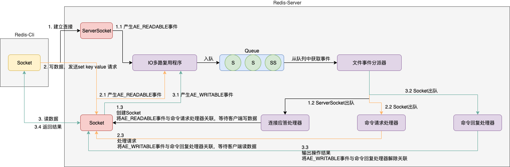

# 数据结构与对象

## 数据结构

| 数据结构   | 对象系统         |
| ---------- | ---------------- |
| sds        | String           |
| ziplist    | List、Hash、ZSet |
| linkedlist | List             |
| hashtable  | Hash、Set        |
| intset     | Set              |
| skiplist   | ZSet             |


### 简单动态字符串 sds

SDS（simple dynamic string） 简单动态字符串，应用

- 键值对中的键和值
- 缓存区

free + len + char buf[]

- strlen 时间复杂度 O(1)：len
- 避免缓存区溢出：判断free，若不够扩容
- 避免频繁内存分配调整
  - 空间预分配：1、若**修改后**len<1MB，则扩容与len相同的空间；2、否则，扩容1MB
  - 惰性空间释放：1、只修改free，并不真正回收空间；2、可以手动回收，避免内存泄露
- 二进制安全（空字符问题），buf只作为保存二进制数据的容器，长度由len决定，而不是空字符决定
- 兼容部分C字符串函数


### 链表 list

应用

- 列表
- 发布订阅、慢查询、监视器

head + tail + len + 双端链表


### 字典 dict

应用

- 哈希散列
- 数据库字典（0-15）

字典 + 哈希表 + 哈希表节点

- rehash：字典有两个哈希表（ht0、ht1），平时只使用一个ht0，只有在扩容或缩容的时候才会使用另外一个ht1。空间换时间；同时，为了避免集中式rehash的性能问题，采用渐进式。当前哈希表ht0，增（ht1）、删（ht0->ht1或ht1）、改（ht0->ht1或ht1）、查（ht0或ht1），即把集中式的时间分摊到多个操作中。


### 跳跃表 skiplist

应用

- 有序集合键
- 集群节点中用作内部数据结构

每个节点中维护多个指向其他节点的指针（**多指针的有序链表**），从而达到快速访问的目的。平均时间复杂度 O(logN)，最坏时间复杂度 O(N)


### 整数集合 intset

应用

- 集合键

encoding + length + contents[]（**有序无重复**）

encoding表示存入contents数组的类型。如果将一个新元素添加到整数集合中，并且新元素的类型比整数集合现有所有元素的类型都要长时，整数集合需要先进行升级，然后再将新元素添加到整数集合里面。

**升级**分为三步：

1. 根据新元素的类型，扩展整数集合底层数组空间，并为新元素分配空间
2. 将现有元素转换成新元素类型，并放置到正确的位上，放置过程，需要维持底层数组的有序性质
3. 将新元素添加到底层数组

因为每次向整数集合添加元素可能会引起升级，而每次升级需要对现有元素进行类型转换，所以时间复杂度时O(N)。

**整数集合不支持降级**。


### 压缩列表 ziplist

应用

- 列表键（少量列表项，每个列表项要么是小整数值，要么是较短的字符串）
- 哈希键（少量键值对）


## 对象系统

Redis并没有直接使用以上数据结构来实现键值对，而是基于这些数据结构创建了一个对象系统，包括字符串对象、列表对象、哈希对象、集合对象、有序集合对象。每种对象都用到了至少一种数据结构。针对不同的使用场景，为对象设置不同的数据结构实现，提高使用效率。

Redis使用对象表示数据库中的键和值。

字符串对象编码

- int
- raw
- embstr

列表对象编码

- ziplist
- linkedlist

哈希对象编码

- ziplist
- hashtable

集合对象编码

- intset
- hashtable

有序集合编码

- ziplist
- skiplist 范围 + dict 确值


# 单机数据库

## 过期策略

### 过期键的判断

- 过期键是否存在与过期字典中；不存在，不存在过期；存在，取得过期时间
- 检查当前系统时间是否大于过期时间；是，已过期；否，尚未过期


### 过期删除策略

- 惰性删除

  指的是当我们查询key的时候才对key进⾏检测，如果已经达到过期时间，则删除。显然，他有⼀个缺点就是如果这些过期的key没有被访问，那么他就⼀直⽆法被删除，⽽且⼀直占⽤内存。

- 定期删除

  定期删除指的是redis每隔⼀段时间对数据库做⼀次检查，删除⾥⾯的过期key。由于不可能对所有key去做轮询来删除，所以redis会每次随机取⼀些key去做检查和删除。


### 持久化功能对过期键的处理

- RDB文件
  - save 或 bgsave 命令创建RDB时，会对键进行检查，已过期的键不会保存到新创建的RDB文件中
  - 加载RDB文件；如果是主库，检查键是否已经过期，过期的不会加载；如果是从库，不检查，直接加载
- AOF文件
  - 文件写入，如果某个键过期，还没有被删除，AOF不会受到影响（仍旧写入）；当删除后，向AOF文件追加一条DEL命令来显式删除
  - AOF重写会忽略已经过期的键
  - 从服务器不会处理过期键，客户端请求时可以正常返回；只有主服务器显式发送DEL命令时，从服务器才会删除过期键


### 内存淘汰机制

假设存在定期随机查询key的时候没有删掉，这些key也没有做查询的话，就会导致这些key⼀直保存在redis⾥⾯⽆法被删除，这时候就会⾛到redis的内存淘汰机制

1. volatile-lru：从已设置过期时间的key中，移除**最近最少使⽤**的key进⾏淘汰

2. volatile-ttl：从已设置过期时间的key中，移除将要过期的key
3. volatile-random：从已设置过期时间的key中随机选择key淘汰
4. allkeys-lru：从key中选择最近最少使⽤的进⾏淘汰
5. allkeys-random：从key中随机选择key进⾏淘汰
6. noeviction：当内存达到阈值的时候，新写⼊操作报错


4.0 版本后增加以下两种：

1. volatile-lfu（least frequently used）：从已设置过期时间的数据集中挑选**最不经常使用**的数据淘汰
2. allkeys-lfu（least frequently used）：当内存不足以容纳新写入数据时，在键空间中，移除最不经常使用的 key


## RDB持久化

持久化可以手动执行，也可以根据服务器配置选项定期执行。RDB文件是一个二进制文件，通过该文件可以还原生成RDB文件时的数据库状态。


### RDB文件创建

- 手动创建

  - save **阻塞**Redis服务器进程，直到RDB文件创建完毕为止

  - bgsave 派生一个子进程，由子进程负责创建RDB文件，服务器进程（父进程）可以继续处理命令请求

- 自动间隔保存

  ```shell
  # 三个条件任意一个满足，则会执行bgsave
  # 900秒至少1次修改
  save 900 1
  # 300秒至少10次修改
  save 300 10
  # 60秒至少10000次修改
  save 60 10000
  ```


### RDB文件载入

在服务器启动时检测到RDB文件存在，就会自动加载RDB文件。如果服务器开启了AOF持久化，服务器会优先使用AOF文件来还原数据库状态。


### RDB文件结构

- REDIS 5字节
- db_version 4字节，字符串表示的整数，记录了RDB文件的版本号
- databases 零个或任意多个数据库，以及各个数据库中的键值对数据；如果数据库为空，则为0字节
  - SELECTDB 1字节
  - db_number 1字节 / 2字节 / 5字节，保存数据库号码
  - key_value_pairs 数据库中的所有键值对数据
    - EXPIRETIME_MS 1字节，读入毫秒为单位的过期时间（可选）
    - ms 8字节带符号整数，以毫秒为单位的UNIX时间戳，键值对的过期时间（可选）
    - TYPE 1字节，value的类型
    - key
    - value
- EOF 1字节，标志RDB文件正文内容结束
- check_sum 8字节无符号整数，保存着一个校验和


## AOF持久化

### AOF文件写入与同步

Append Only File 持久化功能，保存Redis服务器执行的命令来记录数据库的状态。

- 命令追加

  协议内容追加到 aof_buf 缓冲区的末尾

- 文件写入与同步

  在服务器每⼀个事件循环中，调用文件事件处理和时间事件处理，**在处理文件事件时可能会执行一些写命令**，这些写命令被追加到 aof_buf 缓冲区中。在结束事件循环之前，调⽤flushAppendOnlyFile函数决定是否要将aof_buf的内容保存到AOF⽂件中，可以通过配置appendfsync来决定

  - always 将aof_buf缓冲区的所有内容写入并同步到AOF文件。最安全，只会丢失⼀次事件循环的写命令，但性能较差。
  - eveysec（默认） 将aof_buf缓冲区的所有内容写入AOF文件（PageCache），距离上次同步AOF时间超过1秒，对AOF文件进行同步，并且同步操作由一个线程负责。有可能会丢失1秒数据。
  - no 将aof_buf缓冲区的所有内容写入AOF文件（PageCache），不对AOF文件进行同步，由OS自己决定。效率和everysec相仿，但是会丢失上次同步AOF⽂件之后的所有写命令数据。


### AOF文件载入

服务器在启动时，可以通过载入和执行AOF文件保存的命令来还原服务器关闭前的数据库状态。

1. 创建一个不带网络连接的伪客户端（redis命令只能在客户端上下文中执行）

2. 从AOF文件中分析并读取出一条写命令

3. 使用伪客户端执行读出的写命令
4. 重复2和3，直到AOF文件中的所有写命令都处理完毕


### AOF重写

避免AOF文件体积过大，进行数据还原时的时间过多。Redis服务器可以创建一个新的AOF文件来替代现有的AOF文件，新旧两个文件保存的数据库状态相同，但新文件不会包含任何浪费空间的冗余命令。

从数据库读取键现在的值，然后用一条命令去记录键值对，代替之前记录这个键值对的多条命令。

在执行AOF后台重写 **bgrewriteaof** 命令时

- Redis服务器会维护一个AOF重写缓冲区，该缓冲区会在子进程创建新AOF文件期间，记录服务器执行的所有写命令（客户端写命令会同时发送给AOF缓冲区和AOF重写缓冲区）。
  - 子进程的好处，父进程不需要阻塞；也不需要考虑多线程的数据安全问题（锁）
- 当子进程完成创建新AOF文件后，子进程会向父进程发送一个信号，父进程接到该信号后，会调用一个信号处理函数（父进程阻塞），服务器会将重写缓冲区中的所有内容追加到新AOF文件的末尾，使得新旧两个AOF文件所保存的数据库状态一致。
- 最后，服务器用新的AOF文件替换旧的AOF文件（原子），完成AOF文件重写操作。


## 事件

Redis服务器是一个事件驱动程序，服务器需要处理以下两类事件

- 文件事件
- 时间事件


### 文件事件

Redis基于Reactor模式开发了网络事件处理器，这个处理器称为文件事件处理器。

- 文件事件处理器使用IO多路复用程序同时监听多个套接字，并根据套接字目前执行的任务来为套接字关联不同的事件处理器
- 当被监听的套接字准备好执行连接应答accept、读取read、写入write、关闭close等操作时，与操作相对应的文件事件就会产生，这时文件事件处理器就会调用套接字之前关联好的事件处理器来处理这些事件


#### 线程

- IO线程
  - redis 6之前（2020年5月），单线程 
  - redis 6之后，多线程，NIO模型（主要的性能提升点）

- 内存处理线程
  - 单线程（高性能的核心）


#### 线程模型




- 建立连接
  - 首先，redis 服务端进程初始化的时候，会将 server socket 的 AE_READABLE 事件与连接应答处理器关联。
  - 客户端 socket 向 redis server 进程的 server socket 请求建立连接，此时 server socket 会产生一个 AE_READABLE 事件，IO 多路复用程序监听到 server socket 产生的事件后，将 server  socket 压入队列中。
  - 文件事件分派器从队列中获取 server  socket，交给连接应答处理器。
  - 连接应答处理器会创建一个能与客户端通信的 socket，并将 socket 的 AE_READABLE 事件与命令请求处理器关联，等待客户端写数据。

- 执行一个set请求
  - 客户端发送了一个 set key value 写数据请求，此时 redis server 中的 socket 会产生 AE_READABLE 事件，IO 多路复用程序将 socket 压入队列。
  - 此时事件分派器从队列中获取到 socket 产生的 AE_READABLE 事件，由于前面 socket 的 AE_READABLE 事件已经与命令请求处理器关联，因此事件分派器将事件交给命令请求处理器来处理。
  - 命令请求处理器读取 socket 的 key value 并在自己内存中完成 key value 的设置。操作完成后，它会将 socket 的 AE_WRITABLE 事件与命令回复处理器关联，等待客户端读数据。
  - 如果此时客户端准备好接收返回结果了，即向 redis server 发起读数据请求，那么 redis server中的 socket 会产生一个 AE_WRITABLE 事件，同样压入队列中，事件分派器找到相关联的命令回复处理器，由命令回复处理器对 socket 输入本次操作的一个结果，比如 ok，之后解除 socket 的 AE_WRITABLE 事件与命令回复处理器的关联。
  - 最后，redis server 的 socket 返回给客户端结果


### 时间事件

- 定时事件，让一段程序在指定的时间之后执行一次（不使用）

- 周期性事件，让一段程序每隔指定时间就执行一次

  持续运行的Redis服务器需要定期对自身资源和状态进行检查和调整，从而确保服务可以长期稳定运行。定期操作由serverCron函数负责执行，主要工作包括

  - 更新服务器各类统计信息，如事件、内存占用、数据库占用情况
  - 清理数据库中的过期键值对
  - 关闭和清理连接失效的客户端
  - 尝试进行AOF或RDB持久化操作
  - 如果是主服务器，对从服务器定期同步
  - 如果处于集群模式，对集群定期同步和连接测试


# 多机数据库

## 复制

可以通过执行 SLAVEOF 命令让一个服务去复制另一个服务。被复制的服务器为主服务器master，对主服务器复制的服务器为从服务器slave。


### 同步

初次复制

- 从服务器向主服务器发送SYNC命令
- 收到SYNC命令的主服务器执行BGSAVE命令，在后台生成一个RDB文件，并使用一个缓冲区记录从现在开始执行的所有写命令
- 当主服务器的BGSAVE执行完毕，主服务器将BGSAVE生成的RDB文件发送给从服务器，从服务器接收并载入这个RDB文件，将自己的数据库状态更新至主服务器执行BGSAVE时的数据库状态
- 主服务器将记录在缓冲区的所有写命令发送给从服务器，从服务器执行这些命令

新版复制（2.8）使用PSYNC代替SYNC

- 完整重同步

  处理初次复制情况，同SYNC命令执行步骤基本相同

- 部分重同步

  处理断线后重复制情况，主服务器可以将主从服务连接断开期间执行的写命令发送给从服务器

  - 主、从复制偏移量
  - 复制积压缓冲区，原理是维护一个偏移量的固定队列，如果从服务器上报的偏移量在固定队列中，则部分重同步；否则，完整重同步（可能离线时间过长）
  - 服务器运行ID，原理是首次同步时，从服务器记录主服务器ID；从服务器上报主服务器运行ID，相同进行部分重同步；否则，完整重同步


### 命令传播

同时在线

- 主服务器会将自己执行的写命令，发送给从服务器执行

心跳检测

- 在命令传播阶段，从服务器默认每隔一秒向主服务器发送命令 REPLCONF ACK replication_offset 从服务器当前的复制偏移量，主要作用

  - 检测主从服务器的网络连接状态

    info replication 命令的 lag，从服务器最后一次向主服务器发送 REPLCONF ACK 命令距离现在过了多少秒。正常情况应该在 0 或 1 之间跳动

  - 辅助实现 min-slaves 选项

  - 检测命令丢失


## Sentinel

Sentinel是Redis的高可用解决方案，由一个或多个Sentinel监视任意多个主服务器和从服务器，当主服务器下线时，自动将下线的主服务器属下的从服务器升级为新的主服务器，然后由新的主服务器代替下线的主服务器继续处理命令请求。


### 建立连接

- 启动初始化Sentinel

  - 初始化服务器

  - 将普通Redis服务器使用的代码替换成Sentinel专用代码（如端口、支持的命令代码）

  - 初始化Sentinel状态

  - 根据给定的配置文件，初始化Sentinel的监视主服务器列表

  - 创建连向主服务器的网络连接

    **Sentinel将成为主服务器的客户端**，Sentinel会创建两个连向主服务器的异步网络连接

    - 命令连接
    - 订阅连接，用于订阅主服务器的 `__sentinel__:hello` 频道，**主要用于Sentinel之间的相互发现**

- 获取主服务器信息

  默认**每10秒**向主服务器发送 `info` 获得主服务器信息和所有从服务器信息，因此，<font color=red>Sentinel不需要用户提供从服务器的地址信息</font>，就可以自动发现从服务器。

- 获取从服务器信息

  Sentinel会发现所有从服务器，创建 命令和订阅 两个连向从服务器的异步网络连接。创建命令连接后默认**每10秒**向从服务器发送 `info` 命令

- 向主服务器和从服务器发送信息

  默认Sentinel**每两秒**通过命令连接向所有被监视的主服务器和从服务器发送命令，命令向服务器的 `__sentinel__:hello` 频道发送一条信息（publish），包括Sentinel本身的信息和master的信息

- 接收来自主服务器和从服务器的频道信息

  当Sentinel与一个主服务器或从服务器建立订阅连接后，Sentinel就会通过订阅连接，向服务器发送订阅频道命令（`subscribe __sentinel__:hello`）。这样，对于监视同一个服务器的多个Sentinel，一个Sentinel发送的信息会被其他Sentinel接收（**包括自己**）。

- 更新sentinels字典

  提取与 Sentinel、主服务器 有关的参数；<font color=red>监视同一个主服务器的多个Sentinel可以自动发现对方</font>。

- 创建连向其他Sentinel的命令连接

### 检测主观下线状态

默认Sentinel**每秒1次**向所有与它创建了命令连接的实例（主服务器、从服务器、其他Sentinel）发送 PING 命令，并通过实例返回的 PING 命令回复来判断实例是否在线。

如果一个实例在 **down-after-milliseconds 连续向Sentinel返回无效回复或没有任务回复**，表示这个实例已经进入主观下线状态。

### 检测客观下线状态

当认为主服务器进入下线状态的**Sentinel**数量超过配置中设置的quorum参数的值，则该Sentinel就会认为主服务器已经进入客观下线状态。

### 选举领头Sentinel

- Sentinel向其他Sentinel发送 `sentinel is-master-down-by-addr` 命令，和检测客观下线状态发送的命令不同，会携带Sentinel自己的运行ID。
- 如果接收到这个命令的Sentinel还没有设置局部领头Sentinel的话，就会将运行ID的Sentinel设置为自己的局部领头Sentinel（先到先得）。而之后接收到的所有设置请求都被拒绝。回复中包括设置的局部领头Sentinel的运行ID和配置纪元。
- 最后收到回复的Sentinel统计回复有多少个Sentinel将自己设置为局部领头Sentinel。如果某个Sentinel被半数以上的Sentinel设置为局部领头Sentinel，那么这个Sentinel称为领头Sentinel。
- 每次进行领头Sentinel选举，不论是否成功，所有Sentinel的配置纪元都会自增一。
- 如果在给定时间内，没有一个被选举成功，那么各个Sentinel将在一段时间之后再次进行选举，直到选举成功为止。然后这个领头Sentinel开始对主服务器执行故障转移。

### 故障转移

sentinel负责

- 在已下线主服务器的所属从服务器选一个从服务器，并将其转换为主服务器
- 让已下线主服务器的所属从服务器改为复制新的主服务器
- 将已下线主服务器设置为新的主服务器的从服务器，当旧的主服务器重新上线，将会变为新主服务器的从服务器


## 集群

集群通过分片sharding进行数据共享，并提供复制和故障转移功能。

**集群至少需要3主3从**，且每个实例使用不同的配置文件。<font color=red>在redis-cluster架构中，redis-master节点一般用于接收读写，而redis-slave节点则一般只用于备份， 其与对应的master拥有相同的slot集合，若某个redis-master意外失效，则再将其对应的slave进行升级为临时redis-master</font>。

在redis的官方文档中，对redis-cluster架构上，有这样的说明：在cluster架构下，默认redis-master用于接收读写，而redis-slave则用于备份，当有请求是在向slave发起时，会直接重定向到对应key所在的master来处理。**但如果不介意读取的是redis-cluster中有可能过期的数据并且对写请求不感兴趣时，则亦可通过readonly命令，将slave设置成可读，然后通过slave获取相关的key，达到读写分离**。


### 添加节点到集群

`cluster meet <ip> <port>`

- 客户端向节点A发送 cluster meet B 命令，想将节点B添加到节点A的集群中。握手过程

  - 节点A发送meet消息给节点B
  - 节点B返回PONG消息
  - 节点A发送PING消息

  之后，节点A将节点B的信息通过Gossip协议传播给集群中的其他节点，让其他节点也与B进行握手。经过一段时间后，节点B会被集群中的所有节点认识。

- 集群节点只能使用0号数据库


### 槽指派

集群整个数据库被分为16384个槽。如果数据库任何一个槽没有得到处理，集群处于下线状态。

通过 `cluster addslots <slot> [slot ...]` 命令将一个或多个槽指派给节点负责。

集群中的每个节点都会将自己的slots数组通过消息发送给集群的其他节点，因此集群中的每个节点都会知道数据库中的16384个槽分别被指派给了集群中的哪些节点。


### 在集群中执行命令

当客户端向节点发送与数据库键有关的命令时，接收命令的节点会计算出命令要处理的数据库键属于哪个槽，并检查这个槽是否指派给了自己

```shell
# 计算key的槽 crc16(key) & 16383

# 可以查看一个给定键属于哪个槽
cluster keyslot <key>
```

- 如果键所在的槽正好就指派给了当前节点，那么节点直接执行这个命令
- 否则，节点会向客户端返回一个MOVED错误，指引客户端转向至正确的节点，客户端再次发送之前想要执行的命令


### 复制与故障转移

**设置从节点**

Redis集群中的节点分为主节点master和从节点slave，其中主节点用于处理槽，从节点用于复制某个主节点，并在主节点下线时，代替下线的主节点继续处理命令请求。

向一个节点发送命令 `cluster replicate <node_id> ` 可以让接收命令的节点成为node_id所指定节点的从节点。

**故障检测**

- 集群中的每个节点定期向集群中的其他节点发送PING消息，如果某个节点在规定时间内没有返回PONG消息，则发送PING消息的节点会将接收PING消息的节点标记为疑似下线
- 集群中的各个节点会通过互相发送消息来交互集群中各个节点的状态消息
- 如果**半数以上**负责处理槽的**主节点**都将某个主节点X报告为疑似下线，则这个主节点X将被标记为已下线。将主节点X标记为已下线的节点会**向集群广播一条关于主节点X的下线消息，所有收到消息的节点都会立即将主节点X标记为已下线**（下线主节点的从节点也知道了，触发故障转移）。

**故障转移**（从节点自己负责）

- 下线主节点的所有从节点向集群的**主节点**发送消息进行选举，当一个从节点收集到半数以上的投票时，这个从节点当选为新的主节点
- 当选的新的主节点执行 `slaveof no one` 成为新的主节点
- 新的主节点会撤销所有对已下线主节点的槽指派，并将槽全部指派给自己
- 新的主节点向集群广播一条PONG消息，告知集群中的其他节点立即知道这个节点由从节点变成了主节点
- 主节点开始接收和自己负责处理槽有关的命令请求，故障转移完成


# 独立功能

## 发布与订阅

```shell
# 订阅news频道
subscribe news
unsubscribe

# 模式订阅
psubscribe "news.*"
punsubscribe

# 向频道发送消息，订阅者都将收到这条消息
publish news hello

# 查看频道或模式
pubsub channels
# 订阅频道的客户端数量
pubsub numsub "news"
# 服务器当前被订阅模式的数量
pubsub numpat
```

- Redis将所有频道的订阅关系保存在服务器状态的 pubsub_channels 字典里面，键就是某个被订阅的频道，值是一个链表，记录了所有订阅这个频道的客户端
- 将所有模式的订阅关系保存在服务器状态的 pubsub_patterns 属性里面，是一个链表，每个节点都包含了一个pattern结构，记录了被订阅的模式


## 事务

```shell
# 开启事务 
multi
sadd a 1
sadd a 2
# 提交事务
exec

####

multi
sadd a 1
sadd a 2
# 取消事务，放弃执行事务块内的所有命令
DISCARD

####

# 事务执行成功
watch name
multi
set name 1
exec

####

# 事务执行失败
# 客户端1
watch name # 不管客户端1是否修改了name，只要其他客户端修改了name，客户端1就会提交事务失败
multi
# set name 1		# 客户端2 执行 set name 2
exec
```

事务中的多个命令被一次性发送给服务器，而不是一条一条发送，这种方式被称为流水线，它可以减少客户端与服务器之间的网络通信次数从而提升性能。

一个事务从开始到执行会经历以下三个阶段

- 开始事务 `multi`，客户端从非事务状态切换为事务状态

- 命令入队

  除了 `exec、discard、watch、multi` 命令外，其他命令服务器并不立即执行，将命令放入一个事务队列里面，然后返回客户端 QUEUED

- 执行事务


事务的ACID性质

- 原子性
  - 事务队列中的**命令**具有原子性，要么全部执行，要么全部失败；（在入队时，命令校验不合法）
  - 但如果命令合法，事务不支持回滚，事务在**执行期间**出错，不影响之前执行的命令，以及之后执行的命令
- 一致性
  - 入队时命令错误。整个事务被拒绝
  - 执行时错误。不会中断事务，不影响后续命令的执行，以及已经执行的命令
  - 服务器停机。不影响一致性
- 隔离性
  - 单线程执行事务，并且执行期间不允许被中断
- 持久性
  - RDB持久化的时间不确定，事务不具有持久性
  - AOF持久化，且appendfsync是always，执行命令之后落盘，具有持久性


watch 命令

在 Redis 中使用 watch 命令可以决定事务是执行还是回滚。一般而言，可以在 multi 命令之前使用 watch 命令监控某些键值对，然后使用 multi 命令开启事务，执行各类对数据结构进行操作的命令，这个时候这些命令就会进入队列。当 Redis 使用 exec 命令执行事务的时候，它首先会去比对被 watch 命令所监控的键值对，如果没有发生变化，那么它会执行事务队列中的命令，提交事务；如果发生变化，那么它不会执行任何事务中的命令，而去事务回滚。无论事务是否回滚，Redis 都会去取消执行事务前的 watch 命令。

Redis 参考了多线程中使用的 CAS（比较与交换，Compare And Swap）去执行的。在数据高并发环境的操作中，我们把这样的一个机制称为**乐观锁**。


## Lua脚本

```shell
# 直接执行
EVAL "return 'hello world'" 0

# 传递参数
eval "return {KEYS[1],KEYS[2],ARGV[1],ARGV[2]}" 2 key1 key2 first second

# 调用redis命令
eval "return redis.call('set',KEYS[1],ARGV[1])" 1 foo bar

# 在服务器上缓存脚本，不会立即执行
SCRIPT load "return redis.call('set',KEYS[1],ARGV[1])"
# 执行缓存脚本 注意 SHA1校验和 永远一致，无论在哪台server执行
EVALSHA c686f316aaf1eb01d5a4de1b0b63cd233010e63d 1 t 1
```

Redis 从2.6版本引入对Lua脚本支持，在服务器中嵌入Lua环境。Redis客户端可以使用Lua脚本，**直接在服务器端原子性的执行多个Redis命令**。

`EVAL script numkeys key [key ...] arg [arg ...] `

- numkeys 键的个数
- key [key ...] 可以在script中引用，起始索引为1，key的个数要和numkeys保持一致
- arg [arg ...] 非key参数

脚本管理命令

- `script flush` 清除服务器中所有和Lua脚本有关的信息
- `script exists` 根据SHA1校验和检查脚本是否存在于服务器
- `script load` 将脚本保存到 lua_scripts 字典里
- `script kill` 定期调用钩子检查脚本是否已超时运行，如是。钩子将定期在脚本运行的间隙查看是否有 script kill 或 shutdown命令到达服务器
  - 如果超时脚本，没有执行写入操作，客户端可以通过script kill停止执行脚本，并向客户端返回一个错误。处理完script kill之后，服务器可继续运行
  - 如果脚本已经执行过写入操作，客户端只能用shutdown nosave 停止服务器，从而防止不合法数据被写入数据库


## 排序

```shell
# 插入链表
LPUSH n 7 4 9 1 6

# 按插入顺序输出链表
LRANGE n 0 -1

# 按升序排序
sort n

# by 指定权重
sadd fruits apple banana cherry
sort fruits alpha	# 按集合中的value作为权重
MSET apple-price 9 cherry-price 33 banana-price 2	# 指定权重
sort fruits by *-price desc

# 排序后（缩写），根据结果（拼接-price）返回key的值
sort fruits alpha get *-price
```

Redis的sort命令可以对列表键、集合键、有序集合键的值进行排序。

`sort <key>` 选项

- `alpha` 对包含字符串值的键进行排序
- `asc` 升序（默认）
- `desc` 降序
- `by` 指定权重
- `limit <offset> <count>` 返回其中一部分已排序的元素。offset 跳过的元素，count 返回的元素个数
- `get` 获取外部键。排序后（缩写），根据结果（拼接-price）返回key的值
- `store` 保存排序后的结果到列表


## 二进制位数组

```shell
SETBIT b 0 1	# 0001
SETBIT b 2 1	# 0101

getbit b 0	# 返回 第0位为1
getbit b 1	# 返回 第1位为0

BITCOUNT b	# 统计1的个数，返回2

####

SETBIT x 0 1	# 0000 0001	返回旧值
SETBIT y 1 1	# 0000 0010

BITOP and r x y	# 与 0000 0000
BITOP or r x y	# 或 0000 0011
BITOP xor r x y	# 异或 0000 0011
BITOP not r r	# 非 1111 1100
```

Redis使用**字符串对象表示位数组**，字符串对象使用SDS数据结构是二进制安全，最后追加一个字节的空字符。

- 计算位数组需要的字节数 `⌊offset / 8⌋ + 1 ` 
- 计算位数组所在的字节 `⌊offset / 8⌋` （从0开始）；所在字节的位 `offset % 8 + 1` （从1开始）
- BITCOUNT 算法
  - 遍历字节统计（低效）
  - 查表法，缓存 1/2 个字节所有组合（空间换时间，内存压力大）
  - variable-precision SWAR 算法
  - 如果未处理的二进制位数量大于等于128位，使用variable-precision SWAR 算法；否则，使用查表法（Redis实现）


## 慢查询日志

```shell
# 配置
config set slowlog-log-slower-than 0
config set slowlog-max-len 5

# 查看服务器保存的慢查询日志 
slowlog get
```

记录执行时间超过给定时长的命令请求，用户可以通过这个功能产生的日志来监视和优化查询速度。

- slowlog-log-slower-than 微秒
- slowlog-max-len 最多保存多少条慢查询日志


## 监视器

通过 `monitor` 命令，客户端可以将自己变为一个监视器，实时接收并打印服务器当前处理的命令请求的相关信息。


## 管道技术

Redis 管道技术可以在服务端未响应时，客户端可以继续向服务端发送请求，并最终一次性读取所有服务端的响应。合并操作批量处理，且不阻塞前序命令。

```shell
(echo -en "PING\r\nSET pkey redis\r\nGET pkey\r\nINCR visitor\r\nINCR visitor\r\nINCR visitor\r\n"; sleep 1) | nc localhost 6379
```


# 使用场景

## 业务数据缓存🔖

1. 通用数据缓存，string，int，list，map等。 
2. 实时热数据，最新500条数据。 
3. 会话缓存，token缓存等。


## 业务数据处理

1. 非严格一致性要求的数据：评论，点击等。 
2. 业务数据去重：订单处理的幂等校验等。 
3. 业务数据排序：排名，排行榜等。


## 全局一致计数🔖

1. 全局流控计数 
2. 秒杀的库存计算 
3. 抢红包 
4. 全局ID生成


## 高效统计计数

1. id去重，记录访问ip等全局bitmap操作 
2. UV、PV等访问量（非严格一致性要求）


## 发布订阅与Stream

1. Pub-Sub 模拟队列
   - SUBSCRIBE / PUBLISH
2. Redis Stream 是 Redis 5.0 版本新增加的数据结构。Redis Stream 主要用于消息队列（MQ，Message Queue）。 


## 分布式锁🔖

1. 获取锁：单个原子性操作 

   ```lua
   -- SET key value [EX seconds] [PX milliseconds] [NX|XX]
   -- ex 缓存过期时间 秒
   -- px 缓存过期时间 毫秒
   -- nx 只在键不存在时，才对键进行设置操作
   -- xx 只在键已经存在时，才对键进行设置操作
   SET dlock my_random_value NX PX 30000 
   ```

   

2. 释放锁：lua脚本，其保证原子性，因为内存处理是单线程，从而具有事务性 

   ```lua
   if redis.call("get",KEYS[1]) == ARGV[1] then 
   	return redis.call("del",KEYS[1]) 
   else
   	return 0 
   end
   ```

