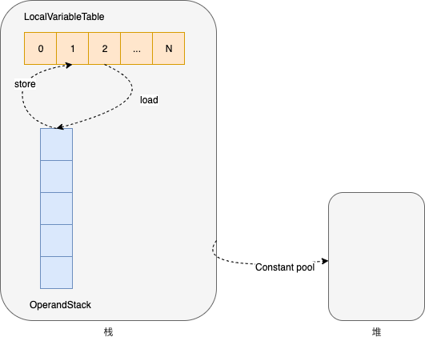

# 概述

Java bytecode由<font color=red>单字节指令</font>组成，理论上最多支持256个操作码（opcode）。实际Java只使用了200左右的操作码。还有一些操作码则保留给调试操作。

- 栈操作指令，包括与局部变量交互的指令
- 程序流程控制指令
- 对象操作指令，包括方法调用指令
- 算术运算及类型转换指令


# 字节码运行时结构

JVM是一台基于**栈**的计算机器。每个线程都有一个独属于自己的线程栈，用于存储栈帧。每一次方法调用，JVM都会自动创建一个栈帧。栈帧由操作数栈，本地变量表以及一个Class引用、返回值组成。Class引用指向当前方法在运行时常量池中对应的Class。

所有指令的起点都是操作数栈，在其上进行运算，临时结果继续入栈；而最终结果可以保存在本地变量表中，用于其他指令读取。



# 指令

[Java虚拟机指令集](https://docs.oracle.com/javase/specs/jvms/se7/html/jvms-6.html)


# 字节码分析

使用反编译命令 `javap -c -verbose xxx`，其中xxx是xxx.class的文件名


## HelloByteCode

### 源码

```java
public class HelloByteCode {
    public void sayHi() {
        System.out.println("Hello, byte code!");
    }

    public static void main(String[] args) {
        HelloByteCode byteCode = new HelloByteCode();
        byteCode.sayHi();
    }
}
```


### 分析

- 反编译 `javap -c -verbose HelloByteCode `
- Constant pool 常量池定义
- 分析的源头从main开始
- main方法本地变量表0位置是传入的参数，即args；成员方法本地变量表0位置是this对象本身

```java
Classfile /D:/repository/project/xdo/xdo-jdk/xdo-jdk-jvm/target/classes/com/sciatta/xdo/jdk/jvm/bytecode/HelloByteCode.class
  Last modified 2024-2-13; size 735 bytes
  MD5 checksum b39f4b1634825335b3f0262d344da5c1
  Compiled from "HelloByteCode.java"
public class com.sciatta.xdo.jdk.jvm.bytecode.HelloByteCode
  minor version: 0
  major version: 52
  flags: ACC_PUBLIC, ACC_SUPER
Constant pool:
   #1 = Methodref          #8.#24         // java/lang/Object."<init>":()V
   #2 = Fieldref           #25.#26        // java/lang/System.out:Ljava/io/PrintStream;
   #3 = String             #27            // Hello, byte code!
   #4 = Methodref          #28.#29        // java/io/PrintStream.println:(Ljava/lang/String;)V
   #5 = Class              #30            // com/sciatta/xdo/jdk/jvm/bytecode/HelloByteCode
   #6 = Methodref          #5.#24         // com/sciatta/xdo/jdk/jvm/bytecode/HelloByteCode."<init>":()V
   #7 = Methodref          #5.#31         // com/sciatta/xdo/jdk/jvm/bytecode/HelloByteCode.sayHi:()V
   #8 = Class              #32            // java/lang/Object
   #9 = Utf8               <init>
  #10 = Utf8               ()V
  #11 = Utf8               Code
  #12 = Utf8               LineNumberTable
  #13 = Utf8               LocalVariableTable
  #14 = Utf8               this
  #15 = Utf8               Lcom/sciatta/xdo/jdk/jvm/bytecode/HelloByteCode;
  #16 = Utf8               sayHi
  #17 = Utf8               main
  #18 = Utf8               ([Ljava/lang/String;)V
  #19 = Utf8               args
  #20 = Utf8               [Ljava/lang/String;
  #21 = Utf8               byteCode
  #22 = Utf8               SourceFile
  #23 = Utf8               HelloByteCode.java
  #24 = NameAndType        #9:#10         // "<init>":()V
  #25 = Class              #33            // java/lang/System
  #26 = NameAndType        #34:#35        // out:Ljava/io/PrintStream;
  #27 = Utf8               Hello, byte code!
  #28 = Class              #36            // java/io/PrintStream
  #29 = NameAndType        #37:#38        // println:(Ljava/lang/String;)V
  #30 = Utf8               com/sciatta/xdo/jdk/jvm/bytecode/HelloByteCode
  #31 = NameAndType        #16:#10        // sayHi:()V
  #32 = Utf8               java/lang/Object
  #33 = Utf8               java/lang/System
  #34 = Utf8               out
  #35 = Utf8               Ljava/io/PrintStream;
  #36 = Utf8               java/io/PrintStream
  #37 = Utf8               println
  #38 = Utf8               (Ljava/lang/String;)V
{
  public com.sciatta.xdo.jdk.jvm.bytecode.HelloByteCode();
    descriptor: ()V
    flags: ACC_PUBLIC
    Code:
      stack=1, locals=1, args_size=1
         // 从本地变量表中拿出第0个元素，this引用入栈
         // <- this
         0: aload_0
         // this出栈，调用父类的初始化方法
         // <-
         1: invokespecial #1                  // Method java/lang/Object."<init>":()V
         // 调用结束返回，没有返回值；方法结束时，操作数栈必须为空
         4: return
      LineNumberTable:
        line 8: 0
      LocalVariableTable:
        Start  Length  Slot  Name   Signature
            0       5     0  this   Lcom/sciatta/xdo/jdk/jvm/bytecode/HelloByteCode;

  public void sayHi();
    descriptor: ()V
    flags: ACC_PUBLIC
    Code:
      stack=2, locals=1, args_size=1
         // 获取静态变量入栈
         // <- out
         0: getstatic     #2                  // Field java/lang/System.out:Ljava/io/PrintStream;
         // 获取常量池字符串入栈
         // <- out str
         3: ldc           #3                  // String Hello, byte code!
         // out和str出栈，调用out的实例方法
         // <-
         5: invokevirtual #4                  // Method java/io/PrintStream.println:(Ljava/lang/String;)V
         // 调用结束返回
         8: return
      LineNumberTable:
        line 10: 0
        line 11: 8
      LocalVariableTable:
        Start  Length  Slot  Name   Signature
            0       9     0  this   Lcom/sciatta/xdo/jdk/jvm/bytecode/HelloByteCode;

  public static void main(java.lang.String[]);
    descriptor: ([Ljava/lang/String;)V
    flags: ACC_PUBLIC, ACC_STATIC
    Code:
      stack=2, locals=2, args_size=1
      	 // 在堆中为HelloByteCode对象分配内存空间，其引用入栈
         // <- ref
         0: new           #5                  // class com/sciatta/xdo/jdk/jvm/bytecode/HelloByteCode
         // 复制栈顶元素
         // <- ref ref
         3: dup
         // 栈顶ref出栈，调用HelloByteCode的初始化方法，即构造函数
         // <- ref
         4: invokespecial #6                  // Method "<init>":()V
         // ref 引用出栈，保存HelloByteCode引用到本地变量表中第1个元素
         // <-
         7: astore_1
         // 加载本地变量表的第1个元素，即HelloByteCode引用
         // <- ref
         8: aload_1
         // ref出栈，调用ref的实例方法sayHi
         // <-
         9: invokevirtual #7                  // Method sayHi:()V
         // 调用结束返回
        12: return
      LineNumberTable:
        line 14: 0
        line 15: 8
        line 16: 12
      LocalVariableTable:
        Start  Length  Slot  Name   Signature
            0      13     0  args   [Ljava/lang/String;
            8       5     1 byteCode   Lcom/sciatta/xdo/jdk/jvm/bytecode/HelloByteCode;
}
```

