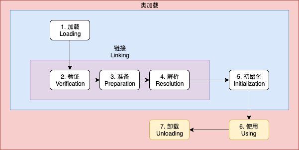
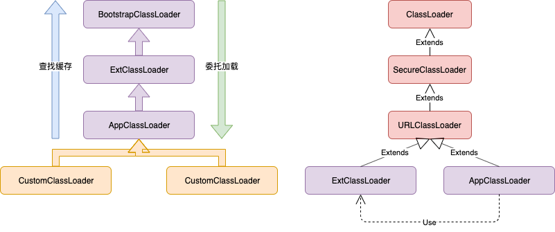
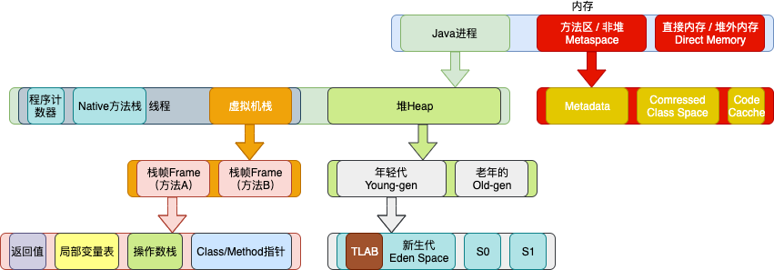
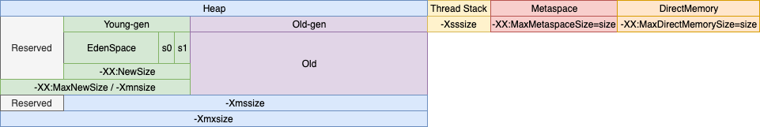
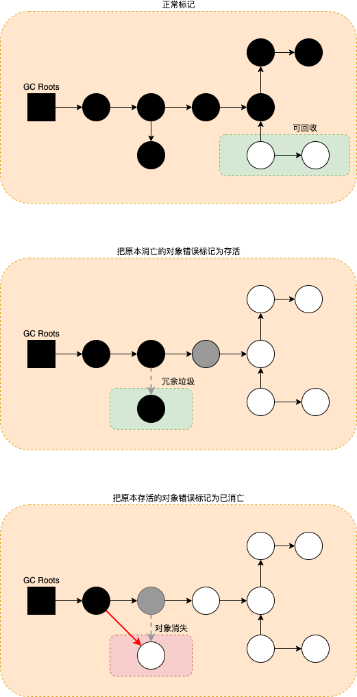

# 概述

Java是一种面向对象、静态类型、编译执行，有 VM/GC 和运行时、跨平台的高级语言。


# 类加载器

## 类的生命周期



1. 加载

   加载过程完成以下三件事：

   - 通过类的完全限定名称获取定义该类的二进制字节流
   - 将该字节流表示的静态存储结构转换为方法区的运行时存储结构
   - 在内存中生成一个代表该类的 Class 对象，作为方法区中该类各种数据的访问入口

   其中二进制字节流可以从以下方式中获取：

   - 从 ZIP 包读取，成为 JAR、EAR、WAR 格式的基础。
   - 从网络中获取，最典型的应用是 Applet。
   - 运行时计算生成，例如动态代理技术，在 java.lang.reflect.Proxy 使用 ProxyGenerator.generateProxyClass 的代理类的二进制字节流。
   - 由其他文件生成，例如由 JSP 文件生成对应的 Class 类。

2. 验证：验证格式、依赖

3. 准备：静态字段分配内存，初始化零值

4. 解析：符号引用解析为直接引用，也就是得到类或者字段、方法在内存中的指针或者偏移量

   - **解析过程在某些情况下可以在初始化阶段之后再开始，这是为了支持 Java 的动态绑定**

5. 初始化：类的初始化，静态变量、静态代码块

   - 初始化阶段是执行初始化方法 `<clinit> ()` 方法的过程
   - `<clinit> ()` 是由编译器自动收集类中所有类变量的赋值动作和静态语句块中的语句合并产生的，编译器收集的顺序由语句在源文件中出现的顺序决定。特别注意的是，静态语句块只能访问到定义在它之前的类变量，定义在它之后的类变量只能赋值，不能访问
   - 接口中不可以使用静态语句块，但仍然有类变量初始化的赋值操作，因此接口与类一样都会生成  `<clinit> ()` 方法。但接口与类不同的是，执行接口的 `<clinit> ()` 方法不需要先执行父接口的 `<clinit> ()` 方法。只有当父接口中定义的变量使用时，父接口才会初始化。另外，接口的实现类在初始化时也一样不会执行接口的 `<clinit> ()` 方法
   - 虚拟机会保证一个类的 `<clinit> ()` 方法在多线程环境下被正确的**加锁和同步**，如果多个线程同时初始化一个类，只会有一个线程执行这个类的 `<clinit> ()` 方法，其它线程都会阻塞等待，直到活动线程执行 `<clinit> ()` 方法完毕。如果在一个类的  `<clinit> ()` 方法中有耗时的操作，就可能造成多个线程阻塞，在实际过程中此种阻塞很隐蔽。

6. 使用

7. 卸载

   卸载类即该类的Class对象被GC，卸载类需要满足3个要求:

   1. 该类的所有的实例对象都已被GC，也就是说堆不存在该类的实例对象。
   2. 该类没有在其他任何地方被引用。
   3. 该类的类加载器的实例已被GC。

   所以，在JVM生命周期类，由jvm自带的类加载器加载的类是不会被卸载的。但是由我们自定义的类加载器加载的类是可能被卸载的。


## 类的加载时机

### 在首次主动使用时初始化

1. 当虚拟机启动时，初始化用户指定的主类，就是启动执行main方法所在的类
2. 当遇到用以新建目标类实例的new指令时，初始化new指令的目标类，就是new一个类的时候要初始化；
3. 当遇到调用静态方法的指令时，初始化该静态方法所在的类；
4. 当遇到访问静态字段的指令时，初始化该静态字段所在的类；
5. 子类的初始化会触发父类的初始化；
6. 如果一个接口定义了default方法，那么直接实现或者间接实现该接口的类的初始化，会触发该接口的初始化；
7. 使用反射API对某个类进行反射调用时，初始化这个类，反射调用要么是已经有实例了，要么是静态方法，都需要初始化；
8. 当初次调用MethodHandle实例时，初始化该MethodHandle指向的方法所在的类。


### 不会初始化（可能会加载）

1. 通过子类引用父类的静态字段，只会触发父类的初始化，而不会触发子类的初始化；
2. 通过数组定义来引用类，不会触发此类的初始化。该过程会对数组类进行初始化，数组类是一个由虚拟机自动生成的、直接继承自 Object 的子类，其中包含了数组的属性和方法；
3. 常量在编译期间会存入调用类的常量池中，本质上没有直接引用定义常量的类，不会触发定义常量所在的类；
4. 通过类名获取Class对象，不会触发类的初始化，Hello.class不会让Hello类初始化；
5. 通过Class.forName加载指定类时，如果指定参数initialize为false时，也不会触发类初始化，其实这个参数是告诉虚拟机，是否对类进行初始化。Class.forName("jvm.Hello")默认会加载Hello类；
6. 通过ClassLoader默认的loadClass方法，也不会触发初始化动作。（加载，但不初始化）。


## 三类类加载器

### 类加载器分类

- BootstrapClassLoader 启动类加载器，其是JVM核心的一部分，由native code实现，没有java引用。当某一个ClassLoader的parent为null时，其parent就是BootstrapClassLoader；加载目录 `$JAVA_HOME/jre/lib` 和 `$JAVA_HOME/jre/classes` ，可以通过 `-Xbootclasspath` 指定路径
- ExtClassLoader 扩展类加载器，加载目录 `$JAVA_HOME/jre/lib/ext` 
  - 添加引用类放到JDK的lib/ext下
  - 或 `-Djava.ext.dirs` 指定路径
- AppClassLoader 应用类加载器，加载目录默认是 `.` 当前目录
  - class文件放到当前路径下
  - 或 `-classpath` 或 `-cp` 指定路径




`sun.misc.Launcher` JVM的入口类，构造函数负责初始化类加载器的层次结构

1. 加载ExtClassLoader，其继承URLClassLoader，但注意ExtClassLoader的parent ClassLoader是null
2. 加载AppClassLoader，其继承URLClassLoader，AppClassLoader的parent ClassLoader是ExtClassLoader；设置为**当前线程**的上下文类加载器


### 双亲委托模型

1. 当加载一个class时，首先从指定ClassLoader中查找，如AppClassLoader的缓存中查找，**若找到则直接返回**；否则，向上查找父ClassLoader，如ExtClassLoader和BootstrapClassLoader的缓存
2. 若缓存中没有找到，则自上至下委托给父ClassLoader加载class
3. 所有class延迟加载

双亲委派模型保证了Java程序的稳定运行，可以避免类的**重复加载**（JVM 区分不同类的方式不仅仅根据类名，相同的类文件被不同的类加载器加载产生的是两个不同的类），也保证了 Java 的核心 API **不被篡改**。如果没有使用双亲委派模型，而是每个类加载器加载自己的话就会出现一些问题，比如我们编写一个称为 java.lang.Object 类的话，那么程序运行的时候，系统就会出现多个不同的 Object 类。


### 添加引用类的方式

1. 放到 JDK 的 lib/ext 下，或 -Djava.ext.dirs
2. java -cp / classpath，或 class 文件放到当前路径
3. 自定义ClassLoader加载
4. 拿到当前执行类的ClassLoader，反射调用 addUrl 方法添加 Jar 或路径（JDK9无效）


## 对象的创建和定位

### 对象创建

分配方式有 “指针碰撞” 和 “空闲列表”两种，选择哪种分配方式由 Java 堆是否规整决定，而 Java 堆是否规整又由所采用的垃圾收集器是否带有压缩整理功能决定。

1. 发现new运算符，查找运行时常量池的符号引用进行校验，判断是否已加载，若没有，则类加载器加载Class
2. 为对象分配内存空间
   - 空间分配
     - 指针碰撞（标记复制或标记整理算法）
       - 适用于连续内存空间
       - 用过的内存放到一边，没有用过的内存放到另一边，中间有一个分界指针；分配内存时，移动分界指针向没有用过的内存一边移动
     - 空闲列表（标记清除算法，有碎片）
       - 适用于不连续内存空间
       - jvm维护了一个空闲列表，表示哪些内存空间可用，在分配的时候，找一块大小足够的空间分配，然后更新空闲列表空间分配
   - 线程安全
     - CAS+失败重试
     - TLAB：为每一个线程预先在eden区分配一块内存空间TLAB，当不够用的时候再使用CAS分配内存
3. 内存空间初始化零值
4. 设置对象头
5. 执行init方法


### 对象是否一定分配在堆上

不一定，jvm通过<font color=red>逃逸分析</font>，逃不出方法的对象会在**栈**上分配。即新的对象引用使用范围不会在多个方法/多个线程中使用。

- 栈上分配，降低GC运行频率
- 同步消除
- 标量替换，把对象分解为若干基本类型，并且不再分配在堆上，而是分配在栈上，减少内存使用（无对象头）


### 对象布局

在 Hotspot 虚拟机中，对象在内存中的布局可以分为 3 块区域：**对象头**、**实例数据**和**对齐填充**。

- Hotspot 虚拟机的对象头包括两部分信息**，**第一部分用于存储对象自身的运行时数据（哈希码、GC 分代年龄、锁状态标志等等），另一部分是类型指针，即对象指向它的类元数据的指针，虚拟机通过这个指针来确定这个对象是那个类的实例。
- 实例数据部分是对象真正存储的有效信息，也是在程序中所定义的各种类型的字段内容。
- 对齐填充部分不是必然存在的，也没有什么特别的含义，仅仅起占位作用。 因为 Hotspot 虚拟机的自动内存管理系统要求对象起始地址必须是 8 字节的整数倍，换句话说就是对象的大小必须是 8 字节的整数倍。当没有对齐时，就需要通过对齐填充来补全。


### 对象访问定位

- 句柄

  - 原理

    虚拟机栈的对象引用指向堆中的句柄池中的句柄，句柄包括对象（堆）和类型（方法区）的指针

  - 优点

    句柄地址稳定，当对象移动后，只需要修改句柄数据，虚拟机栈的对象引用不需要修改

  - 缺点

    两跳寻址

- 直接指针（HotSpot）

  - 原理

    虚拟机栈的对象引用指向堆中的对象，堆中的对象（对象头）包括类型的指针

  - 优点

    一跳寻址，速度快

  - 缺点

    当对象移动后，虚拟机栈的对象引用也需要维护


# 内存模型

## 内存结构

- 每个线程都只能访问自己的线程栈
- 每个线程不能访问（看不见）其他线程的局部变量
- <font color=red>所有**原生类型**（指基本类型：byte、short、int、long、float、double、char 和 boolean）的局部变量都存储在线程栈中</font>，因此对其他线程是不可见的
- 线程可以将一个原生变量值的副本传给另一个线程，但不能共享原生局部变量本身
- <font color=red>堆内存中包含java代码中创建的所有对象，不管是哪个线程创建的。其中也包括包装类型（如 Byte、Integer、Long等）</font>
- 不管是创建一个对象并将其赋值给局部变量（栈中局部变量槽位保存的是对象的引用地址），还是赋值给另一个对象的成员变量，创建的对象都会保存到堆内存中
- <font color=red>对象的成员变量与对象本身一起存储在堆上，不管成员变量的类型是原始数值，还是对象引用</font>
- <font color=red>类的静态变量和类定义一样都保存在堆中</font>

总结

- 方法中使用的原生数据类型和对象引用地址在栈上储存；对象、对象成员、类定义、静态变量在堆上
- 堆内存又称“共享堆”，堆中的所有对象，可以被线程访问，只要拿到对象的引用地址
- 如果一个线程可以访问某个对象时，也就可以访问该对象的成员变量
- 如果两个线程同时调用某个对象的同一方法，它们都可以访问到这个对象的成员变量，但每个线程的局部变量副本是独立的（各有各的局部变量表）


## 内存整体结构




- 程序计数器 Program Counter Register

  - 线程独有
  - 记录字节码运行位置
    - 实现逻辑跳转、循环、异常
    - 线程恢复时原来程序执行的位置

- 虚拟机栈

  - 线程独有
  - 调用Java方法，都会创建栈帧，包括本地变量表、操作数栈、动态链表和返回值
  - 在 JDK 1.4 中默认为 256K，而在 JDK 1.5+ 默认为 1M

- 本地方法栈 Native Method Stack

  - 线程独有
  - 调用Native方法

- 堆

  - 线程共享
  - TLAB（Thread Local Allocation Buffer）为各个线程预先分配一块内存，可在其上创建对象，减少多线程创建对象时的同步锁定或CAS，提高性能
  - <font color=red>字符串常量池</font>，jdk6在永久代，jdk7移入堆中
    - 字符串常量池里的内容是在类加载完成，经过验证，**准备阶段之后在堆中生成字符串对象实例，然后将该字符串对象实例的引用值存到string pool中**。在HotSpot VM里实现的string pool功能的是一个StringTable类，它是一个哈希表，里面存的是驻留字符串（也就是我们常说的用双引号括起来的）的引用（而不是驻留字符串实例本身），也就是说在堆中的某些字符串实例被这个StringTable引用之后就等同被赋予了“驻留字符串”的身份。这个StringTable在每个HotSpot VM的实例只有一份，被所有的类共享。
    - 可以通过 `xxx.intern()` 方法将字符串置入字符串常量池，返回值在常量池中，原字符串xxx仍是堆中的对象
      - 双引号括起来的字符串置入字符串常量池
      - new字符串实例不会置入字符串常量池
      - 运算符+两边是字符串常量，结果仍是字符串常量；如果一个是new字符串实例，则结果不是字符串常量

- 方法区（非堆）

  - 线程共享

  - 方法区保存类型信息、常量、静态变量、即时编译代码缓存，其中常量包括**字符串常量池**，**class文件常量池**和**运行时常量池**；

    - 即时编译代码。java编译为class，jvm逐条解析class指令执行；当某一语句执行次数（循环）超过一个阈值后，会生成**机器码**，下一次再执行时，执行的是机器码，提高运行效率

  - 在HotSpot VM中，方法区实现
    - jdk1.6的方法区实现是永久代
    - jdk1.7的方法区实现是永久代+堆，将字符串常量池和静态变量迁移到堆中
    - jdk1.8的方法区实现是MetaSpace+堆，用MetaSpace代替永久代，其是一块**本地内存**，不受jdk本身内存限制
      - 当类加载到内存中后，JVM会将<font color=red>class文件常量池</font>中的内容存放到<font color=red>运行时常量池</font>中，由此可知，运行时常量池也是每个类都有一个。class文件常量池中存的是字面量和符号引用，也就是说他们存的并不是对象的实例，而是对象的符号引用值。而经过解析（resolve）之后，也就是把符号引用替换为直接引用，**解析的过程会去查询字符串常量池**StringTable，以保证运行时常量池所引用的字符串与**字符串常量池**中所引用的是一致的。
        - 字面量包括：基本数据类型的值、文本字符串、声明<font color=red>final</font>的常量值
        - 符号引用包括：类完全限定名、字段名称和描述符、方法名称和描述符
      - <font color=red>MetaSpace存放的是Class的元数据信息，而Class对象和实例对象存放在堆上</font>
        - 64位，Class指针压缩：32位指针+base偏移量，最大寻址空间4G（2^32）
        - 64位，对象指针压缩（要求堆内存小于32G）：通过左移3位编码（对象大小必须是8的整数倍），最大寻址空间4G*8=32G

- 直接内存（堆外内存） Direct Memory

  - 本地内存


# JVM启动参数

[Java8启动参数](https://docs.oracle.com/javase/8/docs/technotes/tools/unix/java.html)


## 重要参数

- 堆内存
  - `-Xms` 初始堆内存
  - `-Xmx` 最大堆内存（建议 Xms 和 Xmx 配置相同，**防止性能抖动**）
  - `-XX:NewSize` 新生代初始内存大小
  - `-XX:MaxNewSize` 新生代最大内存大小
  - `-Xmn` 新生代内存大小（NewSize 和 MaxNewSize 大小相同）
  - `-XX:NewRatio` 新生代和老年代内存占比，默认是2，即 新生代:老年代=1:2
  - `-XX:SurvivorRatio` Survivor区和Eden区内存占比，默认是8，即 Survivor:Eden=1:8
  - `-XX:PermSize` 永久代初始内存大小（**1.7**）
  - `-XX:MaxPermSize` 永久代最大内存大小（**1.7**）
  - `-XX:MetaspaceSize` 元空间初始内存大小（**1.8**）
  - `-XX:MaxMetaspaceSize` 元空间最大内存大小（**1.8**）
  - `-Xss` **每个**线程栈大小
  - `-XX:ThreadStackSize` 单个线程栈大小

- GC相关
  - `-XX:+UseSerialGC` 年轻代使用串行GC
  - `-XX:+UseParNewGC` 年轻代使用并行GC，配置CMS使用
  - `-XX:+UseParallelGC` 年轻代使用并行GC
  - `-XX:+UseParallelOldGC` 老年代使用并行GC
  - `-XX:ParallelGCThreads` 并行GC的线程数
  - `-XX:+UseConcMarkSweepGC ` 老年代使用并发 CMS GC
  - `-XX:+UseG1GC ` 使用G1GC
  - `-XX:MaxGCPauseMillis` 预期G1每次执行GC操作的暂停时间
  - `-XX:PretenureSizeThreshold` 控制晋级老年代大对象大小
  - `-XX:TargetSurvivorRatio` 年轻代向老年代晋升的动态年龄计算
  - `-XX:MaxTenuringThreshold` 年轻代向老年代晋升的年龄阈值
  - `-Xloggc:gc.serial.log` GC日志路径
  - `-XX:+PrintGCDetails` 每次GC打印日志
  - `-XX:+PrintGCDateStamps` 每次GC打印日志增加时间戳
  - `-XX:+HeapDumpOnOutOfMemoryError` 当发生OOM时dump堆到一个文件
  - `-XX:HeapDumpPath=./GCLogAnalysis_dump.hprof` 指定dump路径
  - `-XX:+UseCompressedClassPointers`  压缩类型指针
  - `-XX:+UseCompressedOops` 压缩对象引用指针

- jvm参数
  - `-XX:+PrintFlagsInitial` jvm默认参数
  - `-XX:+PrintFlagsFinal` jvm最终参数
  - `-XX:+PrintCommandLineFlags` 命令行jvm参数


## 内存参数关系




# GC原理

## GC回收原理

### 对象是否可用

- 分析方法

  - 引用计数

    无法解决循环引用的问题


  - 可达性分析

    判断对象是否可达。通过一系列“GC Roots”对象作为起点进行搜索，如果“GC Roots”和一个对象没有可达路径，则该对象是不可达的。<font color=red>注意此阶段暂停的时间，与堆内存的大小，对象的总数没有直接关系，而是由存活对象的数量决定。所以增加堆内存的大小并不会直接影响标记阶段占用的时间</font>。

    以下对象被认为是“GC Roots”对象：（简单说就是方法区的常量和静态变量，以及栈中局部变量表中引用的对象）

    1. 虚拟机栈(栈帧中的本地变量表)中引用的对象
    2. 本地方法栈(Native 方法)中引用的对象
    3. 方法区中类静态属性引用的对象
    4. 方法区中常量引用的对象
    5. 被同步锁持有的对象
    6. 已启动的且未终止的Java线程

    GC Roots 并不包括堆中对象所引用的对象，这样就不会有循环引用的问题。


- 记忆集（Remembered Set）

  当存在老年代对象对年轻代对象的引用关系时，这个时候要进行 Young GC，要确定 年轻代对象 是否被堆外引用，就需要遍历 Old Gen，这样的代价太大。

  所以 JVM 在进行对象引用的时候，会有个 **记忆集（Remembered Set）** 记录从 Old Gen 到 Young Gen 的引用关系，并把记忆集里的 Old Gen 作为 GC Root 来构建引用图。这样在进行 Young GC 时就不需要遍历 Old Gen。

  但是使用记忆集也会有缺点：如果只存在老年代对象对年轻代对象的引用关系，其实是可以进行回收，但是由于记忆集的存在，不会将年轻代对象回收。这里其实有一点 **空间换时间** 的意思。不过无论如何，它依然确保了垃圾回收所遵循的原则：**垃圾回收确保回收的对象必然是不可达对象，但是不确保所有的不可达对象都会被回收**。


### 对象是否可回收

判断一个对象的死亡至少需要两次标记

1. 如果对象进行可达性分析之后没发现与GC Roots相连的引用链，那它将会第一次标记并且进行一次筛选。判断的条件是决定这个对象是否有必要执行finalize()方法。如果对象有必要执行finalize()方法（有且未被调用），则被放入F-Queue队列中。
2. GC对F-Queue队列中的对象进行二次标记。如果对象在finalize()方法中重新与引用链上的任何一个对象建立了关联，那么二次标记时则会将它移出“即将回收”集合。如果此时对象还没成功逃脱，那么只能被回收了。
3. 虚拟机会以较低的优先级执行这些 finalize()方法，但不会确保所有的 finalize() 方法都会执行结束。如果 finalize() 方法出现耗时操作，虚拟机就直接停止指向该方法，将对象清除。
4. 任何一个对象的 finalize() 方法只会被系统自动调用一次，如果对象面临下一次回收，它的 finalize() 方法不会被再次执行，想继续在 finalize() 中自救就失效了。


### 垃圾回收算法

- Mark-Sweep（标记清除）

  算法：遍历所有的 GC Roots，然后将所有 GC Roots 可达的对象标记为存活的对象。清除的过程将遍历堆中所有的对象，将没有标记的对象全部清除掉。与此同时，清除那些被标记过的对象的标记，以便下次的垃圾回收。

  优缺点：实现简单，容易产生碎片。

- Mark-Copy（标记复制）

  算法：将可用内存划分为大小相等的两块，每次只使用其中的一块。当进行垃圾回收时，把其中存活的对象全部复制到另一块中，然后把已使用的空间一次清除。（遍历“GC Roots”的过程就可以向另一块复制）

  优缺点：不容易产生碎片；当有大量存活对象时，复制效率低；只可使用一半内存，空间利用率低。

- Mark-Compact（标记整理）

  算法：先标记存活对象，然后把存活对象向一边移动，然后清理边界以外的内存（先遍历“GC Roots”标记存活对象，然后再向一边移动；遍历的过程不可移动，否则可能会替换未遍历的对象）。

  优缺点：不容易产生碎片；内存利用率高；存活对象少且较分散时，移动次数多，效率低

- **分代收集算法**

  分代假设

  1. 大部分新生对象很快无用，朝生夕灭
  2. 存活较长时间的对象，可能存活更长时间
  3. 跨代引用对于同代引用仅占极少数

  算法

  1. 由于新生代每次垃圾回收都要回收大部分对象（朝生夕灭），因此采用Mark-Copy算法。新生代分成一块较大的Eden空间和两块较小的Survivor空间。每次只使用Eden和其中一块Survivor空间。当垃圾回收时，把存活对象放到未使用的Survivor空间，清空Eden和之前使用过的Survivor空间。
  2. 由于老年代每次只回收少量对象（存活更长时间），因此采用Mark-Compact算法。


### 垃圾回收过程

**Minor GC / Young GC**

**新生代GC**

1. 新创建对象被分配到Eden，两个Survivor是空的
2. 当Eden空间第一次被**填满**了，触发Minor GC；将Eden标记存活的对象复制到S0，对象的age+1，然后清空Eden
3. 接着下一次Eden空间被填满了，触发Minor GC；此时是将Eden标记存活的对象复制到S1，对象的age+1；同时，S0存活的对象也会复制到S1，对象的age+1。最后将Eden和S0全部清空。注意，此时S1中包括S0和Eden的存活对象，他们的age是不相同的
4. Minor GC不断重复，S0和S1的角色也会随之切换
5. 在一次Minor GC后，当对象的age（基本是Survivor区的对象）达到某一个阈值，则此对象会从年轻代晋升到老年代，同时对象的age+1。之后，会有源源不断的对象晋升到老年代，晋升年龄如下
   - **parallel GC 默认15**
   - **CMS GC 默认6**


**新生代晋升老年代**

- 大对象直接晋升到老年代，避免复制成本。-XX:PretenureSizeThreshold大于此值的对象直接在老年代分配，避免在 Eden 和 Survivor 之间的大量内存复制
- 新生代存活的对象年龄达到阈值-XX:MaxTenuringThreshold后，晋升老年代
- <font color=red>**动态年龄计算**</font>Hotspot 遍历所有标记对象，按照年龄从小到大对其所占用的大小进行累积，当累积的某个年龄大小超过了 survivor 区容量的一半时（-XX:TargetSurvivorRatio参数控制，默认50），取这个年龄和 MaxTenuringThreshold 中更小的一个值，作为新的晋升年龄阈值


**Major GC / Old GC**

老年代GC

CMS有单独收集老年代的行为


**Mixed GC**

混合GC

收集新生代和部分老年代，G1GC


**Full GC**

整堆GC，收集整个堆和方法区

1. 如果创建一个（大）对象，Eden区放不下这个对象，会直接保存在老年代，如果老年代空间也不足，就会触发Full GC
2. 如果有永久代空间的话，系统当中需要加载的类，调用的方法很多，同时永久代当中没有足够的空间，就触发一次Full GC
3. <font color=red>**空间分配担保**</font>，在**发生Minor GC之前**虚拟机会先检查老年代**最大可用的连续空间**是否大于新生代所有对象总空间。如果这个条件成立，那么Minor GC可以确保是安全的。如果不成立，则虚拟机会查看HandlerPromotionFailure设置（**jdk 6 update 24 之后不判断此参数**）是否允许担保失败。如果允许，那么会继续检查老年代最大可用的连续空间是否大于历次晋升到老年代对象的平均大小。如果大于，将尝试着进行一次Monitor GC，尽管这次GC是有风险的。如果小于，或者HandlerPromotionFailure设置不允许冒险，那这时改为进行一次Full GC（包括young gc）
4. CMS GC 时出现 `promotion failed` 和 `concurrent mode failure`
   - promotion failed，就是空间分配担保失败
   - concurrent mode failure 是在执行 CMS GC 的过程中同时有对象要放入老年代，而此时老年代空间不足造成的
5. 显式调用System.gc。但不会马上触发Full GC


## Hotspot算法实现

### 根节点枚举

- 遍历方法区和栈区查找（保守式 GC）
- **通过 OopMap 数据结构来记录 GC Roots 的位置（准确式 GC）**

保守式 GC 的成本太高。准确式 GC 的优点就是能够让虚拟机快速定位到 GC Roots。对应 OopMap（用于确认栈上的数据的类型是否是指针引用） 的位置即可作为一个安全点（Safe Point）。在执行 GC 操作时，所有的工作线程必须停顿，这就是所谓的”Stop-The-World”。安全点意味着在这个点时，所有工作线程的状态是确定的，JVM 就可以安全地执行 GC 。


### 安全点

HotSpot也的确没有为每条指令都生成OopMap，前面已经提到，只是在“特定的位置”记录了这些信息，这些位置被称为安全点（Safepoint）。有了安全点的设定，也就决定了用户程序执行时并非在代码指令流的任意位置都能够停顿下来开始垃圾收集，而是强制要求必须执行到达安全点后才能够暂停。因此，**安全点的选定既不能太少以至于让收集器等待时间过长，也不能太过频繁以至于过分增大运行时的内存负荷**。安全点位置的选取基本上是以“是否具有让程序长时间执行的特征”为标准进行选定的，因为每条指令执行的时间都非常短暂，程序不太可能因为指令流长度太长这样的原因而长时间执行，**“长时间执行”的最明显特征就是指令序列的复用，例如方法调用、循环跳转、异常跳转等都属于指令序列复用**（<font color=red>注意是复用指令</font>），所以只有具有这些功能的指令才会产生安全点。 

选择这些作为安全点主要的目的就是避免程序长时间无法进入 Safe Point。如 JVM 在做 GC 之前要等所有的应用线程进入安全点，如果有一个线程一直没有进入安全点，就会导致 GC 时 JVM 停顿时间延长。如超大的循环导致执行 GC 等待时间过长。

如何在垃圾收集发生时让所有线程（这里其实不包括执行JNI调用的线程）都跑到最近的安全点，然后停顿下来。这里有两种方案可供选择

- 抢先式中断（Preemptive Suspension）

  抢先式中断不需要线程的执行代码主动去配合，在垃圾收集发生时，系统首先把所有用户线程全部中断，如果发现有用户线程中断的地方不在安全点上，就恢复这条线程执行，让它一会再重新中断，直到跑到安全点上。现在几乎没有虚拟机实现采用抢先式中断来暂停线程响应GC事件。

- **主动式中断（Voluntary Suspension）**

  而主动式中断的思想是当垃圾收集需要中断线程的时候，不直接对线程操作，仅仅简单地设置一个标志位，各个线程执行过程时会不停地主动去轮询这个标志，一旦发现中断标志为真时就自己在最近的安全点上主动中断挂起。轮询标志的地方和安全点是重合的，另外还要加上所有创建对象和其他需要在Java堆上分配内存的地方，这是为了检查是否即将要发生垃圾收集，避免没有足够内存分配新对象。


### 安全区域

Safe Point 是对**正在执行**的线程设定的。如果一个线程处于 **Sleep 或中断**状态，它就不能响应 JVM 的中断请求，再运行到 Safe Point 上。因此 JVM 引入了 Safe Region。Safe Region 是指在一段代码片段中，引用关系不会发生变化。在这个区域内的任意地方开始 GC 都是安全的。线程在进入 Safe Region 的时候先标记自己已进入了 Safe Region，等到被唤醒时准备离开 Safe Region 时，先检查检查虚拟机是否已经完成了根节点枚举，如果完成了，那线程就当作没事发生过，继续执行；否则它就必须一直等待，直到收到可以离开安全区域的信号为止。


### 写屏障

写屏障可以看作在虚拟机层面对“引用类型字段赋值”这个动作的AOP切面，在引用对象赋值时会产生一个环形（Around）通知，供程序执行额外的动作，也就是说赋值的前后都在写屏障的覆盖范畴内。在赋值前的部分的写屏障叫作写前屏障（Pre-Write Barrier），在赋值后的则叫作写后屏障（Post-Write Barrier）。HotSpot虚拟机的许多收集器中都有使用到写屏障，但**直至G1收集器出现之前，其他收集器都只用到了写后屏障**。


### 三色标记

- 白色：表示对象尚未被垃圾收集器访问过。显然在可达性分析刚刚开始的阶段，所有的对象都是白色的，若在分析结束的阶段，仍然是白色的对象，即代表不可达。 

- 黑色：表示对象已经被垃圾收集器访问过，且这个对象的所有引用都已经扫描过。黑色的对象代表已经扫描过，它是安全存活的，如果有其他对象引用指向了黑色对象，无须重新扫描一遍。黑色对象不可能直接（不经过灰色对象）指向某个白色对象。 

- 灰色：表示对象已经被垃圾收集器访问过，但这个对象上至少存在一个引用还没有被扫描过。

如果GC和用户线程并发执行，收集器在对象图上标记颜色，同时用户线程在修改引用关系——即修改对象图的结构，这样可能出现两种问题



- 把原本消亡的对象错误标记为存活（可容忍）

- 把原本存活的对象错误标记为已消亡（致命）

  <font color=red>需要以下两个条件同时满足</font>，即若破坏其中一个条件，就可以解决对象丢失的问题

  - 赋值器插入了一条或多条从黑色对象到白色对象的新引用 

    <font color=red>增量更新</font>：当黑色对象插入新的指向白色对象的引用关系时，就将这个新插入的引用记录下来，等并发扫描结束之后，**再将这些记录过的引用关系中的黑色对象为根，重新扫描一次。这可以简化理解为，黑色对象一旦新插入了指向白色对象的引用之后，它就变回灰色对象了**。

    优点：不会产生浮动垃圾

    缺点：性能低

  - 赋值器删除了全部从灰色对象到该白色对象的直接或间接引用

    <font color=red>原始快照</font>：当灰色对象要删除指向白色对象的引用关系时，**就将这个要删除白色对象记录下来，重新标记时，以白色对象变为灰色为起始点扫描整个链，此白色对象本次GC是不会被清理**。 

    优点：性能高

    缺点：会产生浮动垃圾；白色节点变为灰色，后续**可能**变为黑色，因此本次GC不会被清理；**以浮动垃圾（占内存空间）换让我们用户线程能够暂停的时间更加短。**

  以上无论是对引用关系记录的插入还是删除，虚拟机的记录操作都是通过写屏障实现的。在HotSpot虚拟机中，增量更新和原始快照这两种解决方案都有实际应用，譬如，CMS是基于增量更新来做并发标记的，G1、Shenandoah则是用原始快照来实现。 


## 常用GC

### GC分类

#### 串行GC（Serial GC）/ ParNewGC

**`-XX:+UseSerialGC`**

Serial + Serial Old

串行GC对年轻代使用Mark-Copy算法，对老年代使用Mark-Compact算法。两者都是**单线程（STW+单线程）**的垃圾收集器，不能进行并行处理，所以都会触发STW（全线暂停），停止所有应用线程。因此这种GC算法无法利用多核CPU，不管多少CPU内核，JVM GC时，只能使用单个核心。

CPU利用率高，暂停时间长。适用于几百MB堆内存的JVM，而且是单核CPU比较有用。

**`-XX:+UseParNewGC`**

ParNew + Serial Old

改进版本的**多线程**Serial GC，可以配合CMS使用。当使用 `-XX:+UseConcMarkSweepGC` 时，该选项自动可用。它是 Server 场景下默认的新生代收集器，除了性能原因外，主要是因为除了 Serial 收集器，只有它能与 CMS 收集器配合使用。


#### 并行GC（Parallel GC）

<font color=red>可控吞吐量，吞吐量优先</font>

**`-XX:+UseParallelGC`**（<font color=red>JDK8默认；注意如果是单核线程会退化为Mark Sweep Compact GC</font>）

**`-XX:+UseParallelOldGC`** 

**`-XX:+UseParallelGC -XX:+UseParallelOldGC`** 

以上等价

Parallel Scavenge + Parallel Old

年轻代和老年代的垃圾回收都会触发STW事件。年轻代使用Mark-Copy算法；老年代使用Mark-Sweep-Compact算法。`-XX:ParallelGCThreads=threads` 来指定GC线程数，<font color=red>默认值是CPU核数（因为是STW，GC多线程处理）</font>。

并行垃圾收集器使用于多核服务器，主要目标是增加吞吐量（应用程序线程用时占程序总用时的比例）。因为对系统资源的有效使用，能达到更高的吞吐量。

- GC期间，所有CPU**并行（STW+多线程）**清理，总暂停时间更短
- 在两次GC周期的间隔期，**没有GC线程运行**，不会消耗任何系统资源


#### 并发CMS GC

<font color=red>响应时间优先，但不可控，可能会退化为Serial Old</font>

Mostly Concurrency Mark and Sweep Garbage Collector

**`-XX:+UseConcMarkSweepGC`**

**`-XX:+UseParNewGC -XX:+UseConcMarkSweepGC`**

以上等价

ParNew + CMS / Serial Old（**备用，在并发收集发生 Concurrent Mode Failure 时使用**）

对年轻代采用并行STW方式的Mark-Copy算法；对老年代使用**并发（NO ALL STW+多线程）**的Mark-Sweep算法。**设计目标是避免老年代垃圾收集时出现长时间卡顿**：

1. 不对老年代进行整理，而是使用空闲列表来管理内存空间的回收
2. 在Mark-Sweep阶段的大部分工作和应用线程一起并发执行

<font color=red>默认情况下CMS使用的并发线程数等于CPU核心数的1/4（因为是NO ALL STW，GC和应用多线程同时处理，需要注意因为是并发，所以GC线程会和应用线程争抢CPU时间）</font>。如果服务器是多核CPU，并且主要调优的目标是降低GC停顿导致的系统延迟，则使用CMS是明智选择。CMS也有一些缺点，其中最大的问题是老年代碎片问题，在某些情况下GC会造成不可预测的暂停时间，特别是堆内存较大的情况下。

整个过程分为4个阶段：

- 初始标记：Stop The World，仅使用一条初始标记线程对所有与 GC Roots 直接关联的对象进行标记。
- 并发标记：使用**多条**标记线程，与用户线程并发执行。此过程进行可达性分析，标记出所有废弃对象。速度很慢。
- 重新标记：Stop The World，使用多条标记线程并行执行，将刚才并发标记过程中**新出现的废弃对象标记出来**。已经标记的废弃对象已经没有任何引用存在，所以不会再次成为被引用对象。
- 并发清除：只使用一条 GC 线程，与用户线程并发执行，清除刚才标记的对象。这个过程非常耗时。

缺点：

- 吞吐量低：低停顿时间是以牺牲吞吐量为代价的，导致 CPU 利用率不够高
- <font color=red>无法处理浮动垃圾，可能出现 Concurrent Mode Failure。浮动垃圾是指并发清除阶段由于用户线程继续运行而产生的垃圾，这部分垃圾只能到下一次 GC 时才能进行回收。由于浮动垃圾的存在，因此需要预留出一部分内存，意味着 CMS 收集不能像其它收集器那样等待老年代快满的时候再回收。如果预留的内存不够存放浮动垃圾，就会出现 Concurrent Mode Failure，这时虚拟机将临时启用 Serial Old 来替代 CMS</font>
- 标记 - 清除算法导致的空间碎片，往往出现老年代空间剩余，但无法找到足够大连续空间来分配当前对象，不得不提前触发一次 Full GC。对于产生碎片空间的问题，可以通过开启 -XX:+UseCMSCompactAtFullCollection，在每次 Full GC 完成后都会进行一次内存压缩整理，将零散在各处的对象整理到一块。设置参数 -XX:CMSFullGCsBeforeCompaction 告诉 CMS，经过了 N 次 Full GC 之后再进行一次内存整理


#### G1 GC

Garbage First <font color=red>延迟可控，可预测停顿时间</font>

**-XX:+UseG1GC**（<font color=red>JDK9默认</font>） 

-XX:G1NewSizePercent 初始年轻代占整个Heap的大小，默认5%

-XX:G1MaxNewSizePercent  最大年轻代占整个Heap的大小，默认60%

**-XX:G1HeapRegionSize** 按照平均堆的大小 `(MinHeapSize+MaxHeapSize)/2` 划分为2048个目标区块，取同最小RegionSize比较的最大值，但必须满足有效范围1MB~32MB，即不能小于1MB

**-XX:MaxGCPauseMillis=50**	预期G1每次执行GC操作的暂停时间，单位是毫秒，默认200毫秒。<font color=red>如果没有达到这个目标，G1 会通过各种方式来补救：调整年轻代和老年代的比例，调整堆大小，调整晋升的年龄阈值，调整混合垃圾回收周期中处理的老年代的区块数量等等。</font>

**-XX:+InitiatingHeapOccupancyPercent=45**（IHOP）	G1内部并行回收循环启动的阈值，默认为java heap的45%

-XX:G1HeapWastePercent	G1停止回收的最小内存大小。默认是堆大小的5%

**-XX:G1ReservePercent**	G1为了保留一些空间用于年代之间的提升。默认是堆大小的10%。用于降低晋升失败的风险。

-XX:+GCTimeRation	计算花在java应用线程上和花在gc线程上的时间比例，默认是9，同新生代内存的分配比例一致。这个参数的主要目的是使得用户可以控制花在应用上的时间。公式 `100/1+GCTimeRation` ，如果值是9，则10%的时间会花在GC工作上。Parallel的默认值是99，表示1%的时间用在GC上，因为Parallel GC贯穿整个GC，而G1根据region划分，不需要对全局性扫描整个内存堆

**-XX:ParallelGCThreads=n** 并行收集时候的垃圾收集线程数

- 如果逻辑处理器小于等于8，则默认值n等于逻辑处理器的数量
- 如果逻辑处理器大于8，则默认值n等于处理器数量的 `5/8+3`。在大多数情况下都是比较合理的值。
- 如果是高配置的SPARC系统，则默认值n大约等于逻辑处理器的 `5/16`

**-XX:ConcGCThreads=n** 并发标记阶段的垃圾收集线程数。增加这个值可以让并发标记更快完成，如果没有指定这个值，JVM 会通过以下公式计算得到 `ConcGCThreads=(ParallelGCThreads + 2) / 4^3` （默认是 `ParallelGCThreads` 的1/4）

G1（Garbage-First），它是一款面向服务端应用的垃圾收集器，在**多 CPU 和大内存**的场景下有很好的性能。HotSpot 开发团队赋予它的使命是未来可以替换掉 CMS 收集器。

堆被分为新生代和老年代，其它收集器进行收集的范围都是整个新生代或者老年代，而 G1 可以直接对新生代和老年代一起回收。G1 把堆划分成多个大小相等的独立区域（Region），**新生代和老年代不再物理隔离**。通过引入 Region 的概念，从而将原来的一整块内存空间划分成多个的小空间，使得每个小空间可以单独进行垃圾回收。这种划分方法带来了很大的灵活性，使得可预测的停顿时间模型成为可能。通过记录每个 Region 垃圾回收时间以及回收所获得的空间（这两个值是通过过去回收的经验获得），并维护一个优先列表，每次根据允许的收集时间，优先回收价值最大的 Region。**每个 Region 都有一个 Remembered Set，用来记录该 Region 对象的引用对象所在的 Region。通过使用 Remembered Set，在做可达性分析的时候就可以避免全堆扫描**。


**垃圾收集过程**

- 年轻代收集：并行收集，STW，年轻代会动态调整

- 老年代收集（**并发标记周期**）：并发收集（包含年轻代收集）

  - 初始标记：STW，伴随着一次普通的 Young GC 发生，然后对 Survivor 区（root region）进行标记，因为该区可能存在对老年代的引用
  - 扫描根引用区：因为先进行了一次 YGC，所以当前年轻代只有 Survivor 区有存活对象，它被称为根引用区。扫描 Survivor 到老年代的引用，该阶段必须在下一次 Young GC 发生前结束。
  - 并发标记：并发执行，中间可以发生多次 Young GC。寻找整个堆的存活对象，该阶段可以被 Young GC 中断
  - 重新标记：STW，为了修正在并发标记期间因用户程序继续运作而导致标记产生变动的那一部分标记记录，虚拟机将这段时间对象变化记录在线程的 Remembered Set Logs 里面，重新标记阶段需要把 Remembered Set Logs 的数据合并到 Remembered Set 中。这阶段需要停顿线程，但是可并行执行。
  - 清理：清理阶段真正回收的内存很少

- 混合式垃圾收集：并发周期结束后是混合垃圾回收周期，不仅进行年轻代垃圾收集，而且回收之前标记出来的老年代的垃圾最多的部分区块。混合垃圾回收周期会持续进行，直到几乎所有的被标记出来的分区（垃圾占比大的分区）都得到回收，然后恢复到常规的年轻代垃圾收集，最终再次启动并发周期。

- Full GC：STW，单线程

  - concurrent mode failure：并发模式失败，CMS 收集器也有同样的概念。G1 并发标记期间，如果在标记结束前，老年代被填满，G1 会放弃标记。

    - 堆需要增加

    - 增加并发标记的线程数量，让并发标记尽快结束
    - 更早地进行并发周期，默认是整堆内存的 45% 被占用就开始进行并发周期。

  - 疏散失败：年轻代垃圾收集的时候，如果 Survivor 和 Old 区没有足够的空间容纳所有的存活对象。这种情况肯定是非常致命的，因为基本上已经没有多少空间可以用了，这个时候会触发 Full GC 也是很合理的。

    - 堆需要增加

  - 大对象分配失败，我们应该尽可能地不创建大对象，尤其是大于一个区块大小的那种对象


具备如下特点：

- 空间整合：整体来看是基于“标记 - 整理”算法实现的收集器，从局部（两个 Region 之间）上来看是基于“复制”算法实现的，这意味着运行期间不会产生内存空间碎片。
- 可预测的停顿：能让使用者明确指定在一个长度为 M 毫秒的时间片段内，消耗在 GC 上的时间不得超过 N 毫秒。


#### ZGC / Shenandoad GC

-XX:+UnlockExperimentalVMOptions **-XX:+UseZGC** -Xmx16g

通过着色指针和读屏障，实现几乎全部的并发执行，几毫秒级别的延迟，线性可扩展。

- GC最大停顿时间不超过10ms

- 堆内存支持范围广，几百Mb，大至4TB的从超大堆内存（JDK13升至16TB）

- 与G1相比，应用吞吐量下降不超过15%
- 当前只支持Linux x64平台，JDK15后支持MacOs和Windows系统


-XX:+UnlockExperimentalVMOptions **-XX:+UseShenandoahGC** -Xmx16g

G1的改进版本，跟ZGC类似。

设计为GC线程与应用线程并发执行，通过实现垃圾回收过程的并发处理，改善停顿时间，使得GC执行线程能够在业务处理线程运行过程中进行堆压缩、标记和整理，从而消除绝大部分的暂停时间。


### GC适用场景

- 串行GC `UseSerialGC`
  - 对单核、小内存（100M）、停顿无要求的客户端应用适用
- 并行GC `UseParallelGC`
  - 对多核、内存较大（4G）、吞吐量优先、停顿不敏感的后台批处理服务适用
- 并发GC `UseConcMarkSweepGC`
  - 对多核、内存较大（4G）、响应时间优先的高频交易系统适用
  - 但由于CMS不压缩整理，导致内存不连续，在内存较大情况下会导致GC停顿时间较长，延迟不可控
  - 并发模式失败、晋升失败、分配巨型对象失败等情况，会触发Full GC，此时会退化使用Serial收集器单线程来完成垃圾的清理工作，此过程非常耗时应尽量避免
- 改进版并发GC `G1GC`
  - 对多核、内存很大（8G）、响应时间优先且可控的高频交易系统适用


### 常用GC组合

- Serial + Serial Old 实现单线程低延迟垃圾回收机制
- ParNew + CMS 实现多线程低延迟垃圾回收机制
- Parallel Scavenge + Parallel Old 多线程高吞吐量垃圾回收机制（CPU资源都用来最大程度处理业务）
- G1 GC 堆内存较大，整体平均GC时间可控


### GC参数占比

| 参数             | 并行GC占比          | G1GC                                                         |
| ---------------- | ------------------- | ------------------------------------------------------------ |
| MinHeapSize      | 物理内存1/64        | 物理内存1/64                                                 |
| MaxHeapSize      | 物理内存1/4         | 物理内存1/4                                                  |
| NewSize          | MinHeapSize/3       | MinHeapSize*5%                                               |
| MaxNewSize       | MaxHeapSize/3       | MaxHeapSize*60%                                              |
| OldSize          | NewSize*2           |                                                              |
| NewRatio=2       | new:old=1:2         |                                                              |
| SurvivorRatio=8  | survivor:eden=1:1:8 |                                                              |
| G1HeapRegionSize |                     | max((MinHeapSize+MaxHeapSize)/2/2048, 1)<br />注：2048是目标region数量，1是最小RegionSize |


## 内存分配与回收实战

### 对象优先分配到Eden区

```java
// -XX:+UseSerialGC -Xms20m -Xmx20m -Xmn10m -XX:+PrintGCDetails -XX:SurvivorRatio=8
public class MinorGC {
    public static final int _1M = 1024 * 1024;    // 1MB
    public static void main(String[] args) {
        byte[] a1, a2, a3, a4;  // 字节数组->大对象
        a1 = new byte[2 * _1M];
        a2 = new byte[2 * _1M];
        a3 = new byte[2 * _1M];
        a4 = new byte[4 * _1M]; // young gc
    }
}
```

- 新生代10M，老年代10M，eden8M，so和s1各1M
- a1，a2，a3，共6M，优先分配到Eden区
  - 当存入a4时，Eden区放不下，在minor GC前，先确认old区的最大可用连续空间是否大于年轻代对象总大小之和，这里大于（10M > 6M），所以可以安全的触发minor GC
  - 触发minor GC，标记后发现a1，a2，a3仍在使用，进行动态年龄计算，从小到大累加确认是否超过s区的50%，发现第一个a1就放不进去，所以需要将a1，a2，a3提前晋升到老年代
  - 最后a4分配到Eden区


### 大对象直接进入老年代

```java
// -XX:+UseSerialGC -Xms20m -Xmx20m -Xmn10m -XX:+PrintGCDetails -XX:SurvivorRatio=8 -XX:PretenureSizeThreshold=3145728
public class BigObjectToOld {
    public static void main(String[] args) {
        byte[] a1 = new byte[MinorGC._1M * 4];  // -XX:PretenureSizeThreshold=3145728 大于此值，直接晋升老年代   
    }
}
```

- java -XX:+PrintFlagsInitial -version 默认参数
- java -XX:+PrintFlagsFinal -version 最终参数
- 当PretenureSizeThreshold设置为3145728时，申请对象大于此值。在Eden区分配内存前，发现大于PretenureSizeThreshold，避免Eden和S之间低效复制，直接晋升老年代 


### 长期存活对象进入老年代

```java
// -XX:+UseSerialGC -Xms20m -Xmx20m -Xmn10m -XX:+PrintGCDetails -XX:SurvivorRatio=8 -XX:MaxTenuringThreshold=1 -XX:+PrintTenuringDistribution
public class ToOld {    
    public static void main(String[] args) {
        byte[] a1, a2, a3;
        a1 = new byte[MinorGC._1M / 8];
        a2 = new byte[4 * MinorGC._1M];
        a2 = null;
        a3 = new byte[4 * MinorGC._1M]; // 第一次gc                
        a3 = null;
        a3 = new byte[4 * MinorGC._1M]; // 第二次gc  
    }
}
```

- Eden 8m
- 第一次young gc，a1的年龄为1进入s0；a2清除，a3进入Eden区
- 第二次young gc，a1的年龄为2，超过了MaxTenuringThreshold阈值，晋升到老年代


