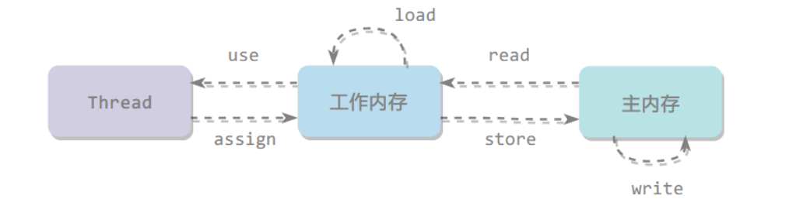

# 多线程基础

## 线程创建过程


## 线程状态


**线程状态**

- `Thread.sleep` <font color=red>当前线程调用此方法，释放CPU，不释放对象锁。作用：给其他线程执行机会的最佳方式。</font>
- `Thread.yield` 当前线程调用此方法，释放CPU，不释放对象锁。作用：让相同优先级的线程轮流执行，但并不保证一定会轮流执行。实际中无法一定保证yield达到让步目的，因为让步的线程还有可能被线程调度程序再次选中。yield不会导致阻塞。该方法与sleep类似，只是不能由用户指定暂停多长时间。
- `Thread#join` 当前线程里调用其它线程 t 的 join 方法，当前线程进入WAITING/TIMED_WAITING 状态，**当前线程不会释放已经持有的非t对象锁，但可以释放持有的t对象锁**，相当于 `t.wait()`。线程 t 执行完毕或者 millis 时间到，当前线程进入就绪状态。
- `Object#wait` <font color=red>当前线程调用对象的wait方法，当前线程释放对象锁，进入等待队列。</font>依靠 notify/notifyAll 唤醒或者 wait(long timeout) 到timeout时间自动唤醒。
  - 阻塞和等待的区别在于，阻塞是被动的，它是在等待获取 monitor lock。而等待是主动的，通过调用 Object.wait() 等方法进入。
- `Object#notify` **唤醒在此对象监视器上等待的单个线程**，选择是任意性的。notifyAll 唤醒在此对象监视器上等待的所有线程。


## 线程中断

- 线程的 interrupt() 方法
  - 通过调用一个 **线程的 interrupt()** 来中断该线程（同时设置中断标志），如果该线程处于阻塞、限期等待或者无限期等待状态（Object.wait，Thread.join 和 Thread.sleep），那么就会抛出InterruptedException，从而提前结束该线程。<font color=red>但是不能中断 I/O 阻塞和 synchronized 锁阻塞</font>。
    - 捕获InterruptedException异常，会清除当前线程的中断标志
  - 如果线程没有被阻塞，这时调用 interrupt() 将不起作用，只是设置中断标志，直到执行到 wait()，sleep() 或 join() 阻塞方法时，才会抛出InterruptedException。
- 线程的 interrupted() **静态**方法（在Runnable内部调用，当然也可以在Thread内部调用）
  - 如果一个线程的 run() 方法执行一个无限循环，并且没有执行 sleep() 等会抛出 InterruptedException 的操作，那么调用线程的 interrupt() 方法就无法使线程提前结束。但是调用 interrupt() 方法会设置线程的中断标记，此时调用 interrupted() 方法会返回 true。因此可以在循环体中使用 interrupted() 方法来判断线程是否处于中断状态，从而提前结束线程。
    - interrupted() 方法属于静态方法，会调用当前线程的 isInterrupted(boolean ClearInterrupted) **本地方法**，参数为true，**会清空**当前线程的中断标志
- 线程的 isInterrupted() 方法（在Thread内部调用）
  - 测试当前线程是否被中断
    - 会调用会调用当前线程的 isInterrupted(boolean ClearInterrupted) **本地方法**，参数为false，**不会清空**当前线程的中断标志


## 线程安全

线程安全有以下几种实现方式

### 不可变

不可变（Immutable）的对象一定是线程安全的，不需要再采取任何的线程安全保障措施。只要一个不可变的对象被正确地构建出来，永远也不会看到它在多个线程之中处于不一致的状态。多线程环境下，应当尽量使对象成为不可变，来满足线程安全。

不可变的类型：

- final 关键字修饰的基本数据类型
- String
- 枚举类型
- Number 部分子类，如 Long 和 Double 等数值包装类型，BigInteger 和 BigDecimal 等大数据类型。但同为 Number 的原子类 AtomicInteger 和 AtomicLong 则是可变的。
- 对于集合类型，可以使用 Collections.unmodifiableXXX() 方法来获取一个不可变的集合


### 互斥同步

synchronized 和 ReentrantLock。

互斥同步最主要的问题就是线程阻塞和唤醒所带来的性能问题，因此这种同步也称为阻塞同步。

互斥同步属于一种悲观的并发策略，总是认为只要不去做正确的同步措施，那就肯定会出现问题。无论共享数据是否真的会出现竞争，它都要进行加锁（这里讨论的是概念模型，实际上虚拟机会优化掉很大一部分不必要的加锁）、用户态核心态转换、维护锁计数器和检查是否有被阻塞的线程需要唤醒等操作。


### 非阻塞同步

随着硬件指令集的发展，我们可以使用基于冲突检测的乐观并发策略：先进行操作，如果没有其它线程争用共享数据，那操作就成功了，否则采取补偿措施（不断地重试，直到成功为止）。这种乐观的并发策略的许多实现都不需要将线程阻塞，因此这种同步操作称为非阻塞同步。

- CAS
- AtomicInteger
- AtomicStampedReference


### 无同步方案

要保证线程安全，并不是一定就要进行同步。如果一个方法本来就不涉及共享数据，那它自然就无须任何同步措施去保证正确性。

- 栈封闭

  多个线程访问同一个方法的局部变量时，不会出现线程安全问题，因为局部变量存储在虚拟机栈中，属于线程私有的。

- 线程本地存储（Thread Local Storage）

  可以使用 java.lang.ThreadLocal 类来实现线程本地存储功能。

- 可重入代码（Reentrant Code）

  这种代码也叫做纯代码（Pure Code），可以在代码执行的任何时刻中断它，转而去执行另外一段代码（包括递归调用它本身），而在控制权返回后，原来的程序不会出现任何错误。可重入代码有一些共同的特征，例如不依赖存储在堆上的数据和公用的系统资源、用到的状态量都由参数中传入、不调用非可重入的方法等。


## 并发性质

### 原子性

原子操作，对基本数据类型的变量的读取和赋值操作（单个操作）是原子性操作，即这些操作是不可被中断的，要么执行，要么不执行。<font color=red>但注意对一个基本数据类型的多个原子操作不具有原子性</font>。

<font color=red>Java中的原子操作包括</font>

- 除long和double之外的基本类型的**赋值**操作
- 所有引用reference的**赋值**操作
- java.util.concurrent.atomic.* 包中所有类的一切操作




Java 内存模型定义了 8 个操作来完成主内存和工作内存的交互操作

- read：把一个变量的值从主内存传输到工作内存中
- load：在 read 之后执行，把 read 得到的值放入工作内存的变量副本中
- use：把工作内存中一个变量的值传递给执行引擎
- assign：把一个从执行引擎接收到的值赋给工作内存的变量
- store：把工作内存的一个变量的值传送到主内存中
- write：在 store 之后执行，把 store 得到的值放入主内存的变量中
- lock：作用于主内存的变量
- unlock


### 可见性

对于可见性，Java 提供了 volatile 关键字来保证可见性。当一个共享变量被 volatile 修饰时，它会保证修改的值会立即被更新到主存，当有其他线程需要读取时，它会去内存中读取新值（**注意JVM的副本机制**）。另外，通过 synchronized 和 Lock 也能够保证可见性，synchronized 和 Lock 能保证同一时刻只有一个线程获取锁然后执行同步代码，并且在释放锁之前会将对变量的修改刷新到主存当中。

**volatile**

<font color=red>volatile 并不能保证原子性。</font>

- 读取：每次读取都强制从主内存刷数据

- 使用场景：单个线程写；多个线程读（未写之前，读取的是旧值；写之后，可以保证马上读取到新值）；如果是多个写线程，volatile不能保证原子性，需要通过**CAS**实现

- 原则：能不用就不用，不确定的时候也不用

- 替代方案：Atomic原子操作类（无锁），**乐观锁的实现：volatile+CAS**

- 内存屏障

  ```java
  // 1和2不会重排到3后面
  // 4和5不会重排到3前面
  // 同时可以保证1和2的结果对3、4和5可见
  x=2; // 1
  y=0; // 2
  flag=true;	// 3 flag是volatile
  x=4; // 4
  y=-1 // 5
  ```

  

**synchronized**

对一个变量执行 unlock 操作之前，必须把变量值同步回主内存。同步块比同步方法更高效，尽量缩小同步范围，提高并发度。同步块中用于控制同步的对象，尽量用小对象，不使用this。


**final**

被 final 关键字修饰的字段在构造器中一旦初始化完成，并且没有发生 this 逃逸（其它线程通过 this 引用访问到初始化了一半的对象），那么其它线程就能看见 final 字段的值。


### 有序性

Java允许编译器和处理器对指令进行重排序，但是重排序过程不会影响到单线程程序的执行，却会影响到多线程并发执行的正确性。可以通过volatile关键字来保证一定的”有序性“（也可通过synchronized 和 Lock保证）。

happens-before原则（先行发生原则）：

1. 程序次序规则：一个线程内，按代码先后顺序
2. 锁定规则：一个unLock操作先行发生于后面对同一个锁的lock操作
3. Volatile变量规则：对同一个变量的写操作先行发生于后面对这个变量的读操作
4. 传递规则：如果操作A先行发生于操作B，而操作B又先行发生于操作C，则可以得出A先于C
5. 线程启动规则：Thread对象的start()方法先行于此线程的每一个动作
6. 线程中断规则：对线程interrupt()方法的调用先行发生于被中断线程的代码检测到中断事件的发生
7. 线程终结规则：线程中所有的操作都先行发生于线程的终止检测，通过Thread.join()方法（结束阻塞）、Thread.isAlive()的返回值检测到线程已经终止执行
8. 对象终结规则：一个对象的初始化完成先行发生于他的finalize()方法的开始


## synchronized

### 对象头

64位HotSpot，对象头占12字节，对象必须以8字节倍数占用内存空间，因此需要4字节补齐

- 对象头12字节，包括：锁信息、分代年龄、GC信息

  - **8字节** MarkWord

    - 含义

      - 0x1234

        - CPU小端模式    34 12	字节从后向前使用（PC）

        - CPU大端模式    12 34

          | 锁状态/gc | Mark Word（64bits）           | -           | -        | -     | 是否偏向锁    | 锁标志位 |
          | --------- | ----------------------------- | ----------- | -------- | ----- | ------------- | -------- |
          | 无锁      | unused 25                     | hashcode 31 | unused 1 | age 4 | biased_lock 1 | lock 2   |
          | 偏向锁    | thread 54                     | epoch 2     | unused 1 | age 4 | biased_lock 1 | lock 2   |
          | 轻量级锁  | ptr_to_lock_record 62         | -           | -        | -     | -             | lock 2   |
          | 重量级锁  | ptr_to_heavyweight_monitor 62 | -           | -        | -     | -             | lock 2   |
          | gc标志    | -                             | -           | -        | -     | -             | lock 2   |

    - 锁晋升

      - 对象创建初始为无锁
      - 当有一个线程访问时，markword设置线程id，状态为偏向锁；如果仍是同一个线程访问锁，则仍可以获得锁（可重入）
      - 当有第二个线程征用锁时，撤销偏向锁
        - 多个线程把**锁对象**的Markword拷贝到自己栈中的LockRecord
        - 然后将LockRecord指针通过CAS更新到锁对象，写入成功的获得锁；写入不成功的判断是否已获得锁，如果是更新重入标志，否则自旋CAS（轻微死循环，防止线程挂起导致上下文切换，性能损失）
  
      - 当竞争激励，自旋（10次或jvm自适应）锁撤销，向OS申请mutex重量级锁，申请成功的获得锁；不成功的线程进入阻塞队列，释放CPU资源
  
      | 锁状态   | 锁标志 |
      | -------- | ------ |
      | 无锁     | 001    |
      | 偏向锁   | 101    |
      | 轻量级锁 | 00     |
      | 重量级锁 | 10     |
  
    - 偏向锁延迟参数

      - `UseBiasedLocking = true` 开启偏向锁
      - `BiasedLockingStartupDelay = 4000` jvm启动后偏向锁延迟4s
  
      ```shell
      # jvm默认参数
      java -XX:+PrintFlagsInitial -version
      
      # jvm最终参数，可以通过命令行参数覆盖
      java -XX:+PrintFlagsFinal
      ```
  
    - 锁降级：不支持，当不使用时，GC就会回收
  
      - 注意场景的使用，如果某一时间段超高并发，导致锁升级；之后不会降级，一直都是重量级锁，性能会下降
  
    - 锁消除：StringBuffer是线程安全的，如append方法被synchronized修饰；当在一个方法，StringBuffer作为**局部变量**多次调用append时，编译器优化将锁消除
  
      ```java
      public static String concatString(String s1, String s2, String s3) {
          return s1 + s2 + s3;
      }
      
      // String 是一个不可变的类，编译器会对 String 的拼接自动优化。在 JDK 1.5 之前，会转化为 StringBuffer 对象的连续 append() 操作
      
      public static String concatString(String s1, String s2, String s3) {
          StringBuffer sb = new StringBuffer();
          sb.append(s1);
          sb.append(s2);
          sb.append(s3);
          return sb.toString();
      }
      ```
  
      
  
    - 锁粗化：方法内多次调用synchronized方法，会粗化为一个synchronized
  
  - ClassPointer
  
    - **4字节** 默认开启类型指针压缩 `-XX:+UseCompressedClassPointers`
  
      ```shell
      java -XX:+PrintCommandLineFlags -version
      
      # -XX:+UseCompressedClassPointers  压缩类型指针
      # -XX:+UseCompressedOops 压缩对象引用指针
      -XX:InitialHeapSize=268435456 -XX:MaxHeapSize=4294967296 -XX:+PrintCommandLineFlags -XX:+UseCompressedClassPointers -XX:+UseCompressedOops -XX:+UseParallelGC
      ```
  
    - 8字节 不压缩


### 实现

- java 代码
  - synchronized修饰
- 字节码
  - 修饰在代码块上
    - monitorenter
    - monitorexit
  - 修饰在方法上
    - ACC_SYNCHRONIZED
- 执行过程
  - 锁升级（jdk1.6）
- 机器码
  - lock+comxchg


## volatile

### 可见性

共享变量对于多线程的可见性由缓存一致性保证，即happens-before。但无法保证原子性。

- **存储器分级**，包括l0寄存器；l1、l2高速缓存各核独有；l3高速缓存多核共享；l4主存；l5磁盘；l6远程文件存储。访问速度寄存器>l1>l2>l3>主存>磁盘>远程文件存储

- **超线程**，一个core包括一个ALU（Arithmetic&logical Unit）和多个PC、registers，这样一个core就可以处理多个线程。如：4C8T

- **缓存一致性协议**（Intel MESI）

  缓存一致性协议给缓存行（cache line 通常为64字节）定义了4个状态：独占（exclusive）、共享（share）、修改（modified）、失效（invalid），用来描述该缓存行是否被多处理器共享、是否修改。所以缓存一致性协议也称MESI协议。

  - 独占（exclusive）：仅当前处理器拥有该缓存行，并且没有修改过，是最新的值。
  - 共享（share）：有多个处理器拥有该缓存行，每个处理器都没有修改过缓存，是最新的值。
  - 修改（modified）：仅当前处理器拥有该缓存行，并且缓存行被修改过了，**一定时间内会写回主存，回写成功状态会变为S**。
  - 失效（invalid）：缓存行被其他处理器修改过，该值不是最新的值，需要读取主存上最新的值。

  协议协作如下：

  - 一个处于M状态的缓存行，必须时刻监听所有试图读取该缓存行对应的主存地址的操作，如果监听到，则必须在此操作执行前把其缓存行中的数据写回主存。
  - 一个处于S状态的缓存行，必须时刻监听使该缓存行无效或者独享该缓存行的请求，如果监听到，则必须把其缓存行状态设置为I。
  - 一个处于E状态的缓存行，必须时刻监听其他试图读取该缓存行对应的主存地址的操作，如果监听到，则必须把其缓存行状态设置为S。
  - 当CPU需要读取数据时，如果其缓存行的状态是I的，则需要从内存中读取，并把自己状态变成S，如果不是I，则可以直接读取缓存中的值，但在此之前，必须要等待其他CPU的监听结果，如其他CPU也有该数据的缓存且状态是M，则需要等待其把缓存更新到内存之后，再读取。
  - 当CPU需要写数据时，只有在其缓存行是M或者E的时候才能执行，否则需要发出特殊的RFO指令(Read Or Ownership，这是一种总线事务)，通知其他CPU置缓存无效(I)，这种情况下性能开销是相对较大的。在写入完成后，修改其缓存状态为M。

- **缓存行**（cache line）是缓存的基本单位。在读取指令时，按缓存行读取，即一次读取64字节。如果两个线程同时读写一个缓存行的不同数据，根据MESI协议，会互相通知对方缓冲失效，从主存读取最新修改数据（伪共享）。性能大大降低。

  - 可以通过缓存行对齐解决这一问题，两个线程修改自己独立的缓存行就可以了，不需要缓存同步数据


### 禁止指令重排序

- **指令重排序**也就是 CPU 对程序指令进行执行的时候，会按照自己制定的顺序，并不是完全严格按照程序代码编写的顺序执行。这样做的原因也是出于性能因素考虑，CPU对一些可以执行的指令先执行可以提供总体的运行效率，而不是让CPU把时间都浪费在停滞等待上面。

- **X86平台内存屏障**

  - lfence，是一种Load Barrier 读屏障
  - sfence，是一种Store Barrier 写屏障
  - mfence，是一种全能型的屏障，具备lfence和sfence的能力
  - Lock前缀，Lock不是一种内存屏障，但是它能完成类似内存屏障的功能。Lock会对CPU总线和高速缓存加锁，可以理解为CPU指令级的一种锁。它后面可以跟ADD, ADC, AND, BTC, BTR, BTS, CMPXCHG, CMPXCH8B, DEC, INC, NEG, NOT, OR, SBB, SUB, XOR, XADD, and XCHG等指令。

  内存屏障有两个能力

  - 阻止屏障两边的指令重排序
  - 刷新处理器缓存

  Lock前缀实现了类似的能力，它先对总线和缓存加锁，然后执行后面的指令，最后释放锁后会把高速缓存中的数据刷新回主内存。在Lock锁住总线的时候，其他CPU的读写请求都会被阻塞，直到锁释放。不同硬件实现内存屏障的方式不同，Java内存模型屏蔽了这种底层硬件平台的差异，由JVM来为不同的平台生成相应的机器码。java中的关键字volatile其实是一种lock屏障，lock本身不是内存屏障，但是它能完成类似于内存屏障的功能（**没有使用fence，使用的是lock，为了保证可移植性**）。

  <font color=red>也就是说增加了内存屏障过后，就是在操作变量之前，能够看到在主存中的最新值，操作变量之后，可以刷新cpu的高速缓存。</font>

- **java内存屏障**

  JVM 按前后分别有读、写两种操作以全排列方式一共提供了四种 Barrier，名称就是左右两边操作的名字拼接。比如 `LoadLoad` Barrier 就是放在两次 Load 操作中间的 Barrier，`LoadStore` 就是放在 Load 和 Store 中间的 Barrier。Barrier 类型及其含义如下：
  
  - `LoadLoad`，操作序列 Load1, LoadLoad, Load2，用于保证访问 Load2 的读取操作一定不能重排到 Load1 之前。
  - `StoreStore`，操作序列 Store1, StoreStore, Store2，用于保证 Store1 及其之后写出的数据一定先于 Store2 写出，即别的 CPU 一定先看到 Store1 的数据，再看到 Store2 的数据。
  - `LoadStore`，操作序列 Load1, LoadStore, Store2，用于保证 Store2 及其之后写出的数据被其它 CPU 看到之前，Load1 读取的数据一定先读入缓存。甚至可能 Store2 的操作依赖于 Load1 的当前值。
  - `StoreLoad`，操作序列 Store1, StoreLoad, Load2，用于保证 Store1 写出的数据被其它 CPU 看到后才能读取 Load2 的数据到缓存。如果 Store1 和 Load2 操作的是同一个地址，StoreLoad Barrier 需要保证 Load2 不能读 Store Buffer 内的数据，得是从内存上拉取到的某个别的 CPU 修改过的值。`StoreLoad` 一般会认为是最重的 Barrier 也是能实现其它所有 Barrier 功能的Barrier。
  
  [具体解释](https://github.com/openjdk/jdk/blob/6bab0f539fba8fb441697846347597b4a0ade428/src/jdk.internal.vm.ci/share/classes/jdk.vm.ci.code/src/jdk/vm/ci/code/MemoryBarriers.java)
  
- **volatile内存屏障**

  <font color=red>禁止指令重排不是禁止所有的重排，只是 `volatile` 写入不能向前排（DCL），读取不能向后排（对读取操作判断，必须读取到内存新值，才能后续操作）。</font>

  - 可见性，每次读 `volatile` 变量总能读到它最新值，即最后一个对它的写入操作，不管这个写入是不是当前线程完成的。
  - 禁止指令重排，也即维护 `happens-before` 关系，对 `volatile` 变量的写入不能重排到写入之前的操作之前，从而保证别的线程看到写入值后就能知道写入之前的操作都已经发生过；对 `volatile` 的读取操作一定不能被重排到后续操作之后，比如我需要读 `volatile`后根据读到的值做一些事情，做这些事情如果重排到了读 `volatile` 之前，则相当于没有满足读 `volatile` 需要读到最新值的要求，因为后续这些事情是根据一个旧 `volatile` 值做的。

  假设约定 Normal Load, Normal Store 对应的是对普通引用的修改。好比有 `int a = 1;` 那 `a = 2;` 就是 Normal Store，`int b = a;` 就有一次对 a 的 Normal Load。如果变量带着 `volatile` 修饰，那对应的读取和写入操作就是 Volatile Load 或者 Volatile Store。`volatile` 对代码生成的字节码本身没有影响，即 Java Method 生成的字节码无论里面操作的变量是不是 `volatile` 声明的，生成的字节码都是一样的。`volatile` 在字节码层面影响的是 Class 内 Field 的 `access_flags`(参看 [Java 11 The Java Virtual Machine Specification](https://docs.oracle.com/javase/specs/jls/se11/jls11.pdf) 的 4.5 节)，可以理解为当看到一个成员变量被声明为 `volatile`，Java 编译器就在这个成员变量上打个标记记录它是 `volatile` 的。JVM 在将字节码编译为汇编时，如果碰见比如 `getfield`, `putfield` 这些字节码，并且发现操作的是带着 `volatile` 标记的成员变量，就会在汇编指令中根据 JMM 要求插入对应的 Barrier。

  

  

- **单例模式DCL（double check lock）**，将单例实例修饰为volatile，因为对象的创建过程不是原子的，所以可能会出现指令重排序。导致线程获取到半初始化的单例对象，从而影响业务逻辑

  1. 为对象分配内存空间

  2. 初始化对象

  3. 将对象的内存地址复制给引用（对象引用不再为null）> <font color=red>volatile写</font> （禁止volatile写向前排）

     如果2和3步对调（指令重排），则会获取到还未正常初始化的对象，导致业务处理问题


### 实现

- java 代码
  - volatile修饰
- 字节码
  - flags: ACC_VOLATILE
- jvm规范
  - 内存屏障
- 机器码
  - lock+add


## ThreadLocal

### OOM

ThreadLocal的作用是提供线程内的**局部变量**安全快速访问，这种变量在线程的生命周期内起作用，减少同一个线程内多个函数或者组件之间一些公共变量的传递的复杂度。<font color=red>即提供线程内部的局部变量，在本线程内随时随地可取，隔离其他线程</font>。

- 线程本地变量
- 场景：每个线程一个副本
- <font color=red>不改方法签名静默传参</font>。可以看做是 Context 模式，减少显式传递参数
- **及时进行清理**，防止内存泄漏


若ThreadLocal保存线程和局部变量的映射关系，在写入数据时需要解决多线程冲突问题，加锁或CAS，这样会降低性能。ThreadLocal反其道而行之，ThreadLocal只是作为访问Thread内部局部变量的入口，局部变量和ThreadLocal的映射关系则保存在Thread内部，这样保证ThreadLocal本身是<font color=red>线程安全</font>的。


- Thread内部维护了一个ThreadLocalMap，其key是一个WeakReference对象，引用的实际对象是ThreadLocal，value是实际值的引用

- Entry的key设计为弱引用，是因为Thread本身强引用ThreadLocalMap，而ThreadLocalMap强引用Entry，如果再强引用ThreadLocal的话，若客户端置ThreadLocal为null的话，但ThreadLocal有强引用关系，导致永远都无法GC回收；当设置为弱引用后，ThreadLocal在经历一次GC后，便可回收

- 但Entry的value仍然具有强引用链，并且客户端无法使用ThreadLocalMap清除value，所以在置ThreadLocal为null前，<font color=red>必须显示的调用remove方法</font>，否则value无法被GC回收，导致OOM

- ThreadLocalMap内部维护了一个循环数组，当发生hash冲突时，会检查entry的key是否是null，如果是，会清除挂在下面的本地变量value，可以起到防止一定OOM的情况发生，但无法完全解决
  
  
  
### 探测式清理 expungeStaleEntry()

  发现过时entry（get / set / remove）

  1. 清理当前过时entry
  2. 向后探测，如果遇到过时entry，执行1；否则，hash后发现不是真正位置，则当前位置设置为null，然后从真正位置开始重hash，执行线性探测算法（目的是为了解决清理过程中出现的entry间空洞问题）。
  3. 直到遇到桶中为null的位置结束


### 启发式清理 cleanSomeSlots()

从当前为null的下一个位置开始扫描（set）

1. 如果不是过时entry，则最大只执行log2^N小范围探测
2. 如果是过时entry，执行探测式清理，返回后边第一个为null的位置，然后重新开始启发式清理，重置探测长度增大探测范围，重新从log2^N范围开始探测


### 引用类型

- 强引用

  - 没有引用的对象，GC会回收

- 软引用

  - 资源不够时，GC会回收软引用的对象
  - 常用作缓存，兼顾时间和空间
  - 可以和一个引用队列联合使用，如果软引用指向的对象被垃圾回收，则VM就会把**软引用**加入到与之关联的引用队列中
  
- 弱引用

  - GC看到弱引用对象就会回收
  - 一般用于引用客户端创建的实例，如：ThreadLocal
  - 可以和一个引用队列联合使用，如果弱引用指向的对象被垃圾回收，则VM就会把**弱引用**加入到与之关联的引用队列中
  
- 虚引用

  - GC看到虚引用对象就会回收，永远无法获取到引用的对象，不负责引用对象的生命周期。唯一的作用就是**引用的对象GC回收前，会将虚引用放到队列并通知客户端进行处理**。其他的引用类型是回收之后，将引用放到队列中
  - 必须和引用队列联合使用
  - NIO对直接内存的管理，引用本身在堆中，可以由JVM管理，但其引用的非堆空间，需要收到GC通知后，虚引用绑定的队列取出虚引用实例作特殊回收处理


## 多线程开发良好的实践

- ==给线程起个有意义的名字，这样可以方便找 Bug==。
- 缩小同步范围，从而减少锁争用。例如对于 synchronized，应该尽量使用同步块而不是同步方法。
- 多用同步工具少用 wait() 和 notify()。首先，CountDownLatch, CyclicBarrier, Semaphore 和 Exchanger 这些同步类简化了编码操作，而用 wait() 和 notify() 很难实现复杂控制流；其次，这些同步类是由最好的企业编写和维护，在后续的 JDK 中还会不断优化和完善。
- 使用 BlockingQueue 实现生产者消费者问题。
- 多用并发集合少用同步集合，例如应该使用 ConcurrentHashMap 而不是 Hashtable。
- 使用本地变量和不可变类来保证线程安全。
- 使用线程池而不是直接创建线程，这是因为创建线程代价很高，线程池可以有效地利用有限的线程来启动任务。


# JUC基础

## 锁机制类

### 问题

synchronized 加锁；wait / notify 解锁/加锁

- 同步块无法异步处理锁（即不能立即知道是否可以拿到锁）
- 同步块的阻塞（等待锁阻塞）无法被中断（不能 Interruptibly）
  - 而使用Lock等待锁的线程可中断（放弃等待），可避免死锁
    - 产生死锁的4个必要条件
      - 互斥
      - 请求保持
      - 不剥夺
      - 循环等待
- 同步块的阻塞（等待锁阻塞）无法控制超时（无法自动解锁）
- 同步块无法根据条件灵活的加锁解锁（即只能跟同步块范围一致）


### Lock更自由的锁

1. 使用方式灵活可控

   - 基于条件使用锁

   - 锁有超时时间

   - 可以异步获取锁
2. 性能开销小
3. 锁工具包: java.util.concurrent.locks
4. synchronized由JVM实现，Lock由JDK实现；都是MESA管程模型的实现。


### ReadWriteLock读写锁

ReadWriteLock管理一组锁，分别是一个读锁和一个写锁。<font color=red>写锁（独占锁），在写线程运行的时候，其他的读、写线程阻塞；读锁（共享锁），在没有写锁的时候，多个读线程可以同时持有读锁。通过锁分离，提高并发性</font>。所有读写锁的实现必须确保写操作对读操作的内存影响。每次只能有一个写线程，但是同时可以有多个线程并发地读数据。

<font color=red>ReadWriteLock 适用于读多写少的并发情况</font>。

ReentrantReadWriteLock 分为读锁和写锁两个实例，读锁是共享锁，可被多个线程同时使用，写锁是独占锁。持有写锁的线程可以继续获取读锁，反之不行。


### Condition

通过 Lock.newCondition()创建。可以看做是 Lock 对象上的信号。类似于 wait/notify，相应api为 await/signal。


### LockSupport锁当前线程

LockSupport 类似于 Thread 类的静态方法，专门用于处理本线程。<font color=red>阻塞当前线程，但不释放锁资源</font>。

unpark需要由其他线程调用，并且以被park的线程作为参数。因为一个被park的线程，无法自己唤醒自己，所以需要其他线程来唤醒。

- **park默认情况下是没有许可的，所以直接调用park的话，会阻塞；可以提前调用unpark，归还许可，此时park的话，消费许可，不会阻塞立即返回**
- park阻塞的时候，如果向这个线程发起中断，这个线程被唤醒，但是不会抛出异常


### 锁的区分

- 可重入锁：同一线程可以重复获取同一个锁，**同一个线程可以进入加锁的不同方法**，防止死锁
- 公平锁 / 非公平锁
  - 没有获得锁的线程进入等待队列，等待时间久的线程（先入队列）优先获得锁，称为公平锁。**线程会查看等待队列**。
  - 即使队列中有等待获得锁的线程，新的待获取锁的线程也有机会获得锁，称为非公平锁。**线程不会查看等待队列，直接上去抢占资源，抢不到才会入队**
- 乐观锁 / 悲观锁
  - 先访问资源，若已被修改，则自旋重试。不上锁，称为乐观锁
  - 访问资源之前，先上锁，其他线程无法访问。修改后再释放锁，称为悲观锁
- 互斥锁 / 自旋锁
  - 互斥锁，会导致拿不到锁的线程阻塞，上下文切换；如果锁住的代码执行时间很短，小于上下文切换的时间，就不用互斥锁，而用自旋锁
  - 自旋锁，在用户态完成加锁和解锁。不适用于执行时间长，并发高的情况，会造成CPU负担加重
  
- 读写锁
  - 写锁是排他锁，读锁是共享锁；适用于读多写少的场景
  - 读优先锁和写优先锁
    - 读优先锁，读锁获取后，写锁阻塞，后面的线程仍可以获得读锁；可能会导致写锁被一直阻塞
    - 写优先锁，读锁获取后，写锁阻塞，后面的线程在获得读锁时阻塞排队；读锁释放后，写锁成功获得
    - 公平读写锁，不分优先级，一律排队
  


### 最佳实践

1. 永远只在更新对象的成员变量时加锁
2. 永远只在访问可变的成员变量时加锁
3. 永远不在调用其他对象的方法时加锁


<font color=red>最小使用锁</font>

1. 降低锁范围：锁定代码的范围/作用域
2. 细分锁粒度：将一个大锁，拆分成多个小锁


## 并发原子类

### 问题

sum++多线程安全问题。对于基础数据类型的并发补充实现，线程安全。


### Atomic工具类

1. java.util.concurrent.atomic

2. AtomicInteger

3. 无锁技术的底层实现

   1. volatile 保证读写操作都可见（注意不保证原子）
   2. 使用 CAS 指令，作为乐观锁实现，通过自旋重试保证写入。
      - Unsafe API - Compare-And-Swap
      - CPU 硬件指令支持: CAS 指令
        - LOCK_IF_MP
        - cmpxchg
      - **ABA问题：通过加入version解决**

4. 有锁 or 无锁？

   CAS 本质上没有使用锁。并发压力跟锁性能的关系：

   - 压力非常小，性能本身要求就不高，有锁、无锁差别不明显
   - 压力一般的情况下，无锁更快，大部分都一次写入

   - <font color=red>压力非常大时（执行时间长、并发高），自旋导致重试过多，资源消耗很大。有锁较好。</font>


### LongAdder

1.8新增并发原子类。

- 若没有线程竞争，直接累加到base值中
- 若有线程竞争，在线程所在的cell上CAS累加
  - 如果成功就返回
  - 否则，出现冲突；第一次重哈希，再次尝试；如果还是失败，则cell数组扩容（当长度超过CPU核心数时，不会再扩容，会重哈希）
- 在最后获取求和数值时，需要累加base和cell数组，没有加锁；所以，获得的结果可能不是最新的值。但所有线程运行完成后，会最终一致


## 信号量工具类

### 问题

多个线程间的协作，可以通过 wait/notify、Lock/Condition，但如果需要更为精细化的控制，则实现起来非常复杂还容易出错。

更复杂的应用场景

- 我们需要控制实际并发访问资源的并发数量
- 我们需要多个线程在某个时间同时开始运行
- 我们需要指定数量线程到达某个状态再继续处理


### AQS

AbstractQueuedSynchronizer，即队列同步器。它是构建锁或者其他同步组件的基础（如Semaphore、CountDownLatch、ReentrantLock、ReentrantReadWriteLock），是JUC并发包中的核心基础组件。

- AbstractQueuedSynchronizer：抽象队列式的同步器
- 两种资源共享方式：独占 OR 共享，子类负责实现公平 OR 非公平


### Semaphore信号量

- 准入数量 N（限流）
- N =1 则等价于独占锁

Semaphore的本质是共享锁，限制同时访问锁的数量。


### CountdownLatch

场景：Master 线程等待 Worker 线程把任务执行完

类似于fork/join的多线程处理，master线程阻塞，等待多个slave线程并发执行完成后，再汇总统计结果。


### CyclicBarrier

场景：任务执行到一定阶段，等待其他任务对齐，对齐之后一起向前运行

与CountdownLatch区别

- CountdownLatch递减；CyclicBarrier递增
- CountdownLatch在主线程通过await阻塞，其他线程countDown，类似join；CyclicBarrier不在主线程阻塞，而是在**每个**被调用线程处通过await阻塞，等待所有线程对齐（满足parties），然后所有线程同时退出阻塞状态继续执行
  - CyclicBarrier可以在任务前阻塞，然后满足限制线程数后一起向前执行；也可以在任务结束后，满足限制线程数后一起向前执行
  - CountdownLatch一般用于子线程任务完成后对齐
- 对于从阻塞状态恢复的线程，CountdownLatch不可重复利用，而CyclicBarrier可以reset重复利用（循环屏障）


## 线程池

线程池从功能上看，就是一个<font color=red>任务执行器</font>

### Excutor

执行者，顶层接口


### ExcutorService

接口 API

- shutdown()：停止接收新任务，原来的任务继续执行

- shutdownNow()：停止接收新任务，原来的任务停止执行

- awaitTermination(long timeOut, TimeUnit unit)：当前线程阻塞
- submit：有返回值，用 Future 封装，异常可以被catch
- execute方法：无返回值，无法cache异常


### ThreadFactory

线程工厂


### Excutors

工具类

- newSingleThreadExecutor
  创建一个单线程的线程池。这个线程池只有一个线程在工作，也就是相当于单线程串行执行所有任务。如果这个唯一的线程因为异常结束，那么会有一个新的线程来替代它。此线程池保证所有任务的执行顺序按照任务的提交顺序执行。

  - 队列 LinkedBlockingQueue
  
- newFixedThreadPool
  创建固定大小的线程池。每次提交一个任务就创建一个线程，<font color=red>先保证核心线程数处理任务，多余的任务置入队列，再多余的任务则新增线程处理直到达到最大线程数，再多余的任务可以根据丢弃策略处理。算法同时满足CPU密集和IO密集型任务处理。</font>

  线程池的大小一旦达到最大值就会保持不变，如果某个线程因为执行异常而结束，那么线程池会补充一个新线程。

  - **缺点**
    - 线程池一旦达到最大，就会保持不变，即使在负载下降后，仍会保持大量空闲线程（核心线程数=最大线程数）
    - 核心线程数超过后，会置入 LinkedBlockingQueue 队列，但队列大小几乎无限（Integer.MAX_VALUE），导致任务大量积压，无法及时响应
  - CPU密集
    - 超过核心线程数，任务置入队列，因为是cpu密集型任务，可以保证队列中的任务可以快速处理完成，而不需要额外创建过多的线程数处理任务，过多的线程，反而会消耗系统资源，上下文切换也会给性能带来损耗
    - 最大核心数设置为N或N+1
  - IO密集型
    - 由队列先缓存一部分任务等待IO，若超过队列限制，则增量线程到最大线程数
    - 最大核心数设置为2N或2(N+1)

- newCachedThreadPool
  创建一个可缓存的线程池。如果线程池的大小超过了处理任务所需要的线程，那么就会回收部分空闲（60秒不执行任务）的线程，当任务数增加时，此线程池又可以智能的添加新线程来处理任务。此线程池不会对线程池大小做限制，线程池大小完全依赖于操作系统（或者说JVM）能够创建的最大线程大小。

  - 适用于大量可以快速处理的小任务，提高并发度。
  - **缺点**
    - 核心线程数是0，最大线程数几乎无限（Integer.MAX_VALUE），当有大量任务时，很有可能会超过操作系统的最大线程数OutOfMemoryError：Unable to create new native thread

- newScheduledThreadPool
  创建一个大小无限的线程池。此线程池支持定时以及周期性执行任务的需求。

  - `schedule` 延迟执行一次性任务
  - `scheduleAtFixedRate` 延迟+定时执行任务，period：本次开始时间-上次开始时间，**以开始时间对齐，不考虑任务执行时间**
  - `scheduleWithFixedDelay` 延迟+定时执行任务，period：本次开始时间-上次结束时间，**考虑任务执行的时间，如果任务执行时间长，则下一次的开始时间也会相应推迟，关注两次任务执行的时间间隔**
  - **缺点**
    - 如果是周期性执行任务，队列中的任务不会回收，同时又不停的新产生任务的话，会出现OOM


### ThreadPoolExecutor

具体线程池实现类

```java
public ThreadPoolExecutor(int corePoolSize,
                              int maximumPoolSize,
                              long keepAliveTime,
                              TimeUnit unit,
                              BlockingQueue<Runnable> workQueue,
                              ThreadFactory threadFactory,
                              RejectedExecutionHandler handler)
```

**线程池参数**

- corePoolSize 线程池中线程的数量，即使是空闲状态
- maximumPoolSize 线程池中允许的最大线程数量
- keepAliveTime 当线程池中的线程数量超过了corePoolSize，多余的线程在结束前等待任务的最大时间；超过存活时间，则被回收
- unit keepAliveTime参数的时间单位
- BlockingQueue 缓存队列
  1. ArrayBlockingQueue：规定大小的 BlockingQueue，其构造必须指定大小。其所含的对象是 FIFO 顺序排序的
  2. LinkedBlockingQueue：大小不固定的 BlockingQueue，若其构造时指定大小，生成的 BlockingQueue 有大小限制，不指定大小，其大小由 Integer.MAX_VALUE 来决定。其所含的对象是 FIFO 顺序排序的
  3. PriorityBlockingQueue：类似于 LinkedBlockingQueue，但是其所含对象的排序不是 FIFO，而是依据对象的自然顺序或者构造函数的 Comparator 决定
  4. SynchronizedQueue：特殊的 BlockingQueue，对其的操作必须是放和取交替完成
- ThreadFactory 创建自定义新线程
- RejectedExecutionHandler 拒绝策略
  1. ThreadPoolExecutor.AbortPolicy：丢弃任务并抛出 RejectedExecutionException 异常（**默认**）
  2. ThreadPoolExecutor.DiscardPolicy：丢弃任务，但是不抛出异常
  3. ThreadPoolExecutor.DiscardOldestPolicy：丢弃队列最前面的任务，然后重新提交被拒绝的任务
  4. ThreadPoolExecutor.CallerRunsPolicy：由调用线程（提交任务的线程）即线程池所在线程处理该任务，可以卡住新任务申请

**线程池方法**

- `execute(Runnable command)` 方法逻辑

  - 当前线程数小于corePoolSize时，创建工作线程（延迟创建）并运行
  - 当前线程数大于等于corePoolSize时，保存在阻塞队列中
  - 阻塞队列容量满，则继续创建工作线程，直到maximumPoolSize
  - 当线程数大于等于maximumPoolSize时，多余任务执行拒绝策略处理器

  <font color=red>当大于等于corePoolSize时，任务首先保存在阻塞队列中。适用于CPU密集型任务，因为队列中的任务可以被快速获取和执行不至于大量积压任务，并且创建大量的线程没有用，频繁切换线程上下文会导致性能下降。之后，创建工作线程直到满足maximumPoolSize，适用于IO密集型任务，当线程处理IO时可以释放CPU资源，多余的线程可以充分打满CPU提高利用率。</font>

**源码解析**

- 用一个**4字节**的Integer表示线程池运行状态和容量
  - 高3位表示线程池运行状态
    - 111 RUNNING
    - 000 SHUTDOWN
    - 001 STOP
    - 010 TIDYING
    - 011 TERMINATED
  - 低29位表示线程池容量

- 主要逻辑
  - 如果队列没有任务，Worker线程获取任务时会阻塞。此时，如果调用线程池的shutdown方法，首先将线程池状态更新为**SHUTDOWN**，然后尝试获得Worker锁，如果可以获得，则可以证明其是空闲线程，然后发起**中断**；Worker线程发现线程池状态是**SHUTDOWN**并且队列没有任务，则结束线程运行
  - 如果无法获得锁，说明Worker线程正在处理任务。对于正在处理任务的Worker线程处理完成任务后，再次尝试获得任务发现线程池状态是**SHUTDOWN**并且队列中没有任务，则结束线程运行
  - Worker本身是一个AQS，被设计为排他锁，不可重入。获得锁，只是简单把state从0变为1；释放锁，把state改为0。
    - 设计为排他锁，当Worker线程获取到任务后，对Worker加锁，正在运行任务且**发生阻塞**时，如果主线程调用线程池的shutdown方法，中断空闲线程，主线程会尝试获得工作线程的锁，如果获取不到，说明正在处理任务不得中断，否则调用线程的中断方法。**也就是说，阻塞分两种情况，一种是任务前的阻塞（可被中断），如等待获取任务；另一种是任务中的阻塞（不可被中断）**。
    - 设计为不可重入，在任务处理过程中如果调用setCorePoolSize（beforeExecute），其可能会调用interruptIdleWorkers，这样有可能会中断正在运行的任务


### ScheduledThreadPoolExecutor

主要用来在给定的延迟后运行任务，或者定期执行任务。

`ScheduledThreadPoolExecutor` 和 `Timer` 的比较：

- `Timer` 对系统时钟的变化敏感，`ScheduledThreadPoolExecutor`不是；
- `Timer` 只有一个执行线程，因此长时间运行的任务可以延迟其他任务。 `ScheduledThreadPoolExecutor` 可以配置任意数量的线程。 此外，如果你想（通过提供 ThreadFactory），你可以完全控制创建的线程；
- 在`TimerTask` 中抛出的运行时异常会杀死一个线程，从而导致 `Timer` 死机（即计划任务将不再运行）。`ScheduledThreadExecutor` 不仅捕获运行时异常，还允许您在需要时处理它们（通过重写 `afterExecute` 方法`ThreadPoolExecutor`）。抛出异常的任务将被取消，但其他任务将继续运行。


### Runnable/Callable/Future/FutureTask/CompletableFuture

- Runnable没有返回结果、不会抛出异常的<font color=red>任务</font>。任务是由线程执行的基本单元
- Callable可返回结果、可抛出异常的<font color=red>任务</font>
- Future接口，表示一个异步计算<font color=red>结果</font>，提供检查计算是否完成、取消计算任务、获取计算结果
- FutureTask<font color=red>可取消的异步计算任务</font>。本质是一个供线程执行的任务，  因为**实现了Runnable接口；同时，其还实现了Future接口**，因此可以异步获得计算结果
  - 被调用线程运行时，调用FutureTask的run方法，其委托调用Callable执行任务
  - 可以通过FutureTask异步获取任务执行结果
- CompletableFuture 异步、回调、组合


## 并发集合类

线程安全是**写冲突**和**读写冲突**导致的。最简单办法就是，读写都加锁。

- ArrayList 的方法都加上 synchronized -> Vector

- Collections.synchronizedList，强制将 List 的操作加上同步

- Arrays.asList，不允许添加删除，但是可以 set 替换元素

- Collections.unmodifiableList，不允许修改内容，包括添加、删除和修改


### CopyOnWriteArrayList

<font color=red>读写分离，最终一致。容忍一定读取数据的滞后情况，但可以保证正确性。</font>

- 无锁并发读
  - 作用在**当前**容器数据上
  - 对容器数据迭代作用在一份当前容器的**快照**上，此时对容器的写操作，对迭代过程不起作用
- 写加锁
  - 将原容器拷贝一份（不影响读操作，容器的元素对象不变，只是创建一个新的容器对象），写操作作用在新副本上，==需要加锁（写互斥）==。此过程若有读操作，则会作用在原容器上
  - 操作完成后，将原容器引用指向新副本。切换过程，用volatile保证切换过程对读线程立即可见
    - 短暂读：马上可以读到新的数据
    - 持续读：读的的快照，对其没有影响


### ConcurrentHashMap

- Java 7

  分段锁，默认16个Segment，降低锁粒度。

  - 根据哈希码高sshift位决定Segment数组的index
  - 根据哈希码决定HashEntry数组的index

- Java 8

  为进一步提高并发性，摒弃了分段锁的方案，而是直接使用一个大的数组。在链表长度到8 & 数组长度到64时，使用红黑树。


### BlockingQueue

BlockingQueue 是一个比较简单的线程安全容器。

- ArrayBlockingQueue

  是 BlockingQueue 接口的有界队列实现类，底层采用**数组**来实现。ArrayBlockingQueue 一旦创建，容量不能改变。其并发控制采用可重入锁来控制，不管是插入操作还是读取操作，都需要获取到锁才能进行操作。当队列容量满时，尝试将元素放入队列将导致操作阻塞；尝试从一个空队列中取一个元素也会同样阻塞。

- LinkedBlockingQueue

  底层基于**单向链表**实现的阻塞队列，可以当做无界队列也可以当做有界队列来使用，同样满足 FIFO 的特性，与 ArrayBlockingQueue 相比起来具有更高的吞吐量，为了防止 LinkedBlockingQueue 容量迅速增大，损耗大量内存。通常在创建 LinkedBlockingQueue 对象时，会指定其大小，如果未指定，容量等于 Integer.MAX_VALUE。

- SynchronousQueue

  它是一个特殊的队列，它的名字其实就蕴含了它的特征 - - 同步的队列。为什么说是同步的呢？这里说的并不是多线程的并发问题，而是因为当一个线程往队列中写入一个元素时，写入操作不会立即返回，需要等待另一个线程来将这个元素拿走；同理，当一个读线程做读操作的时候，同样需要一个相匹配的写线程的写操作。这里的 Synchronous 指的就是读线程和写线程需要同步，一个读线程匹配一个写线程。

  SynchronousQueue 的队列其实是虚的，其不提供任何空间（一个都没有）来存储元素。数据必须从某个写线程交给某个读线程，而不是写到某个队列中等待被消费。

- PriorityBlockingQueue

  是一个支持优先级的无界（长度不够会扩容）阻塞队列。默认情况下元素采用自然顺序进行排序，也可以通过自定义类实现 `compareTo()` 方法来指定元素排序规则，或者初始化时通过构造器参数 `Comparator` 来指定排序规则。

- ConcurrentSkipListMap

  跳表实现


# AQS

AbstractQueuedSynchronizer 抽象队列同步器，多线程访问共享资源的框架。核心包括

- 独占锁
- 共享锁
- 支持响应中断、超时
- CLH队列


## 核心类和变量

### Node

CLH双向链表队列，Node为队列上的一个节点，每个请求共享资源的线程封装为一个节点。

| 方法和属性值        | 含义                              |
| :------------------ | :-------------------------------- |
| waitStatus          | 当前节点在队列中的状态            |
| thread              | 表示处于该节点的线程              |
| prev                | 前驱指针                          |
| predecessor（方法） | 返回前驱节点，没有的话抛出npe     |
| nextWaiter          | 指向下一个处于CONDITION状态的节点 |
| next                | 后继指针                          |

两种锁模式

| 模式      | 含义                           |
| :-------- | :----------------------------- |
| SHARED    | 表示线程以共享的模式等待锁     |
| EXCLUSIVE | 表示线程正在以独占的方式等待锁 |

waitStatus状态值

| 枚举      | 含义                                                         |
| :-------- | :----------------------------------------------------------- |
| RUNNING   | 为0，当一个Node被初始化的时候的默认值，表示当前Node绑定的线程正在运行中 |
| CANCELLED | 为1，被取消的，在等待队列中等待的线程超时或被中断，进入该状态的节点的将不再变化 |
| SIGNAL    | 为-1，当前节点在入队后、进入休眠状态前，应确保将其prev节点类型改为SIGNAL，以便后者取消或释放时将当前节点唤醒。 |
| CONDITION | 为-2，该节点处于条件队列中，当其他线程调用了Condition的signal()方法后，节点转移到AQS的等待队列中，特别要注意的是，条件队列和AQS的等待队列并不是一回事。 |
| PROPAGATE | 为-3，当前线程处在SHARED情况下，该字段才会使用               |


### state

修饰为volatile，表示共享资源当前的使用情况。


## 子类重写方法

自定义同步器要么是独占方式，要么是共享方式，它们也只需实现tryAcquire-tryRelease、tryAcquireShared-tryReleaseShared中的一种即可。AQS也支持自定义同步器同时实现独占和共享两种方式，如ReentrantReadWriteLock。ReentrantLock是独占锁，所以实现了tryAcquire-tryRelease。

| 方法名                                      | 描述                                                         |
| :------------------------------------------ | :----------------------------------------------------------- |
| protected boolean isHeldExclusively()       | 该线程是否正在独占资源。只有用到Condition才需要去实现它。    |
| protected boolean tryAcquire(int arg)       | 独占方式。arg为获取锁的次数，尝试获取资源，成功则返回True，失败则返回False。 |
| protected boolean tryRelease(int arg)       | 独占方式。arg为释放锁的次数，尝试释放资源，成功则返回True，失败则返回False。 |
| protected int tryAcquireShared(int arg)     | 共享方式。arg为获取锁的次数，尝试获取资源。负数表示失败；0表示成功，但没有剩余可用资源；正数表示成功，且有剩余资源。 |
| protected boolean tryReleaseShared(int arg) | 共享方式。arg为释放锁的次数，尝试释放资源，如果释放后允许唤醒后续等待结点返回True，否则返回False。 |


## 独占锁流程分析ƒ


1. 客户端线程调用 `acquire` 获取锁
2. <font color=red>调用 `tryAcquire` 异步获取锁，此方法由AQS子类实现，CAS修改state状态。如果成功，更新exclusiveOwnerThread为当前线程，表示成功获取到锁</font>


3. 未获取到锁，调用 `addWaiter` 方法，创建<font color=red>绑定当前线程的Node节点</font>并**进入等待队列**

   - 首次入队，调用 `enq`，创建head节点，head和tail都指向这个节点；然后通过**自旋+CAS**的方式，将Node节点插入到队尾。注意，插入队尾的操作不是原子操作，在CAS前改变Node节点的前驱不会产生并发问题。
   - 如果队列有节点，则先通过CAS方式插入到队尾，如果并发失败，则调用 `enq` 通过自旋+CAS的方式将Node节点插入到队尾。

4. Node节点进入队列后获取锁

   - 如果他的前驱节点是head，说明他是队列中第一个等待执行的线程，尝试一次 `tryAcquire` 异步获取锁；如果成功获取到锁，把他设置为头节点
     -  `tryAcquire` 由AQS子类实现，根据方法签名可能会抛出运行时异常，所以此种情况调用 `cancelAcquire` 方法；<font color=red>产生的CANCELLED节点先断开next指针</font>
       - 如果是尾节点，waitStatus更新为CANCELLED，改变尾结点为前驱节点
       - 如果是中间节点，waitStatus更新为CANCELLED，保证前驱节点的waitStatus是SIGNAL
       - 如果是head的后继节点，waitStatus更新为CANCELLED，则从后向前找head后出现的第一个waitStatus<=0的节点，然后调用unpark唤醒线程
   - 如果不是第一个等待执行的节点，或者是第一个节点但获取锁失败（非公平锁被抢占），调用 `shouldParkAfterFailedAcquire` 判断获取锁失败后是否阻塞当前线程

     - 如果Node节点的前驱节点waitStatus是CANCELLED（1），则向前遍历前驱节点直到找到<0的节点，即非CANCELLED的节点，然后建立链接关系。<font color=red>断开prev指针</font>。对于CANCELLED节点失去引用会GC回收。自旋执行4
     - 如果Node节点的前驱节点waitStatus是RUNNING（0）、CONDITION（-2）、PROPAGATE（-3），则前驱节点的waitStatus更新为SIGNAL（-1）自旋执行4
     - 如果Node节点的前驱节点waitStatus是SIGNAL（-1）可以安全阻塞Node节点线程，向下执行5

5. 执行 `parkAndCheckInterrupt` 阻塞当前线程
   - `LockSupport.park` 申请许可，默认情况初始是0，因此阻塞当前线程；可以响应unpark和interrupt，从阻塞状态恢复，但不会抛出中断异常，只是记录在自旋等待过程中是否被中断过，继续执行4自旋获取锁
     - 如果成功获取到锁后，并在等待过程中断过，调用 `Thread.currentThread().interrupt()` 重新登记中断标识

6. 客户端线程调用 `release` 释放锁
7. <font color=red>调用 `tryRelease` 异步释放锁，此方法由AQS子类实现，CAS修改state状态。如果成功，唤醒队列中等待的线程节点；否则，需要继续释放持有的锁。</font>注意，修改状态前，必须要检查当前调用 `release` 方法的线程是否和持有锁的线程是同一个，不相同抛出IllegalMonitorStateException异常
8. 调用 `unparkSuccessor` 唤醒队列中等待的线程节点
   - 如果head的waitStatus=0，说明其后继节不需要被唤醒（**队列中已经没有阻塞节点了**）
   - 如果head的waitStatus<0，更新waitStatus为0，其后继节点可以被唤醒运行，唤醒head的后继节点，执行4
     - 如果head的后继节点的waitStatus>0，说明已经被CANCELLED，则从后向前找head后出现的第一个waitStatus<=0的节点，然后调用unpark唤醒线程
     - 否则，head的后继节点正常阻塞，直接调用unpark唤醒线程


## ReentrantLock 分析

### lock获得锁

1. 客户端调用lock，ReentrantLock 委托给内部类Sync的lock，其是AbstractQueuedSynchronizer的子类，负责共享资源的同步
   - Sync是抽象类，有两个实现类分别是NonfairSync和FairSync，**默认是NonfairSync**
2. 委托给Sync的子类调用lock方法
   - 如果是NonfairSync，不管是否队列中有阻塞的线程，马上CAS尝试对资源上锁（0->1）。
     - 成功，设置当前线程持有锁
     - 不成功，执行AQS的acquire流程
   - 如果是FairSync，执行AQS的acquire流程
3. 异步获取锁调用子类的tryAcquire
   - 如果是NonfairSync，不管是否队列中有阻塞的线程，CAS尝试对资源上锁，其实现了可重入锁的机制，即累加state
   - 如果是FairSync，先判断队列中是否有阻塞的线程，如果有tryAcquire失败。否则，CAS尝试对资源上锁，其实现了可重入锁的机制，即累加state


### unlock释放锁

1. 客户端调用unlock，ReentrantLock 委托给内部类Sync的unlock，其未实现，直接调用AQS的release流程
2. 异步释放锁调用Sync的tryRelease，因为release不存在并发问题，所以直接对state减值（1->0），如果操作的线程不是持有锁的线程，则抛出异常。成功后，由AQS唤醒队列中的首个节点


### lockInterruptibly 获得锁

支持中断模式

1. 客户端调用lockInterruptibly，ReentrantLock 委托给内部类Sync的acquireInterruptibly，其未实现，直接调用AQS的acquireInterruptibly
   - 在尝试获得锁前，支持中断，抛出InterruptedException异常
   - 在未获得锁，进入队列阻塞后，支持中断，抛出InterruptedException异常；同时，会先将队列中的节点waitStatus设置为CANCELLED。
     - 与普通acquire的区别是，普通acquire进入队列阻塞后，如果被中断，并不会抛出InterruptedException异常，只是记录中断标志，被唤醒后仍将持续尝试获得锁

