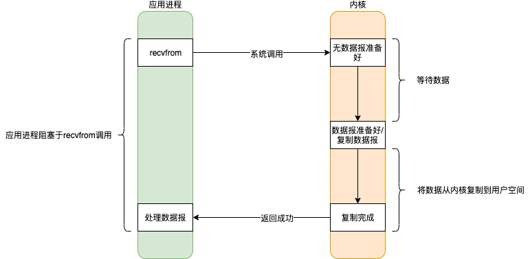
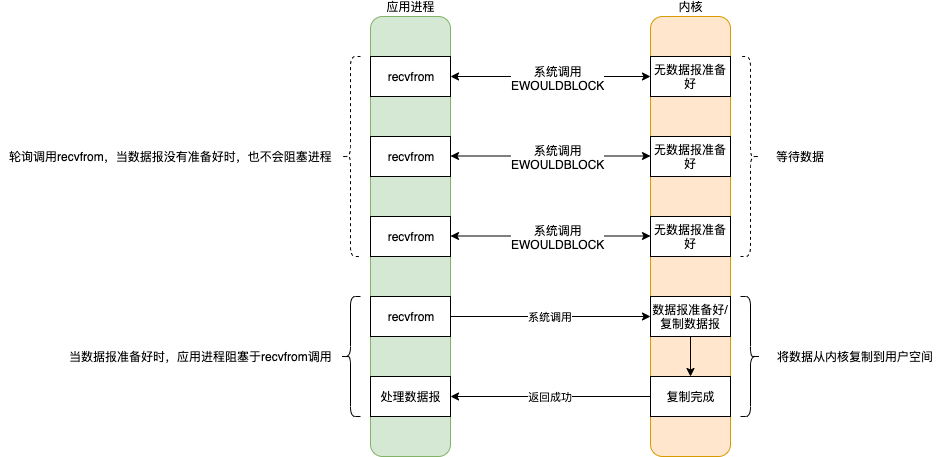
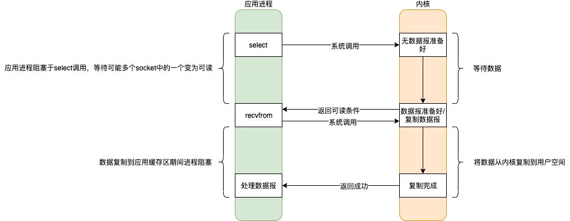
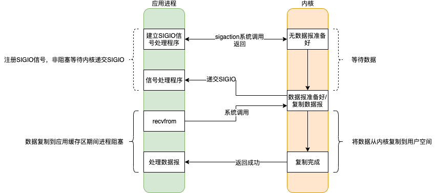
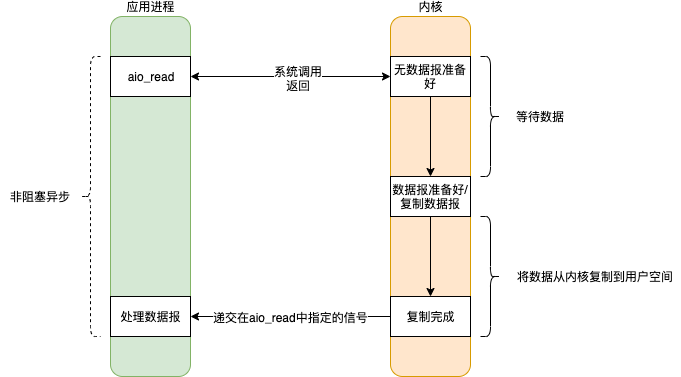
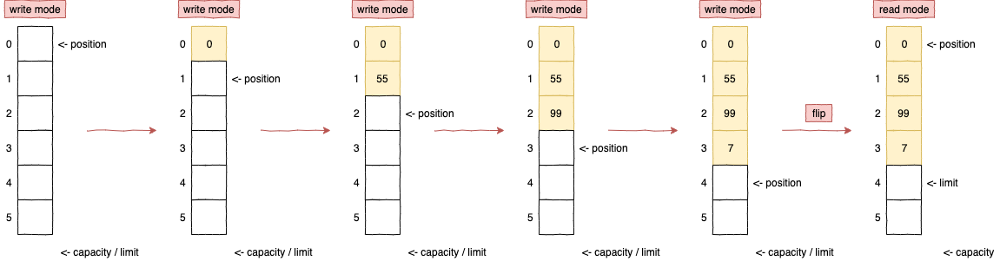
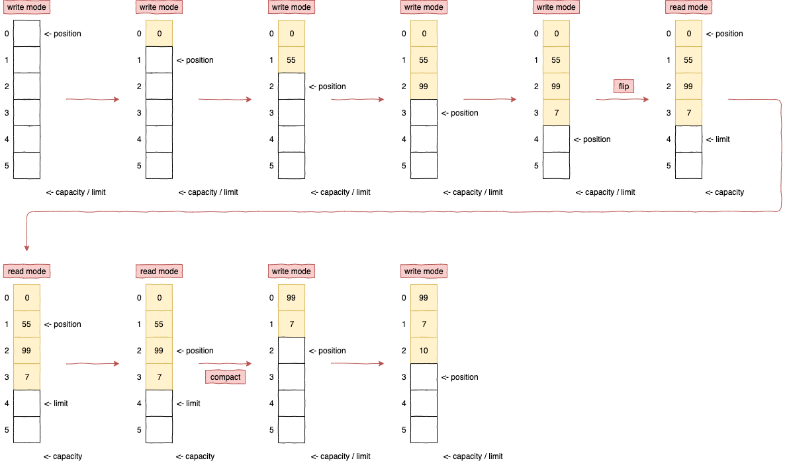
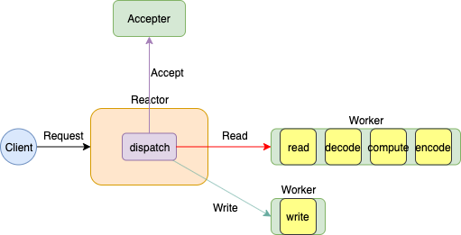
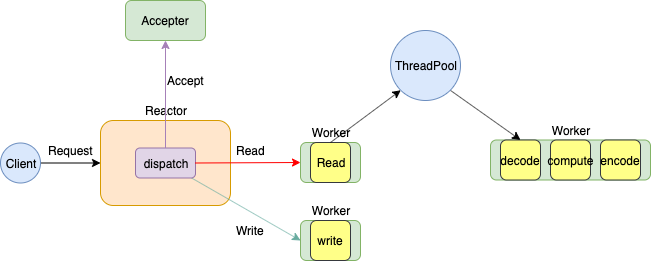
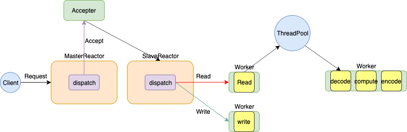

# 网络基础

## 计算机网络体系结构

### 七层协议体系结构

亦称OSI（Open System Interconnection）


- 物理层（屏蔽传输媒介和通信）

  计算机节点间透明传输比特流

- 数据链路层（面向链路）

  这一层会提供计算机**MAC地址**，通信的时候会携带，为了确保请求投递正确，所以他会验证检测MAC地址。

  将网络层传下来的分组添加首部和尾部，用于标记**帧**的开始和结束。目前数据链路层广泛使用了循环冗余检验（CRC）来检查比特差错。

  MAC 地址是链路层地址，长度为 6 字节（48 位），用于唯一标识网络适配器（网卡）。一台主机拥有多少个网络适配器就有多少个 MAC 地址。例如笔记本电脑普遍存在无线网络适配器和有线网络适配器，因此就有两个 MAC 地址。

  **交换机**具有自学习能力，学习的是交换表的内容，交换表中存储着 MAC 地址到接口的映射。正是由于这种自学习能力，因此交换机是一种即插即用设备，不需要网络管理员手动配置交换表内容。交换机有 4 个接口（1，2，3，4），主机 A 向主机 B 发送数据帧时，交换机把主机 A 到接口 1 的映射写入交换表中。为了发送数据帧到 B，先查交换表，此时没有主机 B 的表项，**那么主机 A 就发送广播帧**，主机 C 和主机 D 会丢弃该帧，主机 B 回应该帧向主机 A 发送数据包时，交换机查找交换表得到主机 A 映射的接口为 1，就发送数据帧到接口 1，同时交换机添加主机 B 到接口 2 的映射。

  - A-1
  - B-2
  - C-3
  - D-4

- 网络层（面向主机）

  网络通信的时候必须要有**本机IP**和对方的IP，所以网络层也称之为IP层。

- 传输层（面向进程）

  该层建立**端到端**的连接，他提供了数据传输服务，在传输层通信会涉及到**端口号**，本层常见的协议为TCP，UDP。LVS就是在

  本层，是四层负载均衡。

  网络层只把分组发送到目的主机，但是真正通信的并不是主机而是主机中的进程。传输层提供了进程间的逻辑通信，传输层向高层用户屏蔽了下面网络层的核心细节，使应用程序看起来像是在两个传输层实体之间有一条端到端的逻辑通信信道。

  - 用户数据报协议 UDP（User Datagram Protocol）是无连接的，尽最大可能交付，没有拥塞控制，面向报文（对于应用程序传下来的报文不合并也不拆分，只是添加 UDP 首部），支持一对一、一对多、多对一和多对多的交互通信。
  - 传输控制协议 TCP（Transmission Control Protocol）是面向连接的，提供可靠交付，有流量控制，拥塞控制，提供全双工通信，面向字节流（把应用层传下来的报文看成字节流，把字节流组织成大小不等的数据块），每一条 TCP 连接只能是点对点的（一对一）。

- 会话层

  会话可以理解为session，请求发送到接受响应的这个过程之间存在会话，会话层就充当了这一过程的管理者，从创建会话到

  销毁会话。

- 表示层

  该层提供数据格式编码以及加密功能，确保 请求端 的数据能被 响应端 的应用层识别。

- 应用层

  面向用户的，最靠近用户，为了让用户和计算机交互。在这一层最常见的协议有：HTTP，HTTPS，FTP，SMTP，POP3等。Nginx在本层，为七层负载均衡。


在向下的过程中，需要添加下层协议所需要的首部或者尾部，而在向上的过程中不断拆开首部和尾部。

路由器只有下面三层协议，因为路由器位于网络核心中，不需要为进程或者应用程序提供服务，因此也就不需要传输层和应用层。


### TCP / IP 体系结构

- 网络接口层
- 网际层IP
- 传输层 TCP / UDP
- 应用层（各种应用层协议 TELNET、FTP、SMTP）

物理层通过物理⼿段把电脑连接起来，数据链路层则对⽐特流的数据进⾏分组，⽹络层来建⽴主机到主机的通信，传输层建⽴端⼝到端⼝的通信，应⽤层最终负责建⽴连接，数据格式转换，最终呈现给⽤户。


### 五层协议体系结构

- 物理层

  **物理层(physical layer)的作用是实现相邻计算机节点之间比特流的透明传送，尽可能屏蔽掉具体传输介质和物理设备的差异，** 使其上面的数据链路层不必考虑网络的具体传输介质是什么。“透明传送比特流”表示经实际电路传送后的比特流没有发生变化，对传送的比特流来说，这个电路好像是看不见的。

- 数据链路层

  **数据链路层(data link layer)通常简称为链路层。两台主机之间的数据传输，总是在一段一段的链路上传送的，这就需要使用专门的链路层的协议。** 在两个相邻节点（负责MAC地址）之间传送数据时，**数据链路层将网络层交下来的 IP 数据报组装成帧**，在两个相邻节点间的链路上传送帧。每一帧包括数据和必要的控制信息（如同步信息，地址信息，差错控制等）。

- 网络层

  **在 计算机网络中进行通信的两个计算机之间可能会经过很多个数据链路，也可能还要经过很多通信子网。网络层的任务就是选择合适的网间路由和交换结点， 确保数据及时传送。** 在发送数据时，网络层把传输层产生的报文段或用户数据报封装成分组和包进行传送。在 TCP/IP 体系结构中，由于网络层使用 **IP 协议**，因此分组也叫 **IP 数据报** ，简称 **数据报**。

  互联网是由大量的异构（heterogeneous）网络通过路由器（router）相互连接起来的。<font color=red>互联网使用的网络层协议是无连接的网际协议（Internet Protocol）</font>和许多路由选择协议，因此互联网的网络层也叫做**网际层**或**IP层**。

- 传输层

  **传输层(transport layer)的主要任务就是负责向两台主机进程之间的通信提供通用的数据传输服务**。应用进程利用该服务传送应用层报文。“通用的”是指并不针对某一个特定的网络应用，而是多种应用可以使用同一个运输层服务。由于一台主机可同时运行多个线程，因此运输层有复用和分用的功能。所谓复用就是指多个应用层进程可同时使用下面运输层的服务，分用和复用相反，是运输层把收到的信息分别交付上面应用层中的相应进程。

  **传输层主要使用以下两种协议:**

  1. **传输控制协议 TCP**（Transmission Control Protocol）提供**面向连接**的，**可靠的**数据传输服务。
  2. **用户数据协议 UDP**（User Datagram Protocol）提供**无连接**的，尽最大努力的数据传输服务（**不保证数据传输的可靠性**）。

  UDP 在传送数据之前不需要先建立连接，远程主机在收到 UDP 报文后，不需要给出任何确认。虽然 UDP 不提供可靠交付，但在某些情况下 UDP 确是一种最有效的工作方式（一般用于即时通信），比如： QQ 语音、 QQ 视频 、直播等等

  TCP 提供面向连接的服务。在传送数据之前必须先建立连接，数据传送结束后要释放连接。 TCP 不提供广播或多播服务。由于 TCP 要提供可靠的，面向连接的传输服务（TCP的可靠体现在TCP在传递数据之前，会有三次握手来建立连接，而且在数据传递时，有确认、窗口、重传、拥塞控制机制，在数据传完后，还会断开连接用来节约系统资源），这一难以避免增加了许多开销，如确认，流量控制，计时器以及连接管理等。这不仅使协议数据单元的首部增大很多，还要占用许多处理机资源。TCP 一般用于文件传输、发送和接收邮件、远程登录等场景。

- 应用层

  **应用层(application-layer）的任务是通过应用进程间的交互来完成特定网络应用。**应用层协议定义的是应用进程（进程：主机中正在运行的程序）间的通信和交互的规则。对于不同的网络应用需要不同的应用层协议。在互联网中应用层协议很多，如**域名系统DNS**，支持万维网应用的 **HTTP协议**，支持电子邮件的 **SMTP协议**等等。我们把应用层交互的数据单元称为报文。


## TCP协议

### TCP三次握手

1. `Client -seq=x-> Server` SYN（你在吗？）

2. `Server -ack=x+1, seq=y-> Client` ACK（我在！） + SYN（你在吗？）

   Client收到ACK后，状态变为ESTABLISHED

3. `Client -ack=y+1-> Server` ACK（我在！）

   Server收到ACK后，状态变为ESTABLISHED

**连接后，client发送包的序号从x+1开始，而server的确认序号从y+1开始，用于数据包顺序确认。**


三次握手的目的是建立**可靠的通信信道**

第一次握手：Client 什么都不能确认；Server 确认了对方发送正常，自己接收正常

第二次握手：Client 确认了：自己发送、接收正常，对方发送、接收正常；Server 确认了：对方发送正常，自己接收正常

第三次握手：Client 确认了：自己发送、接收正常，对方发送、接收正常；Server 确认了：自己发送、接收正常，对方发送、接收正常


**三次握手的原因**

第三次握手是为了防止失效的连接请求到达服务器，让服务器错误打开连接。

客户端发送的连接请求如果在网络中滞留，那么就会隔很长一段时间才能收到服务器端发回的连接确认。客户端等待一个超时重传时间之后，就会重新请求连接。但是这个滞留的连接请求最后还是会到达服务器，如果不进行三次握手，那么服务器就会打开两个连接。如果有第三次握手，客户端会忽略服务器之后发送的对滞留连接请求的连接确认，不进行第三次握手，因此就不会再次打开连接。


### TCP四次挥手

任何一方都可以在数据传送结束后发出连接释放的通知，待对方确认后进入半关闭状态。当另一方也没有数据再发送的时候，则发出连接释放通知，对方确认后就完全关闭了TCP连接。

**主动关闭方，通知对方不会再发送数据；此时，被动关闭方可能会有数据没有发送完成，仍可以发送数据。待发送数据完成后，向主动方发起关闭请求。**

1. `Client -> Server` FIN（我要离开！）

2. `Server -> Client` ACK（确认！）

   Server状态变为 CLOSE_WAIT，连接为半关闭状态；**注意，此时Server可以向Client发送数据，但Client不能向Server发送数据**

3. `Server -> Client` FIN（我也要离开！）

   Client状态变为TIME_WAIT，**需要等待2MSL后**，状态变为CLOSED

   - MSL（Maximum Segment Lifetime）最大报文生存时间，LWIP为1分钟，windows为2分钟。在此期间，两端的端口不可复用，主要的目的是，为了防止第四次的ACK超时，Server会重新给Client发送FIN。

4. `Client -> Server` ACK（确认！）

   Server状态变为CLOSED


**四次挥手的原因**

客户端发送了 FIN 连接释放报文之后，服务器收到了这个报文，就进入了 CLOSE-WAIT 状态。这个状态是为了让服务器端发送还未传送完毕的数据，传送完毕之后，服务器会发送 FIN 连接释放报文。


**TIME_WAIT**

客户端接收到服务器端的 FIN 报文后进入此状态，此时并不是直接进入 CLOSED 状态，还需要等待一个时间计时器设置的时间 2MSL。这么做有两个理由：

- 确保最后一个确认报文能够到达。如果 B 没收到 A 发送来的确认报文，那么就会重新发送连接释放请求报文，A 等待一段时间就是为了处理这种情况的发生。
- 等待一段时间是为了让本连接持续时间内所产生的所有报文都从网络中消失，使得下一个新的连接不会出现旧的连接请求报文。
- **避免客户端端口重用，向服务端发送数据过程中，收到服务端重复的fin请求，造成混淆**


### TCP 协议如何保证可靠传输

- 应用数据被分割成 TCP 认为最适合发送的数据块。
- TCP 给发送的每一个包进行编号，接收方对数据包进行排序，把有序数据传送给应用层。
- 校验和： TCP 将保持它首部和数据的检验和。这是一个端到端的检验和，目的是检测数据在传输过程中的任何变化。如果收到段的检验和有差错，TCP 将丢弃这个报文段和不确认收到此报文段。
- TCP 的接收端会丢弃重复的数据。
- 流量控制： TCP 连接的每一方都有固定大小的缓冲空间，TCP的接收端只允许发送端发送接收端缓冲区能接纳的数据。当接收方来不及处理发送方的数据，能提示发送方降低发送的速率，防止包丢失。TCP 使用的流量控制协议是可变大小的滑动窗口协议。 （TCP 利用滑动窗口实现流量控制）
- 拥塞控制： 当网络拥塞时，减少数据的发送。
- ARQ协议： 也是为了实现可靠传输的，它的基本原理就是每发完一个分组就停止发送，等待对方确认。在收到确认后再发下一个分组。
- 超时重传： 当 TCP 发出一个段后，它启动一个定时器，等待目的端确认收到这个报文段。如果不能及时收到一个确认，将重发这个报文段。

#### ARQ协议

**自动重传请求**（Automatic Repeat-reQuest，ARQ）是OSI模型中数据链路层和传输层的错误纠正协议之一。它通过使用确认和超时这两个机制，在不可靠服务的基础上实现可靠的信息传输。如果发送方在发送后一段时间之内没有收到确认帧，它通常会重新发送。ARQ包括停止等待ARQ协议和连续ARQ协议。


##### 停止等待ARQ协议

停止等待协议是为了实现可靠传输的，它的基本原理就是每发完一个分组就停止发送，等待对方确认（回复ACK）。如果过了一段时间（超时时间后），还是没有收到 ACK 确认，说明没有发送成功，需要重新发送，直到收到确认后再发下一个分组。

在停止等待协议中，若接收方收到重复分组，就丢弃该分组，但同时还要发送确认。

**优缺点：**

- **优点：** 简单
- **缺点：** 信道利用率低，等待时间长

**1) 无差错情况:**

发送方发送分组，接收方在规定时间内收到，并且回复确认。发送方再次发送。

**2) 出现差错情况（超时重传）:**

停止等待协议中超时重传是指只要超过一段时间仍然没有收到确认，就重传前面发送过的分组（认为刚才发送过的分组丢失了）。因此每发送完一个分组需要设置一个超时计时器，其重传时间应比数据在分组传输的平均往返时间更长一些。这种自动重传方式常称为 **自动重传请求 ARQ** 。另外在停止等待协议中若收到重复分组，就丢弃该分组，但同时还要发送确认。**连续 ARQ 协议** 可提高信道利用率。发送维持一个发送窗口，凡位于发送窗口内的分组可连续发送出去，而不需要等待对方确认。接收方一般采用累积确认，对按序到达的最后一个分组发送确认，表明到这个分组位置的所有分组都已经正确收到了。

**3) 确认丢失和确认迟到**

- **确认丢失** ：确认消息在传输过程丢失。当A发送M1消息，B收到后，B向A发送了一个M1确认消息，但却在传输过程中丢失。而A并不知道，在超时计时过后，A重传M1消息，B再次收到该消息后采取以下两点措施：1. 丢弃这个重复的M1消息，不向上层交付。 2. 向A发送确认消息。（不会认为已经发送过了，就不再发送。A能重传，就证明B的确认消息丢失）。
- **确认迟到** ：确认消息在传输过程中迟到。A发送M1消息，B收到并发送确认。在超时时间内没有收到确认消息，A重传M1消息，B仍然收到并继续发送确认消息（B收到了2份M1）。此时A收到了B第二次发送的确认消息。接着发送其他数据。过了一会，A收到了B第一次发送的对M1的确认消息（A也收到了2份确认消息）。处理如下：1. A收到重复的确认后，直接丢弃。2. B收到重复的M1后，也直接丢弃重复的M1。


##### 连续ARQ协议

连续 ARQ 协议可提高信道利用率。发送方维持一个发送窗口，凡位于发送窗口内的分组可以连续发送出去，而不需要等待对方确认。接收方一般采用累计确认，对按序到达的最后一个分组发送确认，表明到这个分组为止的所有分组都已经正确收到了。

**优缺点：**

- **优点：** 信道利用率高，容易实现，即使确认丢失，也不必重传。
- **缺点：** 不能向发送方反映出接收方已经正确收到的所有分组的信息。 比如：发送方发送了 5条 消息，中间第三条丢失（3号），这时接收方只能对前两个发送确认。发送方无法知道后三个分组的下落，而只好把后三个全部重传一次。这也叫 Go-Back-N（回退 N），表示需要退回来重传已经发送过的 N 个消息。


#### 滑动窗口和流量控制

**TCP 利用滑动窗口实现流量控制。流量控制是为了控制发送方发送速率，保证接收方来得及接收。** 接收方发送的确认报文中的窗口字段可以用来控制发送方窗口大小，从而影响发送方的发送速率。将窗口字段设置为 0，则发送方不能发送数据。


#### 拥塞控制

在某段时间，若对网络中某一资源的需求超过了该资源所能提供的可用部分，网络的性能就要变坏。这种情况就叫拥塞。拥塞控制就是为了防止过多的数据注入到网络中，这样就可以使网络中的路由器或链路不致过载。拥塞控制所要做的都有一个前提，就是网络能够承受现有的网络负荷。拥塞控制是一个全局性的过程，涉及到所有的主机，所有的路由器，以及与降低网络传输性能有关的所有因素。相反，流量控制往往是点对点通信量的控制，是个端到端的问题。流量控制所要做到的就是抑制发送端发送数据的速率，以便使接收端来得及接收。

为了进行拥塞控制，TCP 发送方要维持一个 **拥塞窗口(cwnd)** 的状态变量。拥塞控制窗口的大小取决于网络的拥塞程度，并且动态变化。发送方让自己的发送窗口取为拥塞窗口和接收方的接受窗口中较小的一个。

TCP的拥塞控制采用了四种算法，即 **慢开始** 、 **拥塞避免** 、**快重传** 和 **快恢复**。在网络层也可以使路由器采用适当的分组丢弃策略（如主动队列管理 AQM），以减少网络拥塞的发生。

- **慢开始（每次cwnd*2）：** 慢开始算法的思路是当主机开始发送数据时，如果立即把大量数据字节注入到网络，那么可能会引起网络阻塞，因为现在还不知道网络的符合情况。经验表明，较好的方法是先探测一下，即由小到大逐渐增大发送窗口，也就是由小到大逐渐增大拥塞窗口数值。cwnd初始值为1，每经过一个传播轮次，cwnd加倍。

- **拥塞避免（慢开始达到阈值ssthresh时，每次cwnd+1）：** 拥塞避免算法的思路是让拥塞窗口cwnd缓慢增大，即每经过一个往返时间RTT就把发送放的cwnd加1.

- **快重传与快恢复：** 在 TCP/IP 中，快速重传和恢复（fast retransmit and recovery，FRR）是一种拥塞控制算法，它能快速恢复丢失的数据包。

  **快重传（立即重传丢失的数据段）**

  没有 FRR，如果数据包丢失了，TCP 将会使用定时器来要求传输暂停。在暂停的这段时间内，没有新的或复制的数据包被发送。

  有了 FRR，如果接收机接收到一个不按顺序的数据段，它会立即给发送机发送一个重复确认（Server端主动告知）。如果发送机接收到三个重复确认，它会假定确认件指出的数据段丢失了，并**立即重传这些丢失的数据段**。有了 FRR，不必继续等待设置的重传计数器时间到期。

  **快恢复（ssthresh = cwnd / 2 ，cwnd = ssthresh，直接进入拥塞避免）**

  发送方减半拥塞窗口，执行拥塞避免算法


## HTTP协议

### 报文结构

请求报文结构

- 第一行是包含了请求方法、URL、协议版本；
- 接下来的多行都是请求首部 Header，每个首部都有一个首部名称，以及对应的值。
- 一个空行用来分隔首部和内容主体 Body
- 最后是请求的内容主体

```shell
# 客户端设置特定的 HTTP 首部字段，例如 Accept、Accept-Charset、Accept-Encoding、Accept-Language，服务器根据这些字段返回特定的资源

GET http://www.example.com/ HTTP/1.1
Accept: text/html,application/xhtml+xml,application/xml;q=0.9,image/webp,image/apng,*/*;q=0.8,application/signed-exchange;v=b3;q=0.9
Accept-Encoding: gzip, deflate
Accept-Language: zh-CN,zh;q=0.9,en;q=0.8
Cache-Control: max-age=0
Host: www.example.com
If-Modified-Since: Thu, 17 Oct 2019 07:18:26 GMT
If-None-Match: "3147526947+gzip"
Proxy-Connection: keep-alive
Upgrade-Insecure-Requests: 1
User-Agent: Mozilla/5.0 xxx

param1=1&param2=2
```

响应报文结构

- 第一行包含协议版本、状态码以及描述，最常见的是 200 OK 表示请求成功了
- 接下来多行也是首部内容
- 一个空行分隔首部和内容主体
- 最后是响应的内容主体

```shell
HTTP/1.1 200 OK
Age: 529651
Cache-Control: max-age=604800
Connection: keep-alive
Content-Encoding: gzip
Content-Length: 648
Content-Type: text/html; charset=UTF-8
Date: Mon, 02 Nov 2020 17:53:39 GMT
Etag: "3147526947+ident+gzip"
Expires: Mon, 09 Nov 2020 17:53:39 GMT
Keep-Alive: timeout=4
Last-Modified: Thu, 17 Oct 2019 07:18:26 GMT
Proxy-Connection: keep-alive
Server: ECS (sjc/16DF)
Vary: Accept-Encoding
X-Cache: HIT

<!doctype html>
<html>
<head>
    <title>Example Domain</title>
	// 省略... 
</body>
</html>
```


### 状态码

|      | 类别                          | 原因                       |
| ---- | ----------------------------- | -------------------------- |
| 1xx  | Informational 信息状态码      | 接收的请求正在处理         |
| 2xx  | Success 成功状态码            | 请求正常处理完毕           |
| 3xx  | Redirection 重定向状态码      | 需要进行附加操作以完成请求 |
| 4xx  | Client Error 客户端错误状态码 | 服务器无法处理请求         |
| 5xx  | Server Error 服务端错误状态码 | 服务器处理请求出错         |

- 1XX 信息
  - **100 Continue** ：表明到目前为止都很正常，客户端可以继续发送请求或者忽略这个响应。

- 2XX 成功
  - **200 OK**
  - **204 No Content** ：请求已经成功处理，但是返回的响应报文不包含实体的主体部分。一般在只需要从客户端往服务器发送信息，而不需要返回数据时使用。
  - **206 Partial Content** ：表示客户端进行了范围请求，响应报文包含由 Content-Range 指定范围的实体内容。

- 3XX 重定向
  - **301 Moved Permanently** ：永久性重定向

  - **302 Found** ：临时性重定向

  - **303 See Other** ：和 302 有着相同的功能，但是 303 明确要求客户端应该采用 GET 方法获取资源。

    注：虽然 HTTP 协议规定 301、302 状态下重定向时不允许把 POST 方法改成 GET 方法，但是大多数浏览器都会在 301、302 和 303 状态下的重定向把 POST 方法改成 GET 方法。

  - **304 Not Modified** ：如果请求报文首部包含一些条件，例如：If-Match，If-Modified-Since，If-None-Match，If-Range，If-Unmodified-Since，如果不满足条件，则服务器会返回 304 状态码。

  - **307 Temporary Redirect** ：临时重定向，与 302 的含义类似，但是 307 要求浏览器不会把重定向请求的 POST 方法改成 GET 方法。

- 4XX 客户端错误
  - **400 Bad Request** ：请求报文中存在语法错误。
  - **401 Unauthorized** ：该状态码表示发送的请求需要有认证信息（BASIC 认证、DIGEST 认证）。如果之前已进行过一次请求，则表示用户认证失败。
  - **403 Forbidden** ：请求被拒绝。
  - **404 Not Found**

- 5XX 服务器错误
  - **500 Internal Server Error** ：服务器正在执行请求时发生错误。
  - **503 Service Unavailable** ：服务器暂时处于超负载或正在进行停机维护，现在无法处理请求。


### HTTP协议同其他协议的关系

客户端

- 客户端发送HTTP请求前，先访问DNS，将域名转换为实际的IP地址
- 客户端发送TCP连接请求，服务端接收请求并建立连接
- HTTP协议负责生成HTTP请求报文
- TCP协议将HTTP请求报文分割为多个报文段并编号
- IP协议负责搜索对方的地址，一边中转一边传输

服务端

- TCP协议将收到的报文段按序号以原来的顺序重组请求报文
- HTTP协议对请求的报文处理


### HTTP长连接和短连接

在HTTP/1.0中默认使用短连接。也就是说，客户端和服务器每进行一次HTTP操作，就建立一次连接，任务结束就中断连接。当客户端浏览器访问的某个HTML或其他类型的Web页中包含有其他的Web资源（如JavaScript文件、图像文件、CSS文件等），每遇到这样一个Web资源，浏览器就会重新建立一个HTTP会话。

而从HTTP/1.1起，默认使用长连接，用以保持连接特性。使用长连接的HTTP协议，会在响应头加入这行代码：

`Connection:keep-alive`

在使用长连接的情况下，当一个网页打开完成后，客户端和服务器之间用于传输HTTP数据的TCP连接不会关闭，客户端再次访问这个服务器时，会继续使用这一条已经建立的连接。Keep-Alive不会永久保持连接，它有一个保持时间，可以在不同的服务器软件（如Apache）中设定这个时间。实现长连接需要客户端和服务端都支持长连接。

**HTTP协议的长连接和短连接，实质上是TCP协议的长连接和短连接。**


### HTTP是不保存状态的协议

HTTP 是一种不保存状态，即无状态（stateless）协议。也就是说 HTTP 协议自身不对请求和响应之间的通信状态进行保存。那么如何保存用户状态呢？Session 机制的存在就是为了解决这个问题，Session 的主要作用就是通过服务端记录用户的状态。典型的场景是购物车，当你要添加商品到购物车的时候，系统不知道是哪个用户操作的，因为 HTTP 协议是无状态的。服务端给特定的用户创建特定的 Session 之后就可以标识这个用户并且跟踪这个用户了（一般情况下，服务器会在一定时间内保存这个 Session，过了时间限制，就会销毁这个Session）。

在服务端保存 Session 的方法很多，最常用的就是内存和数据库(比如是使用内存数据库redis保存)。既然 Session 存放在服务器端，那么我们如何实现 Session 跟踪呢？大部分情况下，我们都是通过在 Cookie 中附加一个 Session ID 来方式来跟踪。


**Cookie 被禁用怎么办?**

最常用的就是利用 URL 重写把 Session ID 直接附加在URL路径的后面。


**Cookie 一般用来保存用户信息**。Cookie 和 Session都是用来跟踪浏览器用户身份的会话方式，但是两者的应用场景不太一样。

1. 我们在 Cookie 中保存已经登录过得用户信息，下次访问网站的时候页面可以自动帮你登录的一些基本信息给填了；
2. 一般的网站都会有保持登录也就是说下次你再访问网站的时候就不需要重新登录了，这是因为用户登录的时候我们可以存放了一个 Token 在 Cookie 中，下次登录的时候只需要根据 Token 值来查找用户即可(**为了安全考虑，重新登录一般要将 Token 重写**)；
3. 登录一次网站后访问网站其他页面不需要重新登录。**Session 的主要作用就是通过服务端记录用户的状态。** 典型的场景是购物车，当你要添加商品到购物车的时候，系统不知道是哪个用户操作的，因为 HTTP 协议是无状态的。服务端给特定的用户创建特定的 Session 之后就可以标识这个用户并且跟踪这个用户了。


**Cookie 与 Session 选择**

- Cookie 只能存储 ASCII 码字符串，而 Session 则可以存储任何类型的数据，因此在考虑数据复杂性时首选 Session。

- Cookie 存储在客户端中，而Session存储在服务器上，相对来说 Session 安全性更高。如果要在 Cookie 中存储一些敏感信息，不要直接写入 Cookie 中，最好能将 Cookie 信息加密然后使用到的时候再去服务器端解密。
- 对于大型网站，如果用户所有的信息都存储在 Session 中，那么开销是非常大的，因此不建议将所有的用户信息都存储到 Session 中。


**Cookie 创建过程**

服务器发送的响应报文包含 Set-Cookie 首部字段，客户端得到响应报文后把 Cookie 内容保存到浏览器中。客户端之后对同一个服务器发送请求时，会从浏览器中取出 Cookie 信息并通过 Cookie 请求首部字段发送给服务器，但需要考虑额外的性能开销（尤其是在移动环境下）。


**Cookie 作用域**

Domain 标识指定了哪些主机可以接受 Cookie。如果不指定，默认为当前文档的主机（不包含子域名）。如果指定了 Domain，则一般包含子域名。例如，如果设置 Domain=mozilla.org，则 Cookie 也包含在子域名中（如 developer.mozilla.org）。

Path 标识指定了主机下的哪些路径可以接受 Cookie（该 URL 路径必须存在于请求 URL 中）。以字符 %x2F ("/") 作为路径分隔符，子路径也会被匹配。例如，设置 Path=/docs，则以下地址都会匹配：

- /docs
- /docs/Web/
- /docs/Web/HTTP


### HTTP 1.0和HTTP 1.1的主要区别

HTTP1.0最早在网页中使用是在1996年，那个时候只是使用一些较为简单的网页上和网络请求上，而HTTP1.1则在1999年才开始广泛应用于现在的各大浏览器网络请求中，同时HTTP1.1也是当前使用最为广泛的HTTP协议。 主要区别主要体现在：

1. **长连接** : **在HTTP 1.0中，默认使用的是短连接**，也就是说每次请求都要重新建立一次连接。HTTP 是基于TCP/IP协议的，每一次建立或者断开连接都需要三次握手四次挥手的开销，如果每次请求都要这样的话，开销会比较大。因此最好能维持一个长连接，可以用个长连接来发多个请求。**HTTP 1.1起，默认使用长连接**，默认开启`Connection: keep-alive`。 **HTTP 1.1的持续连接有非流水线方式和流水线方式** 。流水线方式是客户在收到HTTP的响应报文之前就能接着发送新的请求报文。与之相对应的非流水线方式是客户在收到前一个响应后才能发送下一个请求。
2. **错误状态响应码** : 在HTTP1.1中新增了24个错误状态响应码，如409（Conflict）表示请求的资源与资源的当前状态发生冲突；410（Gone）表示服务器上的某个资源被永久性的删除。
3. **缓存处理** : 在HTTP1.0中主要使用header里的If-Modified-Since，Expires来做为缓存判断的标准，HTTP1.1则引入了更多的缓存控制策略例如Entity tag，If-Unmodified-Since，If-Match，If-None-Match等更多可供选择的缓存头来控制缓存策略。
4. **带宽优化及网络连接的使用** : HTTP1.0中，存在一些浪费带宽的现象，例如客户端只是需要某个对象的一部分，而服务器却将整个对象送过来了，并且不支持断点续传功能，HTTP1.1则在请求头引入了range头域，它允许只请求资源的某个部分，即返回码是206（Partial Content），这样就方便了开发者自由的选择以便于充分利用带宽和连接。


### URI和URL的区别

- URI(Uniform Resource Identifier) 是统一资源标志符，可以唯一标识一个资源。
- URL(Uniform Resource Location) 是统一资源定位符，可以提供该资源的路径。<font color=red>它是一种具体的 URI，即 URL 可以用来标识一个资源，而且还指明了如何 locate 这个资源</font>。

URI的作用像身份证号一样，URL的作用更像家庭住址一样。URL是一种具体的URI，它不仅唯一标识资源，而且还提供了定位该资源的信息。


### HTTP 和 HTTPS 的区别

1. 端口：HTTP的URL由“http://”起始且默认使用端口80，而HTTPS的URL由“https://”起始且默认使用端口443。
2. 安全性和资源消耗：HTTP协议运行在TCP之上，所有传输的内容都是明文，客户端和服务器端都无法验证对方的身份。HTTPS是运行在SSL/TLS之上的HTTP协议，SSL/TLS 运行在TCP之上。所有传输的内容都经过加密，加密采用对称加密，但对称加密的密钥用服务器方的证书进行了非对称加密。所以说，HTTP 安全性没有 HTTPS高，但是 HTTPS 比HTTP耗费更多服务器资源。
   - 对称加密：密钥只有一个，加密解密为同一个密码，且加解密速度快，典型的对称加密算法有DES、AES等；
   - 非对称加密：密钥成对出现（且根据公钥无法推知私钥，根据私钥也无法推知公钥），加密解密使用不同密钥（公钥加密需要私钥解密，私钥加密需要公钥解密），相对对称加密速度较慢，典型的非对称加密算法有RSA、DSA等。


## HTTPS协议

1. ⽤户通过浏览器请求https⽹站，服务器收到请求，选择浏览器⽀持的加密和hash算法，同时返回数字证书给浏览器，包含颁发机构、⽹址、公钥、证书有效期等信息
2. 浏览器对证书的内容进⾏校验，如果有问题，则会有⼀个提示警告。否则，就⽣成⼀个随机数X，同时使⽤证书中的公钥进⾏加密，并且发送给服务器
3. 服务器收到之后，使⽤私钥解密，得到随机数X，然后使⽤X对⽹⻚内容进⾏加密，返回给浏览器
4. 浏览器则使⽤X和之前约定的加密算法进⾏解密，得到最终的⽹⻚内容


## 常用端口

| 应用             | 应用层协议 | 端口号  | 传输层协议 | 备注                        |
| ---------------- | ---------- | ------- | ---------- | --------------------------- |
| 域名解析         | DNS        | 53      | UDP/TCP    | 长度超过 512 字节时使用 TCP |
| 动态主机配置协议 | DHCP       | 67/68   | UDP        |                             |
| 简单网络管理协议 | SNMP       | 161/162 | UDP        |                             |
| 文件传送协议     | FTP        | 20/21   | TCP        | 控制连接 21，数据连接 20    |
| 远程终端协议     | TELNET     | 23      | TCP        |                             |
| 超文本传送协议   | HTTP       | 80      | TCP        |                             |
| 简单邮件传送协议 | SMTP       | 25      | TCP        |                             |
| 邮件读取协议     | POP3       | 110     | TCP        |                             |
| 网际报文存取协议 | IMAP       | 143     | TCP        |                             |


# 通信模式

## IO模型

|          | 阻塞                         | 非阻塞                         |
| -------- | ---------------------------- | ------------------------------ |
| **同步** | 阻塞I/O模型、I/O多路复用模型 | 非阻塞I/O模型、信号驱动I/O模型 |
| **异步** |                              | 异步I/O模型                    |

四种状态指的是应用进程同内核的通讯过程

- 阻塞 / 非阻塞 指的是**等待内核准备数据**，应用进程是否阻塞；即发起请求是否阻塞
- 同步 / 异步 指的是内核准备好数据后，**将数据由内核缓冲区复制到用户空间的进程缓存区**过程，由应用进程主动触发获取数据，还是被动通知；即读写数据是否阻塞

<font color=red>阻塞程度：阻塞I/O > 非阻塞I/O > I/O多路复用模型 > 信号驱动I/O > 异步I/O ，效率由低到高。</font>


**Java对于IO模型的支持**

- < 1.4 Java的IO模型只支持阻塞式IO（Blocking IO），简称为BIO 
- = 1.4 Java的IO模型支持了I/O多路复用模型，相对于之前的IO模型，这是一个新的模型，所以称之为NIO（New IO）
- = 1.7 Java对NIO包进行了升级，支持了异步I/O（Asynchronous IO），简称为AIO


### 阻塞IO（blocking I/O）



<font color=red>应用进程一次recvfrom指令调用，内核的两个阶段 **准备数据** 和 **复制数据** 都被阻塞。</font>


### 非阻塞IO（noblocking I/O）



应用进程多次recvfrom指令调用，当内核没有准备好数据时，不会阻塞，而是返回一个Error。当内核准备好数据时，此时应用进程的recvfrom指令调用被阻塞，直到数据拷贝到应用进程的缓冲区。


### IO多路复用（I/O multiplexing）



IO复用同非阻塞IO本质一样，但其利用了新的select系统调用，由内核负责查询是否准备好数据的轮询操作。看似比非阻塞IO还多了一个select指令调用开销，但是**可以同时处理多个网络连接的IO**。<font color=red>Server端优化的终极目标：Server端使用尽量少的线程，来处理尽量多的Client请求。</font>

当用户进程调用了select指令，应用进程会被阻塞；而同时，内核会“监视”所有select负责的socket，当任何一个socket中的数据准备好时，select就会返回。此时应用进程再调用recvfrom指令。

同多线程 + blocking I/O相比，select可以同时处理多个网络连接

- <font color=red>多路复用的优势不是为了处理连接更快，而是为了支持更多的连接。</font>比如网络连接是长连接或IO阻塞时间长的话，多线程 + blocking I/O的方式会大量使用线程资源，在任务未完成之前或Client未关闭前，无法将空闲线程归还到线程池中，可能的结果就是导致大量连接请求无法及时响应；而多路复用则可以使用单进程就可以同时处理多个链接请求。
- 当链接数不是很大，多线程 + blocking I/O的方式性能会更好一些，因为只有一次系统调用；而多路复用是两次系统调用。

**对于一次读取数据请求分为两个阶段：数据准备和数据复制。对于数据准备的时间是不确定性的，因为服务端什么时候发送数据不确定，而对于数据复制的时间是有限的。多路复用就是利于一个监视线程监听多个连接是否完成数据准备，当某一个连接完成数据准备，select恢复，将任务分配给一个工作线程处理，而工作线程读取数据，内核数据复制阻塞的时间是非常小的，从而使得工作任务大部分时间可以充分利用CPU进行计算工作，而不是阻塞等待IO完成浪费CPU资源**。


### 信号驱动IO（signal blocking I/O）




### 异步IO（asynchronous I/O）




## 内核指令调用实践

**内核需要自我保护不可直接访问，同时还需要对外提供服务支持。应用通过向CPU发送中断指令来访问内核函数。CPU收到应用的中断指令后，会查询中断向量表，然后调用对应的内核回调函数。晶振会定时向CPU发送中断指令，从而使多线程轮换，但会产生线程上下文切换成本。**


- 准备基础环境

  ```shell
  # 下载镜像
  docker pull centos:7
  
  # 启动镜像
  # 添加 --cap-add=SYS_PTRACE =解决=》 Can't attach to the process: ptrace(PTRACE_ATTACH, ..) failed for 253: Operation not permitted
  docker run --cap-add=SYS_PTRACE --name develop -it \
  -v /Users/yangxiaoyu/work/test/javadatas/exchange:/exchange \
  -d centos:7 /bin/bash
  
  # 进入环境
  docker exec -it develop /bin/bash
  
  # 内核指令追踪
  yum -y install strace
  
  # netcat
  yum -y install nc
  
  # 网络追踪 netstat
  yum -y install net-tools
  ```


- Jdk1.5环境

  [官方jdk下载地址](https://www.oracle.com/java/technologies/oracle-java-archive-downloads.html)

  ```shell
  # 安装jdk5
  sh jdk-1_5_0_22-linux-amd64.bin
  
  # 设置环境变量
  vi /etc/profile
  export JAVA_HOME=/exchange/jdk1.5.0_22
  export PATH=:$JAVA_HOME/bin:$PATH
  
  # 立即生效
  source /etc/profile
  
  # 验证
  java -version
  ```


- Jdk1.8环境

  ```shell
  # 安装jdk8
  tar -xzvf jdk-8u271-linux-x64.tar.gz
  
  # 设置环境变量
  vi /etc/profile
  export JAVA_HOME=/exchange/jdk1.8.0_271
  export PATH=:$JAVA_HOME/bin:$PATH
  
  # 立即生效
  source /etc/profile
  
  # 验证
  java -version
  ```

  

### BIO

#### 单线程

基于jdk5运行程序

```shell
# jdk5 编译
javac com/sciatta/dev/java/example/io/server/BIO.java

# -ff            follow forks with output into separate files
# -o file        send trace output to FILE instead of stderr
strace -ff -o bio java com.sciatta.dev.java.example.io.server.BIO
```

分析日志 `tail -F bio.570`

```shell
# 创建fd3
socket(AF_INET, SOCK_STREAM, IPPROTO_IP) = 3
# 绑定端口
bind(3, {sa_family=AF_INET, sin_port=htons(8888), sin_addr=inet_addr("0.0.0.0")}, 16) = 0
# 监听
listen(3, 50)
# accept阻塞
accept(3,

# 客户端建立连接，创建fd5
accept(3, {sa_family=AF_INET, sin_port=htons(57358), sin_addr=inet_addr("127.0.0.1")}, [16]) = 5
# recvfrom阻塞
recvfrom(5,

# 客户端发送请求数据
recvfrom(5, "hello\n", 8192, 0, NULL, NULL) = 6
# 关闭客户端连接
close(5)
# accept阻塞
accept(3,
```

总结

- BIO模式下，服务端在等待客户端连接时调用accept阻塞，当有客户端连接时，调用recvfrom阻塞。如果是单线程模式下，阻塞于recvfrom，<font color=red>此时服务端无法接受其他客户端请求</font>
- 为了改进使得服务端接受更多的客户端请求，采用线程池模式，当accept接受到客户端socket后，将socket交给线程池处理与客户端的读写请求，而服务端主线程则继续调用accept，响应客户端请求


#### 多线程改进版

基于jdk8运行程序

```shell
strace -ff -o Bootstrap java -cp bifrost-core-0.1.0-SNAPSHOT.jar com.sciatta.bifrost.core.Bootstrap
```

分析日志

```shell
# 创建ServerSocket监听
socket(AF_INET, SOCK_STREAM, IPPROTO_IP) = 6
bind(6, {sa_family=AF_INET, sin_port=htons(8888), sin_addr=inet_addr("0.0.0.0")}, 16) = 0
listen(6, 50)
# poll阻塞 同步IO多路复用
poll([{fd=6, events=POLLIN|POLLERR}], 1, -1

# 接收到客户端连接，客户端socket fd 7
poll([{fd=6, events=POLLIN|POLLERR}], 1, -1) = 1 ([{fd=6, revents=POLLIN}])
accept(6, {sa_family=AF_INET, sin_port=htons(57364), sin_addr=inet_addr("127.0.0.1")}, [16]) = 7
# 马上阻塞
poll([{fd=6, events=POLLIN|POLLERR}], 1, -1

# 客户端请求递交给新的线程处理；创建线程（Linux是进程） fd 888
clone(child_stack=0x7f9b89c8cfb0, flags=CLONE_VM|CLONE_FS|CLONE_FILES|CLONE_SIGHAND|CLONE_THREAD|CLONE_SYSVSEM|CLONE_SETTLS|CLONE_PARENT_SETTID|CLONE_CHILD_CLEARTID, parent_tidptr=0x7f9b89c8d9d0, tls=0x7f9b89c8d700, child_tidptr=0x7f9b89c8d9d0) = 888

# 读请求阻塞
recvfrom(7,
# 收到读请求
recvfrom(7, "1234567\n", 8192, 0, NULL, NULL) = 8

# 关闭客户端连接
close(7)
```

总结

- jkd8采用的是poll+accept模式处理客户端连接
- 在Linux环境下，java创建的线程就是创建一个子进程，处理读请求仍然是调用recvfrom函数
- <font color=red>虽然可以处理一定数量的客户端请求，但创建过多的系统进程，会导致内存浪费，CPU轮询上下文切换，以及系统本身对进程数量的限制，都导致了系统资源的浪费。因此需要使用比较少的线程来处理更多的客户端连接请求</font>


### NIO

基于jdk8运行程序

```shell
strace -ff -o Bootstrap java -cp bifrost-core-0.1.0-SNAPSHOT.jar com.sciatta.bifrost.core.Bootstrap
```

分析日志

``` shell
# 创建server socket fd5，绑定端口，监听
socket(AF_INET, SOCK_STREAM, IPPROTO_IP) = 5
bind(5, {sa_family=AF_INET, sin_port=htons(8888), sin_addr=inet_addr("0.0.0.0")}, 16) = 0
listen(5, 50)
# 设置为非阻塞模式
fcntl(5, F_SETFL, O_RDWR|O_NONBLOCK)    = 0
    
# 循环 返回-1，表示没有客户端连接，不阻塞
accept(5, 0x7feffc09fbe0, [16])         = -1 EAGAIN (Resource temporarily unavailable)

# 接收到客户端连接 fd7
accept(5, {sa_family=AF_INET, sin_port=htons(57464), sin_addr=inet_addr("127.0.0.1")}, [16]) = 7
# 设置为非阻塞模式
fcntl(7, F_SETFL, O_RDWR|O_NONBLOCK)    = 0

# 读取数据
read(7, "GET / HTTP/1.1\r\nUser-Agent: curl"..., 1024) = 78

# 关闭客户端连接
close(7)                                = 0
```

总结

- accept为非阻塞模式，单一线程就可以实现同时处理客户端连接请求和读写数据
- <font color=red>NIO模式会不断调用内核函数，浪费系统资源，用户态、内核态切换</font>


### 基于多路复用

基于jdk8运行程序

```shell
strace -ff -o Bootstrap java -cp bifrost-core-0.1.0-SNAPSHOT.jar com.sciatta.bifrost.core.Bootstrap
```

分析日志

```shell
# 创建server socket fd5，绑定端口，监听，设置为非阻塞
socket(AF_INET, SOCK_STREAM, IPPROTO_IP) = 5
bind(5, {sa_family=AF_INET, sin_port=htons(8888), sin_addr=inet_addr("0.0.0.0")}, 16) = 0
listen(5, 50)
fcntl(5, F_SETFL, O_RDWR|O_NONBLOCK)    = 0

# 内核创建空间fd9，放置缓存注册的fd
epoll_create(256)                       = 9
# 注册fd5
epoll_ctl(9, EPOLL_CTL_ADD, 5, {EPOLLIN, {u32=5, u64=139728171040773}}) = 0
# 阻塞等待事件
epoll_wait(9,

# 收到accept事件，创建fd10
epoll_wait(9, [{EPOLLIN, {u32=5, u64=139728171040773}}], 8192, -1) = 1
accept(5, {sa_family=AF_INET, sin_port=htons(57472), sin_addr=inet_addr("127.0.0.1")}, [16]) = 10
fcntl(10, F_SETFL, O_RDWR|O_NONBLOCK)   = 0
# 注册fd10
epoll_ctl(9, EPOLL_CTL_ADD, 10, {EPOLLIN, {u32=10, u64=139728171040778}}) = 0

# 阻塞等待事件
epoll_wait(9,

# 收到read事件
read(10, "GET / HTTP/1.1\r\nUser-Agent: curl"..., 1024) = 78
# 关闭连接
close(10)
```

总结

- 单一线程就可以实现同时处理客户端连接请求和读写数据，select可以配置为阻塞模式等待客户端事件
- 多路复用
  - select 限制fd数量是1024，同步IO多路复用

  - poll 对fd没有限制，同步IO多路复用

    - 每次调用需要传入检测的fd来确认是否IO准备就绪
    - 同时内核会遍历这些fd

  - epoll
    - epoll_create、epoll_ctl、epoll_wait
    - <font color=red>每次调用不需要传入检测的fd，因为事先已经注册到内核空间中，同时也不需要遍历检测的所有fd，内核基于事件通知机制告知监听的哪一个fd准备就绪</font>
    - epoll 仅适用于 Linux OS
    
  - 应用场景

    - select 应用场景
      select 的 timeout 参数精度为微秒，而 poll 和 epoll 为毫秒，因此 select 更加适用于实时性要求比较高的场景，比如核反应堆的控制。

      select **可移植性**更好，几乎被所有主流平台所支持。

    - poll 应用场景
      poll 没有最大描述符数量的限制，如果平台支持并且对实时性要求不高，应该使用 poll 而不是 select。
    
    - epoll 应用场景
      只需要运行在 Linux 平台上，有大量的描述符需要同时轮询，并且这些连接最好是长连接。
    
      需要同时监控小于 1000 个描述符，就没有必要使用 epoll，因为这个应用场景下并不能体现 epoll 的优势。
    
      需要监控的描述符状态变化多，而且都是非常短暂的，也没有必要使用 epoll。因为 epoll 中的所有描述符都存储在内核中，造成每次需要对描述符的状态改变都需要通过 epoll_ctl() 进行系统调用，频繁系统调用降低效率。并且 epoll 的描述符存储在内核，不容易调试。


# NIO

## java NIO

### 核心概念

- Channel

  Channel的数据可以读到Buffer中，Buffer中的数据也可以写入到Channel。

  - FileChannel

    基于File，不支持非阻塞模式

  - DatagramChannel

    基于UDP

  - SocketChannel

    基于TCP

  - ServerSocketChannel

    监听TCP连接

  Channel和Stream的区别

  - Channel是双向的读写；而Stream是单向的，要么读，要么写
  - Channel支持异步读写
  - Channel的读写需借助Buffer

- Buffer

  Buffer覆盖了可以通过IO发送的基本数据类型。

  - ByteBuffer
  - CharBuffer
  - DoubleBuffer
  - FloatBuffer
  - IntBuffer
  - LongBuffer
  - ShortBuffer

- Selector

  <font color=red>一个Selector支持一个单一的线程处理多个Channel</font>。适用于应用包含许多连接，但每个连接的流量都很少的场景。为了监听一个Channel，需要向Selector注册。

  - 线程上下文切换代价高
  - 线程需要占用系统资源（内存）

  注册的Channel必须是**非阻塞**模式。


### Buffer

#### Capacity, Position 和 Limit

- flip 切换为读模式
  - 初始处于写模式，capacity和limit指向Buffer最大容量，position指向0位置
  - 每put数据一次，position下标下移一位；即position总是指向待插入数据位置
  - `flip` 切换为读模式，limit指向原position位置，表示最大可读取位置，position指向0位置，表示起始可读取位置




- rewind 重读数据
  - 切换为读模式读取数据后，`rewind` 可重读已经读取过的数据，即将position指向0位置，limit不变


- clear 清空Buffer
  - 切换为写模式，`clear` 只是重置标志位，内部数据不会操作；即将position指向0位置，limit指向capacity位置


- compact
  - 由读模式切换为写模式，未读元素前置到0位置开始，position指向未读元素的最后一个元素之后，limit指向capacity位置




- mark & reset
  - 读模式下 `mark` 记录当前position位置，之后继续向后读取；`reset` 会重新将position指向 `mark` 标记的位置，可重新读取标记位置之后的数据


### Selector

- <font color=red>channel必须是非阻塞，才能使用selector</font>
- SelectionKey可供监听的四种事件
  - OP_CONNECT Channel连接Server成功（客户端）
  - OP_ACCEPT ServerSocketChannel接收到一个客户端请求（服务端）
  - OP_READ 数据准备好可读
  - OP_WRITE Channel准备好可以用于写数据
- channel向selector注册，并添加感兴趣的事件 `selectionKey.attach(theObject);`，可以向返回的SelectionKey对象附加有用的对象；在selector触发事件后，可以通过 `selector.selectedKeys()` 获得同register时返回一致的SelectionKey，然后可以通过 `Object attachedObj = selectionKey.attachment();` 使用注册时附加的对象
- `select()`
  - `int select()` selector阻塞，直到注册的一个channel的事件准备好
  - `int select(long timeout)` 阻塞，指定超时时间
  - `int selectNow()` 不阻塞，立即返回，不管channel是否准备好
- selector不会主动移除处理过的channel，需要手动移除

```java
// 创建一个selector
Selector selector = Selector.open();

// channel必须是非阻塞，才能使用selector
channel.configureBlocking(false);

// channel向selector注册，并添加感兴趣的事件
// 可以向返回的SelectionKey对象附加有用的对象，在selector触发事件后，可以使用附加的对象 selectionKey.attach(theObject);
SelectionKey key = channel.register(selector, SelectionKey.OP_READ);

while(true) {
	// 准备监听事件，readyChannels有多少个channel准备好
  int readyChannels = selector.selectNow();

  if(readyChannels == 0) continue;

  // 访问准备好的channel，同register时返回的SelectionKey一致
  Set<SelectionKey> selectedKeys = selector.selectedKeys();

  Iterator<SelectionKey> keyIterator = selectedKeys.iterator();
	// 迭代准备好的channel
  while(keyIterator.hasNext()) {

    SelectionKey key = keyIterator.next();
    Channel channel = key.channel();	// 可以转换为需要的实际channel，如 ServerSocketChannel or SocketChannel 

    if(key.isAcceptable()) {
        // a connection was accepted by a ServerSocketChannel.

    } else if (key.isConnectable()) {
        // a connection was established with a remote server.

    } else if (key.isReadable()) {
        // a channel is ready for reading

    } else if (key.isWritable()) {
        // a channel is ready for writing
    }

    // selector不会主动移除处理过的channel，需要手动移除
    keyIterator.remove();
  }
}
```


### Channel

#### FileChannel

- FileChannel不能设置为非阻塞模式


#### SocketChannel 和ServerSocketChannel

- SocketChannel
  - 可以设置SocketChannel为非阻塞模式，异步模式调用 `connect()`, `read()` 和 `write()` 
  - 非阻塞模式下，配合selector使用，由selector监听注册的channel事件是否准备好
- ServerSocketChannel
  - 阻塞模式 `ServerSocketChannel.accept()` 类似于 `ServerSocket.accept()` 
  - 非阻塞模式 `serverSocketChannel.configureBlocking(false);` 方法 `ServerSocketChannel.accept()` 会立即返回


## Reactor模型

Reactor模型包含两个组件：

1. Reactor：负责响应IO事件，当检测到IO事件时，分发给Handlers处理。
2. Handler（Accepter、Worker）：与IO事件绑定，负责IO事件的处理。


### 单Reactor单线程模型

1. 当其中某个 handler 阻塞时， 会导致其他所有的 client 的 handler 都得不到执行， 并且更严重的是， handler 的阻塞也会导致整个服务不能接收新的 client 请求（因为 acceptor 也被阻塞了）。 因为有这么多的缺陷， 因此单线程Reactor 模型用的比较少。这种单线程模型不能充分利用多核资源，所以实际使用的不多。
2. 因此，单线程模型仅仅适用于handler 中业务处理组件能快速完成的场景。




### 单Reactor多线程模型

由于decode、compute、encode的操作并⾮IO的操作，多线程Reactor的思路就是充分发挥多核的特性，同时把⾮IO的操作剥离开。但是，单个Reactor承担了所有的事件监听、响应⼯作，如果连接过多，还是可能存在性能问题。




### 主从Reactor模型

为了解决单Reactor的性能问题，就产⽣了多Reactor的模式。其中MasterReactor建⽴连接，多个 SlaveReactor则负责数据读写。




