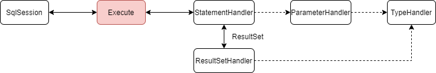

# 源码使用

-  git clone git@github.com:yxyyyt/mybatis-3.git
-  cd D:\repository\contribute\mybatis-3
-  git checkout -b mybatis-3.5.6.yxyyyt mybatis-3.5.6

   - 根据某一tag创建branch
-  git push -u origin mybatis-3.5.6.yxyyyt
   - 提交本地分支到远程


# 源码分析


## 核心组件

- SqlSession

  作为MyBatis工作的主要顶层API，表示和数据库交互的会话，完成必要数据库增删改查功能

- Executor

  MyBatis执行器，是MyBatis 调度的核心，负责SQL语句的生成和查询缓存的维护

- StatementHandler

  封装了JDBC Statement操作，负责对JDBC statement 的操作，如设置参数、将Statement结果集转换成List集合

- ParameterHandler

  负责对用户传递的参数转换成JDBC Statement 所需要的参数

- ResultSetHandler

  负责将JDBC返回的ResultSet结果集对象转换成List类型的集合

- TypeHandler

  负责java数据类型和jdbc数据类型之间的映射和转换

- MappedStatement

  维护了一条<select|update|delete|insert>节点的封装

- SqlSource

  负责根据用户传递的parameterObject，动态地生成SQL语句，将信息封装到BoundSql对象中，并返回

- BoundSql

  表示动态生成的SQL语句以及相应的参数信息

- Configuration

  MyBatis所有的配置信息都维持在Configuration对象之中


## 初始化Configuration

- 获取配置文件 `mybatis-config.xml` InputStreamReader
- 构建 SqlSessionFactory
  - <font color=red>委托 XMLConfigBuilder 解析配置文件（config和mapper），转换为配置类Configuration</font>
  - 创建 **DefaultSqlSessionFactory**，持有Configuration
- 构建 SqlSession
  - 通过 DefaultSqlSessionFactory.openSession 获取 **DefaultSqlSession**
    - SqlSession -> Executor -> Transaction -> DataSource


## 数据源和连接池

- 初始化，由DataSourceFactory创建DataSource，有三种类型：JNDI、POOLED、UNPOOLED
- 使用
  - 在执行SQL时，通过DataSource延迟创建Connection
    - PooledDataSource，池化数据库连接
    - UnpooledDataSource，获取数据库连接


## 事务管理

获取连接流程

- SqlSession -> Executor（缓存） -> Transaction -> DataSource -> connection
- <font color=red>一次SqlSession的开启意味者一个connection的占用</font>

事务类别

- JdbcTransaction 事务由Connection负责
- ManagedTransaction 事务由容器负责


## 执行查询

- 委托 SqlSession.getMapper 获取 Mapper 代理实现
  - Configuration.getMapper > MapperRegistry.getMapper 获取Mapper动态代理（jdk动态代理），持有SqlSession
- 调用Mapper代理方法
  - 调用MapperProxy.invoke（InvocationHandler）-> MapperMethod.execute
    - MapperMethod持有SqlCommand（通过方法在Mapper配置中找到对应项，DML配置）和MethodSignature（包装了方法返回类型）
  - 根据Mapper配置调用SqlSession 的不同方法（增/删/改/查）
    - 委托<font color=red>Execute</font>执行
      - 创建BoundSql
      - 创建CacheKey
      - 执行查询
        - 从缓存查询
        - 从数据库查询 queryFromDatabase
        - 查询结果置入缓存
          - parameter 入参
          - type 出参
          - resultset 集合转换




## 缓存

### 一级缓存（本地缓存）

- 在SqlSession中控制，每一个SqlSession都会创建一个Executor，缓存在Executor上维护
- 缓存失效，<font color=red>PerpetualCache内部维护一个HashMap</font>
- 生命周期
  - SqlSession.close，缓存销毁
  - SqlSession.clearLocalCache，清空所有缓存
  - SqlSession.insert/delete/update，清空所有缓存
- cacheKey的生成规则
  - statementId + rowBounds（非物理分页） + 传递给JDBC的SQL + 传递给JDBC的参数值
- **使用注意**
  - 没有对缓存容量做限制，注意OOM，SqlSession的生命周期不应过长
  - 没有维护缓存的更新、淘汰、过期策略
    - 对于数据更新频率高的数据，要及时关闭SqlSession，否则生命越长，读到的数据就会越旧


### 二级缓存（全局缓存）

- Application级别的全局缓存，每一个Mapper维护一个Cache，维护在Configuration中，以Mapper的namespace作为Key

- 配置

  - `二级缓存的总开关：全局配置变量参数 cacheEnabled=true`
  - `该select语句所在的Mapper，配置了<cache> 或<cached-ref>节点，并且有效`
  - `该select语句的参数 useCache=true（默认是true，除非设置为false）`
  - 查询结果需要序列化

  ```xml
  <settings>
      <setting name="cacheEnabled" value="true"/>
  </settings>
  
  <mapper namespace="com.sciatta.mysql.mybatis.dao.UserMapper">
      <cache/>
  </mapper>
  
  <select id="getUserByIdNumber" resultMap="UserResultMap" parameterType="java.lang.String" useCache="true">
  </select>
  ```

- 查询顺序：二级缓存（CachingExecutor接管） -> 一级缓存 -> 数据库


## 插件

MyBatis 使用 **责任链模式** 和 **动态代理** 实现插件。

可以在 Executor（可以获取mapper参数）、StatementHandler（直接操作 SQL，但遇到复杂的动态 SQL 时，字符串拼接很容易搞崩语法）、ParameterHandler、ResultSetHandler 添加插件。

**编写步骤**：

1. 实现 `Interceptor`接口。
2. 使用 `@Intercepts`和 `@Signature`注解指定要拦截的类和方法签名。
3. 在配置文件中注册该插件。


# 核心问题

## SQL 注入

MyBatis 中的 `#{}` 使用了预编译，而 `${}` 是字符串替换， `#{}`能防注入。

-  `${}` 字符串拼接： 程序使用字符串格式化或简单替换的方式构建SQL。

  ```sql
  -- sql 注入，风险极大
  SELECT * FROM products WHERE id = '1'; DROP TABLE users; --'
  
  -- 错误用法
  String sql = "SELECT * FROM users WHERE name = '" + name + "'";
  stmt = conn.createStatement();
  ResultSet rs = stmt.executeQuery(sql);
  ```

  

-  `#{}` SQL 语句的模板（带有 `?`占位符）在**执行前已被数据库编译**（预编译语句（Prepared Statements）），用户输入的数据在后续**仅作为参数传入**，不会被当作 SQL 代码解析。

  ```sql
  // 正确做法（预编译）：
  String sql = "SELECT * FROM users WHERE name = ?";
  pstmt = conn.prepareStatement(sql);
  pstmt.setString(1, name); // 安全地设置参数
  ResultSet rs = pstmt.executeQuery();
  ```


- 使用 MyBatis 时，**优先使用 `#{}`**，明确知晓使用 `${}`的风险并严格控制（如用于动态表名时，仍需用白名单校验表名）。


## mybatis-plus

- 对原生 MyBatis 的扩展

  - 强大的 CRUD 操作，通用mapper和service接口

  - 条件构造器（LambdaQueryWrapper 类型安全），**替代动态 SQL 的编写**，支持链式调用，类型安全

  - 分页插件 PaginationInnerInterceptor

  - 代码生成器

  - 全局元数据自动填充

    ```java
    @Data
    public class User {
        @TableId(type = IdType.AUTO) // 主键策略
        private Long id;
        @TableField(fill = FieldFill.INSERT) // 插入时填充
        private Date createTime;
        @TableField(fill = FieldFill.INSERT_UPDATE) // 插入和更新时填充
        private Date updateTime;
        @TableLogic(value = "0", delval = "1")  // 0表示未删除，1表示已删除
        private Integer deleted;
    }
    ```

  - 逻辑删除

    @TableLogic和全局配置两者选其一即可，如果两者都有：**注解的优先级高于全局配置**

    ```yaml
    # 并非物理删除，而是通过一个字段标识状态（如 deleted=1）。MP 会自动在所有查询条件中加上 deleted=0的条件，在删除时改为更新该字段。
    mybatis-plus:
      global-config:
        db-config:
          logic-delete-field: deleted  # 全局逻辑删除字段
          logic-delete-value: 1        # 逻辑已删除值
          logic-not-delete-value: 0   # 逻辑未删除值
    ```

    

- 分页如何实现的

  - MyBatis-Plus  通过 `PaginationInnerInterceptor` （Executor 拦截器）拦截所有查询方法，在执行前按照方言动态改写 SQL
    - mybatis-plus-boot-starter
  - PageHelper 通过 拦截器（责任链模式 PageInterceptor（Executor 拦截器），安装方言改写 SQL）和 ThreadLocal（参数隐式传递）实现
    - mybatis-spring-boot-starter
    - pagehelper-spring-boot-starter


## MyBatis 与 Spring 整合

**Mapper 扫描机制**（如 `@MapperScan`）

启动Spring应用
     ↓
@SpringBootApplication → @MapperScan("com.example.mapper")
     ↓
Spring容器启动，处理@MapperScan
     ↓
**MapperScannerRegistrar.registerBeanDefinitions()**
     ↓
注册MapperScannerConfigurer到容器
     ↓
postProcessBeanDefinitionRegistry()被调用
     ↓
ClassPathMapperScanner扫描指定包
     ↓
找到**所有Mapper接口，创建BeanDefinition**
     ↓
修改BeanDefinition：beanClass=**MapperFactoryBean（FactoryBean -> getObject -> getSqlSession().getMapper(this.mapperInterface)）**
     ↓
Spring实例化MapperFactoryBean
     ↓
getObject() → **getSqlSession().getMapper()**
     ↓
MyBatis创建**JDK动态代理**
     ↓
Mapper代理对象注入到Service
     ↓
可以正常使用@Autowired注入Mapper
