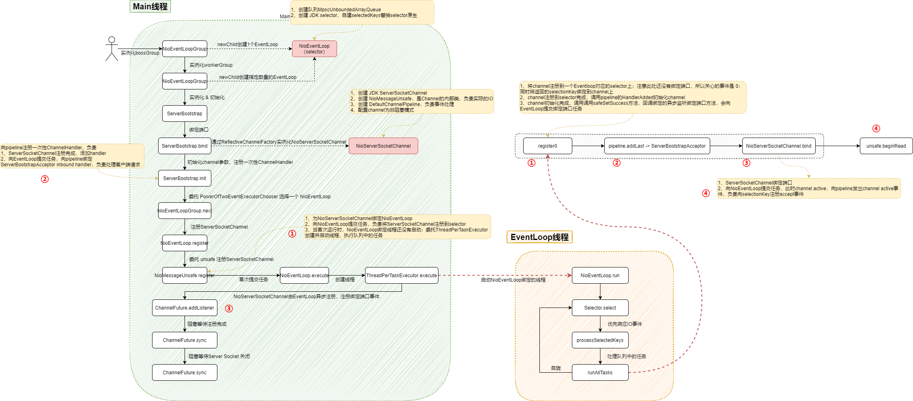

# 源码使用

- `git clone git@github.com:yxyyyt/netty.git`
- `cd netty`
- `git checkout -b netty-4.1.36.Final.yxyyyt netty-4.1.36.Final` 根据某一tag创建branch
- `git push -u origin netty-4.1.36.Final.yxyyyt` 提交本地分支到远程
- 个人项目引用开源源码netty
  - netty（个人项目）| open Module Settings | Dependencies
  - 找到依赖的netty的maven，双击 > + Sources 源码目录，同时删除引用的 sources.jar


# 核心功能

## 支持常用应用层协议


## 解决传输问题

TCP是流式协议，消息无边界

- 粘包
  - 发送方每次写入数据 < socket缓冲区大小
  - 接收方读取socket缓冲区数据不够及时

- 拆包
  - 发送方每次写入数据 > socket缓冲区大小
  - 发送的数据大于协议的MTU（maximum transmission unit 最大传输单元），必须拆包


解决问题的根本手段，找出消息的边界

- TCP连接改成短连接，一个请求一个短连接（效率低下；不推荐）

- 封装成帧

  - 固定长度（空间浪费；不推荐）

     FixedLengthFrameDecoder

  - 分隔符（内容本身出现分隔符需要转义，需要扫描内容；一般推荐）

     DelimiterBasedFrameDecoder

  - **固定长度字段存内容的长度信息**（解析固定长度的字段获取长度，然后读取后续内容；推荐）

     LengthFieldBasedFrameDecoder / LengthFieldPrepender

  - 其他方式（JSON，{} 是否成对）


二次编解码

- 一次解码器 ByteToMessageDecoder（解决半包、粘包）

  io.netty.buffer.ByteBuf -> io.netty.buffer.ByteBuf

- 二次解码器 MessageToMessageDecoder（解决可操作；时间、空间、可读性）

  io.netty.buffer.ByteBuf -> Java Object

  - Java序列化（占用空间大，限制语言）

  - XML

  - JSON

  - MessagePack

  - Protobuf（性能高，可读性差）

    - 编写 person.proto

    - 编译 protoc.exe --java_out=. person.proto

    - 使用

      ```java
      PersonOuterClass.Person.Builder builder = PersonOuterClass.Person.newBuilder();
      builder.setId(1);
      PersonOuterClass.Person person = builder.build();
      
      // 序列化
      byte[] bytes = person.toByteArray();
      // 反序列化
      PersonOuterClass.Person personFromBytes = PersonOuterClass.Person.parseFrom(bytes);
      ```

      

## 支持流量整形


## 完善的断连、Idle等异常处理

### Keepalive 

TCP Keepalive 核心参数

- net.ipv4.tcp_keepalive_time=7200

  7200秒没有响应时，发送探测包

- net.ipv4.tcp_keepalive_intvl=75

  探测包的间隔时间是75秒

- net.ipv4.tcp_keepalive_probes=9

  共9个探测包

7200+75*9=2小时11分


应用层 Keepalive 

- 协议分层，各层关注点不同
- TCP Keepalive 默认关闭，且经过路由等中转设备Keepalive包可能会丢包
- TCP Keepalive 时间太长


### Idle监测

只负责诊断，诊断后做出不同的行为，决定Idle监测的最终用途

- 配合Keepalive，减少Keepalive 消息
  - 正常消息传输，不发送Keepalive消息
  - 无数据传输超过一定时间（Idle监测），当判断为Idle时，才发送Keepalive
- 直接关闭连接
  - 快速释放损害的、恶意的、很久不用的连接，让系统时刻保持最好状态


## 规避 JDK NIO bug

- 经典的epoll bug：异常唤醒空转导致CPU100%
- IP_TOS参数（IP包的优先级和QoS选项）使用时抛出异常


## API更友好

- ByteBuffer -> Netty ByteBuffer
- ThreadLocal -> Netty FastThreadLocal


## 隔离变化，屏蔽细节

- 隔离 JDK NIO 实现细节 NIO -> NIO2（aio）
- 屏蔽 JDK NIO 实现细节


## 零拷贝

零拷贝并不是“不拷贝”；只是减少用户态（应用内存）和内核态（系统缓存）的切换，由硬件直接参与DMA（Direct Memory Access，直接内存存取）拷贝，避免CPU参与。操作系统的角度来看，零拷贝是一个广义的概念，可以认为只要能够减少不必要的 CPU 拷贝，都可以理解为是零拷贝。

- 堆外内存，避免 JVM 堆内存到堆外内存的数据拷贝。
  - 操作系统不感知JVM内存，内存分配不一样
  - 堆内存对象地址不稳定
- CompositeByteBuf 类，可以组合多个 Buffer 对象合并成一个逻辑上的对象，避免通过传统内存拷贝的方式将几个 Buffer 合并成一个大的 Buffer。
- 通过 Unpooled.wrappedBuffer 可以将 byte 数组包装成 ByteBuf 对象，包装过程中不会产生内存拷贝。
- ByteBuf.slice 操作与 Unpooled.wrappedBuffer 相反，slice 操作可以将一个 ByteBuf 对象切分成多个 ByteBuf 对象，切分过程中不会产生内存拷贝，底层共享一个 byte 数组的存储空间。
- Netty 使用 FileRegion 实现文件传输，FileRegion 底层封装了 FileChannel#transferTo() 方法，可以将文件缓冲区的数据直接传输到目标 Channel，避免内核缓冲区和用户态缓冲区之间的数据拷贝，这属于操作系统级别的零拷贝。


# 组件拆解

## NioEventLoopGroup

- 线程池抽象
- 参数
  - `nThreads` 如果线程数为0时默认为cpu核数*2
    - 创建指定线程数量的EventExecutor，即NioEventLoop
    - 处理Accept事件的bossGroup只有一个NioEventLoop线程
    - 处理Read事件的workerGroup有16个NioEventLoop线程
  - `executor` ThreadPerTaskExecutor的实现类
    - 特殊线程池，**一个任务创建一个线性**，即调用一次创建一个线程，<font color=red>给NioEventLoop使用</font>，用于创建线程然后绑定到NioEventLoop上
    - DefaultThreadFactory负责创建线程，线程命名规则是，以nioEventLoopGroup-x-为前缀
  - `chooserFactory` DefaultEventExecutorChooserFactory
    - 判断是否是2的幂，提供优化后的EventExecutorChooser，可以从NioEventLoop池中选择一个
  - `selectorProvider` SelectorProvider.provider() 按需加载 SelectorProvider
  - `selectStrategyFactory` DefaultSelectStrategyFactory
    - <font color=red>给NioEventLoop使用</font>
  - `RejectedExecutionHandler` RejectedExecutionHandler，默认抛出RejectedExecutionException


## NioEventLoop

- 线程抽象
- 每一个NioEventLoop只会绑定到一个线程上，所以单一NioEventLoop可以看作是单线程串行执行，不存在并发问题
- 每一个Channel只能绑定到一个NioEventLoop上，而一个NioEventLoop可以绑定多个Channel
- parent是NioEventLoopGroup
- <font color=red>包含 jdk selector</font>
  - **每一个NioEventLoop包含一个selector**，在构造NioEventLoop的时候就已经创建了selector
  - selector包含selectionKeys集合
- 任务运行逻辑
  - 获取任务
    - 若有任务，select一次不阻塞（看看有没有IO需要处理）
    - 若没有任务，select阻塞等待iO，等待的时间要求不高于延时队列第一个任务的延时执行时间，若没有延时队列任务，则延时1秒

  - 处理任务（默认IO和内部任务运行时间比为1:1）
    - 优先处理IO任务
    - 处理系统内部异步任务
      - 把到期的延迟任务聚集到任务队列
      - 批量运行64个任务，判断一次到期时间；若到期，退出执行，提高吞吐量

- <font color=red>优化</font>
  - 对Selector原生的selectedKeys数据结构替换，原来是基于HashSet（基于HashMap逻辑复杂，且key会有冲突），替换为数组实现，add时向后追加，支持扩容，时间复杂度时O(1)
  - Selector空轮询，异常唤醒空转导致CPU100%；在Selector超时时间内到达空轮询阈值（512）后，重建Selector


## NioServerSocketChannel

- ServerBootstrap 委托 ReflectiveChannelFactory（构造时传入 NioServerSocketChannel ） 创建 Channel
  - 构造时，创建 <font color=red>jdk原生ServerSocketChannel</font>
  - 构造时，创建 **NioMessageUnsafe**，所有的真正IO交互都委托给Unsafe完成
  - 构造时，创建 ChannelPipeline，所有的事件（**IO事件和内部操作**）都在ChannelPipeline中执行


## NioSocketChannel

- 在NioServerSocketChannel所在的NioEventLoop收到一个客户端Accept请求后调用NioServerSocketChannel的unsafe创建NioSocketChannel
  - 获取 <font color=red>jdk原生SocketChannel</font>
  - 创建 **NioSocketChannelUnsafe**，其父类是NioByteUnsafe
  - 创建 ChannelPipeline
- 然后向pipeline发出ChannelRead事件，触发 ServerBootstrapAcceptor 的 channelRead方法，初始化NioSocketChannel，并选择NioEventLoop向其绑定的Selector注册


## ChannelPipeline

ChannelPipeline实现了**责任链**模式，底层数据结构是双向链表，每一个节点是ChannelHandlerContext。ChannelHandlerContext持有ChannelHandler。

<font color=red>ChannelHandlerContext和ChannelPipeline都实现了ChannelInboundInvoker和ChannelOutboundInvoker，区别是ChannelHandlerContext会从当前节点调用，而ChannelPipeline（Channel会调用ChannelPipeline，即也是调用整个责任链）会调用整个责任链。</font>


- ChannelPipeline

  - 默认实现类是DefaultChannelPipeline，同具体的Channel绑定，有状态，线程安全。**无锁串行化执行，需要注意ChannelHandler不要阻塞，否则，可能会导致任务积压**（可以内部维护任务线程池，不阻塞EventLoop）。
  - 入站IO**事件**，从Head向Tail方向传播
  - 出站**操作**，从Tail向Head方向传播
  - <font color=red>事件调用顺序</font>，ChannelPipeline(fire) -> [ ChannelHandlerContext(invoke, private) -> ChannelHandler -> ChannelHandlerContext(fire, find next) ]
  - <font color=red>异常处理顺序</font>，会沿着pipeline一直向后传播，直到Tail节点，不会区分inbound，还是outbound。所以，可以在pipeline最后添加一个inbound，用于处理异常的全局处理器

- ChannelHandler

  - 无状态，可以提供给不同的Channel使用；不易添加过多的ChannelHandler，注意业务分层
  - <font color=red>ChannelInitializer</font>是一个特殊的ChannelInboundHandlerAdapter，**用于在pipeline中装配自定义的ChannelHandler**，且只可以使用一次，调用完成后，自动从pipeline中移除
    - **调用时机是在Channel向Selector注册成功后，回调Channel注册成功函数前**，触发 `pipeline.invokeHandlerAddedIfNeeded()`
  - ChannelInboundHandler处理入站IO**事件**
  - ChannelOutboundHandler处理出站**操作**
  - <font color=red>Inbound调用的顺序和添加的顺序相同；Outbound调用的顺序和添加的顺序相反</font>

  

- ChannelHandlerContext
  - 责任链上的节点，作为上下文衔接ChannelPipeline和ChannelHandler；包含Channel、EventLoop、ChannelHandler、ChannelPipeline
  - 在向pipeline添加ChannelHandler时，会创建一个ChannelHandlerContext，并持有这个ChannelHandler
  - 系统创建两个哨兵节点
    - HeadContext（inbound / outbound）HeadContext作为outbound的最后一个节点用于实际的IO操作
    - TailContext（inbound）TailContext作为inbound的最后一个节点兜底，打印提升


## ByteBuf

### 特性

- 容量可以按需动态扩展；
- 读写采用了不同的指针，读写模式可以随意切换，不需要调用 flip 方法；
- 通过内置的复合缓冲类型可以实现零拷贝；
- 支持引用计数；
  - 当新创建一个 ByteBuf 对象时，它的初始引用计数为 1，当 ByteBuf 调用 release() 后，引用计数减 1；此时内存并没有释放，被放入到对象池中，避免每次使用 ByteBuf 都重复创建
  - 当ByteBuf不可达，且引入计数大于0，则检测到内存泄漏。会记录 LEAK 关键字日志
- 支持缓存池。

### 分类

- Heap/Direct 就是堆内和堆外内存。Heap 指的是在 JVM 堆内分配，底层依赖的是字节数据；Direct 则是堆外内存，不受 JVM 限制，分配方式依赖 JDK 底层的 ByteBuffer。

- Pooled/Unpooled 表示池化还是非池化内存。Pooled 是从预先分配好的内存中取出，使用完可以放回 ByteBuf 内存池，等待下一次分配。而 Unpooled 是直接调用系统 API 去申请内存，确保能够被 JVM GC 管理回收。

- Unsafe/非 Unsafe 的区别在于操作方式是否安全。Unsafe 表示每次调用 JDK 的 Unsafe 对象操作物理内存，依赖 offset + index 的方式操作数据。非 Unsafe 则不需要依赖 JDK 的 Unsafe 对象，直接通过数组下标的方式操作数据。

### API

```json
|<---- 已读 ---->|<---- 可读 ---->|<----可写 ---->|<----可扩容 ---->| 

            readerIndex     writerIndex

|<----   		Capacity				   ---->|
|<----   		MaxCapacity				                    ---->|
```

- write 系列方法会改变 writerIndex 位置，当 writerIndex 等于 capacity 的时候，Buffer 置为不可写状态；
- 向不可写 Buffer 写入数据时，Buffer 会尝试扩容，但是扩容后 capacity 最大不能超过 maxCapacity，如果写入的数据超过 maxCapacity，程序会直接抛出异常；
- read 系列方法会改变 readerIndex 位置；
- get/set 系列方法不会改变 readerIndex/writerIndex 位置，也不会在意 readerIndex/writerIndex 所处的位置。

### 内存管理

**内存规格**

- Tiny 代表 0 ~ 512B 之间的内存块
  - ==16B、32B、48B ...... 496B subpage（32个规格，每个规格512个缓存；PoolThreadCache / Arena）==
- Samll 代表 512B ~ 8K 之间的内存块
  - ==512B、1024B、2048B、4096B subpage（4个规格，每个规格256个缓存；PoolThreadCache / Arena）==
- Normal 代表 8K ~ 16M 的内存块
  - ==8K、16K、32K（3个规格，每个规格64个缓存；PoolThreadCache ）==
- Huge 代表大于 16M 的内存块
  - Netty 会直接使用非池化的方式进行内存分配

==16M Chunk==

==8K Page==（逻辑页）

==0~8K SubPage==

**内存分配单位**

- <font color=red>Chunk 是 Netty 向操作系统申请内存的单位</font>，所有的内存分配操作也是基于 Chunk 完成的，**Chunk 可以理解为 Page 的集合**，**每个 Chunk 默认大小为 16M**。

- Page 是 Chunk 用于管理内存的单位，Netty 中的 Page 的大小为 8K，不要与 Linux 中的内存页 Page 相混淆了。假如我们需要分配 64K 的内存，需要在 Chunk 中选取 8 个 Page 进行分配。

- Subpage 负责 Page 内的内存分配，假如我们分配的内存大小远小于 Page，直接分配一个 Page 会造成严重的内存浪费，所以需要将 Page 划分为多个相同的子块进行分配，这里的子块就相当于 Subpage。按照 Tiny 和 Small 两种内存规格，SubPage 的大小也会分为两种情况。在 Tiny 场景下，最小的划分单位为 16B，按 16B 依次递增，16B、32B、48B ...... 496B；在 Small 场景下，总共可以划分为 512B、1024B、2048B、4096B 四种情况。Subpage 没有固定的大小，需要根据用户分配的缓冲区大小决定，例如分配 1K 的内存时，Netty 会把一个 Page 等分为 8 个 1K 的 Subpage。

**内存池架构**

- ==PoolArena==

  Netty 借鉴了 jemalloc 中 Arena 的设计思想，采用固定数量的多个 Arena 进行内存分配，Arena 的默认数量与 CPU 核数有关，**通过创建多个 Arena 来缓解资源竞争问题**，从而提高内存分配效率。线程在首次申请分配内存时，会通过 round-robin 的方式轮询 Arena 数组，选择一个固定的 Arena（线程占用最少），在线程的生命周期内只与该 Arena 打交道，所以每个线程都保存了 Arena 信息，从而提高访问效率。

  **PoolArena** 的数据结构包含两个 PoolSubpage 数组和六个 PoolChunkList，两个 PoolSubpage 数组分别存放 Tiny 和 Small 类型的内存块，六个 PoolChunkList 分别存储不同利用率的 Chunk，构成一个双向循环链表。PoolArena 对应实现了 Subpage 和 Chunk 中的内存分配，其 中 PoolSubpage 用于分配小于 8K 的内存，PoolChunkList 用于分配大于 8K 的内存。

  **PoolSubpage** 也是按照 Tiny 和 Small 两种内存规格，设计了tinySubpagePools 和 smallSubpagePools 两个数组，在 Tiny 场景下，内存单位最小为 16B，按 16B 依次递增，共 32 种情况，Small 场景下共分为 512B、1024B、2048B、4096B 四种情况，分别对应两个数组的长度大小，每种粒度的内存单位都由一个 PoolSubpage 进行管理。

  **PoolChunkList** 用于 Chunk 场景下的内存分配，PoolArena 中初始化了六个 PoolChunkList，分别为 qInit、q000、q025、q050、q075、q100，分别代表不同的内存使用率。随着 Chunk 内存使用率的变化，Netty 会重新检查内存的使用率并放入对应的 PoolChunkList，所以 PoolChunk 会在不同的 PoolChunkList 移动。

  - qInit，内存使用率为 0 ~ 25% 的 Chunk。

    qInit 用于存储初始分配的 PoolChunk，因为在第一次内存分配时，PoolChunkList 中并没有可用的 PoolChunk，所以需要新创建一个 PoolChunk 并添加到 qInit 列表中。qInit 中的 PoolChunk 即使内存被完全释放也不会被回收，避免 PoolChunk 的重复初始化工作。

  - q000，内存使用率为 1 ~ 50% 的 Chunk。

    q000 则用于存放内存使用率为 1 ~ 50% 的 PoolChunk，q000 中的 PoolChunk 内存被完全释放后，PoolChunk 从链表中移除，对应分配的内存也会被回收。

  - q025，内存使用率为 25% ~ 75% 的 Chunk。

  - q050，内存使用率为 50% ~ 100% 的 Chunk。

    在分配大于 8K 的内存时，其链表的访问顺序是 q050->q025->q000->qInit->q075，遍历检查 PoolChunkList 中是否有 PoolChunk 可以用于内存分配

  - q075，内存使用率为 75% ~ 100% 的 Chunk。

  - q100，内存使用率为 100% 的 Chunk。

- ==PoolChunkList==

  每个 PoolChunkList 都有内存使用率的上下限：minUsage 和 maxUsage，当 PoolChunk 进行内存分配后，如果使用率超过 maxUsage，那么 PoolChunk 会从当前 PoolChunkList 移除，并移动到下一个 PoolChunkList。同理，PoolChunk 中的内存发生释放后，如果使用率小于 minUsage，那么 PoolChunk 会从当前 PoolChunkList 移除，并移动到前一个 PoolChunkList。

- ==PoolChunk==

  Netty 内存的分配和回收都是基于 PoolChunk 完成的，PoolChunk 是真正存储内存数据的地方，每个 PoolChunk 的默认大小为 16M。

  PoolChunk 可以理解为 Page 的集合，Page 只是一种抽象的概念，实际在 Netty 中 Page 所指的是 PoolChunk 所管理的子内存块，每个子内存块采用 PoolSubpage 表示。Netty 会使用**伙伴算法**将 PoolChunk 分配成 2048 个 Page（**最后一层有2048 个 Page，树高是11，0~11，每一个page是8K**），最终形成一颗满二叉树，二叉树中所有子节点的内存都属于其父节点管理。

- ==PoolSubpage==

  在小内存分配的场景下，即分配的内存大小小于一个 Page 8K，会使用 PoolSubpage 进行管理。

- ==PoolThreadCache==

  本地线程缓存。当内存释放时，Netty 并没有将缓存归还给 PoolChunk，而是使用 PoolThreadCache 缓存起来，当下次有同样规格的内存分配时，直接从 PoolThreadCache 取出使用即可。PoolThreadCache 缓存 Tiny、Small、Normal 三种类型的数据，而且根据堆内和堆外内存的类型进行了区分。

- ==MemoryRegionCache==

  MemoryRegionCache 实际就是一个队列，当内存释放时，将内存块加入队列当中，下次再分配同样规格的内存时，直接从队列中取出空闲的内存块。


### 内存分配

Netty 中负责线程分配的组件有两个：**PoolArena**和**PoolThreadCache**。PoolArena 是多个线程共享的，每个线程会固定绑定一个 PoolArena，PoolThreadCache 是每个线程私有的缓存空间。

PoolArena 中管理的内存单位为 PoolChunk，每个 PoolChunk 会被划分为 2048 个 8K 的 Page。在申请的内存大于 8K 时，PoolChunk 会以 Page 为单位进行内存分配。当申请的内存大小小于 8K 时，会由 PoolSubpage 管理更小粒度的内存分配。

PoolArena 分配的内存被释放后，不会立即会还给 PoolChunk，而且会缓存在本地私有缓存 PoolThreadCache 中，在下一次进行内存分配时，会优先从 PoolThreadCache 中查找匹配的内存块。

- 分配内存大于 8K 时，PoolChunk 中采用的 Page 级别的内存分配策略。

  满二叉树查找

- 分配内存小于 8K 时，由 PoolSubpage 负责管理的内存分配策略。

  - tinySubpagePools / smallSubpagePools
  - 把Page按请求容量等分为若干份，然后链接到 tinySubpagePools / smallSubpagePools 用于下一次相同容量规格的快速分配

- 当申请的内存大小小于Chunk 的 16M时，优先从PoolThreadCache分配，获取不到才去PoolChunk 上获取；否则，大于 Chunk 的 16M，则不会经过 PoolThreadCache，直接进行分配。


### 内存回收

- Netty 记录了 allocate() 的执行次数，默认每执行 8192 次，就会触发 PoolThreadCache 调用一次 trim() 进行内存整理，会对 PoolThreadCache 中维护的六个 MemoryRegionCache 数组分别进行整理。
- 线程销毁时 PoolThreadCache 会依次释放所有 MemoryRegionCache 中的内存数据。


## Recycler

- **对象池**有两个重要的组成部分：Stack 和 WeakOrderQueue。
- 从 Recycler 获取对象时，优先从 Stack 中查找，如果 Stack 没有可用对象，会尝试从 WeakOrderQueue（每一个帮助线程对应一个WeakOrderQueue，堆栈和队列的设计，避免多线程冲突） 迁移部分对象到 Stack 中；如果还没有，则创建一个对象
- Recycler 回收对象时，分为同线程对象回收和异线程对象回收两种情况，同线程回收直接向 Stack 中添加对象，异线程回收向 WeakOrderQueue 中的 Link 添加对象。
- 对象回收都会控制回收速率，每回收 8 个对象会丢弃8个。


# 运行原理

## 启动服务




## 构建连接


## 接收数据

**数据传播流程**

1. EventLoop 收到客户端的read事件
2. 调用 NioSocketChannel.unsafe.read()，读取byteBuf数据
   - 触发 **pipeline.fireChannelRead(byteBuf)** ，从head（入站）开始向后传播 channelRead 事件，直到可以处理byteBuf的处理器（可以是自定义的InboundHandler）
     - 自定义的InboundHandler处理数据完毕后调用 ctx.write(msg)（不flush），从当前context（出站）开始向前传播 write 事件，直到head
       - 调用unsafe.write，把输出数据byteBuf缓存到ChannelOutboundBuffer
   - 一次连续读完成后，触发 **pipeline.fireChannelReadComplete()**，从head（入站）开始向后传播 channelReadComplete 事件，直到可以处理的自定义的InboundHandler
     - 自定义的InboundHandler调用ctx.writeAndFlush（需要flush），从当前context（出站）开始向前传播 writeAndFlush事件，直到head
       - 调用unsafe.write，向ChannelOutboundBuffer输出一个EMPTY_BUFFER
       - 调用unsafe.flush()，实际输出数据到channel
     - <font color=red>head再判断开启了自动读后（默认开启），调用 channel.read()，从tail（出站）开始向前传播 read 事件</font>，直到head
       - 调用unsafe.beginRead()，可以重新给selectionKey注册读事件


**读数据技巧**

- 自适应数据大小分配器 AdaptiveRecvByteBufAllocator
  - 每一次连续读完成后。对ByteBuffer的猜测，放大果断，缩小谨慎（需要连续2次判断）
- 连续读 defaultMaxMessagesPerRead
  - 连续读是由本次是否“满载而归”决定（默认首次读1024字节）
  - 最多连续读16次
- 读事件
  - pipeline.fireChannelRead(byteBuf) 一次读数据
  - pipeline.fireChannelReadComplete() 一次读事件处理完成 ，一次读事件处理可能会包含多次读数据操作


## 业务处理

- pipeline.fireChannelRead(byteBuf) 一次读数据，处理由 ChannelInboundHandler负责。处理业务的本质是数据在pipeline中所有handler的ChannelRead方法中的执行过程
- 默认处理线程是Channel绑定的NioEventLoop线程，也可以设置其他的线程池EventExecutorGroup。pipeline.addLast(new UnorderedThreadPoolEventExecutor(10), serverHandler)


## 发送数据

写数据的三种方式

- write 写到一个buffer（ChannelOutboundBuffer）
- flush 把buffer的数据发送出去
- writeAndFlush 写到buffer，立即发送

写数据要点

- Netty写数据写不进去的时候（对方爆仓），会停止写，然后注册一个OP_WRITE事件，来通知什么时候可以写。**OP_WRITE不是指有数据可以写，而是说可以写进去了**。
- Netty批量写数据，如果都写进去了，接下来尝试写更多（调整 maxBytesPerGatheringWrite）
- Netty只要有数据要写且能写出，则一直尝试；直到写不出去，或满16次（writeSpinCount）；**写16次没有写完，则直接schedule一个task来继续写，而不是注册写事件触发**。
- Netty待写数据太多，超过一定水位线（writeBufferWaterMark.high()），会将可写的标志位改为false，由应用端决定要不要再发送数据


## 断开连接

本质

- channel close
- selectionKey cancel

要点

- 关闭连接，会触发OP_READ事件，读取字节数是-1，表示关闭

- 数据读取进行时，强行关闭，触发IOException，进而执行关闭

- Channel的关闭包含了SelectionKey的cancel


## 关闭服务

本质

- channel close
- selectionKey cancel
- selector close
- EventLoop close

要点

- 优雅 DEFAULT_SHUTDOWN_QUIET_PERIOD
- 可控 DEFAULT_SHUTDOWN_TIMEOUT
- 先不接收任务，然后尽量干完现有任务；先关BossGroup，再关WorkerGroup，但不是100%保证


# 优化

## I/O 模型

- EventLoop不要设置过大，只要满足业务即可，避免不必要的上下文切换
- ioRatio 默认50，当IO并发高的时候，调大参数，可以控制有更多的时间处理IO请求上
- 不要阻塞 EventLoop。在 ChannelHandler 处理器中自定义新的业务线程池，将耗时的操作提交到业务线程池中执行
- @Sharable 注解用于修饰 ChannelHandler，标识该 ChannelHandler 全局只有一个实例，而且会被多个 ChannelPipeline 共享。所以我们必须要注意的是，@Sharable 修饰的 ChannelHandler 必须都是**无状态**的，这样才能保证线程安全
- 设置高低水位线。高低水位线 WRITE_BUFFER_HIGH_WATER_MARK 和 WRITE_BUFFER_LOW_WATER_MARK 是两个非常重要的流控参数。Netty 默认的高低水位线配置是 32K ~ 64K。当缓存超过了高水位，Channel 会被设置为不可写状态，调用 isWritable() 方法会返回 false。建议在 Channel 写数据之前，使用 isWritable() 方法来判断缓存水位情况，防止因为接收方处理较慢造成 OOM。


## 系统参数配置

- TCP_NODELAY，是否开启 Nagle 算法。当时效要求高的时候，关闭此参数降低延迟

  MTU: Maxitum Transmission Unit 最大传输单元 1500Byte

  MSS: Maxitum Segment Size 最大分段大小 1460Byte，其中TCP头20Byte，IP头20Byte

  如果网络上按字节发送，都要带40Byte头，传输不经济划算，其次会带来网络拥堵。

  优化条件

  - 启用Nagle算法（默认），关闭TCP_NODELAY，缓冲区满或达到超时才发送数据包，减少网络传输数据包，适用于并发高、数据量大的场景
  - 禁用Nagle算法，启动TCP_NODELAY。适用于对延迟敏感、数据量小的场景，如SSH会话

- SO_BACKLOG，已完成三次握手的请求队列最大长度。适当调大

- SO_SNDBUF/SO_RCVBUF，TCP 发送缓冲区和接收缓冲区的大小。为了能够达到最大的网络吞吐量，SO_SNDBUF 不应当小于带宽和时延的乘积。SO_RCVBUF 一直会保存数据到应用进程读取为止，如果 SO_RCVBUF 满了，接收端会通知对端 TCP 协议中的窗口关闭，保证 SO_RCVBUF 不会溢出。

  SO_SNDBUF/SO_RCVBUF 大小的设置建议参考消息的平均大小，不要按照最大消息来进行设置，这样会造成额外的内存浪费。

- SO_KEEPALIVE，连接保活。启用了 TCP SO_KEEPALIVE 属性，TCP 会主动探测连接状态，Linux 默认设置了 2 小时的心跳频率。TCP KEEPALIVE 机制主要用于回收死亡时间交长的连接，不适合实时性高的场景。

- `/proc/sys/net/ipv4/tcp_fin_timeout`, `TcpTimedWaitDelay` 缩短TIME_WAIT等待时间

-  Linux 操作系统最大文件句柄数

  局部文件句柄数 `vi /etc/security/limits.conf`

  ```shell
  * soft nofile 1000000
  * hard nofile 1000000
  
  # sysctl -p 命令使配置生效
  # ulimit -a 命令查看参数是否生效	
  ```

  全局文件句柄数 `vi /etc/sysctl.conf`

  ```shell
  fs.file-max=1000000
  
  # sysctl -p 命令使配置生效
  # cat /proc/sys/fs/file-max
  ```

  

## 序列化方式

- 序列化算法
  - Kryo 序列化后占用字节数较少，网络传输效率更高，但是不支持跨语言。
  - Hessian 是目前业界使用较为广泛的序列化协议，它的兼容性好，支持跨语言，API 方便使用，序列化后的字节数适中。
  - Protobuf 是 gRPC 框架默认使用的序列化协议，属于 Google 出品的序列化框架。Protobuf 支持跨语言、跨平台，具有较好的扩展性，并且性能优于 Hessian。但是 Protobuf 使用时需要编写特定的 prpto 文件，然后进行静态编译成不同语言的程序后拷贝到项目工程中，一定程序增加了开发者的复杂度。
- 减少不必要的字段以及精简字段的长度，从而降低序列化后占用的字节数。
- 提供不同的序列化策略。可以将不同的字段拆分至不同的线程里进行反序列化，例如 Netty I/O 线程可以只负责 className 和 消息头 Header 的反序列化，然后根据 Header 分发到不同的业务线程池中，由业务线程负责反序列化消息内容 Content，这样可以有效地降低 I/O 线程的压力。


## 内存管理

- CompositeByteBuf 零拷贝
- ByteBuf.copy 深拷贝；ByteBuf.duplicate().retain() 浅拷贝
- 内存池。ByteBuf 可以分为堆内存 HeapByteBuf 和堆外内存 DirectByteBuf。DirectByteBuf 相比于 HeapByteBuf，虽然分配和回收的效率较慢，但是在 Socket 读写时可以少一次内存拷贝，性能更佳。为了减少堆外内存的频繁创建和销毁，Netty 提供了池化类型的 PooledDirectByteBuf。
- 对象池。对象池与内存池的都是为了提高 Netty 的并发处理能力，通常在项目开发中我们会将一些通用的对象缓存起来，当需要该对象时，优先从对象池中获取对象实例。通过重用对象，不仅避免频繁地创建和销毁所带来的性能损耗，而且对 JVM GC 是友好的。


## GC 参数优化

- 堆内存：-Xms 和 -Xmx 参数，-Xmx 用于控制 JVM Heap 的最大值，必须设置其大小，合理调整 -Xmx 有助于降低 GC 开销，提升系统吞吐量。-Xms 表示 JVM Heap 的初始值，对于生产环境的服务端来说 -Xms 和 -Xmx 最好设置为相同值。

- 堆外内存：DirectByteBuffer 最容易造成 OOM 的情况，DirectByteBuffer 对象的回收需要依赖 Old GC 或者 Full GC 才能触发清理。如果长时间没有 Old GC 或者 Full GC 执行，那么堆外内存即使不再使用，也会一直在占用内存不释放。最好通过 JVM 参数 -XX:MaxDirectMemorySize 指定堆外内存的上限大小，当堆外内存的大小超过该阈值时，就会触发一次 Full GC 进行清理回收，如果在 Full GC 之后还是无法满足堆外内存的分配，那么程序将会抛出 OOM 异常。
- 年轻代：-Xmn 调整新生代大小，-XX:SurvivorRatio 设置 SurvivorRatio 和 eden 区比例。我们经常遇到 YGC 频繁的情况，应该清楚程序中对象的基本分布情况，如果存在大量朝生夕灭的对象，应适当调大新生代；反之应适当调大老年代。例如在类似百万长连接、推送服务等延迟敏感的场景中，老年代的内存增长缓慢，优化年轻代的空间大小以及各区的比例可以带来更大的收益。


## 堆外内存泄漏排查

- jmap -histo:live `<pid>` 手动触发 FullGC, 观察堆外内存是否被回收，如果正常回收很可能是因为堆外设置太小，可以通过 -XX:MaxDirectMemorySize 调整。

- 堆外内存代码监控

  ```java
  BufferPoolMXBean directBufferPoolMXBean = ManagementFactory.getPlatformMXBeans(BufferPoolMXBean.class).get(0);
  
  LOGGER.info("DirectBuffer count: {}, MemoryUsed: {} K", directBufferPoolMXBean.getCount(), directBufferPoolMXBean.getMemoryUsed()/1024);
  ```

- 自带工具

  Netty 会检测 ByteBuf 是否已经不可达且引用计数大于 0，判定内存泄漏的位置并输出到日志中，需要关注日志中 LEAK 关键字。

  - disabled，关闭堆外内存泄漏检测；
  - simple，以 1% 的采样率进行堆外内存泄漏检测，消耗资源较少，属于默认的检测级别；
  - advanced，以 1% 的采样率进行堆外内存泄漏检测，并提供详细的内存泄漏报告；
  - paranoid，追踪全部堆外内存的使用情况，并提供详细的内存泄漏报告，属于最高的检测级别，性能开销较大，常用于本地调试排查问题。

  ```shell
  -Dio.netty.leakDetection.level=paranoid
  ```

- MemoryAnalyzer 内存分析

- Btrace 

  ```java
  @BTrace
  
  public class TraceDirectAlloc {
  
      @OnMethod(clazz = "java.nio.Bits", method = "reserveMemory")
  
      public static void printThreadStack() {
  
          jstack();
  
      }
  
  }
  ```

  

## 流控

流量整形（Traffic Shaping）是一种主动控制服务流量输出速率的措施，保证下游服务能够平稳处理。流量整形和流控的区别在于，流量整形不会丢弃和拒绝消息，无论流量洪峰有多大，它都会采用令牌桶算法控制流量以恒定的速率输出。

流量整形并不能保证系统处于安全状态，当流量洪峰过大，数据会一直积压在内存中，所以流量整形和流控应该结合使用才能保证系统的高可用。

- GlobalTrafficShapingHandler = ChannelTrafficShapingHandler + GlobalChannelTrafficShapingHandler


## 连接空闲检测+心跳检测

- IdleStateHandler 

