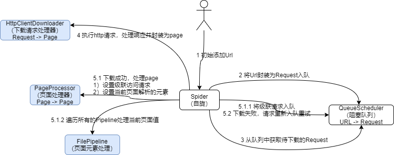

# 源码使用

- `git clone git@github.com:yxyyyt/webmagic.git`
- `cd webmagic`
- `git checkout -b WebMagic-0.8.0.yxyyyt WebMagic-0.8.0` 根据某一tag创建branch
- `git push -u origin WebMagic-0.8.0.yxyyyt` 提交本地分支到远程

# 核心功能

 
