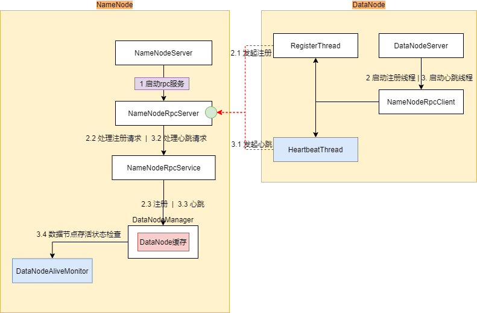
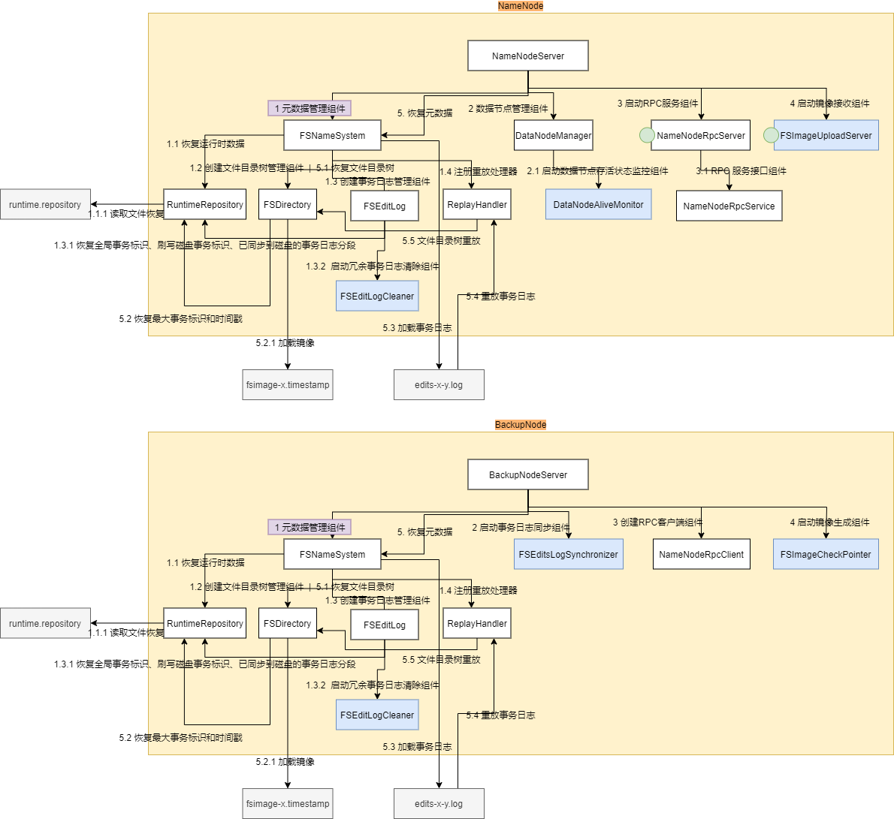
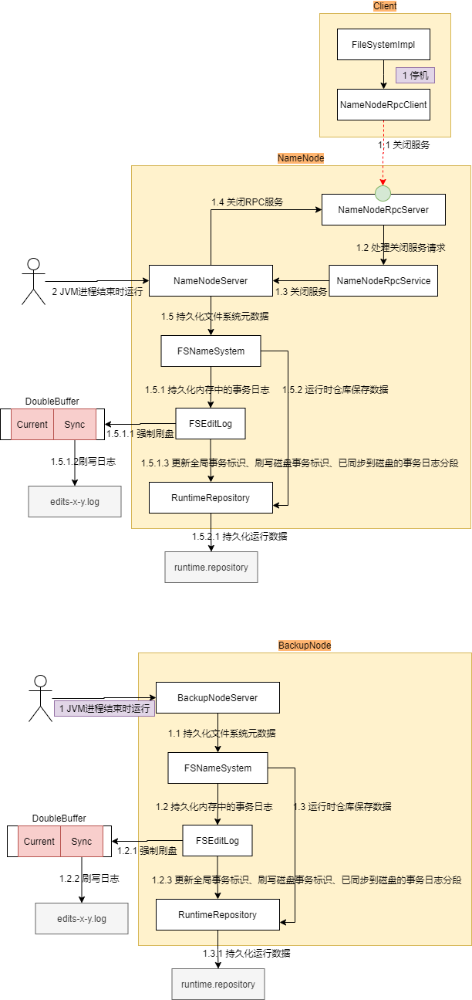
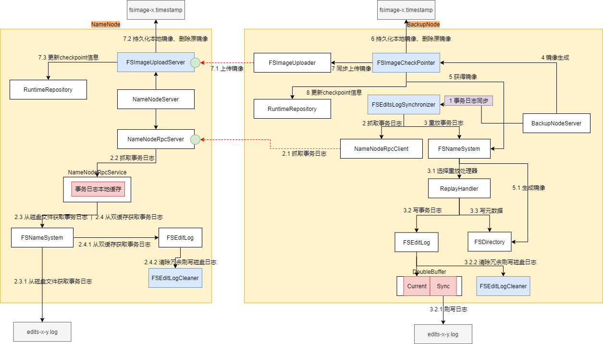
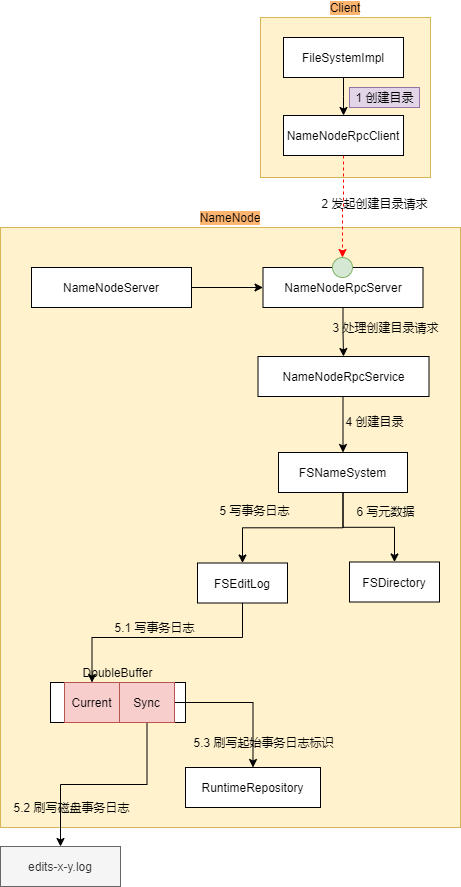
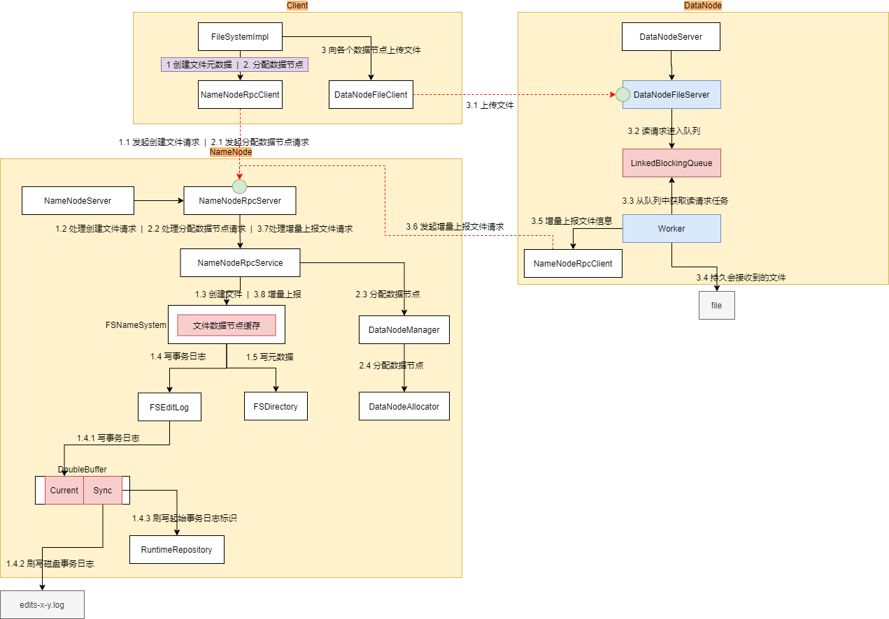
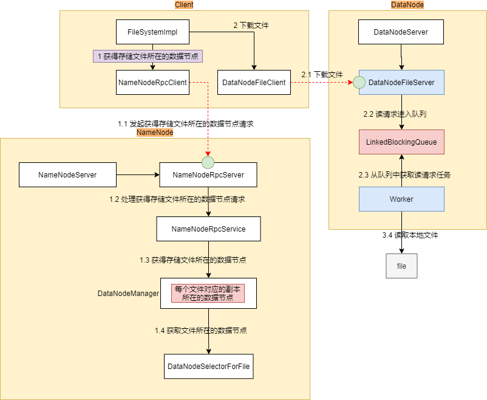

# 概述

1. 海量数据架构：分布式存储、可伸缩架构
2. 高可用架构：多副本冗余、读写容错机制
3. 高并发架构：纯内存元数据管理机制、 Reactor网络模型
4. 高性能架构：长连接机制、异步化机制

# 通讯方式

Java原生 nio + grpc

# 流程

## 注册&心跳检查

## 启动恢复

## 停止运行

## 冷备份

## 创建目录

## 上传文件&增量上报

## 下载文件

