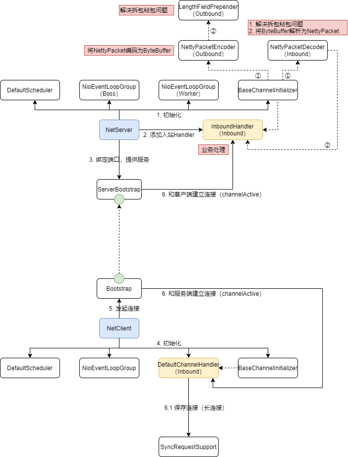

# 版本升级

- 网络通信基于Netty
  - 支持同步、异步传输
  - 支持文件分块传输
- 元数据节点
  - 支持主备自动切换
    - 客户端和数据节点，感知到BackupNode节点宕机；看一下NameNode是否宕机？如果宕机，则切换到BackupNode作为最新的NameNode，重新建立客户端连接；如果没有宕机，则询问NameNode最新的BackupNode地址，然后重新连接
  - 支持元数据节点水平扩展，元数据分片存储；元数据节点包含一定数量的虚拟插槽；插槽包含内存目录树元数据，文件和元数据节点缓存
    - 缩容，下线节点向控制节点发起下线重平衡，元数据节点集群短暂对外停止服务
    - 扩容，新增元数据节点发起重平衡，元数据节点集群短暂对外停止服务
  - 内存文件目录树元数据支持删除后归入垃圾箱，垃圾箱内文件支持恢复和定期删除
- 数据节点
  - 数据节点获取到元数据节点列表后，同随机一个节点建立长连接；如果连接失败，重试3次，再次失败，则迁移到其他元数据节点建立连接
  - 数据节点向一个元数据节点注册；元数据节点维护好数据节点缓存后，向集群广播
  - 数据节点向一个元数据节点分批次全量上报本地存储信息；元数据节点维护好自己负责插槽的元数据，然后向集群节点广播全量上报信息
  - 数据节点向一个元数据节点发起定时心跳；元数据节点更新数据节点缓存心跳时间，然后向集群节点广播心跳
    - 元数据节点如果3个心跳周期没有收到数据节点心跳，则标记数据节点不可用
    - 数据节点发送心跳，如果发现数据节点缓存不存在，则需要重新发起注册和全量上报
    - 数据节点执行下发的复制、删除远程命令
  - 本地存储目录 二级目录+文件名（包含路径、元数据等）
  - 支持水平扩展数据节点
    - 缩容，元数据节点自动迁移下线节点文件
    - 扩容，条带化写入，自动感知新数据节点；渐进重平衡，元数据节点感知容量倾斜超过一定阈值，定时渐进重平衡数据节点文件
- 客户端接口
  - 客户端获取到元数据节点列表后，同随机一个节点建立长连接；如果连接失败，重试3次，再次失败，则迁移到其他元数据节点建立连接
  - 客户端和数据节点通信使用短连接
  - 支持读写容错
  - 上传文件，客户端向数据节点异步上传文件完毕后，hang住，定时查询数据节点有无增量上报成功，保证元数据节点和数据节点的数据一致性；元数据节点收到增量上报后向集群广播，数据节点缓存都要增加容量，如果是自己插槽，则需要维护数据节点和文件元数据

# 容量规划

## 元数据节点

假设1w个小文件占内存1MB，1y占10GB，10y占100GB；

要求6个月在线存取；则 1天新增5w，1个月150w，6个月900w，占内存900MB；考虑后续业务增长3倍，则约占内存3GB;

因此，分配3个元数据节点，单台最多承载1GB内存；

## 数据节点

每个文件200KB，双副本冗余；则占磁盘空间 900w * 200KB *2 = 3600GB；若单台磁盘容量500GB，则约需要8个数据节点；

# 核心流程

## 网络通信

### 建立连接

### 报文处理

- 全双工模式，提升吞吐量
- 异步转同步（Netty收发异步）

## 注册&心跳

数据节点和元节点建立连接成功后

- 数据节点注册（==元数据节点集群内的所有节点都会收到并缓存数据节点信息==）
  - 数据节点
    - 扫描本地数据文件目录的所有文件，向元节点发起注册
  - 元数据节点
    - 向其他所有元数据节点**广播**数据节点注册请求
      - 收到广播请求的元数据节点，只缓存数据节点注册信息；缓存数据节点注册信息，包括**存储容量、空闲空间**等
- 数据节点注册成功后，上报本地数据文件存储信息（==元数据节点集群内的所有节点都会收到上报文件存储信息，并处理自己槽上的文件，但要注意广播风暴==）
  - 数据节点
    - 扫描本地存储索引文件，分批次（最大100），上报数据文件信息
  - 元数据节点
    - 向其他所有元数据节点**广播**数据文件上报
    - 通过上报文件名计算是否在当前元数据节点的插槽上，如果不在不进行处理，即只处理槽上的文件；如果存在，则处理自己槽下的元数据节点和文件对应关系
      - 数据节点上的文件不存在元数据，则下发删除命令
      - 数据节点上的文件超出最大副本数据，则下发删除命令
    - 全部上报完成后，更新数据节点**可用**
  - 如果数据节点短暂重启，元数据节点中的数据节点注册信息还存在，则不需要上报
- 数据节点注册成功后，定时发起心跳（==广播==）
  - 数据节点
    - 收到删除副本命令，删除文件成功后，上报元数据节点
      - 元数据节点释放数据节点内存空间大小；同时向集群其他节点**广播**
    - ==收到复制副本命令==
      - 向指定数据节点下载数据文件
      - 下载文件成功后，更新本地文件存储索引文件
      - 上报元数据节点，元数据节点增加数据节点内存空间大小，处理自己槽下的元数据节点和文件对应关系；同时向集群其他节点**广播**
  - 元数据节点
    - 收到心跳请求后，更新下一次心跳时间窗口
    - **广播**心跳
    - 同步等待，其他节点通过心跳返回的命令；之后汇总，向数据节点下发复制、删除副本命令
- ==元数据节点定时监控数据节点存活状态==
  - 如果在指定时间窗口内没有收到心跳（**由于心跳是广播，所以集群中的所有节点都有这个逻辑**），则认为数据节点异常
    - 缓存中移除异常数据节点
    - 移除数据节点和文件对应关系
    - 创建复制副本任务

## 创建目录

- 客户端和元数据节点建立长连接
  - 向元数据节点发起认证（用户名+密码），成功后，返回token；同时，元数据节点向集群==广播==token保证客户端注册数据一致性
  - 获取备份节点信息
- 创建目录
  - 客户端
    - 等待认证成功
    - 发起创建目录请求；若不成功，则抛出异常
  - 元数据节点
    - 确保认证通过
    - 通过路径Hash计算slot，通过slot获取所在节点（每一个元数据节点上都有全量slot和节点的对应关系）
      - 如果是所在节点
        - 级联创建内存元数据目录结构
        - 利用双缓存写事务日志
      - 不是所在节点
        - ==同步转发请求==到所在slot的元数据节点

## 镜像备份

备份节点启动（1 vs 1）

- 同元数据节点建立长连接
  - 备份节点信息上报。元数据节点保存备份节点信息，同时响应元数据节点的配置信息
- 启动抓取事务日志调度器（**间隔短，内存元数据较新**）
  - 备份节点
    - 同步上传抓取事务日志请求（提供当前最大事务标识，以及是否需要slot信息）
      - 返回缓存用户列表
      - 返回事务日志，逐条回放事务日志到内存元数据（==注意没有写事务日志==）
    - 收到元数据节点下发的slot信息，则缓存之
  - 元数据节点
    - 返回响应
      - 获取缓存区事务日志
        - 优先从已读取的缓存区读取事务日志
        - 其次，从文件读取
        - 最后，从内存缓存中读取
      - 获取已认证的用户信息
    - ==如果需要slot信息，并且slot做过变更，则向备份节点返回所有slot信息== 
- 启动镜像上传调度器（**间隔长，镜像较陈旧**）
  - 备份节点
    - 将内存元数据转换为镜像格式，持久化到本地
    - 上传本地镜像文件到元数据节点
      - 由于本地文件可能比较大，分块传输镜像文件（ head + N body + tail ）
    - 清除本地冗余及不合法镜像文件
  - 元数据节点
    - 接收分块传输镜像文件（ head + N body + tail ）合并持久化到本地
    - 清除本地冗余及不合法镜像文件
    - 清除本地冗余事务日志文件

## 优雅停机

- 元数据节点、备份节点
  - 刷写内存缓冲区的事务日志到磁盘文件

## 系统恢复

- 元数据节点
  - 加载客户端认证信息
  - 加载最新的镜像文件，应用到内存目录树元数据中；从镜像的最大事务日志标识开始，重放日志文件中的事务日志
- 备份节点
  - 加载最新的镜像文件，应用到内存目录树元数据中（==如果备份节点意外宕机，可能会导致同步的最大事务标识远落后于元数据节点，导致频繁向元数据节点更新，可能之前已经更新过的事务日志，重放过，但还没有生成镜像==）

## 上传文件

客户端

- 检验文件是否合法；用户是否认证
- 向元数据节点发起创建文件请求
  - 遍历返回数据节点列表，分别创建短连接，上传文件（==分块；异步==）
  - 全部上传文件完毕后，发上传文件确认请求到元数据节点，元数据节点hang住这个请求（只有数据节点接收文件完毕，上报成功后，才算文件上传完成），只要有一个文件上传成功就会返回

元数据节点

- 收到客户端发送的创建文件请求
  - hash文件名获得slot是否属于当前节点
    - 是：获取文件副本所在的数据节点（返回）；创建文件目录树元数据（==数据庞大，分片存储==）；写事务日志
    - 否：同步转发请求到其他节点
- 收到数据节点发送的增量上报创建文件请求
  - 增加数据节点内存空间大小，处理自己槽下的数据节点和文件对应关系（==数据庞大，分片存储==）；同时向集群其他节点**广播**增加数据节点内存空间大小

数据节点

- 收到客户端发送的上传文件请求
  - 分块组装文件，持久化到本地
  - 记录本地索引文件
  - 增量上报创建文件

## 下载文件

客户端

- 检验文件是否合法；用户是否认证
- 向元数据节点发起获取文件所在数据节点请求
  - 和数据节点创建短连接，发起下载文件请求；收到分块传输的文件，持久化到本地

元数据节点

- 收到客户端发送的获取文件所在数据节点请求
  - hash文件名获得slot是否属于当前节点
    - 是：随机获取==一个==文件所在的数据节点
    - 否：同步转发请求到其他节点

数据节点

- 收到客户端发送的下载文件请求，分块传输文件

## 读取文件或目录元数据

客户端

- 检验文件是否合法；用户是否认证
- 向元数据节点发起读取文件元数据请求

元数据节点

- 收到客户端发送的读取文件元数据请求

  - hash文件名获得slot是否属于当前节点

    - 是：从文件目录树读取元数据

    - 否：同步转发请求到其他节点

## 删除文件

客户端

- 检验文件是否合法；用户是否认证
- 向元数据节点发起删除文件请求

元数据节点

- 收到客户端发送的删除文件请求

  - hash文件名获得slot是否属于当前节点

    - 是：删除文件元数据；在==垃圾箱==创建文件（暂时不会删除），添加 .Trash，之后再在目录树上查找就找不到了（**注意此时不调整文件和元数据节点对应关系缓存**）；

    - 否：同步转发请求到其他节点

## 垃圾箱文件

- 清理

  - 元数据节点周期运行，存储路径 /user/.Trash

  - 调整文件名为文件和元数据节点对应关系时的真正文件名
    - 删除文件和元数据节点对应关系缓存
    - 向副本数据节点下发删除副本命令
    - 减少用户存储空间

- 恢复

  - 删除垃圾箱文件元数据
  - 删除 .Trash，在文件目录树创建文件

## 数据节点文件存储

为了解决上传文件时，如果客户端文件路径层级很深，导致数据节点本地存储时层级过深影响性能。

映射到数据节点的文件路径只有两级，每级由256个文件夹组成

给整个文件路径编码 与 256*256 求模，求得的值 / 256 作为第一级目录，% 256 作为第二级目录，文件路径编码作为文件名

## 元数据节点高可用

主备切换

## 元数据节点水平扩展

分片（联邦机制）；元数据节点间相互连接

### 建立连接

- 各个节点相互间建立连接
- 同时上报，我连接了哪些节点，如果不是自己，或者你也没有连接过，就去和其他节点建立连接
- 最后，所有节点相互建立连接完成
- 当前节点如果发现我和集群中的其他所有节点都建立起了连接，就会开始**选举**

### 选举Controller

- 第一轮选举，每一个节点都投票给自己，然后向其他节点广播发送投票
  - 当前节点发送完投票后，阻塞等待所有节点的归票，统计节点投票
    - 如果有超过半数节点的投票，则选此节点作为Controller
    - 如果没有超过半数节点的投票，且没有接收到所有节点投票，则继续阻塞等待
    - 如果没有超过半数节点的投票，且收到所有节点投票，则本轮选举失败，进行下一轮选举
  - 其他节点收到投票，归票数超过半数后，即可唤醒阻塞等待的选举
- 第二轮选举，每一个节点投票给上一轮选票中ControllerNodeId最大的节点，然后向其他节点广播发送投票
  - 当前节点发送完投票后，阻塞等待所有节点的归票，统计节点投票
    - 如果有超过半数节点的投票，则选此节点作为Controller
      - 如果选举的Controller就是自己，则创建**LocalController**
      - 否则，创建**RemoteController**
  - 其他节点收到投票，归票数超过半数后，即可唤醒阻塞等待的选举

### 初始化槽位

==槽位和节点的对应关系，所有节点都持有一份==。

- LocalController
  - 通过所有槽位（ 0 ~ 16383 ）% 所有节点之和，计算出索引位置，从而获得槽位对应的节点；获得==节点和槽位==、==槽位和节点==的映射关系
  - 应用槽位分配信息，持久化槽位和节点的映射关系到磁盘
  - 向集群中的所有其他节点**广播**槽位和节点的映射关系
- RemoteController
  - 没有接收到槽位关系通知，阻塞等待
  - **接收到**槽位和节点的映射关系
    - 应用槽位分配信息，持久化槽位和节点的映射关系到磁盘
    - 通知阻塞等待

### 新增节点

新增节点和集群中的所有节点建立连接

- 连接成功上报自身信息
  - 收到其他节点上报信息
    - 如果没有连接其他节点，建立连接
    - 全部建立连接成功后，开始选举
      - 广播自身选票
      - 没有收到有效选票，则阻塞等待
        - 被唤醒后、或超过了等待时间，归票过程中，如果发现了强制选票，直接获取指定的ControllerNodeId
        - 创建RemoteController
          - **向ControllerNodeId节点发送**==申请重新分配Slots==请求
          - 没有接收到槽位关系通知，阻塞等待
          - **接收到**槽位和节点的映射关系
            - 应用槽位分配信息，持久化槽位和节点的映射关系到磁盘
            - 通知阻塞等待
      - 收到其他节点的强制选票后，归票，如果没有超过半数，什么都不做；否则，唤醒阻塞等待
- 其他节点收到上报后，创建PeerNameNodeServer，同时上报自身信息，保证新增节点可以在集群中触达到集群中的所有节点
  - 很显然，集群中已经选举完成，有Controller存在
- 其他节点收到投票后，已经选举完成，向新增节点发送==强制选票==

### 重新分配槽位

新增节点

- 新增加节点向ControllerNodeId节点发送==申请重新分配Slots==请求
- 没有接收到槽位关系通知，阻塞等待
- 收到重平衡结果（槽位和节点的映射关系）
  - 收到重平衡结果后，看一下属于自己的槽位是否在其他节点上，如果是的话，分别从其他节点上拉取拉取文件目录树元数据
    - 【阻塞等待】从其他所有节点拉取文件目录树元数据响应完成
      - 应用槽位分配信息，持久化槽位和节点的映射关系到磁盘
      - 通知控制节点，新节点完成了文件目录树的拉取（**理论上可以对外提供服务，其他旧节点上的数据是多余的，删除与否不影响业务，只影响内存空间没有释放**）
    - ==收到下发元数据，应用元数据（涉及NameNode，DataNode）==
      - 所有节点数据都接收完成后，通知阻塞等待

控制节点

- 收到**新增加节点**请求，添加一个重平衡的任务到请求队列（异步，不阻塞）
  - 重平衡任务线程定时获取请求队列任务
    - 通过分配算法，移除旧节点多余的槽位，增加槽位到新节点，使得槽位在所有节点上数量平均分配达到平衡
    - 向所有节点广播重平衡结果（槽位和节点旧关系，槽位和节点新关系）
    - ==下发所有DataNode信息给本次重平衡包含的节点==
    - 【阻塞等待】移除数据节点上报移除了不属于自己的元数据
      - 完成一轮重平衡
- 收到拉取文件目录树元数据，查询数据，下发数据
- 收到新节点完成了文件目录树的拉取请求
  - 看一下是否所有新增节点全部完成拉取元数据，并回放完成
    - 没有完成，什么事情不做
    - 完成，向所有节点（除了新增节点），广播新节点完成了元数据拉取回放
- 收到旧节点删除不属于自身槽位的内存目录树元数据请求
  - 看一下是否全部完成
    - 没有完成，什么事情不做
    - 完成，移除控制节点上不属于自身槽位的内存目录树元数据
      - 通知等待的移除数据节点上报移除了不属于自己的元数据

旧节点

- 收到重平衡结果后，只是移除槽位，不需要增加槽位，因此不需要任何改变
- 收到拉取文件目录树元数据，查询数据，下发数据
- 收到新节点完成了文件目录树的拉取请求
  - 应用槽位分配信息（最新），持久化槽位和节点的映射关系到磁盘
  - 移除不属于自己的元数据，释放内存空间
  - 向控制节点发送旧节点删除不属于自身槽位的内存目录树元数据

