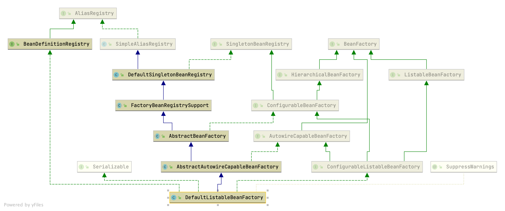
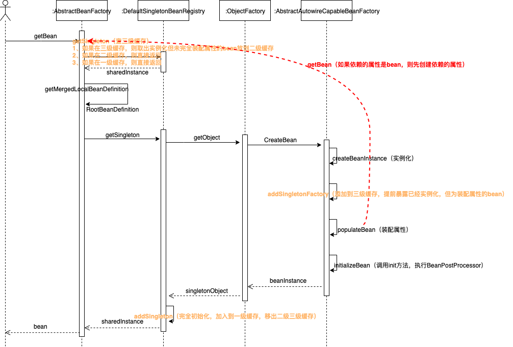
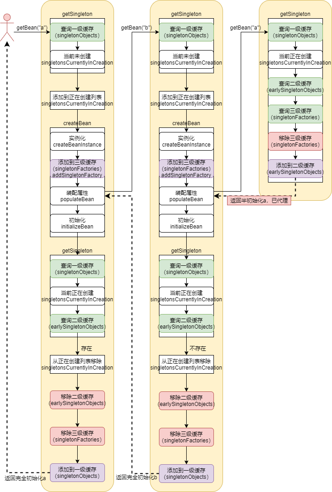
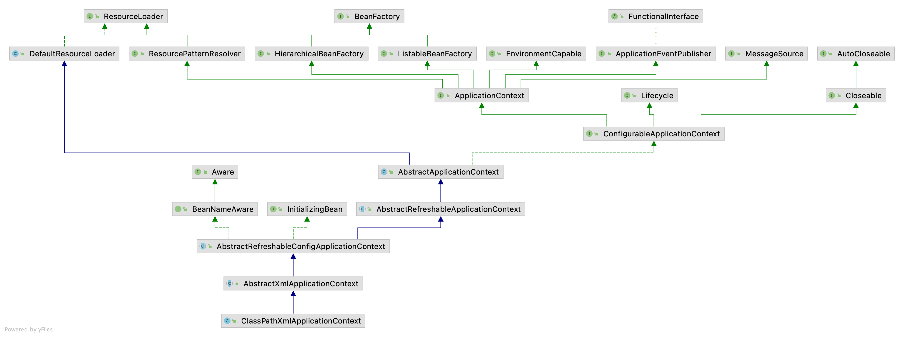
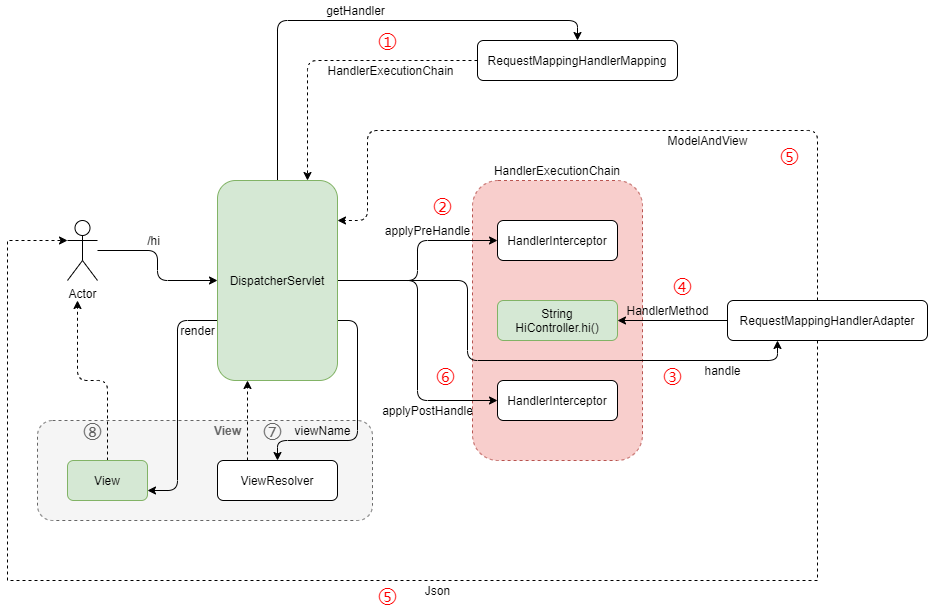

# 源码编译

## spring-framework

### 下载源码

初始下载

- `https://github.com/spring-projects/spring-framework` fork项目
- `git clone git@github.com:yxyyyt/spring-framework.git` 下载源码到本地
- `git checkout -b v5.1.7.RELEASE.yxyyyt v5.1.7.RELEASE`
- git push -u origin v5.1.7.RELEASE.yxyyyt
- 个人项目引用开源源码spring-ioc（个人项目）| open Module Settings | Dependencies
  - spring-core，spring-bean，spring-context，Sourcepath加载源码目录
  - 移除原有源码


从上游分支获取更新（上游分支名称改变）

- `git fetch upstream`
- `git checkout main`
- `git rebase upstream/main`
- `git push origin main` 
- `git branch -d master` 删除本地分支（github默认分支需要提前更新，如master更新为main）
- `git push origin -d master` 删除远程分支


### 编译

- `gradlew :spring-oxm:compileTestJava` 下载jar，时间较长

- `open | spring-framework` idea打开项目，下载jar，时间较长

  - 如果下载缓慢修改spring-framework/build.gradle，`gradle | spring | Reload Gradle Project`

    ```groovy
    repositories {
    		mavenCentral()
    		maven { url "https://repo.spring.io/libs-spring-framework-build" }
        maven { url "http://maven.aliyun.com/nexus/content/groups/public/" }
    	}
    ```

  - 构建完成后 git Rollback 恢复build.gradle

- 如果加载到后面发现 spring-aspects 模块依赖报错，spring-aspects 右键 | unload module

- gradle编译过程中出现乱码

  Help->Edit Custom VM Options中增加 `-Dfile.encoding=UTF-8`


# spring-beans

## 核心类




- `SimpleAliasRegistry` 维护容器中Bean的别名，使用map作为alias的缓存
  - 实现了AliasRegistry接口，定义对别名的增删改操作
- `DefaultSingletonBeanRegistry` 
  - SingletonBeanRegistry接口定义对单例的注册和获取
  - 维护**singletonObjects**、**earlySingletonObjects**、**singletonFactories**、**singletonsCurrentlyInCreation**
  - getSingleton核心逻辑，支持singleton三级缓存
- `FactoryBeanRegistrySupport` 维护由FactoryBean导出的Bean
- `AbstractBeanFactory` 
  - BeanFactory接口，定义获取bean及bean的各种属性
  - HierarchicalBeanFactory继承BeanFactory接口，增加对Parent factory的支持
  - ConfigurableBeanFactory接口，提供配置Factory的各种方法
  - getBean核心逻辑
- `AbstractAutowireCapableBeanFactory` 
  - AutowireCapableBeanFactory接口，提供创建bean，自动注入，初始化，应用bean的后处理器
  - createBean核心逻辑
    - 调用构造函数实例化
    - 将ObjectFactory加入到三级缓存，此时Bean已实例化
    - 装配Bean属性
    - 调用init方法，执行BeanPostProcessor
    - 注册DisposableBean
  - 忽略依赖接口BeanNameAware，BeanFactoryAware，BeanClassLoaderAware
- `DefaultListableBeanFactory`  默认实现
  - BeanDefinitionRegistry接口，定义对BeanDefinition的增删改操作
  - ListableBeanFactory接口，根据各种条件获取bean的配置清单
  - ConfigurableListableBeanFactory接口，BeanFactory的配置清单，指定忽略类型和接口


## Bean加载

### 数据准备

#### 解析默认命名空间

委托给 <font color=red>`XmlBeanDefinitionReader`</font>，调用其loadBeanDefinitions方法

- 委托 `DefaultDocumentLoader` 读取，将Resource文件转换为Document
- 委托 `DefaultBeanDefinitionDocumentReader` 解析Document元素，逐个生成GenericBeanDefinition，并向BeanFactory注册BeanDefinition
  - 委托 `BeanDefinitionParserDelegate` 解析Document**默认命名空间**的元素，创建 **GenericBeanDefinition** 填充XML元数据，并包装为BeanDefinitionHolder
    - 有三类自定义元素：1、同beans同级的根节点；2、同bean同级的节点；3、bean的自定义属性，或自定义的嵌套元素，装饰bean节点
  - 委托 `BeanDefinitionReaderUtils` ，调用 `DefaultListableBeanFactory` 的registerBeanDefinition方法向BeanFactory注册BeanDefinition


#### 自定义标签解析

- 源码调用

  - DefaultBeanDefinitionDocumentReader > parseBeanDefinitions 解析自定义元素
  - BeanDefinitionParserDelegate > parseCustomElement
    - DefaultNamespaceHandlerResolver > resolve **通过namespaceUri获取NamespaceHandler（META-INF/spring.handlers）**
      - 反射实例化NamespaceHandler
      - 调用NamespaceHandler的init方法，<font color=red>注册自定义元素名称和自定义解析器的对应关系</font>
    - NamespaceHandlerSupport（SchoolNameSpaceHandler父类，NamespaceHandler子类）> parse
      - 通过自定义元素名称获取自定义解析器
      - AbstractBeanDefinitionParser > parse > parseInternal（SchoolBeanDefinitionParser子类覆盖实现）

- 验证解析XML，生成Document对象

  - 由 `ResourceEntityResolver` 通过 publicId 和 SystemId 获取 XML 规约

    ```bash
    # URI
    http://www.sciatta.com/schema/user 
    # URL / systemId
    http://www.sciatta.com/schema/user/user.xsd
    ```

    - 查找 **META-INF/spring.schemas** 通过SystemId 获取**本地配置**

      ```properties
      http\://www.sciatta.com/schema/user/user.xsd=META-INF/user.xsd
      ```

- 分析Document解析自定义元素，生成BeanDefinition

  - 由  `BeanDefinitionParserDelegate` 解析自定义元素

    - `DefaultNamespaceHandlerResolver` 通过 URI 查找**META-INF/spring.handlers** 获取 NamespaceHandler **扩展实现**，并调用init方法注册自定义元素和与之对应的**解析器实现**用于后续解析元素

      ```properties
      http\://www.sciatta.com/schema/user=com.sciatta.spring.beans.tests.BeanFactoryTests.UserNamespaceHandler
      ```

    - 调用 NamespaceHandler 解析自定义元素

      - 委托 `BeanDefinitionParser` 自定义解析器解析元素


### 注册

- 调用 `DefaultListableBeanFactory` 的registerBeanDefinition方法注册BeanDefinition
  - 对GenericBeanDefinition作必要的验证，如有Override方法，必须要有factoryMethodName
  - 在**beanDefinitionMap**缓存中注册GenericBeanDefinition
- 调用 `DefaultListableBeanFactory` 的registerAlias方法注册bean的别名


## Bean获取

### 核心流程




### 三级缓存

A引用B，B引用A，形成循环依赖

- 循环调用（方法）不支持
- 循环依赖
  - 构造器不支持
  - setter支持


三级缓存

- 一级缓存 `singletonObjects` 缓存完全初始化的bean

- 二级缓存 `earlySingletonObjects` 缓存未完全填充属性的bean，解决循环依赖问题；==二级缓存已被代理（若需要的话），但尚未完全初始化完成==

- 三级缓存 `singletonFactories` 缓存可以获取未完全填充属性bean的ObjectFactory，前提是bean已经实例化，解决循环依赖问题；==三级缓存ObjectFactory执行AOP逻辑==

  - <font color=red>为什么需要三级缓存？</font>

    A（需要被代理）-> B

    A实例化，装配属性，发现依赖于B；B实例化，装配属性，然后返回给A；此时A完全初始化完成，**走代理逻辑**（代理的是完全初始化完成的对象）。

    A（需要被代理）-> B -> A

    **注意B依赖的是A的代理**。A实例化，装配属性，发现依赖于B；B实例化，装配属性，发现依赖A；获取A时，发现A正在创建，从三级缓存中获取对象，即从ObjectFactory中获取，**提供了代理支持**，因此返回给B的是A的代理（==符合语义==），而且此时A是未完全初始化的对象。

  - <font color=red>只有两级缓存不可以吗？</font>

    符合Spring框架，ObjectFactory肯定需要，从其获得的是半初始的代理对象；如果直接放到一级缓存；多线程环境下，另一个线程从一级缓存获得的是未完全初始化的对象，会出现错误；所以，从ObjectFactory获得的半初始的代理对象要放到二级缓存，而一级缓存只能放完全初始化的对象。

    




# spring-context

## 核心类




## 核心流程

分析ClassPathXmlApplicationContext创建核心流程。


### 环境准备

- 调用 `initPropertySources` 初始化自定义属性源
  - 可以调用 `getEnvironment()` 获取Environment，调用customizePropertySources方法初始化自定义属性源
  - 可以调用 `getEnvironment()` 获取Environment，调用setRequiredProperties方法设置必须检验环境变量
- 调用 `getEnvironment().validateRequiredProperties()` 校验必须存在的环境变量，若不存在，提前抛出异常


### 加载BeanFactory

- 创建DefaultListableBeanFactory，委托XmlBeanDefinitionReader**加载所有BeanDefinition**，然后将beanFactory赋值给ApplicationContext的私有变量持有


### 扩展BeanFactory

- SPEL支持
- 注册自定义属性编辑器
  - 调用BeanFactory的addPropertyEditorRegistrar方法，为BeanFactory增加ResourceEditorRegistrar，其重要的方法就是registerCustomEditors方法，可以注册自定义属性编辑器
    - 在Bean实例化后，会调用BeanFactory的registerCustomEditors，会遍历所有ResourceEditorRegistrar，批量向PropertyEditorRegistry（BeanWrapperImpl）注册PropertyEditor
    - 会遍历customEditors向PropertyEditorRegistry注册PropertyEditor
  - 扩展自定义属性编辑器，在配置文件中注册CustomEditorConfigurer，其实现了**BeanFactoryPostProcessor**接口
    - 向propertyEditorRegistrars注入自定义PropertyEditorRegistrar
    - 向customEditors注入自定义PropertyEditor
- 注册ApplicationContextAwareProcessor，其实现了**BeanPostProcessor**接口，若Bean实现了Aware相关的接口，则为其注入相应的Bean，如实现了ApplicationContextAware接口，为Bean注入applicationContext
- 设置忽略自动装配接口，会在ApplicationContextAwareProcessor中设置
- 设置自动装配接口
- 向BeanFactory注册环境变量相关Bean


### 自定义扩展BeanFactory

- postProcessBeanFactory方法可以由子类实现


### 激活BeanFactoryPostProcessor

- 通过硬编码或配置文件方式**获取**BeanFactoryPostProcessor，并通过**调用**其方法实现自定义BeanDefinition
- BeanFactoryPost包括硬编码和配置文件两种设置方式
  - 硬编码按照注册顺序执行
  - 配置文件按照实现排序接口排序，实现了PriorityOrdered优先于实现了Ordered先执行，实现了Ordered优先于没有实现排序接口的先执行
  - 硬编码执行优先于配置文件方式
- BeanDefinitionRegistryPostProcessor继承BeanFactoryPostProcessor
  - BeanDefinitionRegistryPostProcessor类优先于BeanFactoryPostProcessor类执行
  - postProcessBeanDefinitionRegistry方法先于postProcessBeanFactory方法执行


### 注册BeanPostProcessor

- 通过硬编码注册BeanPostProcessor，按照注册顺序执行
- 通过配置文件注册BeanPostProcessor
  - 按照实现排序接口排序，实现了PriorityOrdered优先于实现了Ordered先执行，实现了Ordered优先于没有实现排序接口的先执行
  - 注册MergedBeanDefinitionPostProcessor（继承BeanPostProcessor接口），如果之前已经注册，则移除，之后一律注册到list尾部
- 硬编码执行优先于配置文件方式


### 初始化消息资源

- bean的name规定为messageSource
  - 从配置文件获得
    - 一种实现ResourceBundleMessageSource，设置basenames
  - 未定义，提供默认实现DelegatingMessageSource，支持委托给parent获得message
- 通过ApplicationContext的getMessage方法获取消息，其委托给MessageSource实现类，其委托给ResourceBundle实现类，对于properties文件，实现类是PropertyResourceBundle


### 初始化ApplicationEventMulticaster和注册监听器

- 初始化ApplicationEventMulticaster
  - bean的name规定为applicationEventMulticaster
  - 从配置文件获得
  - 未定义，提供默认实现SimpleApplicationEventMulticaster
- 向ApplicationEventMulticaster注册监听器
  - 通过硬编码注册ApplicationListener
  - 通过配置文件注册listenerBeanName
- 通过ApplicationContext的publishEvent方法广播事件
  - 调用ApplicationEventMulticaster的multicastEvent方法
  - 遍历监听器，调用监听器的onApplicationEvent方法，由特定的监听器处理事件
    - 异步非阻塞调用，由线程池调用
    - 同步调用


### 实例化所有非延迟初始化单例Bean

- 调用BeanFactory的freezeConfiguration方法，冻结所有配置定义
- 调用BeanFactory的preInstantiateSingletons方法，实例化所有非延迟初始化的单例Bean


### 完成Refresh

- 初始化LifecycleProcessor
  - bean的name规定为lifecycleProcessor
  - 从配置文件获得，需要实现LifecycleProcessor接口
  - 未定义，提供默认实现DefaultLifecycleProcessor
- 刷新LifecycleProcessor
  - 获取实现Lifecycle或SmartLifecycle接口的Bean
  - 按节点启动Lifecycle
- 向ApplicationEventMulticaster发布ContextRefreshedEvent事件


# spring-aop

## 标签解析

- `spring-aop/resources/META-INF/spring.schemas` 是URL同本地xsd对应关系，用于验证aop标签

- `spring-aop/resources/META-INF/spring.handlers` 是URI同NamespaceHandler对应关系，org.springframework.aop.config.AopNamespaceHandler负责注册aop元素相应的解析器

  - <font color=red>`aspectj-autoproxy` 对应 AspectJAutoProxyBeanDefinitionParser</font>，目的是为了创建并注册AnnotationAwareAspectJAutoProxyCreator这个BeanPostProcessor，为Bean创建动态代理

    - 创建BeanDefinition

      name=org.springframework.aop.config.internalAutoProxyCreator

      class=**AnnotationAwareAspectJAutoProxyCreator**

    - 设置proxy-target-class和expose-proxy属性

    - 注册BeanDefinition


## 模型

- AnnotationAwareAspectJAutoProxyCreator对应ProxyConfig，包含多个Advisor
- Advisor对应Aspect，包含一个Pointcut，和一个与其对应的Advice
- Advice有的实现了MethodIntercept；如果没有实现，则需要相应的Adapter适配为MethodIntercept
- Joinpoint对应调用的目标方法，调用前会执行MethodInvocation内的MethodInterceptor拦截器链，MethodInvocation实现了责任链模式


## 创建AOP代理

### ApplicationContext注册AOP核心类

- **AnnotationAwareAspectJAutoProxyCreator**实现了BeanPostProcessor接口
- ApplicationContext初始化过程中，创建AnnotationAwareAspectJAutoProxyCreator类型的Bean，然后向BeanFactory注册BeanPostProcessor
  - 其实现了InstantiationAwareBeanPostProcessor接口，设置BeanFactory的**hasInstantiationAwareBeanPostProcessors**属性为true


### ApplicationContext实例化所有单例Bean

- AnnotationAwareAspectJAutoProxyCreator

  - Bean已经创建，从一级缓存中直接获取

- 待功能增强的业务类UserService创建代理

  - 在实例化前调用resolveBeforeInstantiation方法，参数hasInstantiationAwareBeanPostProcessors为true

    - 调用AnnotationAwareAspectJAutoProxyCreator的postProcessBeforeInstantiation方法

      1. 判断UserService是否是需要被代理

         如果是基础设施（Advice、Pointcut、Advisor、AopInfrastructureBean），或者有@Aspect注解，不需要被代理；

         <font color=red>找出所有的Advisor（包括配置文件Advisor和@Aspect注解包含的Advisor，会被缓存）</font>遍历，如果是AspectJPointcutAdvisor，并且所属advice的AspectName是BeanName，也不需要被代理。

      2. **TargetSourceCreator存在，才会在此处创建代理；否则，不会创建bean**

    - 如果bean创建成功了，则会执行注册的BeanPostProcessor的postProcessAfterInitialization方法；代理创建成功，返回；否则，继续走后续的doCreateBean创建流程

  - 实例化Bean包装为BeanWrapper

  - 装配Bean属性

  - 调用AnnotationAwareAspectJAutoProxyCreator的postProcessBeforeInitialization方法

    - 是的，什么都没有做

  - 调用init初始化方法

  - <font color=red>调用AnnotationAwareAspectJAutoProxyCreator的postProcessAfterInitialization方法</font>（==在完全初始化之后代理==）

    - 创建custom TargetSource，已经被代理过
    - 不需要被代理，直接返回
    - 如果是基础设施，或是AspectJPointcutAdvisor，不需要被代理，直接返回
    - 获取可以匹配bean的所有Advisor
      1. 在所有候选Advisor中，用Pointcut表达式匹配class的类和方法，只要类匹配，方法有一个匹配，则此Advisor为可以匹配bean的Advisor
      2. 在Advisor列表首添加DefaultPointcutAdvisor
    - **创建代理**
      - 构建ProxyFactory
      - 委托DefaultAopProxyFactory创建代理
        - 创建JdkDynamicAopProxy，基于JDK动态代理，<font color=red>实现了InvocationHandler接口</font>
          - 代理接口增加SpringProxy、Advised、DecoratingProxy
          - 委托java.lang.reflect.Proxy的newProxyInstance方法创建代理类
        - 创建ObjenesisCglibAopProxy

- @Aspect定义的UserServiceAspect

  - 在实例化前调用resolveBeforeInstantiation方法，参数hasInstantiationAwareBeanPostProcessors为true

    - 调用AnnotationAwareAspectJAutoProxyCreator的postProcessBeforeInstantiation方法

      1. 判断UserServiceAspect是否是需要被代理

         @Aspect注解是基础设施，**不需要被代理**

    - 继续走后续的doCreateBean创建流程

  - 实例化Bean包装为BeanWrapper

  - 装配Bean属性

  - 调用AnnotationAwareAspectJAutoProxyCreator的postProcessBeforeInitialization方法

  - 调用init初始化方法

  - 调用AnnotationAwareAspectJAutoProxyCreator的postProcessAfterInitialization方法

    - 不需要被代理，直接返回


### 调用代理对象的方法

- 调用JdkDynamicAopProxy的invoke方法，传入proxy，method，args
  - 遍历Advisor集合，判断是否和调用method匹配，如果匹配，从Advisor中获取Advice，Advice即MethodInterceptor（或适配为MethodInterceptor），即获取MethodInterceptor拦截器链
    - 如果Advice是MethodInterceptor的实例，则返回；包括：AspectJAfterAdvice，AspectJAroundAdvice
    - 否则，需要将Advice适配为相应的MethodInterceptor，包括：AfterReturningAdvice（适配为AfterReturningAdviceInterceptor），MethodBeforeAdvice（适配为MethodBeforeAdviceInterceptor），ThrowsAdvice（适配为ThrowsAdviceInterceptor）
  - 创建MethodInvocation，实现类是ReflectiveMethodInvocation（责任链模式，递归方式实现），调用proceed方法
    - 逐个调用MethodInterceptor


## 运行时分析代理类源码

### 测试用例运行

- `sh as.sh --telnet-port 9998 --http-port 9999` 运行arthas
- 查找com.intellij.rt.junit.JUnitStarter进程


### 独立打包运行

以非MVC方式运行

- 创建运行入口

  ```java
  @SpringBootApplication(scanBasePackageClasses = UserServiceConfiguration.class)
  @Slf4j
  public class AspectjApplication implements CommandLineRunner, ApplicationContextAware {
      public static void main(String[] args) {
          SpringApplication.run(AspectjApplication.class);
      }
      
      @Override
      public void run(String... args) throws Exception {
          // 以非mvc方式运行
          Thread.currentThread().join();
      }
      
      @Override
      public void setApplicationContext(ApplicationContext applicationContext) throws BeansException {
          UserService userService = applicationContext.getBean("userService", UserService.class);
          User user = userService.findUser("root");
          log.info(user.getName());
      }
  }
  ```

- 创建fat jar

  ```xml
  		<build>
          <plugins>
              <plugin>
                  <groupId>org.springframework.boot</groupId>
                  <artifactId>spring-boot-maven-plugin</artifactId>
                  <executions>
                      <execution>
                          <goals>
                              <goal>repackage</goal>
                          </goals>
                      </execution>
                  </executions>
                  <configuration>
                      <mainClass>com.sciatta.aop.aspectj.run.AspectjApplication</mainClass>
                  </configuration>
              </plugin>
          </plugins>
      </build>
  ```

- 运行

  ```shell
  # 运行jar
  java -jar aop-1.0-SNAPSHOT.jar
  
  # 运行athas
  sh as.sh --telnet-port 9998 --http-port 9999
  ```


# spring-mvc

## 初始化环境

首次访问时，初始化上下文环境，调用DispatcherServlet的onRefresh方法

- 初始化handlerMappings集合，包括实现HandlerMapping接口的类
  - 初始化**RequestMappingInfoHandlerMapping**，其实现了InitializingBean接口。初始化所有注解了 `Controller` 或 `RequestMapping` 的Bean
    - 为每一个方法构建RequestMappingInfo
    - 向MappingRegistry注册HandlerMethod，其包括BeanName，BeanFactory和Method实例；<font color=red>一个请求对应一个方法的映射</font>。
- 初始化handlerAdapters集合，包括实现HandlerAdapter接口的类


## 请求处理



调用DispatcherServlet的doDispatch方法处理请求

- 遍历handlerMappings
  - 调用**RequestMappingHandlerMapping**的getHandler方法，通过url获得HandlerMethod，包装为**HandlerExecutionChain**
    - HandlerExecutionChain（责任链模式）包括HandlerMethod和若干HandlerInterceptor
      - ConversionServiceExposingInterceptor
      - ResourceUrlProviderExposingInterceptor
- 遍历handlerAdapters
  - 通过HandlerMethod获得**RequestMappingHandlerAdapter**
- 调用HandlerExecutionChain的applyPreHandle（实际方法调用前，责任链开始起作用）
- 调用**RequestMappingHandlerAdapter**的handle方法处理HandlerMethod
  - 委托ServletInvocableHandlerMethod处理请求，反射调用Controller的匹配方法
    - 委托HandlerMethodReturnValueHandlerComposite处理Controller的返回结果，遍历得到RequestResponseBodyMethodProcessor支持@RestController注解（**本质是@ResponseBody注解**），委托RequestResponseBodyMethodProcessor处理结果，经过MappingJackson2HttpMessageConverter将对象转换为json，<font color=red>直接返回客户端响应。注意，对于RestController，此处已经将结果返回到客户端</font>
- 调用HandlerExecutionChain的applyPostHandle
- 调用processDispatchResult
  - 如果有异常，遍历handlerExceptionResolvers统一处理异常
    - ExceptionHandlerExceptionResolver查找注解了@ControllerAdvice的类，缓存注解了@ExceptionHandler的方法，全局统一处理异常

  - 如果HandlerAdapter返回了ModelAndView，通过视图逻辑名遍历可以匹配的ViewResolver，调用其获得View
    - <font color=red>调用View的render方法，输出结果到客户端（普通需要渲染的View）</font>


# spring-jdbc

## 更新操作

- 初始化JdbcTemplate，必须使用DataSource初始化
- 调用JdbcTemplate的**update**方法
  - 把参数封装为ArgumentPreparedStatementSetter
  - 把SQL封装为SimplePreparedStatementCreator
  - 执行execute核心模板方法
    - 从DataSource获取Connection
    - 通过SimplePreparedStatementCreator创建PreparedStatement
    - 设置PreparedStatement参数，设置FetchSize、MaxRows、QueryTimeout
    - <font color=red>调用PreparedStatementCallback回调扩展</font>
      - 通过ArgumentPreparedStatementSetter设置PreparedStatement参数
      - **调用PreparedStatement的executeUpdate执行SQL**
    - 处理PreparedStatement的Warning，默认只输出日志；否则，可以抛出SQLWarningException运行时异常
    - 关闭PreparedStatement
    - 关闭Connection


## 查询操作

- 调用JdbcTemplate的**query**方法
  - execute核心逻辑和调用update方法一致，区别被封装在了<font color=red>QueryStatementCallback回调扩展</font>中
    - **调用Statement的executeQuery执行SQL**
    - 返回的ResultSet由RowMapperResultSetExtractor解析，其封装了ResultSet的遍历过程
      - <font color=red>每一行记录由RowMapper负责解析</font>，RowMapper是客户端传入的<font color=red>回调扩展</font>，封装了将单行记录转换为POJO的逻辑
    - 关闭ResultSet


# spring-tx

## 核心流程

### 自定义标签

#### 注册解析类

`org.springframework.transaction.config.TxNamespaceHandler` 负责解析 `http://www.springframework.org/schema/tx` 命名空间，注册`annotation-driven` 标签的自定义标签解析类 `AnnotationDrivenBeanDefinitionParser`


#### 向容器注册组件

- 注册 `org.springframework.aop.config.internalAutoProxyCreator` InfrastructureAdvisorAutoProxyCreator，实现了<font color=red>BeanPostProcessor</font>接口，负责为Bean自动织入事务代理

- 注册 `org.springframework.transaction.annotation.AnnotationTransactionAttributeSource#0` org.springframework.transaction.annotation.AnnotationTransactionAttributeSource，负责判断实现类的方法、实现类、接口的方法，接口上是否有事务声明

- 注册 `org.springframework.transaction.interceptor.TransactionInterceptor#0` TransactionInterceptor，负责事务功能增强
  - 向其属性transactionManagerBeanName注入transactionManager（已在容器中声明）
  - 向其属性transactionAttributeSource注入org.springframework.transaction.annotation.AnnotationTransactionAttributeSource
- 注册 `org.springframework.transaction.config.internalTransactionAdvisor` BeanFactoryTransactionAttributeSourceAdvisor，实现了<font color=red>Advisor</font>接口，委托AnnotationTransactionAttributeSource进行方法匹配确认目标Bean是否需要代理；同时提供事务拦截功能，委托给TransactionInterceptor
  - 向其属性transactionAttributeSource注入org.springframework.transaction.annotation.AnnotationTransactionAttributeSource
  - 向其属性adviceBeanName注入TransactionInterceptor


### 织入事务

#### 初始化BeanPostProcessor

向容器注入 `org.springframework.aop.config.internalAutoProxyCreator` InfrastructureAdvisorAutoProxyCreator


#### 实例化容器中的Bean

在**初始化容器中第一个Bean**时，在调用完**init**方法后，会调用InfrastructureAdvisorAutoProxyCreator的postProcessAfterInitialization方法确认这个Bean是否需要被代理

- 在容器中**初始化所有备选**Advisor，包括BeanFactoryTransactionAttributeSourceAdvisor，初始化其所有属性
  - 初始化AnnotationTransactionAttributeSource
  - 初始化TransactionInterceptor
- 遍历备选Advisor，确认目标Bean是否需要被代理


在容器中创建TransactionInterceptor

- 初始化transactionManager
- 初始化AnnotationTransactionAttributeSource


在容器中创建DataSourceTransactionManager

- 初始化dataSource，在容器中创建SimpleDriverDataSource


**在容器中创建UserService，此类需要被代理**

- 获得所有备选Advisor
- 遍历备选Advisor，确认目标Bean是否需要被代理，通过BeanFactoryTransactionAttributeSourceAdvisor的Pointcut判断
  - 判断Class是否匹配，默认直接返回true
  - 判断Method是否匹配
    - 获得目标Bean的Class和实现的所有Interface的所有方法进行匹配，委托给AnnotationTransactionAttributeSource进行匹配，只要有一个方法匹配即匹配此Advisor，然后缓存
      - 实现类的方法上有没有 `@Transactional` 注解
      - 实现类上有没有注解
      - 实现类接口的方法上有没有注解
      - 实现类接口上有没有注解
- 为UserService创建代理类，如果是JDK动态代理的话，InvocationHandler保存了一份AdvisedSupport，AdvisedSupport是一份config，持有所有的Advisor


### 事务处理

- 调用代理 `userService.insertUser` ，会委托给JdkDynamicAopProxy的invoke方法
- 遍历所有匹配的Advisor，获得Advice，对于BeanFactoryTransactionAttributeSourceAdvisor的Advice是TransactionInterceptor
- 调用拦截器链进行事务处理
  - 调用TransactionInterceptor的invoke方法
    - 开启事务
    - 处理业务逻辑
    - 处理正常，则提交事务
      - 如果抛出异常是RuntimeException或Error，才会回滚；否则，默认继续提交


## 事务属性

### 传播机制 propagation

- 如果当前不存在事务
  - `PROPAGATION_MANDATORY` 
    - 抛出异常IllegalTransactionStateException
  - `PROPAGATION_REQUIRED`、`PROPAGATION_REQUIRES_NEW`、`PROPAGATION_NESTED`
    - 从DataSource获取Connection，缓存之
    - 设置Connection的ReadOnly、TransactionIsolation、<font color=red>AutoCommit（false，开启事务，关闭自动提交事务）</font>
    - 创建一个**事务对象**
  - `PROPAGATION_SUPPORTS`、`PROPAGATION_NOT_SUPPORTED`、`PROPAGATION_NEVER`
    - 不会创建事务
- 如果当前已经存在事务，传播级别是 `REQUIRED`
  - `PROPAGATION_NEVER`
    - 执行业务逻辑前，抛出异常IllegalTransactionStateException，已经存在的事务回滚
  - `PROPAGATION_NOT_SUPPORTED`
    - 挂起当前事务；
    - 不会创建事务；
    - 嵌套事务如果写入数据后抛出异常，数据不会回滚；当前事务如果写入数据后收到嵌套事务抛出的异常，数据会回滚
    - 嵌套事务如果写入数据正常，数据正常入库；当前事务如果写入数据后，自己抛出异常，数据会回滚
  - `PROPAGATION_REQUIRES_NEW` （里边的影响外边的，但外边的不影响里边的）
    - 挂起当前事务
    - 创建一个新事务（**本质是创建一个新的connection**）
    - 嵌套事务如果写入数据后抛出异常，数据会回滚；当前事务如果写入数据后收到嵌套事务抛出的异常，数据会回滚
    - <font color=red>嵌套事务如果写入数据正常，数据正常入库（嵌套事务是独立事务）；当前事务如果写入数据后，自己抛出异常，数据会回滚</font>
  - `PROPAGATION_NESTED`（里边的不影响外边的，外边的影响里边的）
    - 如果使用Savepoint，则为当前connection创建Savepoint
    - 嵌套事务如果写入数据后抛出异常，数据会恢复到检查点位置，同时需要处理异常，不再抛出异常；此时，当前事务数据正常入库（**嵌套事务是否异常不会影响到当前事务**）
    - <font color=red>嵌套事务如果写入数据正常；当前事务如果写入数据后，自己抛出异常，嵌套事务和当前事务的数据都会回滚</font>（**当前事务是否异常会影响到嵌套事务**）
  - `PROPAGATION_MANDATORY` 、`PROPAGATION_REQUIRED`、`PROPAGATION_SUPPORTS`
    - 共用原事务
    - 嵌套事务如果写入数据后抛出异常，数据会回滚；当前事务如果写入数据后收到嵌套事务抛出的异常，数据会回滚
    - 嵌套事务如果写入数据正常；当前事务如果写入数据后，自己抛出异常，嵌套事务和当前事务的数据都会回滚


### 隔离级别 isolation

- `TransactionDefinition.ISOLATION_DEFAULT` 使用后端数据库默认的隔离级别，MySQL 默认采用的 `REPEATABLE_READ` 隔离级别 Oracle 默认采用的 `READ_COMMITTED` 隔离级别
- `TransactionDefinition.ISOLATION_READ_UNCOMMITTED` 最低的隔离级别，使用这个隔离级别很少，因为它允许读取尚未提交的数据变更，可能会导致脏读、不可重复读、幻读
- `TransactionDefinition.ISOLATION_READ_COMMITTED` 允许读取并发事务已经提交的数据，可以阻止脏读，但是不可重复读、幻读仍有可能发生
- `TransactionDefinition.ISOLATION_REPEATABLE_READ` 对同一字段的多次读取结果都是一致的，除非数据是被本身事务自己所修改，可以阻止脏读和不可重复读，但幻读仍有可能发生
- `TransactionDefinition.ISOLATION_SERIALIZABLE` 最高的隔离级别，完全服从 ACID 的隔离级别。所有的事务依次逐个执行，这样事务之间就完全不可能产生干扰，该级别可以防止脏读、不可重复读以及幻读。但是这将严重影响程序的性能。通常情况下也不会用到该级别


### 超时时间 timeout

事务的超时时间，默认值为 -1。如果超过该时间限制但事务还没有完成，则自动回滚事务。


### 只读事务 readOnly

指定事务是否为只读事务，默认值为 false；为了忽略那些不需要事务的方法，比如读取数据，可以设置 read-only 为 true。


### 回滚属性 rollbackFor

用于指定能够触发事务回滚的异常类型，可以指定多个异常类型。


### 不回滚属性 noRollbackFor

抛出指定的异常类型不回滚事务，也可以指定多个异常类型。


## 事务注解失效场景分析

- @Transactional 应用在非 public 修饰的方法上

  protected、private 修饰的方法上使用 @Transactional 注解，虽然事务无效，但不会有任何报错

- @Transactional 注解属性 propagation 设置错误

  TransactionDefinition.PROPAGATION_SUPPORTS：如果当前存在事务，则加入该事务；如果当前没有事务，则以非事务的方式继续运行。

  TransactionDefinition.PROPAGATION_NOT_SUPPORTED：以非事务方式运行，如果当前存在事务，则把当前事务挂起。

  TransactionDefinition.PROPAGATION_NEVER：以非事务方式运行，如果当前存在事务，则抛出异常。

- @Transactional  注解属性 rollbackFor 设置错误

  rollbackFor 可以指定能够触发事务回滚的异常类型。Spring默认抛出了未检查unchecked异常（继承自 **RuntimeException** 的异常）或者 **Error** 才回滚事务；其他异常不会触发回滚事务。如果在事务中抛出其他类型的异常，但却期望 Spring 能够回滚事务，就需要指定 rollbackFor属性。

- 同一个类中方法调用，导致@Transactional失效

  即使两个方法都有传播机制设置，会导致事务失效。

- 异常被catch “吃了” 导致@Transactional失效

  在业务方法中一般不需要catch异常，如果非要catch一定要抛出throw new RuntimeException()，或者注解中指定抛异常类型@Transactional(rollbackFor=Exception.class)，否则会导致事务失效

- 数据库引擎不支持事务
  这种情况出现的概率并不高，事务能否生效数据库引擎是否支持事务是关键。常用的MySQL数据库默认使用支持事务的innodb引擎。一旦数据库引擎切换成不支持事务的myisam，那事务就从根本上失效了。

