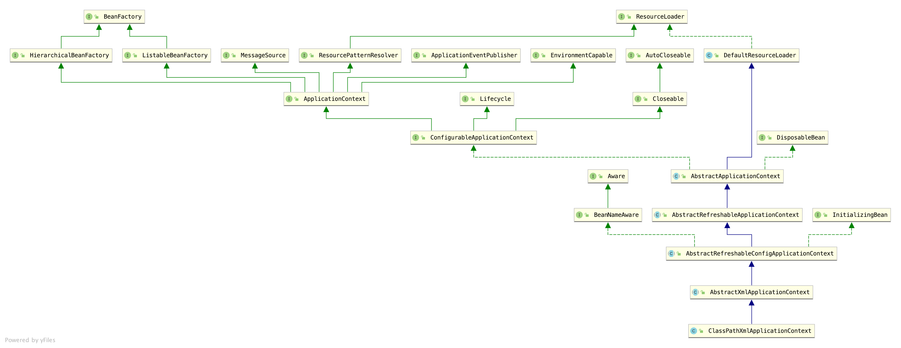
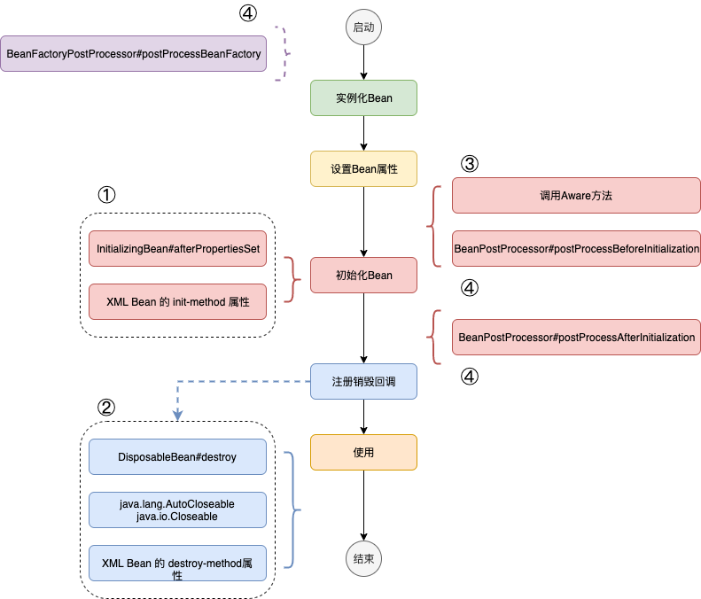
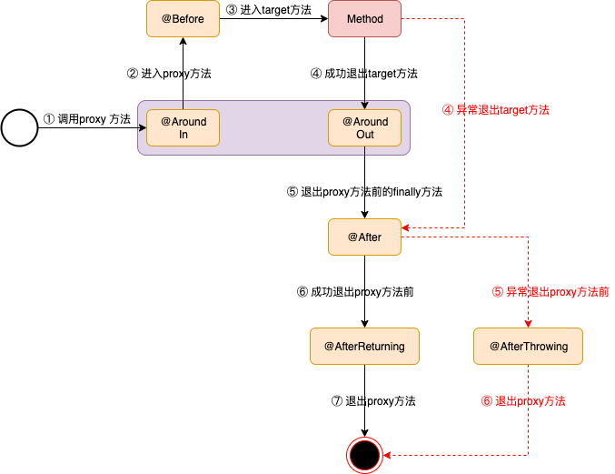
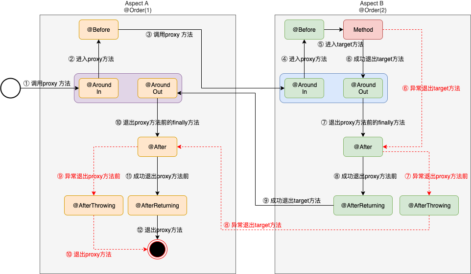

# IOC容器

## 容器

### BeanFactory

提供了一个高级的配置机制，来管理任意类型的对象。访问spring容器的root接口。

#### 类层次


#### 构建及Bean的获取

- 构建BeanFactory
  - 委托XmlBeanDefinitionReader进行构建
    1. XML resource 转换为 Document
    2. Document 转换为 BeanDefinition
    3. BeanDefinition在BeanFactory中注册，包括注册id和name
  - 构建BeanFactory完成，包括所有Bean的元数据信息，即BeanDefinition。**注意，这里所有的Bean还没有被实例化**。

- 从BeanFactory中获取Bean
  - 所有Bean的实例化都是<font color=red>延迟加载</font>，即只有getBean时，才从缓存中（若存在）或根据BeanDefinition定义来创建Bean的实例，然后托管在容器中
  - Bean的创建过程，AbstractBeanFactory委托ObjectFactory，由其调用子类AbstractAutowireCapableBeanFactory的 `createBean` 方法
    1. 通过constructor反射构造实例（reflect、static factory method、instance factory method）
    2. 通过setter装配Bean属性
    3. 在init之前，调用BeanPostProcessor
    4. 调用init方法（三种初始化：InitializingBean、@PostConstruct、init-method）
    5. 在init之后，调用BeanPostProcessor
  - DefaultSingletonBeanRegistry注册singleton范围的缓存
  - 如果是FactoryBean则调用工厂方法返回Bean，否则直接返回


### ApplicationContext

ApplicationContext是BeanFactory的子接口，可以更容易的集成spring AOP，i18n国际化（MessageSource），访问资源（ResourceLoader），事件发布（ApplicationEventPublisher、ApplicationListener），用于web应用的WebApplicationContext。ApplicationContext代表springIOC容器，通过读取配置元数据（xml，java注解，java code），来负责实例化、配置、装配beans。

#### 类层次



#### 构建及Bean的获取

- 刷新过程（默认刷新）
  1. 创建、配置DefaultListableBeanFactory，加载所有BeanDefinition
  2. 调用BeanFactoryPostProcessor、注册BeanPostProcessor
  3. 初始化附加功能MessageSource、ApplicationEventMulticaster
  4. 委托给DefaultListableBeanFactory（调用方法preInstantiateSingletons）实例化所有非抽象、singleton、非延迟初始化Bean，即在XML配置中默认为<font color=red>非延迟加载</font>

- 从ApplicationContext中获取Bean
  - 委托给DefaultListableBeanFactory获取Bean，若是singleton，则从缓存中获取（规则同BeanFactory）


## Metadata元数据

容器通过读取元数据对Bean实例化、配置和装配。元数据描述方式有XML、Java annotation和Java code三种方式。

### XML

### Java annotation

- `<context:annotation-config/>` 隐式向容器注册4个BeanPostProcessor

  - AutowiredAnnotationBeanPostProcessor（@Autowired）

  - RequiredAnnotationBeanPostProcessor（@Required）

  - CommonAnnotationBeanPostProcessor（@Resource 、@PostConstruct、@PreDestroy）

  - PersistenceAnnotationBeanPostProcessor（@PersistenceContext）
  
  之所以是BeanPostProcessor，需要容器中先存着相对应实现的Bean。如@Autowired注解，自动注入的实现必须先在容器中以Bean形式存在。因此，<font color=red>首先要在XML中配置Bean，才可以使用上述注解。此配置减少了XML中Bean的依赖配置</font>。
  
  - `<context:component-scan/>` 做了 `<context:annotation-config>` 要做的事情（通过注解解析依赖关系），还额外支持@Component，@Repository，@Service，@Controller，@RestController, @ControllerAdvice注解的Bean向容器注册。搭配 `<context:component-scan/>` 扫描base-package，在application context中注册扫描到的使用注解的Beans。因此，<font color=red>就不需要在XML中逐个配置（注册）Bean了。此配置减少了XML中Bean的定义配置</font>。

### Java code

从spring3.0开始，基于javaconfig的项目，支持使用java来定义bean，而不是传统的xml文件。@Component是一个通用的stereotype，可以用于任何受容器管理的bean。而@Service、@Controller、@Repository是用于特殊形式的@Component，注解在类型上，但本质是一样的。

在@Configuration中配合@ComponentScan使用，spring 自动检测stereotype类，然后在application context注册相应的bean definition。@Configuration注解的类在运行时会生成CGLIB的子类（成为工厂类），而@Bean注解的方法可以看作是一个完整的BeanDefinition，bean的名字即为方法名称。

后续实例化时，包含@Bean的@Configuration类为工厂类，而@Bean注解的方法为工厂方法。当在调用@Configuration工厂类的@Bean工厂方法前，CGLIB子类会先查找缓存，从而保证工厂方法返回bean的singleton性质。从spring3.2开始，CGLIB已经被包含在spring中。

CGLIB的限制

- @Configuration注解的类和方法不能是private、final

- 从4.3开始，任何构造函数都允许在配置类上使用，包括使用@Autowired或用于默认注入的单个非默认构造函数声明

- **若不想要CGLIB对bean的限制，则可以使用@Component作为配置类，跨方法的调用不会被拦截，因此你必须使用构造函数或方法级别的依赖注入**

@Bean注解在方法上，用于实现工厂方法，实例化、配置、初始化一个受spring容器管理的object。相当于xml配置中 `<bean/>` 元素的角色。

@Configuration注解的类表示的是一个 bean definitions源。可以通过调用同一个类中的其他@Bean注解的方法来定义bean之间的依赖关系。@Bean与@Configuration搭配使用，@Bean注解的不同方法调用同一个@Bean注解的方法代表相同的实例（默认是singleton，在调用方法前，先查询容器）。

- @Configuration注解的类被CGLIB代理，此类（@Component是其元注解）和@Bean注解的方法返回的Bean都被注册为bean definition；
- <font color=blue>而与@Component搭配使用，@Bean注解的不同方法为工厂方法，代表不同的实例，所以方法调用不能用于内部bean的依赖（多次调用@Bean注解的方法，返回不同的实例，@Component注解的类没有被CGLIB代理）</font>。

**若是第三方服务想由spring容器管理，则需要使用@Bean注解提供工厂方法。若是自己的服务则可以注解@Component（@Service、@Controller、@Repository），由容器自动扫描注册。**


## 依赖注入（Dependency Injection）

也称为控制反转（Inversion of Control）。对象依赖的是接口，由**容器**控制Bean的实例化和依赖查找，而不是通过用户代码直接实例化具体对象。

依赖注入的方式

- 基于构造函数

  - 当A的构造函数依赖B，而B的构造函数依赖A，则会发生循环依赖问题。可以将构造函数注入改为setter注入。

- 基于Setter

- 静态工厂方法 / 实例工厂方法（配置方式类似于构造函数形式，可提供 `<constructor-arg/>` 标签）

- `depends-on` 定义<font color=red>非直接</font>依赖关系，当需要依赖的Bean优先启动时使用；相应的 `depends-on` 定义的类会优先销毁

- Autowiring

- Method Injection 方法注入

  方法签名

  ```java
  <public|protected> [abstract] <return-type> theMethodName(no-arguments);
  ```

  XML配置

  ```xml
  <!-- a stateful bean deployed as a prototype (non-singleton) -->
  <bean id="myCommand" class="fiona.apple.AsyncCommand" scope="prototype">
      <!-- inject dependencies here as required -->
  </bean>
  
  <!-- commandProcessor uses statefulCommandHelper -->
  <bean id="commandManager" class="fiona.apple.CommandManager">
      <lookup-method name="createCommand" bean="myCommand"/>
  </bean>
  ```

  基于注解

  ```java
  @Lookup
  ```

  

## 实例化Bean

  - 通过默认构造函数

    ```xml
    <bean id="exampleBean" class="examples.ExampleBean"/>
    ```

  - Static Factory 静态工厂方法

      - class 工厂类

      - factory-method 工厂类对应的静态工厂方法

        注意这里没有指明工厂方法返回对象的类型

    ```xml
    <bean id="clientService"
        class="examples.ClientService"
        factory-method="createInstance"/>
    ```

    - <font color=red>一般用于遗留代码，没有默认构造函数的场景</font>

  - Instance Factory 实例工厂方法

      - factory-bean 工厂类

      - factory-method 工厂类的方法

        注意配置没有class元素

    ```xml
    <!-- the factory bean, which contains a method called createInstance() -->
    <bean id="serviceLocator" class="examples.DefaultServiceLocator">
        <!-- inject any dependencies required by this locator bean -->
    </bean>
    
    <!-- the bean to be created via the factory bean -->
    <bean id="clientService"
        factory-bean="serviceLocator"
        factory-method="createClientServiceInstance"/>
    ```

- FactoryBean

  FactoryBean接口被当成一个SPI（Service Provider Interface：SPI是一种API，这种API被第三方来实现或扩展。它可以被用来扩展框架或实现组件替换功能）使用

  - 一般用于，对于XML无法配置或配置很繁琐的复杂逻辑依赖关系，即xml配置以外的另一种配置bean的方法
  - FactoryBean返回的bean有singleton或prototype区分。**如果FactoryBean是Singleton，则其返回的Bean也是Singleton，由容器管理返回bean和FactoryBean的生命周期**
  - `getBean(factoryBeanName)` 通过FactoryBean返回实际bean
  - `getBean(&factoryBeanName)` 返回工厂实例本身

- ObjectFactory

  接口被当成一个API使用

  - 一般用于，bean不想被容器维护，或总是返回prototype类型的bean
  
  - ObjectFactory返回的bean总是prototype
  - 容器只管理ObjectFactory的生命周期，而不管理返回bean
  - getObject需要客户端手动调用


## Bean的范围

- singleton

  - 默认
  - Spring中的singleton指的是一个容器一个实例；而设计模式中的单例模式指的是一个ClassLoader一个实例。
  - 无状态Bean

- prototype

  - 有状态Bean

  - Spring并不会控制prototype范围实例的完整生命周期，销毁方法不会被调用。Client代码必须做好资源的清理工作。

  - singleton bean 依赖一个 prototype bean，正常情况下 prototype bean 只能在 singleton bean 初始化时被初始化一次，不符合预期。即<font color=red>需要解决 long scope 依赖于 shoter scope Bean的问题</font>

    - 使用方法注入

    - AOP **基于CGLIB**

      ```xml
      <bean id="userPreferences" class="com.something.UserPreferences" scope="session">
      	<!-- instructs the container to proxy the surrounding bean -->
      	<aop:scoped-proxy/> 
      </bean>
      
      <!-- a singleton-scoped bean injected with a proxy to the above bean -->
      <bean id="userService" class="com.something.SimpleUserService">
      	<!-- a reference to the proxied userPreferences bean -->
      	<property name="userPreferences" ref="userPreferences"/>
      </bean>
      ```

    - ObjectFactory

- request

  - Web

- session

  - Web

- application

  - Web

- websocket

  - Web 


## Bean的加载过程




1. 初始化Bean扩展

   - @PostConstruct（推荐）

   - InitializingBean#afterPropertiesSet()

   - XML Bean的 init-method 属性 / @Bean 的 initMethod 属性

   - Lifecycle#start
2. 销毁Bean扩展
   - @PreDestroy（推荐）
   - DisposableBean#destroy()
   - 实现了 java.lang.AutoCloseable / java.io.Closeable 接口
   - XML Bean的 destroy-method属性 / @Bean 的 destroyMethod 属性
   - Lifecycle#stop
3. 容器注入
     - ApplicationContextAware#setApplicationContext
4. 容器扩展

   - BeanPostProcessor

     使用BeanPostProcessor自定义bean实例，控制实例化逻辑和依赖解析。对于多个BeanPostProcessor，可以实现Ordered接口来控制调用顺序。**注意，操作的是bean实例**。同时，BeanPostProcessor只归属于某一个容器，不具有继承关系。对于调用顺序，如果是通过xml配置自动检测，则由ApplicationContext容器控制（Ordered起作用）；如果是通过编程方式，则Ordered不起作用，顺序只和注册顺序有关；调用顺序，编程方式总是优先于配置方式。

   - BeanFactoryPostProcessor
   
     使用BeanFactoryPostProcessor自定义bean配置元数据BeanDefinition。同样，可以实现Ordered接口来控制调用顺序。


## BeanPostProcessor运行顺序

- InstantiationAwareBeanPostProcessor.postProcessBeforeInstantiation 支持提前生成代理
  - 如果提前生成代理，执行 BeanPostProcessor.postProcessAfterInitialization
  - 实例化完成，直接返回
- **实例化**
- MergedBeanDefinitionPostProcessor.postProcessMergedBeanDefinition 修改合并BeanDefinition
- InstantiationAwareBeanPostProcessor.postProcessAfterInstantiation 实例化后处理
  - 可以决定是否装配setter属性；返回false，不装配属性
- 自动注入
- InstantiationAwareBeanPostProcessor.postProcessProperties 填充属性
- **装配属性**
- Aware回调
- BeanPostProcessor.postProcessBeforeInitialization 初始化前处理
- **初始化**
- BeanPostProcessor.postProcessAfterInitialization 初始化后处理


# AOP

## AOP 概念

- Aspect

  横跨多个类，一个关注点的模块化。例如事务管理。在Spring中，被实现为常规类（基于schema的方式）或 `@Aspect` 注解的常规类。

- Join point

  程序执行时的一个点。例如一个方法的执行或异常处理。在Spring中，**Join point表示的是一个执行方法**。

- Advice

  一个Aspect在一个特定Join point所采取的行为。Advice的不同类型包括around，before和after。在Spring中，将Advice构建为一个拦截器，在Join point前后维护一个拦截器链。

- Pointcut

  匹配Join point的谓词（函数 -> ture or false）。Advice同Pointcut表达式关联，在任意与Pointcut表达式匹配的Join point上运行。在Spring中，默认使用AspectJ作为Pointcut表达式语言。

- Introduction

  引入额外的方法或字段表示一个新的类型。在Spring中，可以使用新的接口和实现来Introduction到采取特定Advice的对象。

- Target object

  一个被一个或多个Aspect织入Advice的对象。也称为 ”advised object“。在Spring中，使用运行时代理来实现，Target object也是一个被代理的对象。

- AOP proxy

  为实现Aspect契约通过AOP框架创建的对象。在Spring中，AOP proxy是JDK动态代理或CGLIB代理。

- Weaving

  将Aspect同其他类型或对象链接，来创建一个”advised object“。可以在编译期间，加载期间或运行时完成Weaving。在Spring中，在运行时执行Weaving。


## AOP support

### 代理机制

Spring AOP **默认**使用**标准JDK动态代理**，基于接口类型代理。而使用**CGLIB**可以代理非接口类型。

JDK动态代理

- 如果目标对象被代理的方法是其实现的某个接口的方法，那么将会使用JDK动态代理生成代理对象，此时代理对象和目标对象是两个对象，并且都实现了该接口
- 代理 public interface method

CGLIB

- 如果目标对象是一个类，并且其没有实现任何接口，那么将会使用CGLIB代理生成代理对象，代理类是其子类的对象

- 代理 public 和 protected method

- 无法 Advice final 方法，因为子类不能覆盖这个方法

- 完全使用CGLIB代理

  基于schema

  ```xml
  <aop:config proxy-target-class="true">
      <!-- other beans defined here... -->
  </aop:config>
  ```

  基于@AspectJ

  ```xml
  <aop:aspectj-autoproxy proxy-target-class="true"/>
  ```

  

### 基于 @AspectJ 注解（2.0）

<font color=blue>@AspectJ 做为AspectJ 5 release样式引入。Spring像AspectJ 5一样解析注解，使用AspectJ提供的library用于pointcut的解析和匹配。但注意AOP运行时，仍然使用Spring AOP，不会依赖AspectJ的compiler或weaver</font>。


#### 启用 @AspectJ

@AspectJ支持生效，自动检测@Aspect注解

- 配置
  - Java-style

    ```java
    @Configuration
    @ComponentScan({"com.sciatta.hadoop.java.spring.core.aop.log",
                    "com.sciatta.hadoop.java.spring.core.aop.biz"})
    @EnableAspectJAutoProxy
    public class SameAspectDifferentAdvice {
    }
    ```

  - XML

    ```xml
    <aop:aspectj-autoproxy/>
    ```

- 引入依赖jar

  ```xml
  <dependency>
  	<groupId>org.aspectj</groupId>
  	<artifactId>aspectjweaver</artifactId>
  	<version>1.9.4</version>
  </dependency>
  ```

  

#### 声明 Aspect

- 需要加入@Component注解，识别@Aspect，该类首先需要被容器管理

```java
@Aspect
@Component
public class NotVeryUsefulAspect {
}
```


#### 声明 Pointcut

Spring AOP仅支持**方法级别**的Join point。

```java
@Pointcut("execution(* transfer(..))") // the pointcut expression
private void anyOldTransfer() {} // the pointcut signature
```


<font color=red>Pointcut表达式</font>

- execution & @annotation(annotation-type)

  **粒度是方法**

  - `execution(modifiers-pattern? ret-type-pattern declaring-type-pattern?name-pattern(param-pattern) throws-pattern?)` **匹配方法签名**

    `?` 表示可以省略

    - modifiers-pattern：方法的可见性，如public，protected
    - **ret-type-pattern：方法的返回值类型，如int，void等（不可省略）**
    - declaring-type-pattern：方法所在类的全路径名，如com.spring.Aspect
    - **name-pattern：方法名类型，如buisinessService()（不可省略）**
    - **param-pattern：方法的参数类型，如java.lang.String（不可省略）**
    - throws-pattern：方法抛出的异常类型，如java.lang.Exception

    通配符

    - `*` 通配符，该通配符主要用于匹配单个单词，或者是以某个词为前缀或后缀的单词
    - `..` 通配符，该通配符表示0个或多个项，主要用于declaring-type-pattern和param-pattern中，如果用于declaring-type-pattern中，则表示匹配当前包及其子包，如果用于param-pattern中，则表示匹配0个或多个参数

  - @annotation(annotation-type) 匹配指定注解的方法

- within & @within(annotation-type)

  **粒度是类**

  可以使用通配符 `*` 和 `..`

  - within(declaring-type-pattern)
  - @within(annotation-type) 匹配指定注解的类

- args & @args

  在**运行时**匹配指定参数类型和指定参数数量的方法

  只能使用通配符 `..`

  - args(param-pattern)
  - @args 使用指定注解标注的类作为某个方法的参数时该方法将会被匹配

- this

  表达式中只能指定类或者接口。代理对象（proxy object）是指定类型的实例，可收集Join point上下文。

- target & @target

  - 表达式中只能指定类或者接口。被代理的对象（target object）是指定类型的实例。

    <font color=red>this & target 匹配语义</font>
    - A 是接口，`this(A)` 和 `target(A) ` 使用JDK代理，被代理对象和代理对象都实现了A接口，两者均可匹配
    - A 是未实现接口的类，`this(A)` 和 `target(A) ` 使用CGLIB代理，被代理对象是A的实例，代理对象是A的子类的实例，因此也是A的实例，两者均可匹配
    - A 是实现接口的类，`this(A)` 和 `target(A) ` 使用JDK代理，被代理对象是A的实例，而代理对象是实现接口的类的实例，不是同一个类，因此仅匹配 `target(A)` 
    - @target 执行对象的类有指定注解

- bean

  可以使用通配符 `*` 

  - bean(tradeService) 名称为tradeService的Spring bean的任意Join point


#### 声明 Advice

- Before Advice

  ```java
  import org.aspectj.lang.annotation.Aspect;
  import org.aspectj.lang.annotation.Before;
  
  @Aspect
  public class BeforeExample {
  
      @Before("execution(* com.xyz.myapp.dao.*.*(..))")
      public void doAccessCheck() {
          // ...
      }
  
  }
  ```

- After Returning Advice

  - 可以访问实际返回的值，`returning` 的名称要和Advice的参数名称一致
  - 不可以返回不同的引用

  ```java
  import org.aspectj.lang.annotation.Aspect;
  import org.aspectj.lang.annotation.AfterReturning;
  
  @Aspect
  public class AfterReturningExample {
  
      @AfterReturning(
          pointcut="com.xyz.myapp.CommonPointcuts.dataAccessOperation()",
          returning="retVal")
      public void doAccessCheck(Object retVal) {
          // ...
      }
    
  }
  ```

- After Throwing Advice

  - 可以访问抛出的异常，`throwing` 的名称要和Advice的参数名称一致

  ```java
  import org.aspectj.lang.annotation.Aspect;
  import org.aspectj.lang.annotation.AfterThrowing;
  
  @Aspect
  public class AfterThrowingExample {
  
      @AfterThrowing(
          pointcut="com.xyz.myapp.CommonPointcuts.dataAccessOperation()",
          throwing="ex")
      public void doRecoveryActions(DataAccessException ex) {
          // ...
      }
  
  }
  ```

- After（Finally）Advice

  - 在 `After Returning Advice` 和 `After Throwing Advice` **前**执行

  ```java
  import org.aspectj.lang.annotation.Aspect;
  import org.aspectj.lang.annotation.After;
  
  @Aspect
  public class AfterFinallyExample {
  
      @After("com.xyz.myapp.CommonPointcuts.dataAccessOperation()")
      public void doReleaseLock() {
          // ...
      }
  
  }
  ```

- Around Advice

  ```java
  import org.aspectj.lang.annotation.Aspect;
  import org.aspectj.lang.annotation.Around;
  import org.aspectj.lang.ProceedingJoinPoint;
  
  @Aspect
  public class AroundExample {
  
      @Around("com.xyz.myapp.CommonPointcuts.businessService()")
      public Object doBasicProfiling(ProceedingJoinPoint pjp) throws Throwable {
          // start stopwatch
          Object retVal = pjp.proceed();
          // stop stopwatch
          return retVal;
      }
  
  }
  ```

- Advice Parameters

  任何一个Advice方法都可以声明 `org.aspectj.lang.JoinPoint` 作为第一个参数，注意Around Advice第一个参数的类型是 `ProceedingJoinPoint` ，其是 `JoinPoint` 的子类。

  JoinPoint提供了如下方法

  - `getArgs()`: Returns the method arguments.
  - `getThis()`: Returns the proxy object.
  - `getTarget()`: Returns the target object.
  - `getSignature()`: Returns a description of the method that is being advised.
  - `toString()`: Prints a useful description of the method being advised.

  向Advice传递参数

  - @Pointcut 可重用的Pointcut表达式，可用于附加到Advice上
  - @Before 定义Advice
  - <font color=red>如果在args表达式中使用parameter名称代替类型名称，则在调用Advice时，相应Pointcut签名的参数argument值将作为Advice方法的parameter值传递到Advice</font>

  ```java
  @Pointcut("com.xyz.myapp.CommonPointcuts.dataAccessOperation() && args(account,..)")
  private void accountDataAccessOperation(Account account) {}
  
  @Before("accountDataAccessOperation(account)")
  public void validateAccount(Account account) {
      // ...
  }
  ```

  确定参数名称

  - Pointcut表达式的argNames和Advice的参数名称一致

    ```java
    @Before(value="com.xyz.lib.Pointcuts.anyPublicMethod() && target(bean) && @annotation(auditable)",
            argNames="bean,auditable")
    public void audit(JoinPoint jp, Object bean, Auditable auditable) {
        AuditCode code = auditable.value();
        // ... use code, bean, and jp
    }
    ```

  Advice顺序

  - 相同Aspect，不同Advice

    

  - 不同Aspect，不同Advice

    


#### 声明 Introduction

- @DeclareParents注解在field上，其是**功能加强接口**
- @DeclareParents的value是待功能加强的类或接口
  - `*` 任意单词
  - `+` 待加强功能的类、子类或实现类
- @DeclareParents的defaultImpl是功能加强实现类

```java
@Aspect
public class UsageTracking {
		// 增强类功能，即原类拥有加强接口的定义功能
    @DeclareParents(value="com.xzy.myapp.service.*+", defaultImpl=DefaultUsageTracked.class)
    public static UsageTracked mixin;
  	// 指定增强接口和实现类
  	// 指定待增强类

  	// 匹配pointcut表达式，this表示代理类是接口UsageTracked的实例，注入代理类本身
    @Before("com.xyz.myapp.CommonPointcuts.businessService() && this(usageTracked)")
    public void recordUsage(UsageTracked usageTracked) {
        usageTracked.incrementUseCount();
    }
  	// 指定匹配待增强类的方法，如何调用增强类
}
```


**注意**

- advice 是为了给目标类的<font color=red>已有目标方法</font>增强功能
- introduction 是为了<font color=red>引入新的接口</font>，为原有目标类增加新的功能


### 基于 Schema（2.0）

#### 启用 Schema

```xml
<?xml version="1.0" encoding="UTF-8"?>
<beans xmlns="http://www.springframework.org/schema/beans"
    xmlns:xsi="http://www.w3.org/2001/XMLSchema-instance"
    xmlns:aop="http://www.springframework.org/schema/aop"
    xsi:schemaLocation="
        http://www.springframework.org/schema/beans https://www.springframework.org/schema/beans/spring-beans.xsd
        http://www.springframework.org/schema/aop https://www.springframework.org/schema/aop/spring-aop.xsd">

    <!-- bean definitions here -->
  
</beans>
```


#### 声明 Aspect

- `<aop:aspect>` 的属性ref引用的是容器管理的一个普通Bean

```xml
<aop:config>
    <aop:aspect id="myAspect" ref="aBean">
        ...
    </aop:aspect>
</aop:config>

<bean id="aBean" class="...">
    ...
</bean>
```


#### 声明 Pointcut

- `<aop:config>` 内部定义的 `<aop:pointcut>` 可以在 Aspect 和 Advisor 中共享

```xml
<aop:config>

    <aop:pointcut id="businessService"
        expression="execution(* com.xyz.myapp.service.*.*(..))"/>

</aop:config>
```


#### 声明 Advice

- Before Advice

  - `<aop:before>` 的属性method引用的是aBean的doAccessCheck方法

  ```xml
  <aop:aspect id="beforeExample" ref="aBean">
  
      <aop:before
          pointcut="execution(* com.xyz.myapp.dao.*.*(..))"
          method="doAccessCheck"/>
  
      ...
  
  </aop:aspect>
  ```

  

- After Returning Advice

  ```xml
  <aop:aspect id="afterReturningExample" ref="aBean">
  
      <aop:after-returning
          pointcut-ref="dataAccessOperation"
          returning="retVal"
          method="doAccessCheck"/>
  
      ...
  
  </aop:aspect>
  ```

  

- After Throwing Advice

  ```xml
  <aop:aspect id="afterThrowingExample" ref="aBean">
  
      <aop:after-throwing
          pointcut-ref="dataAccessOperation"
          throwing="dataAccessEx"
          method="doRecoveryActions"/>
  
      ...
  
  </aop:aspect>
  ```

  

- After（Finally）Advice

  ```xml
  <aop:aspect id="afterFinallyExample" ref="aBean">
  
      <aop:after
          pointcut-ref="dataAccessOperation"
          method="doReleaseLock"/>
  
      ...
  
  </aop:aspect>
  ```

  

- Around Advice

  ```xml
  <aop:aspect id="aroundExample" ref="aBean">
  
      <aop:around
          pointcut-ref="businessService"
          method="doBasicProfiling"/>
  
      ...
  
  </aop:aspect>
  ```

  

#### 声明 Introduction

```xml
<aop:aspect id="usageTrackerAspect" ref="usageTracking">

    <aop:declare-parents
        types-matching="com.xzy.myapp.service.*+"
        implement-interface="com.xyz.myapp.service.tracking.UsageTracked"
        default-impl="com.xyz.myapp.service.tracking.DefaultUsageTracked"/>

    <aop:before
        pointcut="com.xyz.myapp.CommonPointcuts.businessService()
            and this(usageTracked)"
            method="recordUsage"/>

</aop:aspect>
```


### 基于 Spring AOP API（1.2）

#### Pointcut

`org.springframework.aop.Pointcut` 的 `ClassFilter` 用于Class匹配，`MethodMatcher` 用于方法匹配。

`MethodMatcher` 分为静态匹配和动态匹配，由方法 `boolean isRuntime();` 控制，返回true表示动态（运行时）匹配

- 静态匹配：仅匹配方法签名

  - `org.springframework.aop.support.JdkRegexpMethodPointcut`

- 动态匹配：除匹配方法签名外，还会在运行时匹配传入的参数

  - `org.springframework.aop.support.ControlFlowPointcut`

<font color=red>推荐使用静态匹配。在方法被第一次调用的时候，框架会缓存Pointcut表达式的计算结果。而动态匹配在方法的每一次调用时都会再次调用方法匹配。</font>


#### Advice

- `per-class advice`

  <font color=red>不依赖target的状态或添加新的状态，即该Advice是无状态的。可以被多个Advisor共享。</font>

  - Interception Around Advice

    - MethodInterceptor

      **Spring实现的MethodInterceptor，会沿着MethodInvocation拦截器链向后传递，一直到Joinpoint方法，执行完成后逆向返回。注意区分与AspectJ的Around执行顺序。**

  - Before Advice

    - MethodBeforeAdvice

  - Throws Advice

    - ThrowsAdvice

  - After Returning Advice

    - AfterReturningAdvice

- `per-instance advice` 

  <font color=red>该Advice是有状态的。不可被多个Advisor共享。</font>

  - Introduction Advice
    - IntroductionInterceptor
      - DelegatingIntroductionInterceptor


#### Advisor

在Spring中，Advisor是一个Aspect，仅包含一个关联Pointcut表达式的Advice。<font color=red>Advisor可以控制Advice代理的粒度到方法级别</font>。

- `org.springframework.aop.support.DefaultPointcutAdvisor`
  - 在 `ProxyFactoryBean` 中配置的Advice会封装为Advisor，在代理类方法调用过程中，会将Advisor中注册的Advice封装成拦截器，最后注册到拦截器链中。
  - 提供类和方法匹配
- `org.springframework.aop.support.DefaultIntroductionAdvisor`
  - 在 `ProxyFactoryBean` 中，如果是IntroductionAdvisor，则要求Advice必须实现Advisor声明的接口，然后将Advisor的接口添加到 `ProxyFactoryBean` 中，供后续生成代理实例。
  - 提供类匹配


#### ProxyFactoryBean

`org.springframework.aop.framework.ProxyFactoryBean` 本身是一个 `FactoryBean` 的子类，所以仍受控于容器。根据参数 `optimize is true` 或 `proxyTargetClass is true` 或 实现某一接口，则使用CglibAopProxy；否则，使用JdkDynamicAopProxy。

其中，JdkDynamicAopProxy实现了InvocationHandler接口，绑定到运行时生成的代理实例上。调用代理实例的方法时，会首先运行拦截器链上的所有拦截器，然后再通过反射调用target方法。

- ProxyFactoryBean 需要**手动**配置每一个代理
- BeanNameAutoProxyCreator 根据正则表达式**自动**配置代理
- DefaultAdvisorAutoProxyCreator 自动匹配系统内的所有Advisor


## AOP代理实现比较

- jdk 需要实现接口，创建和调用相对较快，优先使用；代理类的**字节码**由ProxyGenerator自己生成

- cglib 无法代理final和static，创建时较慢（一式三份，代理类、代理类的fastClass，被代理类的fastClass）；**依赖ASM**

- javassist 手动编写**字符串源码**，较繁琐；创建和调用相对较快

- asm，操作**字节码**

- spring 支持 jdk & cglib 动态代理


# XML配置扩展

##  编写 XML schema

描述自定义配置 `.xsd` ，约束 `BeanDefinition`

- `targetNamespace` 指定 XML Schema Namespace URI
- `elementFormDefault="qualified"`
- 自定义的Bean，root节点要有id元素
  - `xmlns:beans="http://www.springframework.org/schema/beans"`
  - `<xsd:import namespace="http://www.springframework.org/schema/beans"/>`
  - `<xsd:extension base="beans:identifiedType">`


<font color=red>注意将 `.xsd` 文件 放在 `resources/META-INF/` 目录下，保证此文件拷贝到 `classes` 目录下，否则在验证XML时，找不到本地的XSD文件，就会使用Http地址，一般如下错误都是由于在类路径下找不到XSD文件引起</font>

- 方案元素中不允许出现除 'xs:appinfo' 和 'xs:documentation' 之外的非空格字符
- http 502


## 自定义 NamespaceHandler

自定义 `NamespaceHandler` 实现，注册 `BeanDefinitionParser`，委托其解析自定义命名空间内的元素

- 继承 `NamespaceHandlerSupport`
- 注册 `BeanDefinitionParser`，将自定义元素名称和 `BeanDefinitionParser` 匹配用于后续解析


## 自定义 BeanDefinitionParser

自定义 `BeanDefinitionParser` 实现，解析XML元素，构建 `BeanDefinitionBuilder` ，由其创建 `BeanDefinition`

- 继承 `AbstractBeanDefinitionParser`


## 注册自定义组件

- `META-INF/spring.handlers`

  将 XML Schema Namespace URI 映射到 NamespaceHandler

- `META-INF/spring.schemas`

  将 XML Schema location 映射到类路径下的 `.xsd` 文件。Spring优先查找类路径下的 `.xsd` 文件，找不到才通过网络访问

