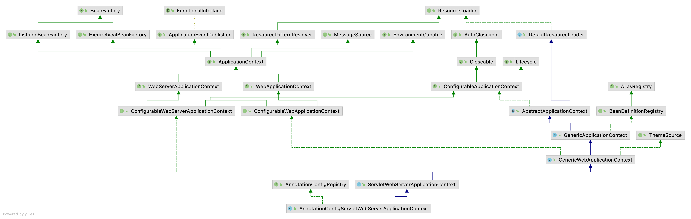

# 源码分析

基于 SpringBoot 2.1.5.RELEASE

- `git checkout -b v2.1.5.RELEASE.yxyyyt v2.1.5.RELEASE` 根据某一tag创建branch
- `git push -u origin v2.1.5.RELEASE.yxyyyt` 提交本地分支到远程

==遇到的问题==

- git下载文件时提示文件路径超长

  git config --global core.longpaths true

- 运行 spring-boot-sample-simple 出错；Kotlin: Language version 1.1 is no longer supported; please, use version 1.3 or greater.

  提示错误的 module 的Kotlin修改为1.3


# 初始化

## 创建SpringApplication实例

- 根据存在的类推断应用程序类型：reactive、servlet、none
- 查找**META-INF/spring.factories**，获取实现ApplicationContextInitializer、ApplicationListener接口的类
  - 首次加载全部，然后缓存到SpringApplication中
  - ApplicationContextInitializer可用于初始化ApplicationContext
  - ApplicationListener关注EventPublishingRunListener向容器内广播的容器创建各个阶段的事件
    - ConfigFileApplicationListener
    - AnsiOutputApplicationListener
    - LoggingApplicationListener
    - ClasspathLoggingApplicationListener
    - BackgroundPreinitializer
    - DelegatingApplicationListener
    - ParentContextCloserApplicationListener
    - ClearCachesApplicationListener
    - FileEncodingApplicationListener
    - LiquibaseServiceLocatorApplicationListener
- 推断出main的入口类作为mainApplicationClass


## 调用SpringApplication实例run方法

- 查找**META-INF/spring.factories**，获取SpringApplicationRunListener的实现类EventPublishingRunListener

  - 通过 SimpleApplicationEventMulticaster 向容器内广播ApplicationStartingEvent事件

- 根据应用程序类型创建环境Environment，如StandardEnvironment，并配置属性源

  - 配置属性源

  - 激活profile，默认 default

  - 向容器内广播ApplicationEnvironmentPreparedEvent事件

    ConfigFileApplicationListener负责加载EnvironmentPostProcessor实现加载配置文件

    1. MapPropertySource jvm参数
    2. SystemEnvironmentPropertySourceEnvironmentPostProcessor 环境变量
    3. RandomValuePropertySource 随机生成的带random.*前缀的属性
    4. OriginTrackedMapPropertySource 类路径下的application.properties
  
- ==创建ApplicationContext实例==，注册系统BeanDefinition

  - 如果应用程序类型是Servlet模式，实例化**AnnotationConfigServletWebServerApplicationContext**

    - 实例化AnnotatedBeanDefinitionReader（注意AnnotationConfigApplicationContext也创建了此类，说明其也支持条件化注解）注册BeanDefinition

      ```tex
      internalConfigurationAnnotationProcessor（ConfigurationClassPostProcessor）
      internalAutowiredAnnotationProcessor（AutowiredAnnotationBeanPostProcessor）
      internalCommonAnnotationProcessor（CommonAnnotationBeanPostProcessor）
      internalEventListenerProcessor（EventListenerMethodProcessor） 
      internalEventListenerFactory（DefaultEventListenerFactory）
      ```

    - 实例化ClassPathBeanDefinitionScanner
    
  - 如果应用程序类型是none，实例化**AnnotationConfigApplicationContext**

    - 实例化AnnotatedBeanDefinitionReader
    - 实例化ClassPathBeanDefinitionScanner

- ==准备ApplicationContext实例==，注册自定义BeanDefinition

  - 遍历ApplicationContextInitializer（**SPI**）初始化ApplicationContext，可为其添加自定义的BeanPostProcessor、BeanFactoryPostProcessor，applicationListener
  - 广播ApplicationContextInitializedEvent事件
  - 创建BeanDefinitionLoader委托其注册BeanDefinition（封装了XmlBeanDefinitionReader和AnnotatedBeanDefinitionReader），数据来源是SpringApplication.run静态方法传入的**主类**，**将其注册为BeanDefinition**
    - 传入的类注解了@SpringBootConfiguration，其是@Component（注解有传递性），委托AnnotatedBeanDefinitionReader注册BeanDefinition
  - 广播ApplicationPreparedEvent事件

- ==刷新ApplicationContext实例==，实例化装配Bean


# 自动化配置

## 原理

<font color=red>约定大于配置</font>。

在没有自动化配置时，注册Bean需要通过@ComponentScan扫描某一个包下的注解类，然后通过@Configuration和@Conditional注册相应的Bean到容器中（AnnotatedBeanDefinitionReader负责注册ConfigurationClassPostProcessor，这个Processor负责解析带有@Conditional注解的配置类）。**@Configuration配置类在各种包路径下，如果@ComponentScan都要配置这些包路径的话，显式配置侵入性大，也很繁琐，容易出错，不够优雅**。

使用 `@EnableAutoConfiguration + @Import` 注解（<font color=red>Enable开关模式</font>），按照约定配置Bean。通过 `AutoConfigurationImportSelector` 在 类路径下查找**META-INF/spring.factories**，然后再查找所有以 **org.springframework.boot.autoconfigure.EnableAutoConfiguration** 为key的配置类，将对应的类作为候选配置类，同时结合@Conditional按需加载配置类中的Bean。此种方法，只需要将jar部署到类路径，同时提供spring.factories即可实现自动化配置。


## 加载配置类

刷新ApplicationContext过程中，遍历调用BeanFactoryPostProcessor，调用 **ConfigurationClassPostProcessor**（internalConfigurationAnnotationProcessor）的postProcessBeanDefinitionRegistry方法注册BeanDefinition

- ==筛选配置类==

  遍历当前容器内的所有BeanDefinition判断是否是配置类的候选，在这里满足条件的是有注解@SpringBootApplication的主类

  - 筛选出**@Configuration**注解的类，BeanDefinition的org.springframework.context.annotation.ConfigurationClassPostProcessor.configurationClass标记为full
  - 筛选出**@Import，@Component，@ImportResource，@ComponentScan**注解的类，**@Bean**注解的方法，BeanDefinition的 org.springframework.context.annotation.ConfigurationClassPostProcessor.configurationClass标记为lite

- ==解析配置类==

  委托ConfigurationClassParser遍历配置类的所有候选配置类，并逐个解析，以及递归检查配置类的成员是否是配置类，<font color=red>处理配置类processConfigurationClass核心逻辑</font>，将符合条件的配置类添加到解析器的**configurationClasses**集合中，以下注解的类都归属于配置类。其中，通过ConditionEvaluator判断是否当前配置类的解析有@Conditional注解，从而支持条件配置逻辑

  - @Component

  - @PropertySource

  - @ComponentScan

  - @Import

    主类@EnableAutoConfiguration上有@Import注解，其值是**AutoConfigurationImportSelector**，候选导入类实现了DeferredImportSelector接口（ImportSelector接口），调用DeferredImportSelectorHandler的handle方法，先把AutoConfigurationImportSelector缓存到handler中；

    如果实现了ImportBeanDefinitionRegistrar接口，缓存到配置类中。

  - @ImportResource

  - @Bean（方法）

- ==加载自动配置类==

  ConfigurationClassParser调用DeferredImportSelectorHandler的process方法，处理延迟@Import注解对应的AutoConfigurationImportSelector类

  - 加载META-INF/spring-autoconfigure-metadata.properties（spring-boot-autoconfigure的target）配置了系统内置的Configuration是否需要自动化配置的条件

  - 加载META-INF/spring.factories将org.springframework.boot.autoconfigure.EnableAutoConfiguration作为key的所有实现类作为候选类

  - 加载META-INF/spring.factories中org.springframework.boot.autoconfigure.AutoConfigurationImportFilter配置，遍历AutoConfigurationImportFilter实现类判断EnableAutoConfigurationp配置的候选类是否满足如下条件，经过此步后，会过滤掉不需要自动化配置的Configuration

    - OnClassCondition需要满足Configuration后缀是ConditionalOnClass
    - OnWebApplicationCondition需要满足Configuration后缀是ConditionalOnWebApplication
    - OnBeanCondition需要满足Configuration后缀是ConditionalOnBean、ConditionalOnSingleCandidate

    <font color=red>如果没有匹配（自定义EnableAutoConfiguration）或者匹配成功的（系统内预定义Configuration）不过滤，需要自动化配置</font>

  - 遍历所有自动配置类，开始解析获取配置类

- ==自动装配==

  委托ConfigurationClassBeanDefinitionReader加载所有配置类向容器注册BeanDefine

  - 如果configurationClass的importedBy不为空的话，先注册这个configurationClass的配置类为BeanDefine
  - 遍历BeanMethods，向容器注册BeanDefine
    - 如果配置类的方法是static，则配置类是静态工厂类，方法是静态工厂方法
    - 否则，配置类是实例工厂类，方法是实例工厂方法
  - 遍历ImportedResources，向容器注册BeanDefine
  - 遍历ImportBeanDefinitionRegistrars，向容器注册BeanDefine


# 自动化配置Tomcat




## ServletWebServerFactory

- **自动化配置类ServletWebServerFactoryAutoConfiguration**
  - 调用processImports处理导入配置类
  - 调用processConfigurationClass处理导入配置类
    - 调用ConditionEvaluator的shouldSkip确认自动导入配置类是否被忽略
      - 包含OnClassCondition和OnWebApplicationCondition两个Condition，分别进行match；如匹配不成功，则忽略后续自动化配置；否则，执行后续自动化配置逻辑
    - 调用doProcessConfigurationClass解析注解，搜索满足条件的类
      - 调用processImports处理**@Import注解**
        - EnableConfigurationPropertiesImportSelector实现ImportSelector接口
          - 调用selectImports方法
            - 导入ConfigurationPropertiesBeanRegistrar实现了ImportBeanDefinitionRegistrar接口，加入到ServletWebServerFactoryAutoConfiguration的importBeanDefinitionRegistrars
            - 导入ConfigurationPropertiesBindingPostProcessorRegistrar实现了ImportBeanDefinitionRegistrar接口，加入到ServletWebServerFactoryAutoConfiguration的importBeanDefinitionRegistrars
        - BeanPostProcessorsRegistrar实现了ImportBeanDefinitionRegistrar接口，加入到ServletWebServerFactoryAutoConfiguration的importBeanDefinitionRegistrars
        - <font color=red>EmbeddedTomcat调用方法processConfigurationClass</font>
          - 调用ConditionEvaluator的shouldSkip确认自动导入配置类是否被忽略
          - 调用doProcessConfigurationClass解析注解，搜索满足条件的类
            - 包含@Bean方法注解tomcatReactiveWebServerFactory，返回**TomcatServletWebServerFactory**（继承<font color=red>ServletWebServerFactory接口</font>），后续会向容器注册TomcatServletWebServerFactory
        - EmbeddedJetty
          - 调用ConditionEvaluator的shouldSkip，不匹配直接返回
        - EmbeddedUndertow
          - 调用ConditionEvaluator的shouldSkip，不匹配直接返回
      - 包含@Bean方法注解
        - servletWebServerFactoryCustomizer
        - tomcatServletWebServerFactoryCustomizer


## DispatcherServlet

- **自动化配置类DispatcherServletAutoConfiguration**
  - 调用processImports处理导入配置类
  - 调用processConfigurationClass处理导入配置类
    - 调用ConditionEvaluator的shouldSkip确认自动导入配置类是否被忽略
    - 调用doProcessConfigurationClass解析注解，搜索满足条件的类
      - 处理成员类MemberClasses，DispatcherServletConfiguration和DispatcherServletRegistrationConfiguration，分别封装为ConfigurationClass
        - 调用processConfigurationClass处理DispatcherServletRegistrationConfiguration
          - 调用ConditionEvaluator的shouldSkip确认自动导入配置类是否被忽略
          - 调用doProcessConfigurationClass解析注解
            - 处理@Import注解
        - 调用processConfigurationClass处理<font color=red>DispatcherServletConfiguration</font>
          - 调用ConditionEvaluator的shouldSkip确认自动导入配置类是否被忽略
          - 调用doProcessConfigurationClass解析注解
            - 处理@Bean注解，**dispatcherServlet后续会向容器注册DispatcherServlet**


## Tomcat启动

AnnotationConfigServletWebServerApplicationContext是SERVLET模式下的ApplicationContext。调用onRefresh()方法初始化ApplicationContext下的特殊Bean

- 调用ServletWebServerApplicationContext的onRefresh方法，调用createWebServer方法，创建WebServer

  - 在容器中查找**ServletWebServerFactory**的实现类（Tomcat的实现类是**TomcatServletWebServerFactory**）

    <font color=red>初始化前调用BeanPostProcessor自定义Bean</font>

    - 调用WebServerFactoryCustomizerBeanPostProcessor的postProcessBeforeInitialization
      - 遍历WebServerFactoryCustomizer的实现类定制ServletWebServerFactory
        - TomcatWebSocketServletWebServerCustomizer增加WsContextListener
        - ServletWebServerFactoryCustomizer自定义ServletWebServerFactory的Server参数，如端口号
        - TomcatServletWebServerFactoryCustomizer自定义ServletWebServerFactory的Tomcat参数
        - TomcatWebServerFactoryCustomizer自定义ServletWebServerFactory的Server和Tomcat参数
        - LocaleCharsetMappingsCustomizer自定义ServletWebServerFactory的LocaleCharset
    - 调用ErrorPageRegistrarBeanPostProcessor的postProcessBeforeInitialization
      - 获取所有ErrorPageRegistrar，其实现类是ErrorPageCustomizer，由配置类ErrorMvcAutoConfiguration提供
        - 实例化ErrorMvcAutoConfiguration，构造函数有三个参数需要注入
          - ServerProperties
          - DispatcherServletPath，其实现类是DispatcherServletRegistrationBean，构造函数有两个参数需要注入
            - DispatcherServlet，由配置类<font color=red>DispatcherServletAutoConfiguration的dispatcherServlet工厂方法提供</font>
            - path
          - ErrorViewResolver

  - 通过ServletWebServerFactory创建**WebServer**

    - 创建Tomcat
    - 设置临时目录
    - 自定义connector，添加到Service中
      - 创建StandardServer（Server），创建StandardService（Service），将Service添加到Server中
    - 创建配置Engine
    - 构建TomcatEmbeddedContext
    - 创建**TomcatWebServer**，调用initialize方法
      - 调用tomcat.start启动Tomcat服务，委托server.start()，调用Server的startInternal
      - 调用service.start()，调用service的startInternal
      - 调用engine.start()，调用engine的startInternal
      - 调用host.start()，调用host的startInternal
      - 调用tomcatEmbeddedContext.start()，调用tomcatEmbeddedContext的startInternal
        - 调用TomcatStarter的onStartup方法，遍历initializers，调用initializer的onStartup方法
          - 调用ServletWebServerApplicationContext的selfInitialize回调函数
            - 准备WebApplicationContext
              - servletContext设置属性org.springframework.web.context.WebApplicationContext.ROOT为ServletWebServerApplicationContext
            - 向ServletWebServerApplicationContext注册servletContext相关的Bean，包括：servletContext、contextParameters、contextAttributes
            - 遍历ServletContextInitializer调用onStartup方法
              - <font color=red>DispatcherServletRegistrationBean向servletContext注册servlet，dispatcherServlet</font>
              - FilterRegistrationBean向servletContext注册filter，OrderedCharacterEncodingFilter
              - FilterRegistrationBean向servletContext注册filter，OrderedHiddenHttpMethodFilter
              - FilterRegistrationBean向servletContext注册filter，OrderedFormContentFilter
              - FilterRegistrationBean向servletContext注册filter，OrderedRequestContextFilter
