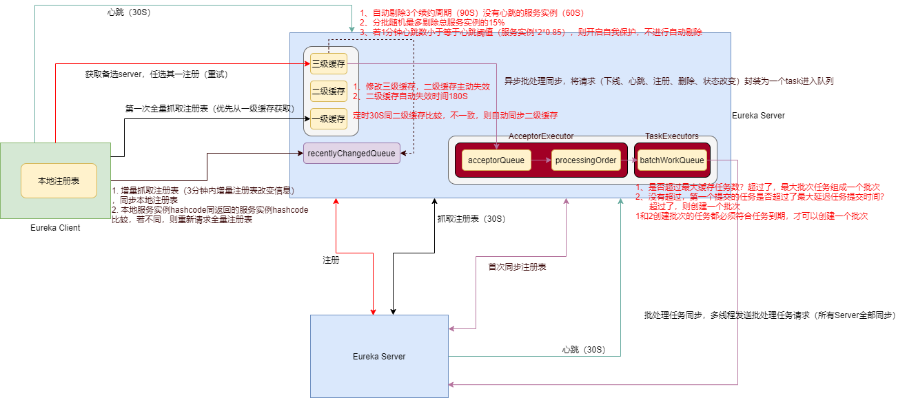
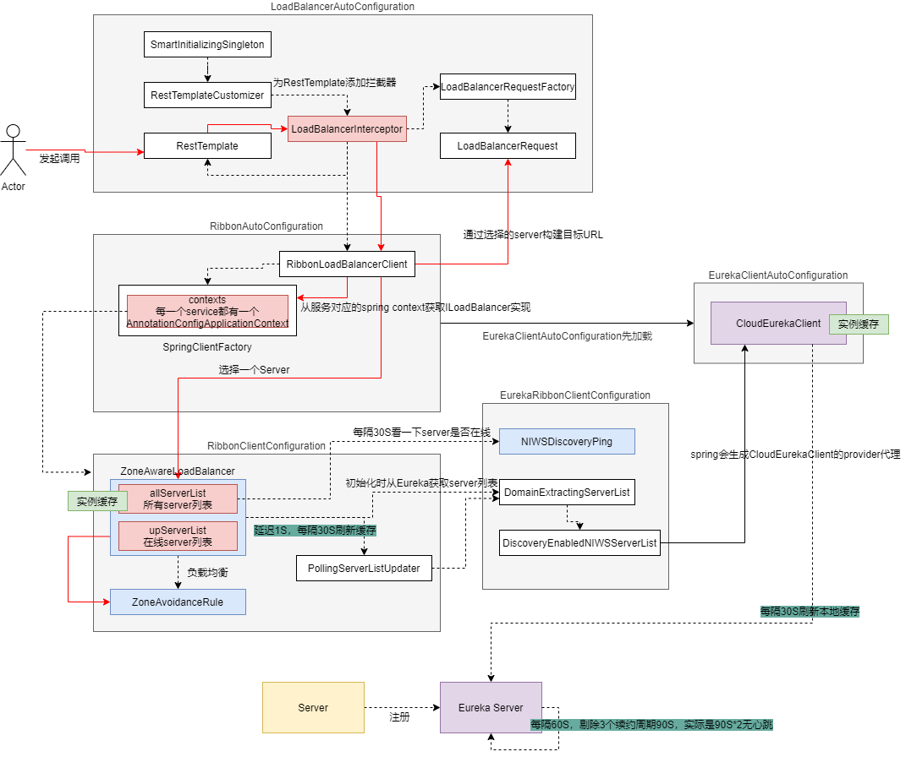
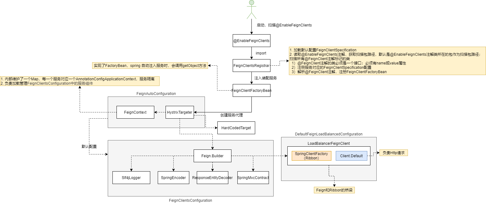
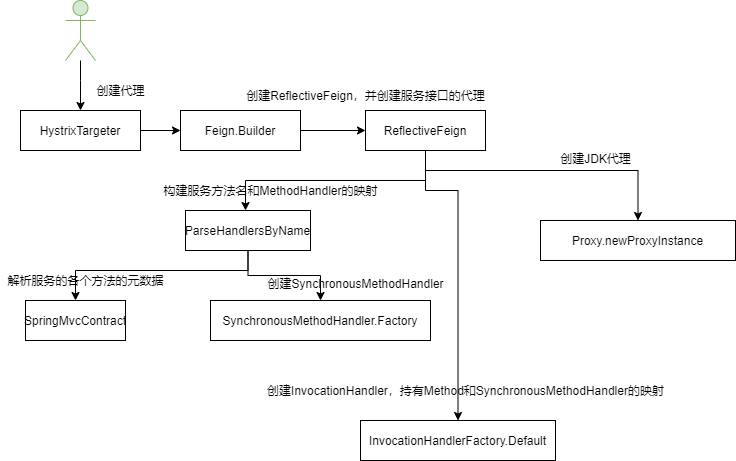
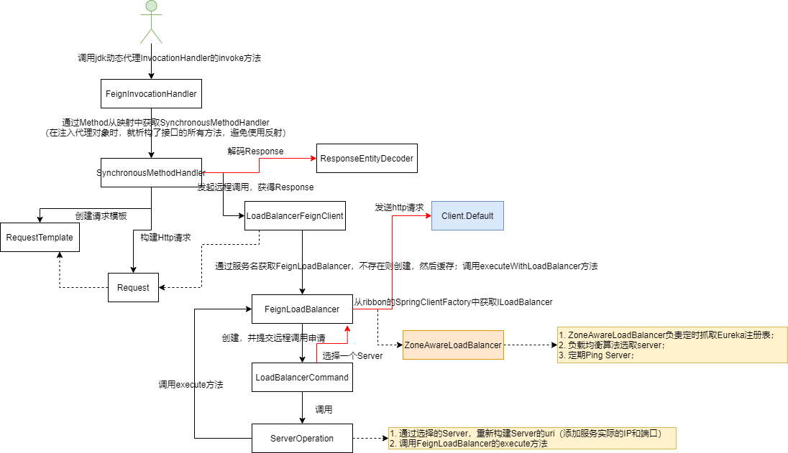
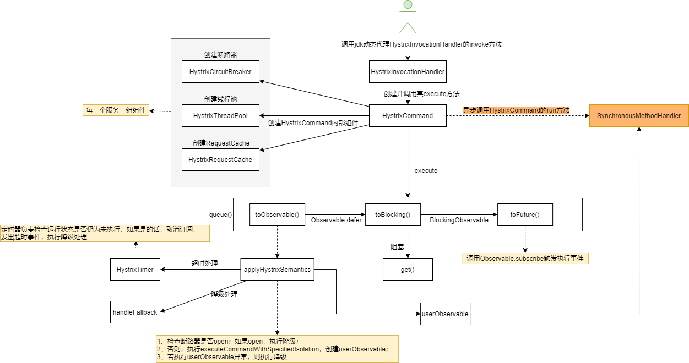

# Eureka

## 源码使用

-  git clone git@github.com:yxyyyt/eureka.git
-  cd D:\repository\contribute\eureka
-  git checkout -b v1.9.21.yxyyyt v1.9.21

   - 根据某一tag创建branch
-  git push -u origin v1.9.21.yxyyyt
   - 提交本地分支到远程
   - 删除分支
     - 本地 git branch -D  v1.9.8.yxyyyt
     - 远程 git push origin --delete v1.9.8.yxyyyt

## 源码分析入口

- 服务端

  eureka-core项目的EurekaBootStrap，作为Web工程的加载入口

- 客户端

  eureka-examples项目的ExampleEurekaClient

## 模块解析

### 注册中心

#### 启动流程

- `@EnableEurekaServer` 注解是注册中心的入口，import配置类 `EurekaServerMarkerConfiguration` ，注意这个配置类只导出了一个Marker空类，其作用是激活主配置类 `EurekaServerAutoConfiguration`（注意其上注解 `@ConditionalOnBean(EurekaServerMarkerConfiguration.Marker.class)` ，即只有存在Marker这个Bean，才会激活主配置类）。
- 主配置类 `EurekaServerAutoConfiguration` 继承 `WebMvcConfigurerAdapter` 用于扩展Spring MVC
  - 创建 jerseyApplication Bean，扫描 com.netflix.discovery 和 com.netflix.eureka 包下包括Path和Provider注解的类
- 主配置类import `EurekaServerInitializerConfiguration` 实现了 `SmartLifecycle` 接口，在容器启动过程中调用Bean的start方法，开启一个线程，初始化Eureka Server
  - 初始化EurekaServerBootstrap
  - 向容器发布EurekaRegistryAvailableEvent事件
  - 向容器发布EurekaServerStartedEvent事件

### 服务注册

#### 环境准备

- `@EnableDiscoveryClient` 入口注解，import配置类 `EnableDiscoveryClientImportSelector` ，如果是自动注册模式，导入配置类 `org.springframework.cloud.client.serviceregistry.AutoServiceRegistrationConfiguration` ，其目的是为了配置`AutoServiceRegistrationProperties` 自动生效。
- `EurekaClientAutoConfiguration` 在spring.factories配置，配合springboot的org.springframework.boot.autoconfigure.EnableAutoConfiguration 完成自动化配置
  - EurekaClientAutoConfiguration需要在AutoServiceRegistrationAutoConfiguration之后配置，AutoServiceRegistrationAutoConfiguration导入了AutoServiceRegistrationConfiguration，而其使得AutoServiceRegistrationProperties生效；以上配置优先级加载，使得EurekaClientAutoConfiguration在创建EurekaAutoServiceRegistration时，`@ConditionalOnBean(AutoServiceRegistrationProperties.class)` 一定生效
  - 导出Bean `EurekaAutoServiceRegistration`
- `EurekaAutoServiceRegistration` 实现了 `SmartLifecycle` 接口，在容器启动过程中调用Bean的start方法，调用 `EurekaServiceRegistry` 的register方法
  - `maybeInitializeClient > reg.getEurekaClient().getApplications()` 初始化org.springframework.cloud.netflix.eureka.CloudEurekaClient（**注意此Bean配置了@Lazy，即使用的时候才会初始化，当前是一个代理**），随即初始化父类  `DiscoveryClient`
- 实例化  `DiscoveryClient`
  - 每一个服务自启动后都有唯一一个 `InstanceInfo` （服务的元数据）
  - 实例化ScheduledExecutorService，负责定时执行任务
    - **刷新缓存**（每隔30秒执行），往cacheRefreshExecutor线程池扔任务（**为什么要向线程池丢任务？因为要异步执行，有超时统计，防止当前任务超时，导致大量任务堆积**）
    - **心跳检测**（每隔30秒执行），往heartbeatExecutor线程池扔任务
  - 实例化EurekaTransport，负责通讯，内部实现责任链模式
    - EurekaHttpClientFactory 高级接口，创建EurekaHttpClient
    - TransportClientFactory 低级接口，创建EurekaHttpClient

#### 发起注册

心跳检测定时任务

- 调用  `DiscoveryClient` 的 register 方法，调用SessionedEurekaHttpClient（高级） > RetryableEurekaHttpClient（高级） > RedirectingEurekaHttpClient（低级） > MetricsCollectingEurekaHttpClient（低级） > JerseyApplicationClient（低级）（**装饰器模式、工厂模式**）
- 由 JerseyApplicationClient > AbstractJerseyEurekaHttpClient 发出 `POST http://localhost:20000/eureka/apps/EUREKA-PROVIDER` 注册请求，包括服务的IP、端口、服务名称等信息（InstanceInfo）

#### 注册中心接收请求

- `ApplicationResource` 的addInstance方法处理注册请求
- 调用 InstanceRegistry > PeerAwareInstanceRegistryImpl > AbstractInstanceRegistry 的register方法，注册到ConcurrentHashMap结构的注册表中
  - AppName——Map<id, Lease>  一个AppName对应多个Instance服务，每一个Instance由Id（ip:AppName:port）和Lease构成一对一关系，Lease持有InstanceInfo
  - 可以通过AppName和Id找到唯一的一个InstanceInfo

### 服务发现

启动时初始化服务

- DiscoveryClient首次启动，构造函数调用 fetchRegistry > getAndStoreFullRegistry 获取全量注册信息
  - AbstractJerseyEurekaHttpClient 发出 `GET http://localhost:20000/eureka/apps `
    - eureka：version
  - 把远程服务刷新到 Applications -> Application -> InstanceInfo
- 启动定时任务CacheRefreshThread，每隔30s获取注册中心服务列表
  - 调用方法getAndStoreFullRegistry获取全量注册信息
    - 发出 `GET http://localhost:20000/eureka/apps `
    - 对应服务端 ApplicationsResource > getContainers
  - 调用方法getAndUpdateDelta获取增量注册信息
    - 发出 `GET http://localhost:20000/eureka/apps/delta`
    - 对应服务端 ApplicationsResource > getContainerDifferential

### 服务续约

#### 发送心跳

- 构造  `DiscoveryClient`  过程中调用initScheduledTasks方法，会启动调度器，定时执行HeartbeatThread心跳（默认30秒）
- 调用 JerseyApplicationClient > AbstractJerseyEurekaHttpClient 的sendHeartBeat方法，向注册中心发起心跳请求 `apps/EUREKA-PROVIDER/192.168.125.117:eureka-provider:20001`
  - 如果注册中心将该服务剔除（没有按时续约），则发送心跳时需要向注册中心重新注册

#### 接收心跳

- `InstanceResource` 的renewLease方法处理心跳请求
- 调用 InstanceRegistry > PeerAwareInstanceRegistryImpl > AbstractInstanceRegistry 的renew方法
- 调用Lease的renew方法更新租约信息，即将lastUpdateTimestamp增加**90秒**
- 校验DirtyTimestamp
  - 如果请求的lastDirtyTimestamp大于注册中心InstanceInfo的LastDirtyTimestamp，说明服务的信息已经变更（如端口），需要服务重新向注册中心发起注册，以客户端服务为准
  - 如果注册中心LastDirtyTimestamp大于请求的lastDirtyTimestamp
    - 如果是副本同步，则冲突
    - 否则，以注册中心为准（旧服务的请求直接按成功处理，不影响注册中心的服务信息）

### 服务剔除

- `EurekaServerInitializerConfiguration` 被容器调用start方法
- 调用EurekaServerBootstrap的contextInitialized方法，initEurekaServerContext初始化tEurekaServer环境
- 调用 InstanceRegistry > PeerAwareInstanceRegistryImpl > AbstractInstanceRegistry 的postInit方法，默认延迟60秒启动，每隔60秒执行服务剔除逻辑
  - 遍历注册表，确认是否已近过了租期（90秒，三个续约租期），默认最多只剔除总服务的15%，然后随机从注册中心的注册表中剔除服务

### 服务自保

如果开启自保，则不会进行服务剔除逻辑；**服务自保和服务剔除是互斥的**。

- 关闭自保参数 `eureka.server.enable-self-preservation=false`
- 如果每分钟接收心跳数阈值大于0，并且最后一分钟接收到心跳数大于阈值（接收到85%以上的服务心跳），则无需自保，直接剔除过期服务；只有当最后一分钟心跳数小于阈值才会触发自保机制（大面积服务失效）

## 核心实践

### 注册中心多级缓存

#### 原理

- 缓存类型
  -  readOnlyCacheMap 一级缓存，ConcurrentHashMap
  -  readWriteCacheMap 二级缓存，LoadingCache（Guava）；key包括appName、ALL_APPS、ALL_APPS_DELTA
    - **二级缓存的目的是，如果三级缓存操作频繁，如果没有二级缓存，会使得一级缓存频繁失效，需要频繁读取三级缓存的数据，读写冲突加剧；二级缓存起到缓冲读写并发的作用**。
  -  registry 三级缓存，ConcurrentHashMap
- 初始化
  - PeerAwareInstanceRegistryImpl.init 初始化 ResponseCacheImpl
    - 读写缓存 readWriteCacheMap，写入数据后，**180s过期**（被动失效）；
    - 加载 registry  三级缓存，如缓存的key是ALL_APPS，则获取registry 的全部注册信息
    - 每隔**30s**更新readOnlyCacheMap 一级缓存，使用readWriteCacheMap二级缓存更新一级缓存
- 注册
  - ApplicationResource.addInstance -> AbstractInstanceRegistry.register
  - 直接增加registry 三级缓存
  - 使得相应key的 readWriteCacheMap  二级缓存失效；包括注册，下线，状态更新都会使得二级缓存失效（主动失效）
- 获取注册信息
  -  ApplicationsResource.getContainers -> ResponseCache.get 
    - 构建缓存key，如 ALL_APPS
    - 从readOnlyCacheMap 一级缓存获取，获取到直接返回
    - 如果一级缓存获取不到，从readWriteCacheMap 二级缓存获取，然后添加到readOnlyCacheMap 一级缓存
    - 如果二级缓存获取不到，从 registry 三级缓存获取，然后添加到readWriteCacheMap 二级缓存

#### 服务感知慢优化改进

- 服务端
  - `eureka.server.response-cache-update-interval-ms: 3000` **减少**服务端一级缓存同步二级缓存时间，默认30000MS
  - `use-read-only-response-cache: false` **不使用**一级缓存，当客户端数量比较小的时候，可以快速感知服务注册状态
- 客户端
  - `eureka.client.registry-fetch-interval-seconds: 3`  **减少**客户端刷新缓存时间，默认30S

### 注册中心间注册表同步

#### 原理

PeerAwareInstanceRegistryImpl注册本地注册表之后，调用replicateToPeers根据事件发送同步信息

同步Node

- 遍历所有PeerEurekaNode，调用其上的事件，如register，异步发起同步注册信息请求
- 调用HttpReplicationClient.submitBatchUpdates批量提交注册任务（peerreplication/batch/）

被同步Node

- PeerReplicationResource.batchReplication接收请求
- 调用ApplicationResource.addInstance，注意isReplication参数是true，表示是副本同步请求
- 调用PeerAwareInstanceRegistryImpl.register注册本地注册表

#### 优化改进

- 批量异步同步注册信息，可能会导致同步不及时；无法及时发现新的注册服务（CAP中的AP）
- 每一个注册中心节点包括所有注册信息，对内存有压力
  - 注册中心分片存储
  - 主从高可用

### 注册中心剔除不可用节点优化

#### 原理

- EurekaBootStrap.contextInitialized（实现接口ServletContextListener） > initEurekaServerContext
- InstanceRegistry.openForTraffic
- PeerAwareInstanceRegistryImpl.openForTraffic
- AbstractInstanceRegistry.postInit 启动 evictionTimer 定时任务（默认延迟60s，每个60S执行一次）
- EvictionTask.run > evict
  - 遍历注册表（2次循环）registry（注册表数据机构ConcurrentHashMap：**appname [ appid, Lease ]**）获取到过期的Lease，然后下线节点

#### 优化改进

可以使用TreeMap的有序性，按照过期时间从小到大排序，优先检查最早的旧契约

- 正常情况下，大部分节点都是正常的，所以不需要遍历TreeMap的所有节点，只需要遍历头部的几个节点即可
- 如果需要拿到所有过期节点，也不需要遍历所有节点，效率也会提升
- 注意TreeMap是非线程安全的，多线程读写情况可以使用ConcurrentSkipListMap（无锁高并发有序哈希表）代替

### 大量使用Timer的缺点

每一个Timer的任务是由一个工作线程负责定时执行；如果这个Timer负责多个任务，只要有一个任务抛出异常，工作线程终止执行，会影响到其他未执行的定时任务；可以使用ScheduledThreadPoolExecutor代替。

# Ribbon

## 核心流程

## 模块解析

### 服务入口

- `@LoadBalanced` 注解上注解了 `@Qualifier`，而 `LoadBalancerAutoConfiguration` 类 的 restTemplates 上也标注了 `@LoadBalanced`；可以只给restTemplates列表注入标记了`@LoadBalanced` 的RestTemplate，作用就是过滤特定RestTemplate
  - `@Autowired` 不只可以注入服务，还可以注入所有的服务到一个集合或Map中
  - 接口 `SmartInitializingSingleton` 的实现类在ApplicationContext初始化时，会实例化所有非延迟初始化Bean，遍历所有RestTemplate，为其添加拦截器**LoadBalancerInterceptor**
- 发起请求 `http://eureka-provider/hello`，调用**LoadBalancerInterceptor**的intercept方法
  - 从url中**提取服务名**eureka-provider
  - 调用**RibbonLoadBalancerClient**的execute方法
    - 调用 `ZoneAwareLoadBalancer` 获取 **Server服务列表** ，调用IRule服务的choose方法，参数是default；默认的IRule实现是RoundRobinRule轮询策略，根据IRule策略选择出一个Server服务
      - 父类 `DynamicServerListLoadBalancer` 在初始化时实例化 PollingServerListUpdater，调用 restOfInit > enableAndInitLearnNewServersFeature > serverListUpdater.start(updateAction)，PollingServerListUpdater延迟1秒，每隔30秒执行定时任务调用updateListOfServers()更新**服务列表**（**获取到最新刷新缓存**）
      - 父类 `DynamicServerListLoadBalancer` 在初始化时调用 restOfInit > updateListOfServers > updateAllServerList > setServersList 会提前初始化**服务列表**，委托DomainExtractingServerList > DiscoveryEnabledNIWSServerList > DiscoveryClient 获取服务列表（**获取到初始刷新缓存**）
      - IRule注入 `ILoadBalancer` 接口的实现类ZoneAwareLoadBalancer，在初始化时会，先快速发送一个Ping请求（Ping策略服务NIWSDiscoveryPing，并没有真正发出请求，只是根据 CloudEurekaClient（定时刷新Eureka Server注册表） **刷新缓存的服务列表**确认一下Server的UP状态，），然后启动一个定时任务每隔10秒发送Ping请求，确认服务UP状态
    - 调用 `LoadBalancerRequest` ，委托 `InterceptingRequestExecution`（包含若干ClientHttpRequestInterceptor，实现了责任链模式） 发出请求
      - RibbonLoadBalancerClient.reconstructURI > LoadBalancerContext.reconstructURIWithServer 重新构建uri，替换serviceName为实际Server的IP和Port

### 本地负载均衡策略

#### RandomRule

- 从所有服务列表里边随机选择一个，通过索引再到可达服务列表获取，如果找不到，再重新选择；否则，直接返回

#### RoundRobinRule

- 轮询获取Server，如果没有获取到Server，最多可以轮询10次，直到获取到Server为止，或到达最大轮询次数
  - 次数上做限制

#### RetryRule

- 委托RoundRobinRule，如果没有获取到Server或Server不可用（依赖RoundRobinRule），则在指定时间范围内持续获取Server
  - 时间上做限制
  - 次数上做限制

#### WeightedResponseTimeRule

- 底层委托RoundRobinRule获取Server
- 响应越快，权重越高；适合业务复杂的场景

#### BestAvailableRule

- 底层委托RoundRobinRule获取Server
- 过滤掉故障机，过去30分钟内并发量最小的节点；适合响应时间快的场景

#### AvailabilityFilteringRule

- 底层委托RoundRobinRule获取Server
- 节点熔断或当前active请求连接数超过阈值，重新选择；适合熔断场景

#### ZoneAvoidanceRule

- Zone+AvailabilityFilteringRule

# Feign

## 核心流程

### 启动依赖

### 创建代理

接口注入时，尝试缓存接口的所有方法对应的MethodHandler映射，提高解析效率；

### 服务调用

- 在Feign的Client调用时，SynchronousMethodHandler将参数通过Template构建Http请求，然后请求Server服务；Server提供的是Controller，应用层面不涉及反射调用

## 模块解析

### 创建服务接口代理

- 入口 `@EnableFeignClients`

  - `@Import(FeignClientsRegistrar.class)` 

    FeignClientsRegistrar.registerBeanDefinitions 注册代理 >

    - registerFeignClients 在默认包路径下扫描（@EnableFeignClients注解类所在的包）@FeignClient 注解的接口 >

    - registerFeignClient 构建类型是**FeignClientFactoryBean**（type是接口）的BeanDefinition，然后注册；注意FeignClientFactoryBean实现了接口**FactoryBean**，getObject提供了创建代理的核心逻辑

- 调用FeignClientFactoryBean的getObject方法获取代理，委托getTarget 

  - **构建FeignContext，是Feign的上下文服务**

    - FeignContext包含了 **代理服务名和AnnotationConfigApplicationContext的映射**

    - 一个代理服务对应一个AnnotationConfigApplicationContext，默认注册配置类**FeignClientsConfiguration**，各个代理服务间隔离

  - 通过FeignContext构建Feign.Builder

    - 每一个代理服务都有一个Feign.Builder（是FeignClientsConfiguration的一个Bean）；为Feign.Builder装配Logger、Encoder、Decoder、Contract

  - 调用loadBalance方法

    - 从代理服务（eureka-provider）的AnnotationConfigApplicationContext获取Client接口的实现类**LoadBalancerFeignClient，其作为Feign和Ribbon集成的桥梁**（包含**SpringClientFactory，是ribbon的上下文服务**，同样一个代理服务对应一个AnnotationConfigApplicationContext）
    - 获取Targeter接口的实现类HystrixTargeter，调用HystrixTargeter的target方法。此处不是feign.hystrix.HystrixFeign.Builder，直接调用Feign.Builder的target方法
      - 构建Feign，实例化**ReflectiveFeign**，调用newInstance方法，使用**JDK动态代理**创建服务接口的代理服务
      - 解析服务接口的所有方法，生成与其对应的SynchronousMethodHandler映射（避免使用反射性能降低）

### 调用代理服务方法

调用FeignInvocationHandler的invoke方法，其实现了InvocationHandler接口

- 通过Method获取SynchronousMethodHandler，调用invoke方法；委托LoadBalancerFeignClient的execute方法

  - 获取服务URL，如 `http://eureka-provider/hello`

  - 通过服务名（eureka-provider）获取IClientConfig。先从SpringClientFactory中获取代理服务（eureka-provider）对应的AnnotationConfigApplicationContext，再获取IClientConfig。SpringClientFactory包含多个代理服务对应的AnnotationConfigApplicationContext，默认的配置类是**RibbonClientConfiguration**。
    - 加载配置类EurekaRibbonClientConfiguration，调用RibbonUtils.initializeRibbonDefaults设置ribbon的**eureka-provider.ribbon.DeploymentContextBasedVipAddresses**参数为代理服务名
    - 加载配置类EurekaRibbonClientConfiguration，实例化ServerList接口的DomainExtractingServerList
    - 加载配置类RibbonClientConfiguration，其会初始化配置中的ZoneAwareLoadBalancer > updateListOfServers > **DomainExtractingServerList** > DiscoveryEnabledNIWSServerList.getUpdatedListOfServers 获取server列表（基于eureka-provider.ribbon.DeploymentContextBasedVipAddresses参数）
      - 父级应用上下文包含注册中心的所有服务
      - 每一个代理服务的子级应用上下文只包含属于自己的注册中心服务

  - 从服务的上下文构建FeignLoadBalancer，并调用executeWithLoadBalancer方法
    - 通过ZoneAwareLoadBalancer选取Server，构造最终URI向服务提供方发送请求

# Hystrix

## 核心流程

### 创建代理

当开启参数 feign.hystrix.enabled=true时，注入 feign.hystrix.HystrixFeign.Builder；HystrixFeign.Builder 设置组件

- SetterFactory
- Fallback 或 FallbackFactory

假设使用FallbackFactory，则动态代理调用HystrixInvocationHandler，协议使用HystrixDelegatingContract

### 服务调用

1. 获取请求缓存，如果存在，返回结果；否则，继续
2. 断路器，时间窗口内的请求是否达到阈值，并且失败请求比例达到阈值，则打开断路器，执行降级；否则，继续
   - 打开断路器，是否超过了一定时间，若超过，断路器进入半开状态，允许一个请求通过
     - 若请求成功，关闭断路器；后续请求正常处理
     - 若不成功，断路器仍处于打开状态，等待下一个半开状态时间窗口
   - 没有超过一定时间，执行降级
3. 线程池是否满，若满了，拒绝请求，上报断路器，执行降级；否则，继续（拒绝）
4. 定时器定时调度检查调用是否超时，如果超时，上报断路器，取消订阅，执行降级；否则，继续（超时）
5. 用户方法执行，正常返回结果；异常，上报断路器，执行降级（异常）

## 核心实践

### 服务超时时间和线程数规划

#### 线程数

- 了解某一个服务的请求数，机器数，服务响应时间要求
- 假设每秒要求50个请求，响应时间要求200ms
  - 单线程1秒处理5个请求（1000ms / 200ms）
  - 单机需要 50 / 5 = 10个线程
  - 一般要加几个线程，防止响应时间增大的情况；如响应时间增大到300ms，1000ms/300ms = 3，则单线程1秒处理3个请求，50/3=17个线程；因此，要增加线程数到17，否则，会出现排队阻塞的情况
- 假设每秒要求2000个请求，响应时间要求200ms，20台机器
  - 单线程1秒处理5个请求
  - 单机需要处理请求数 2000/20=100
  - 单机需要 100 / 5 = 20个线程

#### 超时时间

- 要和响应时间相同，如果太大会造成请求阻塞
- hystrix的超时时间要设置比ribbon要大，ribbon有重试机制
- feign的超时时间优先级最高，hystrix和ribbon谁先到达超时时间限制，谁先起作用

### 限流算法

#### 单机

- 固定窗口

  无法抵御突发流量

- 滑动窗口

  窗口越多，流量越平滑

- 漏桶（==桶里是任务==）

  入桶（队列）任意速率，出桶固定速率，桶容量有限且保持不变，超过桶容量则丢弃

- 令牌桶（==桶里是令牌==）

  令牌以固定速率入桶（队列），当桶里的令牌满了，则丢弃多余的令牌；任意速率的请求，从桶里拿令牌，拿到令牌的请求通过，拿不到的请求丢弃；**可以应对突发流量**。

#### 分布式

- 中间件：sentinel、redis、网关
