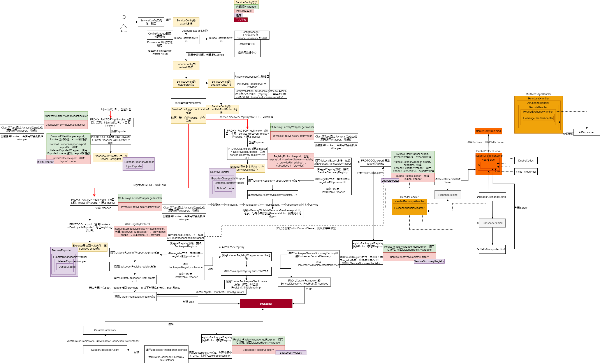
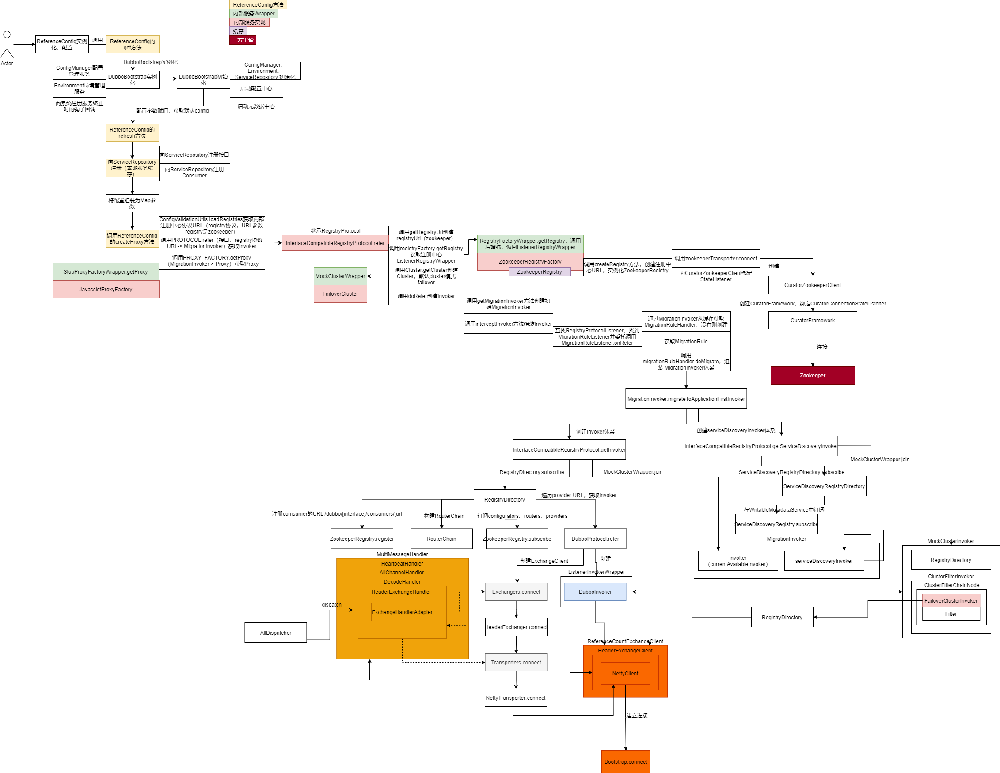
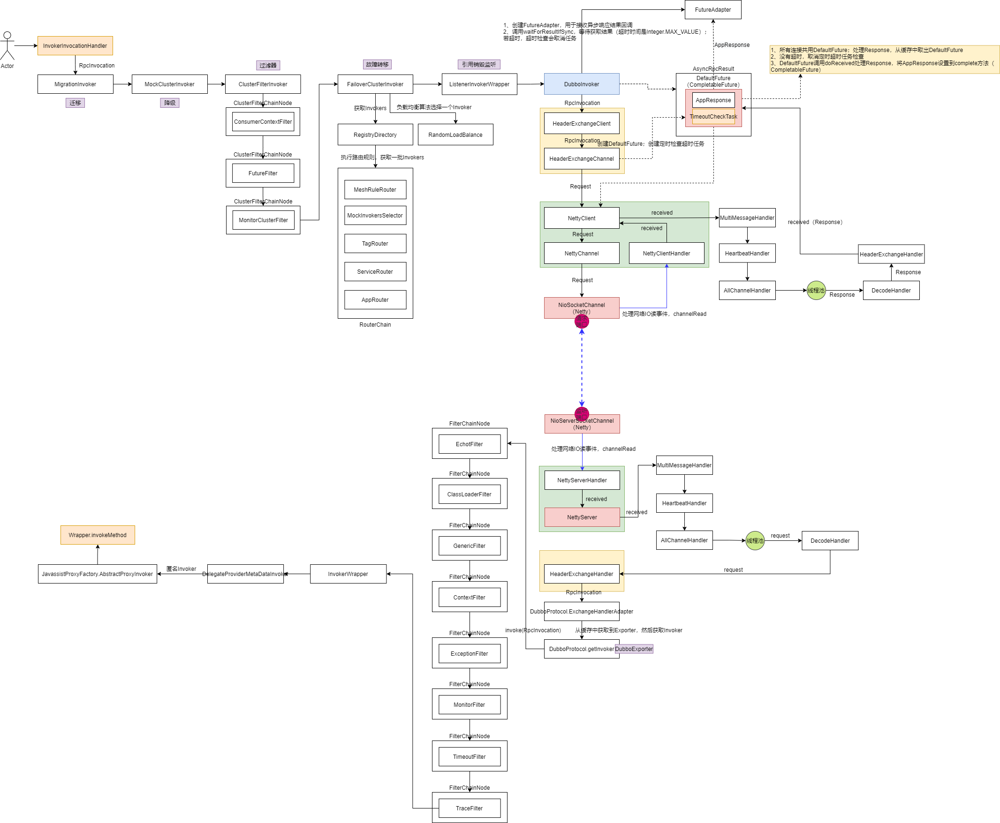

# 源码使用

- git clone git@github.com:yxyyyt/dubbo.git
- cd dubbo
- `git checkout -b dubbo-3.0.0.yxyyyt dubbo-3.0.0` 根据某一tag创建branch
- `git push -u origin dubbo-3.0.0.yxyyyt` 提交本地分支到远程


# 动态生成类源码

通过 `java -jar arthas-boot.jar --telnet-port 9998 --http-port -1` 测试

## Protocol

`com.alibaba.dubbo.rpc.Protocol$Adaptive` Protocol适配器扩展服务

```java
package com.alibaba.dubbo.rpc;

import com.alibaba.dubbo.common.URL;
import com.alibaba.dubbo.common.extension.ExtensionLoader;
import com.alibaba.dubbo.rpc.Exporter;
import com.alibaba.dubbo.rpc.Invoker;
import com.alibaba.dubbo.rpc.Protocol;
import com.alibaba.dubbo.rpc.RpcException;

public class Protocol$Adaptive
implements Protocol {
    public Exporter export(Invoker invoker) throws RpcException {
        String string;
        if (invoker == null) {
            throw new IllegalArgumentException("com.alibaba.dubbo.rpc.Invoker argument == null");
        }
        if (invoker.getUrl() == null) {
            throw new IllegalArgumentException("com.alibaba.dubbo.rpc.Invoker argument getUrl() == null");
        }
        URL uRL = invoker.getUrl();
        String string2 = string = uRL.getProtocol() == null ? "dubbo" : uRL.getProtocol();
        if (string == null) {
            throw new IllegalStateException(new StringBuffer().append("Fail to get extension(com.alibaba.dubbo.rpc.Protocol) name from url(").append(uRL.toString()).append(") use keys([protocol])").toString());
        }
        Protocol protocol = ExtensionLoader.getExtensionLoader(Protocol.class).getExtension(string);
        return protocol.export(invoker);
    }

    public Invoker refer(Class class_, URL uRL) throws RpcException {
        String string;
        if (uRL == null) {
            throw new IllegalArgumentException("url == null");
        }
        URL uRL2 = uRL;
        String string2 = string = uRL2.getProtocol() == null ? "dubbo" : uRL2.getProtocol();
        if (string == null) {
            throw new IllegalStateException(new StringBuffer().append("Fail to get extension(com.alibaba.dubbo.rpc.Protocol) name from url(").append(uRL2.toString()).append(") use keys([protocol])").toString());
        }
        Protocol protocol = ExtensionLoader.getExtensionLoader(Protocol.class).getExtension(string);
        return protocol.refer(class_, uRL);
    }

    @Override
    public void destroy() {
        throw new UnsupportedOperationException("method public abstract void com.alibaba.dubbo.rpc.Protocol.destroy() of interface com.alibaba.dubbo.rpc.Protocol is not adaptive method!");
    }

    @Override
    public int getDefaultPort() {
        throw new UnsupportedOperationException("method public abstract int com.alibaba.dubbo.rpc.Protocol.getDefaultPort() of interface com.alibaba.dubbo.rpc.Protocol is not adaptive method!");
    }
}
```


## ProxyFactory

`com.alibaba.dubbo.rpc.ProxyFactory$Adaptive` ProxyFactory适配器扩展服务

```java
package com.alibaba.dubbo.rpc;

import com.alibaba.dubbo.common.URL;
import com.alibaba.dubbo.common.extension.ExtensionLoader;
import com.alibaba.dubbo.rpc.Invoker;
import com.alibaba.dubbo.rpc.ProxyFactory;
import com.alibaba.dubbo.rpc.RpcException;

public class ProxyFactory$Adaptive
implements ProxyFactory {
    public Object getProxy(Invoker invoker) throws RpcException {
        if (invoker == null) {
            throw new IllegalArgumentException("com.alibaba.dubbo.rpc.Invoker argument == null");
        }
        if (invoker.getUrl() == null) {
            throw new IllegalArgumentException("com.alibaba.dubbo.rpc.Invoker argument getUrl() == null");
        }
        URL uRL = invoker.getUrl();
        String string = uRL.getParameter("proxy", "javassist");
        if (string == null) {
            throw new IllegalStateException(new StringBuffer().append("Fail to get extension(com.alibaba.dubbo.rpc.ProxyFactory) name from url(").append(uRL.toString()).append(") use keys([proxy])").toString());
        }
        ProxyFactory proxyFactory = ExtensionLoader.getExtensionLoader(ProxyFactory.class).getExtension(string);
        return proxyFactory.getProxy(invoker);
    }

    public Object getProxy(Invoker invoker, boolean bl) throws RpcException {
        if (invoker == null) {
            throw new IllegalArgumentException("com.alibaba.dubbo.rpc.Invoker argument == null");
        }
        if (invoker.getUrl() == null) {
            throw new IllegalArgumentException("com.alibaba.dubbo.rpc.Invoker argument getUrl() == null");
        }
        URL uRL = invoker.getUrl();
        String string = uRL.getParameter("proxy", "javassist");
        if (string == null) {
            throw new IllegalStateException(new StringBuffer().append("Fail to get extension(com.alibaba.dubbo.rpc.ProxyFactory) name from url(").append(uRL.toString()).append(") use keys([proxy])").toString());
        }
        ProxyFactory proxyFactory = ExtensionLoader.getExtensionLoader(ProxyFactory.class).getExtension(string);
        return proxyFactory.getProxy(invoker, bl);
    }

    public Invoker getInvoker(Object object, Class class_, URL uRL) throws RpcException {
        if (uRL == null) {
            throw new IllegalArgumentException("url == null");
        }
        URL uRL2 = uRL;
        String string = uRL2.getParameter("proxy", "javassist");
        if (string == null) {
            throw new IllegalStateException(new StringBuffer().append("Fail to get extension(com.alibaba.dubbo.rpc.ProxyFactory) name from url(").append(uRL2.toString()).append(") use keys([proxy])").toString());
        }
        ProxyFactory proxyFactory = ExtensionLoader.getExtensionLoader(ProxyFactory.class).getExtension(string);
        return proxyFactory.getInvoker(object, class_, uRL);
    }
}
```


## RegistryFactory

`com.alibaba.dubbo.registry.RegistryFactory$Adaptive` RegistryFactory适配器扩展服务

```java
package com.alibaba.dubbo.registry;

import com.alibaba.dubbo.common.URL;
import com.alibaba.dubbo.common.extension.ExtensionLoader;
import com.alibaba.dubbo.registry.Registry;
import com.alibaba.dubbo.registry.RegistryFactory;

public class RegistryFactory$Adaptive
implements RegistryFactory {
    @Override
    public Registry getRegistry(URL uRL) {
        String string;
        if (uRL == null) {
            throw new IllegalArgumentException("url == null");
        }
        URL uRL2 = uRL;
        String string2 = string = uRL2.getProtocol() == null ? "dubbo" : uRL2.getProtocol();
        if (string == null) {
            throw new IllegalStateException(new StringBuffer().append("Fail to get extension(com.alibaba.dubbo.registry.RegistryFactory) name from url(").append(uRL2.toString()).append(") use keys([protocol])").toString());
        }
        RegistryFactory registryFactory = ExtensionLoader.getExtensionLoader(RegistryFactory.class).getExtension(string);
        return registryFactory.getRegistry(uRL);
    }
}
```


## Wrapper（Provider）

`com.alibaba.dubbo.common.bytecode.Wrapper0` 扩展点 `interface com.alibaba.dubbo.config.api.DemoService` 的代理Wrapper

- 被Wrapper缓存，后缀数字从0开始
- 此wrapper的目的是为了获取**扩展点**的所有方法
- 在发布时通过反射生成Wrapper，<font color=red>注意</font>在方法调用时不使用反射调用（性能低），而是通过javassist生成的静态方法调用
- <font color=red>接口或实现类的Wrapper，本质上没有区别，只是强转时类型不同</font>

```java
package com.alibaba.dubbo.common.bytecode;

import com.alibaba.dubbo.common.bytecode.ClassGenerator;
import com.alibaba.dubbo.common.bytecode.NoSuchMethodException;
import com.alibaba.dubbo.common.bytecode.NoSuchPropertyException;
import com.alibaba.dubbo.common.bytecode.Wrapper;
import com.sciatta.dev.java.dubbo.api.Box;
import com.sciatta.dev.java.dubbo.api.DemoService;
import java.lang.reflect.InvocationTargetException;
import java.util.List;
import java.util.Map;

public class Wrapper0
extends Wrapper
implements ClassGenerator.DC {
    public static String[] pns;
    public static Map pts;
    public static String[] mns;
    public static String[] dmns;
    public static Class[] mts0;
    public static Class[] mts1;
    public static Class[] mts2;
    public static Class[] mts3;
    public static Class[] mts4;
    public static Class[] mts5;

    @Override
    public String[] getDeclaredMethodNames() {
        return dmns;
    }

    @Override
    public String[] getMethodNames() {
        return mns;
    }

    @Override
    public String[] getPropertyNames() {
        return pns;
    }

    public Class getPropertyType(String string) {
        return (Class)pts.get(string);
    }

    @Override
    public boolean hasProperty(String string) {
        return pts.containsKey(string);
    }

    @Override
    public Object getPropertyValue(Object object, String string) {
        DemoService demoService;
        try {
            demoService = (DemoService)object;
        }
        catch (Throwable throwable) {
            throw new IllegalArgumentException(throwable);
        }
        if (string.equals("box")) {
            return demoService.getBox();
        }
        throw new NoSuchPropertyException(new StringBuffer().append("Not found property \"").append(string).append("\" filed or setter method in class com.sciatta.dev.java.dubbo.api.DemoService.").toString());
    }

    @Override
    public void setPropertyValue(Object object, String string, Object object2) {
        DemoService demoService;
        try {
            demoService = (DemoService)object;
        }
        catch (Throwable throwable) {
            throw new IllegalArgumentException(throwable);
        }
        if (string.equals("box")) {
            demoService.setBox((Box)object2);
            return;
        }
        throw new NoSuchPropertyException(new StringBuffer().append("Not found property \"").append(string).append("\" filed or setter method in class com.sciatta.dev.java.dubbo.api.DemoService.").toString());
    }

    public Object invokeMethod(Object object, String string, Class[] arrclass, Object[] arrobject) throws InvocationTargetException {
        DemoService demoService;
        try {
            demoService = (DemoService)object;
        }
        catch (Throwable throwable) {
            throw new IllegalArgumentException(throwable);
        }
        try {
            if ("setBox".equals(string) && arrclass.length == 1) {
                demoService.setBox((Box)arrobject[0]);
                return null;
            }
            if ("sayName".equals(string) && arrclass.length == 1) {
                return demoService.sayName((String)arrobject[0]);
            }
            if ("getBox".equals(string) && arrclass.length == 0) {
                return demoService.getBox();
            }
            if ("throwDemoException".equals(string) && arrclass.length == 0) {
                demoService.throwDemoException();
                return null;
            }
            if ("getUsers".equals(string) && arrclass.length == 1) {
                return demoService.getUsers((List)arrobject[0]);
            }
            if ("echo".equals(string) && arrclass.length == 1) {
                return new Integer(demoService.echo(((Number)arrobject[0]).intValue()));
            }
        }
        catch (Throwable throwable) {
            throw new InvocationTargetException(throwable);
        }
        throw new NoSuchMethodException(new StringBuffer().append("Not found method \"").append(string).append("\" in class com.sciatta.dev.java.dubbo.api.DemoService.").toString());
    }
}
```


`com.alibaba.dubbo.common.bytecode.Wrapper1` 扩展 `class com.alibaba.dubbo.config.provider.impl.DemoServiceImpl` 的代理Wrapper

```java
package com.alibaba.dubbo.common.bytecode;

import com.alibaba.dubbo.common.bytecode.ClassGenerator;
import com.alibaba.dubbo.common.bytecode.NoSuchMethodException;
import com.alibaba.dubbo.common.bytecode.NoSuchPropertyException;
import com.alibaba.dubbo.common.bytecode.Wrapper;
import com.sciatta.dev.java.dubbo.api.Box;
import com.sciatta.dev.java.dubbo.api.provider.impl.DemoServiceImpl;
import java.lang.reflect.InvocationTargetException;
import java.util.List;
import java.util.Map;

public class Wrapper1
extends Wrapper
implements ClassGenerator.DC {
    public static String[] pns;
    public static Map pts;
    public static String[] mns;
    public static String[] dmns;
    public static Class[] mts0;
    public static Class[] mts1;
    public static Class[] mts2;
    public static Class[] mts3;
    public static Class[] mts4;
    public static Class[] mts5;

    @Override
    public String[] getPropertyNames() {
        return pns;
    }

    public Class getPropertyType(String string) {
        return (Class)pts.get(string);
    }

    @Override
    public boolean hasProperty(String string) {
        return pts.containsKey(string);
    }

    @Override
    public Object getPropertyValue(Object object, String string) {
        DemoServiceImpl demoServiceImpl;
        try {
            demoServiceImpl = (DemoServiceImpl)object;
        }
        catch (Throwable throwable) {
            throw new IllegalArgumentException(throwable);
        }
        if (string.equals("box")) {
            return demoServiceImpl.getBox();
        }
        throw new NoSuchPropertyException(new StringBuffer().append("Not found property \"").append(string).append("\" filed or setter method in class com.sciatta.dev.java.dubbo.api.provider.impl.DemoServiceImpl.").toString());
    }

    @Override
    public void setPropertyValue(Object object, String string, Object object2) {
        DemoServiceImpl demoServiceImpl;
        try {
            demoServiceImpl = (DemoServiceImpl)object;
        }
        catch (Throwable throwable) {
            throw new IllegalArgumentException(throwable);
        }
        if (string.equals("box")) {
            demoServiceImpl.setBox((Box)object2);
            return;
        }
        throw new NoSuchPropertyException(new StringBuffer().append("Not found property \"").append(string).append("\" filed or setter method in class com.sciatta.dev.java.dubbo.api.provider.impl.DemoServiceImpl.").toString());
    }

    public Object invokeMethod(Object object, String string, Class[] arrclass, Object[] arrobject) throws InvocationTargetException {
        DemoServiceImpl demoServiceImpl;
        try {
            demoServiceImpl = (DemoServiceImpl)object;
        }
        catch (Throwable throwable) {
            throw new IllegalArgumentException(throwable);
        }
        try {
            if ("setBox".equals(string) && arrclass.length == 1) {
                demoServiceImpl.setBox((Box)arrobject[0]);
                return null;
            }
            if ("getUsers".equals(string) && arrclass.length == 1) {
                return demoServiceImpl.getUsers((List)arrobject[0]);
            }
            if ("sayName".equals(string) && arrclass.length == 1) {
                return demoServiceImpl.sayName((String)arrobject[0]);
            }
            if ("getBox".equals(string) && arrclass.length == 0) {
                return demoServiceImpl.getBox();
            }
            if ("throwDemoException".equals(string) && arrclass.length == 0) {
                demoServiceImpl.throwDemoException();
                return null;
            }
            if ("echo".equals(string) && arrclass.length == 1) {
                return new Integer(demoServiceImpl.echo(((Number)arrobject[0]).intValue()));
            }
        }
        catch (Throwable throwable) {
            throw new InvocationTargetException(throwable);
        }
        throw new NoSuchMethodException(new StringBuffer().append("Not found method \"").append(string).append("\" in class com.sciatta.dev.java.dubbo.api.provider.impl.DemoServiceImpl.").toString());
    }

    @Override
    public String[] getMethodNames() {
        return mns;
    }

    @Override
    public String[] getDeclaredMethodNames() {
        return dmns;
    }
}
```


## Proxy（Consumer）

**com.alibaba.dubbo.common.bytecode.Proxy0**

Proxy抽象类的子类可实例化

```java
package com.alibaba.dubbo.common.bytecode;

import com.alibaba.dubbo.common.bytecode.ClassGenerator;
import com.alibaba.dubbo.common.bytecode.Proxy;
import com.alibaba.dubbo.common.bytecode.proxy0;
import java.lang.reflect.InvocationHandler;

public class Proxy0
extends Proxy
implements ClassGenerator.DC {
    @Override
    public Object newInstance(InvocationHandler invocationHandler) {
        return new proxy0(invocationHandler);
    }
}
```


**com.alibaba.dubbo.common.bytecode.proxy0**

服务接口的代理类

```java
package com.alibaba.dubbo.common.bytecode;

import com.alibaba.dubbo.common.bytecode.ClassGenerator;
import com.alibaba.dubbo.rpc.service.EchoService;
import com.sciatta.dev.java.dubbo.api.Box;
import com.sciatta.dev.java.dubbo.api.DemoException;
import com.sciatta.dev.java.dubbo.api.DemoService;
import java.lang.reflect.InvocationHandler;
import java.lang.reflect.Method;
import java.util.List;

public class proxy0
implements ClassGenerator.DC,
EchoService,
DemoService {
    public static Method[] methods;
    private InvocationHandler handler;

    public String sayName(String string) {
        Object[] arrobject = new Object[]{string};
        Object object = this.handler.invoke(this, methods[0], arrobject);
        return (String)object;
    }

    public Box getBox() {
        Object[] arrobject = new Object[]{};
        Object object = this.handler.invoke(this, methods[1], arrobject);
        return (Box)object;
    }

    public List getUsers(List list) {
        Object[] arrobject = new Object[]{list};
        Object object = this.handler.invoke(this, methods[2], arrobject);
        return (List)object;
    }

    public int echo(int n) {
        Object[] arrobject = new Object[1];
        new Integer(n);
        Object object = this.handler.invoke(this, methods[3], arrobject);
        return object == null ? 0 : (Integer)object;
    }

    public void setBox(Box box) {
        Object[] arrobject = new Object[]{box};
        Object object = this.handler.invoke(this, methods[4], arrobject);
    }

    public void throwDemoException() throws DemoException {
        Object[] arrobject = new Object[]{};
        Object object = this.handler.invoke(this, methods[5], arrobject);
    }

    @Override
    public Object $echo(Object object) {
        Object[] arrobject = new Object[]{object};
        Object object2 = this.handler.invoke(this, methods[6], arrobject);
        return object2;
    }

    public proxy0(InvocationHandler invocationHandler) {
        this.handler = invocationHandler;
    }

    public proxy0() {
    }
```


# 核心流程

## 服务导出

服务导出的本质是启动 Provider Server 监听，注册中心发布。

核心流程

- interface，target —ProxyFactory.getInvoker—> Invoker
- invoker —Protocol.export—> exporter

注册中心Zookeeper数据

- 服务提供者
  - /dubbo/[interface]/providers/[url]
  - /dubbo/[interface]/configurators
- 元数据中心
  - /dubbo/metadata/[interface]/provider/[application]
  - /dubbo/mapping/[interface]




## 服务引用

服务引用的本质是从注册中心发现目标 Provider Server，然后同其建立连接。

核心流程

- interface —Protocol.refer—> Invoker

- Invoker —ProxyFactory.getProxy—> Proxy

注册中心Zookeeper数据

- 服务消费者
  - /dubbo/[interface]/consumers/[url]
  - /dubbo/[interface]/configurators
  - /dubbo/[interface]/routers





## 服务调用

网络通信使用的是netty的reactor模型；netty的boss和worker线程只处理IO操作，业务操作交给业务线程池处理，避免业务操作阻塞。





# 模块拆解

## 服务发现

### 服务引用

首次调用 MigrationInvoker.refreshInterfaceInvoker 创建Invoker体系，调用 InterfaceCompatibleRegistryProtocol.getInvoker获取Invoker

- 创建 **RegistryDirectory** （负责服务发现）
- 向注册中心注册ConsumerUrl
- 为 **RegistryDirectory** 创建 RouterChain
- 调用 **RegistryDirectory.subscribe**，向注册中心订阅providers、configurators、routers
  - 委托 ZookeeperRegistry.subscribe，向Zookeeper订阅providers、configurators、routers，注册 RegistryChildListenerImpl（本质是创建CuratorWatcher，当目录有变动时，会调用CuratorWatcher.process，如通知providers下的子节点变化）
  - 当订阅目录有变动时，通知 **RegistryDirectory.notify** 订阅路径子节点变更，更新缓存 <font color=red>cachedInvokerUrls、invokers、urlInvokerMap</font>，设置 <font color=red>RouterChain.setInvokers</font> 的 invokers 缓存供后续服务调用时使用

### 服务调用

调用FailoverClusterInvoker，委托 **RegistryDirectory.list**，委托 RouterChain.route，所有缓存的 invokers  缓存执行路由算法后返回满足条件的所有 Invoker


## 负载均衡

- RandomLoadBalance

  加权随机

  如：S1，S2，S1的权重为7，S2的权重为3。这些权重值分布在坐标区间会得到：S1->[0, 7) ，S2->[7, 10)。我们生成[0, 10) 之间的随机数，随机数落到对应的区间，我们就选择对应的服务器来处理请求。

- RoundRobinLoadBalance

  加权轮循

- LeastActiveLoadBalance

  最小活跃数

  初始状态下所有服务提供者的活跃数均为 0，收到请求+1，处理完成-1。

- ShortestResponseLoadBalance

-  ConsistentHashLoadBalance


## 远程方法调用

- 单向发送
- 异步双向发送


## SPI机制

### JDK原生实现

- `ServiceLoader` 类负责<font color=red>服务发现</font>
- 解析类路径下以 `META-INF/services/` 作为前缀，接口名称作为文件名的文件，文件内部为实现类的完全限定类名，可以多行
- 首先查找已经被解析缓存的实现类，如果没有再去解析文件获取实现类
- 在解析文件过程中，由<font color=red>延迟加载</font>迭代器 `LazyIterator` 负责，目的是迭代过程中如果找到了所需要的实现就可以及时退出迭代过程，未迭代的实现类不会加载，加速了迭代，避免加载不需要的实现类
  - 符合接口名称的文件，逐个文件迭代
  - `Class.forName(cn, false, loader)` 延迟加载类文件到JVM，当 `initialize` 为false时，不会立即执行类的 `static` 块代码，只有类实例化的时候才会执行，也是为了加速遍历
  - **实例化Class（不支持按需实例化服务，导致不需要的Class，只要遍历到，就会被实例化）**


### 优势

- 延迟按需加载，通过服务名称明确获得实现类的实例

  加载接口所有实现类的Class后缓存，可以通过服务名称获取服务，只需要实例化此服务Class的实例；而JDK每次查找实现时都需要逐个迭代实现类，然后实例化，可能会实例化大量不需要的服务实现

- 支持扩展的IOC，AOP增强


### 分析

- `ExtensionLoader` 类负责<font color=red>服务发现</font>，待查找实现的类必须是**接口**、必须有**@SPI**注解

  - 接口（扩展点）和 `ExtensionLoader` 一一对应

  - 通过 `ExtensionLoader` 获取 <font color=red>Extension（获取指定扩展）</font>

    1. 加载**所有**扩展Class并缓存

    2. 实例化**特定**扩展并缓存，不需要的不必实例化

       - <font color=red>**支持IOC**</font>：通过 `AdaptiveExtensionFactory` 为特定扩展实例**查找**待注入所需依赖。 `AdaptiveExtensionFactory` 实现了扩展点 `ExtensionFactory` ，其也是一个@SPI扩展点，同样也需要获取扩展。

         1. 加载扩展 `SpiExtensionFactory` 基于SPI机制
         2. 加载Adaptive类型扩展，实现类上有@Adaptive注解 `AdaptiveExtensionFactory` ，**其作为 `ExtensionLoader` 内部的对象工厂**

         以set开头的方法为待注入扩展， `AdaptiveExtensionFactory` 委托 `SpiExtensionFactory` 获取指定扩展点的AdaptiveExtension为其注入，调用@Adaptive标注的方法时通过URL参数可以**动态**获得指定扩展实现并调用

       - <font color=red>**支持wrapper模式AOP增强扩展**</font>：在文件中配置的扩展实现扩展点，并包含以扩展点作为参数的构造函数，对每一个扩展实现功能增强

  - 通过 `ExtensionLoader` 获取 <font color=red>AdaptiveExtension（通过URL参数动态获取扩展）</font>，一个扩展点只能有一个AdaptiveExtension

    - @Adaptive注解的扩展服务实现
    - @Adaptive注解的扩展点方法，为扩展点动态生成Adaptive类，只适配@Adaptive注解的方法，通过URL参数获得扩展名称动态获取target扩展

  - 通过 `ExtensionLoader` 获取 <font color=red>ActivateExtension（同时获取一组扩展）</font> ，基于条件获取启用的扩展服务列表

    - @Activate注解的扩展服务实现
      - 传入参数Group和Activate的Group匹配
      - 传入参数URL的Parameters和Activate的Value匹配
      - 传入参数values和扩展名称匹配

- 服务发现目录，文件名称为接口名称，内部以 `key=value` 形式组成，key是服务名称，value是扩展服务的完全限定类名；# 后面是注释

  - `META-INF/dubbo/internal/`
  - `META-INF/dubbo/`
  - `META-INF/services/` 兼容Jdk原生SPI服务发现

- 注解

  - @SPI 注解在接口上
    - value属性，表示该接口的默认实现
  - @Adaptive 注解在接口的方法或实现类上
    - 注解位置
      - 类：已实现的适配器类，不提供具体业务支持。用来适配扩展点的其他扩展
      - 方法：动态生成适配器类，通过**URL**携带的参数，来选择对应的扩展实现
    - 参数value是string数组类型，表示可以通过多个元素依次查找实现类
  - @Activate 注解在实现类上，基于条件获取一组扩展
    - group 表示URL中的分组如果匹配的话就激活，可以设置多个
    - value 查找URL中如果含有该key值，存在就会激活
    - before 表示哪些扩展点需要在本扩展点的前面
    - after 表示哪些扩展点需要在本扩展点的后面
    - order 排序信息
  - @DisableInject 注解在接口的set方法上，不会自动注入扩展


## Dubbo协议

### 协议

#### Request

header，16bytes

| 类型   | 字段                         | 字节数                 | 序号  |
| ------ | ---------------------------- | ---------------------- | ----- |
| 报文头 | magic                        | 2字节（固定值 0xdabb） | 0,1   |
| 报文头 | serialization，twoway，event | 1字节                  | 2     |
| 报文头 |                              | 1字节                  | 3     |
| 报文头 | requestId                    | 8字节                  | 4~11  |
| 报文头 | payload length               | 4字节                  | 12~15 |
| 报文体 | payload                      | 默认不可超过8M         | 16~X  |


#### Response

header，16bytes

| 类型   | 字段                 | 字节数                 | 序号  |
| ------ | -------------------- | ---------------------- | ----- |
| 报文头 | magic                | 2字节（固定值 0xdabb） | 0,1   |
| 报文头 | serialization，event | 1字节                  | 2     |
| 报文头 | status               | 1字节                  | 3     |
| 报文头 | responseId           | 8字节                  | 4~11  |
| 报文头 | payload length       | 4字节                  | 12~15 |
| 报文体 | payload              | 默认不可超过8M         | 16~X  |


### 编解码

**netty handler**

```netty
head->h1->h2->h3->tail

inBound 读
head, h1, h2, h3, tail

outBound 写
tail, h3, h2, h1, head
```


**dubbo handler**

```dubbo
NettyCodecAdapter.InternalDecoder ->NettyCodecAdapter.InternalEncoder->NettyClientHandler

inbound 读
NettyCodecAdapter.InternalDecoder, NettyClientHandler

outbound 写
NettyClientHandler, NettyCodecAdapter.InternalEncoder
```


**OutBound（Request）**

- NettyClientHandler 

- NettyCodecAdapter.InternalEncoder（DubboCodec 继承ExchangeCodec）
  - ExchangeCodec 编码报文头
  - DubboCodec 编码报文体（RpcInvocation）


**InBound（Response）**

- NettyCodecAdapter.InternalDecoder（DubboCodec 继承ExchangeCodec）

  IO线程

  - ExchangeCodec解码报文头

  - DubboCodec 解码报文体（报文体封装为DecodeableRpcResult，报文体ByteBufer转换为Byte数组<font color=red>延迟到业务线程</font>解析）

- NettyClientHandler（Handler责任链）

  业务线程

  - DecodeHandler，从Response中获取DecodeableRpcResult，由DecodeableRpcResult自己解析报文体


- NettyCodecAdapter聚合编解码，委托 DubboCodec 提供编解码功能（继承ExchangeCodec），负责将Request和Response和字节流进行转换。
  - 在解码过程中，只解析报文头，如为RpcInvocation报文体构造一个DecodeableRpcInvocation设置到Request的data字段，报文体的解析**延迟到业务线程**
- DecodeHandler负责解析Request的data字段（Response的result字段），其是DecodeableRpcInvocation（DecodeableRpcResult）类型，尤其自解析


## 流量管控

细粒度管理流量路由，单元 / 机房；

发布策略

- 蓝绿发布（机器冗余），新老版本冗余部署，互为热备，解决系统可用性问题
- A / b测试（需要预估匹配规则请求规模分配一部分机器），特定请求路由到新版本
- 金丝雀 / 灰度发布（少量机器），少量请求按权重无差别路由到新版本，根据情况扩容、切换新版本机器


## 线程池管理

- DefaultExecutorRepository 管理系统内所有线程池和调度器
  - 特定业务的线程池/调度器
  - 共享线程池/调度器
  - 循环申请线程池/调度器
  - 消费者 / 生产者（按协议端口）服务隔离线程池（可缓存）
- ThreadPool
  -  FixedThreadPool（默认）
  -  CachedThreadPool
  -  MockThreadPool
  -  LimitedThreadPool
  -  EagerThreadPoolExecutor 队列满了，尝试立即再提交一次
  -  ThreadlessExecutor 用于防止线程忙等


# 设计思路

- Consumer和Provider角色分离，应用不同场景，高内聚，低耦合
- Model多层级体系module、application、framework，门面模式，聚合公共组件，统一使用标准，调用方式
- Repository公共存储数据组件，存储，读写；同一类数据变量，不同人处理方式不同，到处缓存
- 拆分注册中心、配置中心、元数据中心，不同分类数据解耦；不同中心数据量不同（可扩展，扩容；可用性）
- 不同职能的Invoker，责任链模式
- 框架分层
  - Service，业务定义
  - Config，面向应用
  - Proxy，封装代理逻辑
  - Registry
  - Cluster，集群，容错，负载均衡，路由
  - Monitor
  - Protocol，不同协议，通讯方式不同，报文不同，导出和引用的逻辑不同
  - Exchange，request/response 请求响应模型，同步转异步
  - Transport，抽象网络框架
    - netty reactor模型，拆分IO线程（单线程，不能阻塞）和业务线程
  - Serialize
- SPI机制，动态扩展，插件机制；按name，adaptive动态自适应，activate批量激活
  - Spring cloud 通过配置文件扩展组件
- 线程池、调度器统一管理，可共享，可隔离


# 生产经验

- ZK网络抖动导致的Provider注册表数据丢失问题

  2.6.x版本，Provider和zk的session过期后，会重新创建一个Session，zk会通知Provider，在之前会删除在zk上建立的临时节点；但可能先通知，会没有删除，会删除出现异常，此时Provider在去建立临时节点时，节点已经存在，不在建立；后面，zk再删除临时节点，导致数据丢失。

  2.7.x修复，Provider创建临时节点，如果发现已经存在，则先删除，再去创建。
