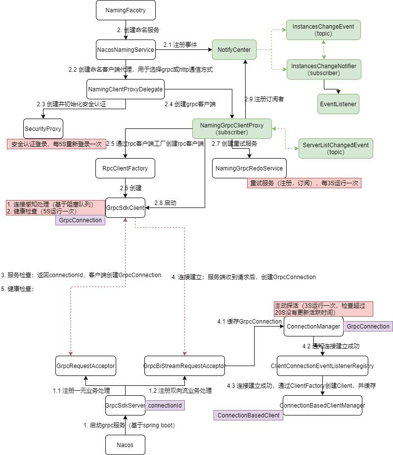
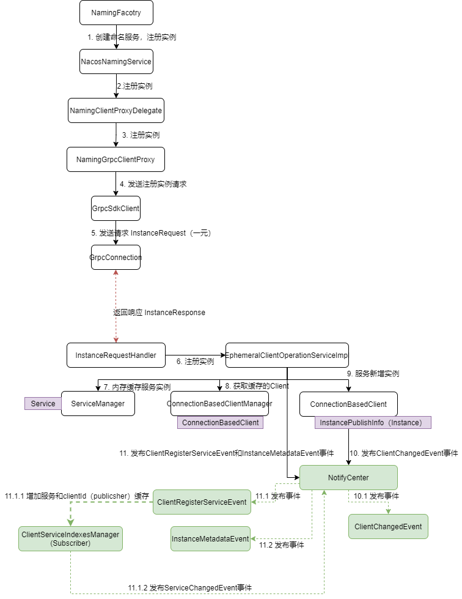
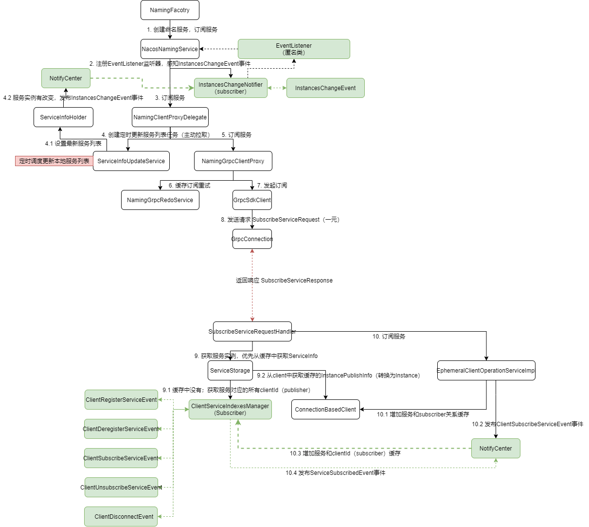
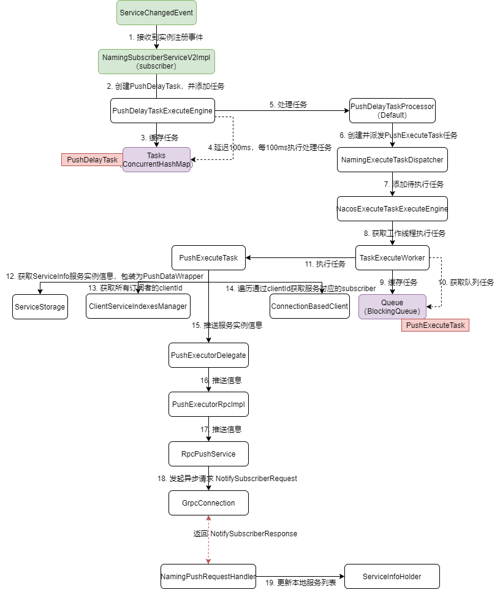

# 基础

## 服务注册中心

- 服务注册

- 服务发现

## 动态配置中心

配置数据保存到MySQL中。

- 获取数据
- 监听数据

## 部署

### 单机

- 执行数据库脚本 ` nacos-mysql.sql`
- 修改配置文件 `application.properties` 数据库部分
- 运行 `nohup sh startup.sh -m standalone &`
- 访问webui `http://192.168.80.8:8848/nacos/`

## 概念

### 服务注册

- 命名空间：环境隔离
- 服务
  - 一个服务可以有多个实例
  - 多个实例可以划分为多个集群；一个服务可以由多个集群组成
  - 服务可以划分到不同组，组可以认为是子系统
- 健康探测机制
  - 临时实例（默认）：每隔5S上报心跳，nacos如果15S没有收到心跳就标记为不健康，超过30S没收到心跳，则摘除这个服务实例
  - 持久实例：nacos每隔20S主动探测，探测失败标记为不健康；但不会摘除这个服务实例
- 健康保护阈值
  - 摘除大量实例可能会导致服务雪崩，大量请求打到所剩无几的健康服务实例上，导致所有服务实例不可用
  - 超过阈值，不再剔除不健康服务实例
- 协议
  - Distro（AP）
    - 注册
      - 随机写
      - 路由转发，会出现数据分片
      - 集群所有节点注册信息最终一致性
        - 定期同步
        - 心跳校验（补偿），比较M5，不一样，全量数据补齐
      - 新加入节点，轮询同步所有节点全量注册信息
    - 发现
      - 随机读
      - 一段时间读取不到，加监听（最终一致性）
  - Raft（弱CP）
    - 注册
      - leader选举，leader写，过半复制成功
    - 发现
      - 有一定几率读不到

### 动态配置

- 命名空间
- Data id：一份配置文件，一般对应一个服务
- Group
- 归属应用

# 源码分析

基于Nacos 2.0.4

- `git checkout -b 2.0.4.yxyyyt 2.0.4` 根据某一tag创建branch
- `git push -u origin 2.0.4.yxyyyt` 提交本地分支到远程

## 初始化

双向探活

- 客户端 -> 服务端，5秒一次健康检查
- 服务端 -> 客户端，延迟1S，每隔3S，检查超过20S没有更新活跃时间的客户端连接，发出主动探活请求到客户端

## 注册实例

- 当新增实例后发出ClientChangedEvent事件，节点会广播新增实例请求给其他所有节点同步数据（Distro协议，DistroClientDataProcessor）
  - 新增实例直连节点
  - 其他节点同步过来的新增实例
- 注册本地索引成功后，发出ServiceChangedEvent事件，主动向所有订阅服务的客户端推送实例

## 订阅服务

### 主动拉取

客户端定时更新本地服务列表

- 在没有失败的请求下，默认延迟1S，6S更新一次；若失败，则每次延迟时间*2；最长不超过60S

### 被动推送

服务端收到注册实例请求后，主动向所有订阅服务的客户端推送实例；时效性强，但必须有实例变更情况

- 延迟100ms，每100ms执行一次

## Distro协议

- 节点间相互建立连接
- 节点向其他所有节点发起全量同步数据请求
  - 当有一个节点正常返回快照之后，不管是否是全部数据，同步本地数据之后，都不再向其他节点再同步数据
- 节点向其他所有节点发起数据校验请求，包括当前节点的所有**直接连接**Client（轻量级校验，只包括ClientId），每5S定时执行一次
  - 校验成功，更新其他节点非直连Client的活跃时间
  - 校验失败，当前节点向校验失败节点发起新增服务实例请求
- 节点收到新增实例请求后，广播给其他所有节点。其他节点收到请求后，如果是新增实例，则发布事件通知监听当前节点的订阅者新增实例
- 各个节点相互独立，都可以响应写请求（注册），之后异步向其他所有节点广播
- 各个节点相互独立，都可以响应读请求（订阅），若当前读不到最新数据，之后主动拉取或被动推送可以保证数据的最终一致性
- 各个节点默认5秒检查一次，非直连Client是否失活（3分钟），如果失活，则从缓存中剔除；对于直连Client，由长连接双向探活保证活性
