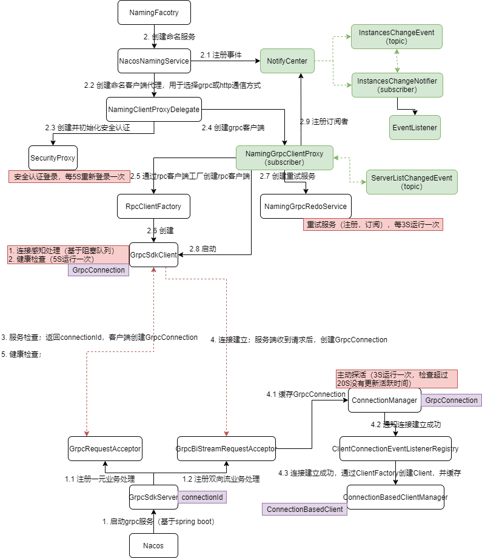
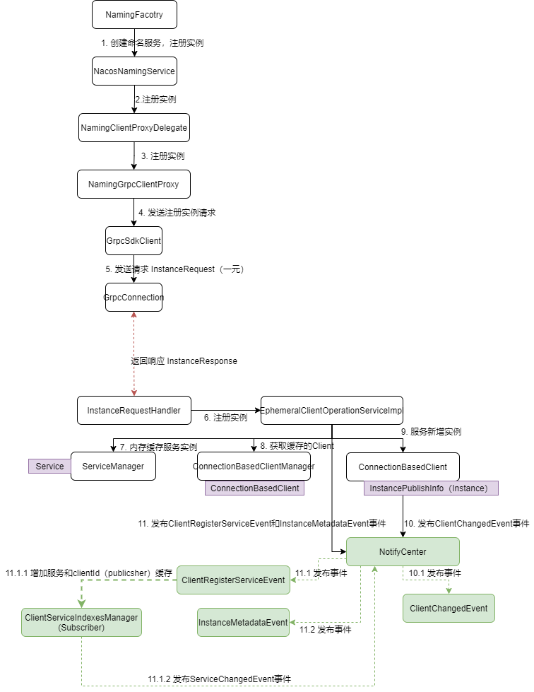
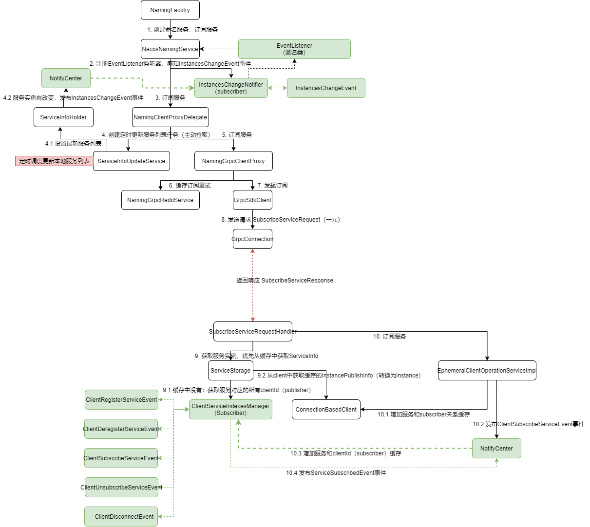
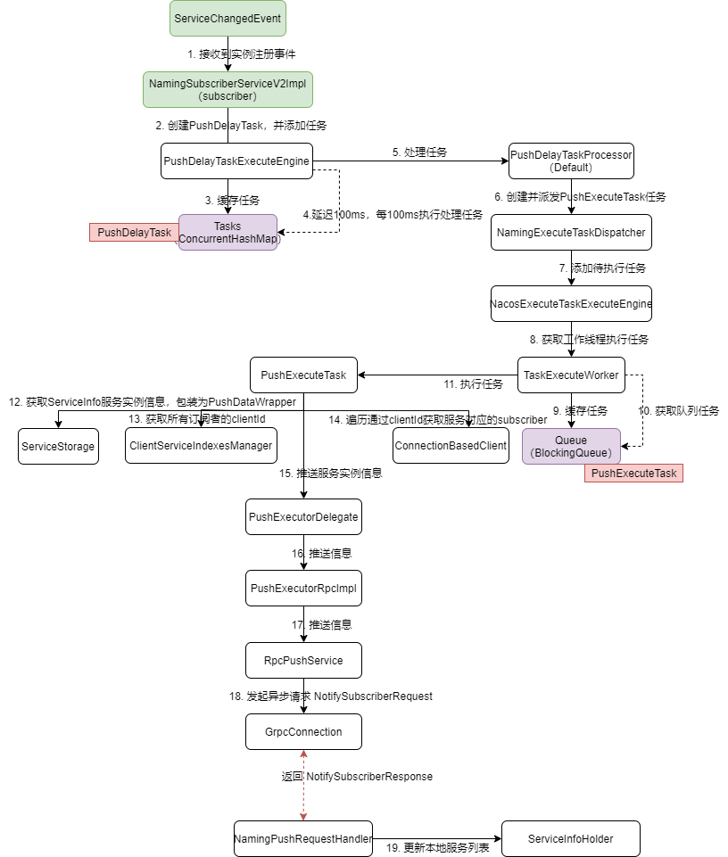

# 基础

## 服务注册中心

- 服务注册

- 服务发现

## 动态配置中心

配置数据保存到MySQL中。

- 获取数据
- 监听数据

## 部署

### 单机

- 执行数据库脚本 ` nacos-mysql.sql`
- 修改配置文件 `application.properties` 数据库部分
- 运行 `nohup sh startup.sh -m standalone &`
- 访问webui `http://192.168.80.8:8848/nacos/`

## 概念

### 服务注册

- 服务提供者 & 服务消费者
  - 服务提供者
    - spring.application.name 服务名，用于注册到Nacos
    - 依赖 
      - spring-cloud-starter-alibaba-nacos-discovery（**注册**）
        - 只要在项目中引入了 spring-cloud-starter-alibaba-nacos-discovery 依赖，应用默认会自动启用并注册到注册中心。不需要加注解 `@EnableDiscoveryClient`

  - 服务消费者
    - 添加注解
      - @EnableFeignClients(basePackages = "com.example.consumer.feign")

    - 路径：注意如果有 **server.servlet.context-path**，则需要作为请求路径的前缀
    - 依赖
      - spring-cloud-starter-alibaba-nacos-discovery（**发现**）
      - spring-cloud-starter-openfeign
      - spring-cloud-starter-loadbalancer  负载均衡（Spring Cloud 2020+ 必需）

- 命名空间：环境隔离
- 服务
  - 一个服务可以有多个实例
  - 多个实例可以划分为多个集群；一个服务可以由多个集群组成
  - 服务可以划分到不同组，组可以认为是子系统
- 健康探测机制
  - 临时实例（默认）：每隔5S上报心跳，nacos如果15S没有收到心跳就标记为不健康，超过30S没收到心跳，则摘除这个服务实例
  - 持久实例：nacos每隔20S主动探测，探测失败标记为不健康；但不会摘除这个服务实例
- 健康保护阈值
  - 摘除大量实例可能会导致服务雪崩，大量请求打到所剩无几的健康服务实例上，导致所有服务实例不可用
  - 超过阈值，不再剔除不健康服务实例
- 协议
  - Distro（AP）
    - 注册
      - 随机写
      - 路由转发，会出现数据分片
      - 集群所有节点注册信息最终一致性
        - 定期同步
        - 心跳校验（补偿），比较M5，不一样，全量数据补齐
      - 新加入节点，轮询同步所有节点全量注册信息
    - 发现
      - 随机读
      - 一段时间读取不到，加监听（最终一致性）
  - Raft（弱CP）
    - 注册
      - leader选举，leader写，过半复制成功
    - 发现
      - 有一定几率读不到

### 动态配置

- 基本概念，**唯一性**：只有 `Namespace + Group + Data ID`完全相同时，才会被认为是同一个配置。

  - Namespace

    - 最高级别的隔离，常用于区分环境（如开发、测试、生产）

    - Group
      - 在 Namespace 下的逻辑分组，用于区分业务模块

  - Data id：一份配置文件，一般对应一个服务
    - 具体的配置文件名称，是配置的最小单元

- Data ID 的命名格式
  - ${prefix}-${spring.profiles.active}.${file-extension}
    - ${prefix}
      - spring.application.name 微服务应用名
    - ${spring.profiles.active}
      - 环境标识
    - ${file-extension}
      - 文件扩展名

- 依赖
  - spring-cloud-starter-alibaba-nacos-config

# 源码分析

基于Nacos 2.0.4

- `git checkout -b 2.0.4.yxyyyt 2.0.4` 根据某一tag创建branch
- `git push -u origin 2.0.4.yxyyyt` 提交本地分支到远程

## 初始化

双向探活

- 客户端 -> 服务端，5秒一次健康检查
- 服务端 -> 客户端，延迟1S，每隔3S，检查超过20S没有更新活跃时间的客户端连接，发出主动探活请求到客户端

## 注册实例

- 当新增实例后发出ClientChangedEvent事件，节点会广播新增实例请求给其他所有节点同步数据（Distro协议，DistroClientDataProcessor）
  - 新增实例直连节点
  - 其他节点同步过来的新增实例
- 注册本地索引成功后，发出ServiceChangedEvent事件，主动向所有订阅服务的客户端推送实例

## 订阅服务

### 主动拉取

客户端定时更新本地服务列表

- 在没有失败的请求下，默认延迟1S，6S更新一次；若失败，则每次延迟时间*2；最长不超过60S

### 被动推送

服务端收到注册实例请求后，主动向所有订阅服务的客户端推送实例；时效性强，但必须有实例变更情况

- 延迟100ms，每100ms执行一次

# Distro协议

**Distro协议**是Nacos社区自研的一种**AP分布式协议**，专门为**临时实例**的服务发现场景设计。它属于CAP理论中的**AP模型**（可用性+分区容忍性），与负责配置管理的**CP模型**（基于Raft协议）形成互补。

## 服务注册

步骤1：客户端发起注册请求

步骤2：请求到达随机节点

- 客户端随机选择集群中的一个Nacos节点
- 该节点接收到注册请求

步骤3：**路由判断与转发**

1. 提取distroTag：从请求参数中提取实例信息（IP+port或service name）
2. 计算hash值：对distroTag进行hash计算
3. 确定责任节点：`hash值 % 节点总数 = 责任节点索引`
4. 转发判断： 如果计算出的责任节点是当前节点：直接处理 如果不是当前节点：将请求转发到责任节点

步骤4：**责任节点处理注册**

1. 解析请求：责任节点上的Controller解析写请求
2. 数据存储：将实例信息存储到内存缓存中
3. 更新本地数据：更新本节点负责的数据分片

步骤5：**异步数据同步**

1. 延迟任务：责任节点开启==1秒的延迟==同步任务
2. 批量同步：将本节点负责的所有实例变更批量同步到其他节点
3. 数据传播：其他节点接收并更新本地数据

步骤6：**服务变更通知**

- **UDP推送**：服务实例注册后，通过UDP方式推送到所有订阅该服务的客户端
- 实时感知：让其他服务实例及时感知服务列表的变化

步骤7：客户端收到成功响应时，**只保证数据已写入责任节点**

## 服务发现

步骤1：客户端发起查询请求

步骤2：请求到达任意节点

- 客户端可以连接集群中的任意Nacos节点
- 无需关心数据分片，因为每个节点都有全量数据

步骤3：本地数据查询

1. 内存查询：节点直接从本地内存缓存中查询服务实例数据
2. 数据过滤：根据健康状态、权重等条件过滤实例
3. 负载均衡：可结合客户端负载均衡策略选择实例

步骤4：返回查询结果

- 快速响应：由于是本地内存操作，响应延迟极低
- 数据可能陈旧：如果该节点尚未同步到最新数据，可能返回稍旧的数据

**订阅与推送机制**（推拉结合模式）

1. **初始拉取**：客户端启动时，向Server拉取目标服务的全量实例列表，本地缓存
2. **长连接订阅**：客户端和Server建立gRPC长连接，订阅目标服务的变更事件
3. **实时推送**：服务列表变更时，Server通过长连接主动推送给客户端

# Raft协议

**Raft**是一种**分布式一致性算法**，旨在替代Paxos算法，提供**更易理解**的实现。它由Diego Ongaro和John Ousterhout于2014年提出。

## 写流程

**客户端发送写请求到领导者**

- 客户端随机选择一个节点发送请求，==如果该节点不是领导者，它会返回领导者的地址（重定向）==。
- 客户端将请求发送到领导者。

**领导者追加日志条目**

- 领导者将客户端请求中的命令作为一个新的日志条目追加到本地日志中（此时未提交）。

**领导者并行发送AppendEntries RPC给所有跟随者**

- 领导者将新的日志条目通过AppendEntries RPC并行发送给所有跟随者。
- 如果跟随者成功复制了日志条目，则返回成功。

**领导者等待大多数节点的响应**

- 当领导者收到==大多数节点（包括自己）==的成功响应时，就认为该日志条目已经可以提交。
- 领导者将提交该日志条目（更新本地提交索引commitIndex）。

**领导者应用日志条目到状态机**

- 领导者将已提交的日志条目应用到状态机（执行命令，得到结果）。

**领导者响应客户端**

- 领导者将执行结果返回给客户端。

**跟随者提交并应用日志条目**

- 在后续的AppendEntries RPC中，领导者会将提交索引（commitIndex）通知给跟随者。
- 跟随者收到新的提交索引后，会将已提交的日志条目应用到自己的状态机。

## 读流程

**客户端发送读请求到领导者**

**领导者记录当前的提交索引（ReadIndex）**

- 领导者记录当前已提交的日志索引（即commitIndex）作为ReadIndex。

**领导者确认自己仍然是领导者**

- 领导者向所有跟随者发送一轮心跳（不包含日志条目的AppendEntries RPC）。
- 如果收到==大多数节点的响应==，则领导者可以确认自己仍然是领导者。

**等待状态机应用到ReadIndex**

- 领导者需要等待自己的状态机至少应用到了ReadIndex（即lastApplied >= ReadIndex）。
- 这是为了保证读取的数据至少是那个时间点的已提交数据。

**领导者读取本地状态机并返回结果**
