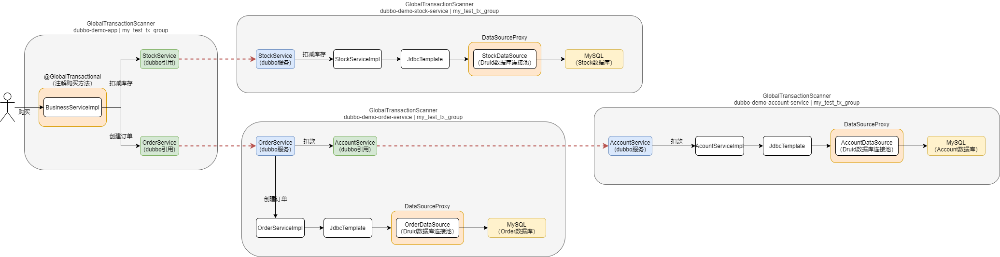
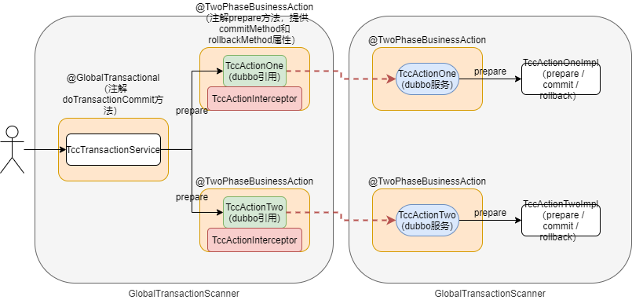
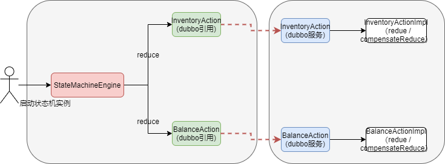
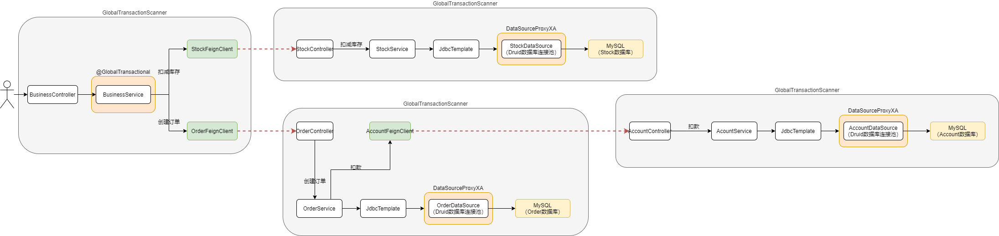

# 源码使用

## seata

- git clone git@github.com:yxyyyt/seata.git
- cd seata
- git checkout -b v1.5.0.yxyyyt v1.5.0
- git push -u origin v1.5.0.yxyyyt

## seata-samples

- git clone git@github.com:yxyyyt/seata-samples.git
- cd seata-samples
- git checkout -b 1.5.0.yxyyyt origin/1.5.0
- git push -u origin 1.5.0.yxyyyt

# AT

## 业务流程

## 网络通讯

### 同步异步

- 同步，client发送请求后，线程通过future等待server返回响应；server返回响应后，client通过handler设置future的响应结果，通知等待的线程
- 异步，client发送请求后，不等待结果直接返回；server返回响应后，客户端通过handler或者listener通知client响应结果

### 模型

客户端 -> 服务端

- 客户端发出请求

  1. 业务层

     业务Request

  2. 通讯层

     创建RpcMessage，公共属性 + Header Map + 业务Request

  3. Netty层

     编码 RpcMessage为ByteBuffer（**客户端和服务端共用**）

     - 输出公共报文属性
     - 输出报文头Header Map
       - key length+content str
       - value length+content str
     - 输出报文体
       - 序列化 业务Request（**避免大量针对请求和响应的编码器和解码器**）

- 服务端接收请求

  1. Netty层

     解码ByteBuffer为RpcMessage

     - 解析公共报文属性
     - 解析报文头，反序列化 Header Map
     - 解析报文体，反序列化 业务Request

  2. 通讯层

     处理RpcMessage，通过业务类型获取相应的处理器

  3. 业务层

     处理业务Request

- 服务端发出响应

  1. 业务层

     业务Response

  2. 通讯层

     创建RpcMessage，公共属性 + Header Map + 业务Request

  3. Netty层

     编码 RpcMessage为ByteBuffer

- 客户端接收响应

  1. Netty层

     解码ByteBuffer为RpcMessage

  2. 通讯层

     处理RpcMessage，通过业务类型获取相应的处理器

  3. 业务层

     处理业务Response

## TC 服务启动

- 单server启动服务监听
- 向**注册中心**注册

## TM & RM 初始化

通过注册中心获取TC server列表

### 加载GlobalTransactionScanner类

- afterPropertiesSet 初始化执行

  - 创建TM客户端连接，和 TC 集群上的**所有节点**创建连接，并注册

  - 创建RM客户端连接（有ResourceMananger），和 TC 集群上的**所有节点**注册数据源 resourceId（所有资源的合集）

- postProcessAfterInitialization -> wrapIfNecessary 初始化完成执行，为**注解了@GlobalTransactional的Bean**创建代理

  - 创建TCC拦截器 GlobalTransactionalInterceptor

### 加载DataSourceProxy类

- 从目标数据源获取一个数据库连接，然后获取数据库元数据
- 向TC 集群上的**所有节点**注册数据源resourceId

## TM 方法调用

调用注解了@GlobalTransactional的代理类的方法，执行事务模板TransactionalTemplate方法

- 创建全局事务信息

- ==开启全局事务==

  - 调用DefaultTransactionManager**注册全局事务**；从注册中心获取TC server列表，然后选择其中一个；向TC server发送**同步**请求GlobalBeginRequest，获得响应GlobalBeginResponse，线程绑定xid
    - TC server处理请求
      - 创建全局session，包括transactionId，xid
      - 开启全局session，并持久化
      - 异步返回响应xid

- ==执行业务方法==

  - 服务引用：集成dubbo服务代理，通过Filter，报文携带xid

  - 服务导出：集成dubbo服务代理，通过Filter，获取报文携带xid，然后绑定到线程上下文中

- ==提交或回滚事务==

  - 正常
    - 发送全局事务提交请求GlobalCommitRequest，返回GlobalCommitResponse
      - TC server处理请求
        - 更新全局session数据库状态
        - 遍历所有分支session，同步发出提交分支事务请求BranchCommitRequest，返回BranchCommitResponse
        - 更新分支session数据库状态和移除缓存
  - 异常
    - 发送全局事务回滚请求GlobalRollbackRequest，返回GlobalRollbackResponse
      - TC server处理请求
        - 更新全局session数据库状态
        - 遍历所有分支session，同步发出回滚分支事务请求BranchRollbackRequest，返回BranchRollbackResponse
        - 更新分支session数据库状态和移除缓存

## RM调用代理数据源

从DataSourceProxy获取连接getConnection，封装为ConnectionProxy

- 获取连接 connection
  - 返回ConnectionProxy
- 调用connection.prepareStatement 获取prepareStatement
  - 生成原生prepareStatement
  - 返回PreparedStatementProxy
- 调用prepareStatement.executeUpdate，调用ExecuteTemplate.execute
  - 设置自动事务提交false
  - 生成前镜像
  - 执行SQL
  - 生成后镜像
  - 构建Undo语句
    - 构建全局锁，如：table:pk1,pk2（行锁）
    - 创建Undo语句
  - 提交事务
    - **注册分支事务**；同步发送BranchRegisterRequest到TC server，收到BranchRegisterResponse响应，返回分支事务id
      - TC server处理请求
        - 通过xid获取全局session
        - 创建分支session，包括transactionId，xid，branchId，resourceId，lockKey（全局锁）
        - 通过全局session和分支session，尝试获取全局锁（即数据库里是否有行锁冲突记录）
        - 开启分支session，并持久化
        - 异步返回响应branchId
    - 插入undolog日志通过原生connection
    - 提交本地事务通过原生connection

## RM分支事务处理

- 收到TC server的BranchCommitRequest
  - 异步删除undoLog
  - 异步返回BranchCommitResponse
- 收到TC server的BranchRollbackRequest
  - 反向执行undolog恢复业务数据
  - 删除undoLog
  - 提交本地事务
  - 异步返回BranchRollbackResponse

## 流程简述

- 初始化

  TC server启动，监听服务端口，同时向注册中心注册；

  client向注册中心获取所有TC server，包含的TM和RM向所有TC server建立连接并注册；

  client包含数据源的向所有TC server注册数据源；

- 一阶段提交

  TM向任意一个TC server注册全局事务，注册成功，返回xid；

  TM远程调用服务，通过dubbo的filter携带xid；

  dubbo服务方调取数据源代理

  - 开启本地事务，关闭自动提交
  - 生成前镜像
  - 执行sql
  - 生成后镜像
  - 生成全局锁和回滚日志
  - 向TC server 注册分支事务，携带全局锁，注册成功，返回branchId；
  - 插入回滚日志
  - 提交本地事务

- 二阶段提交

  所有分支处理成功或有任意分支失败；TM向TC server 提交全局事务提交请求或全局事务回滚请求；

  TC server收到请求后，反向推送注册的所有RM，提交或回滚本地事务；

  RM收到请求后

  - 正常提交

    直接返回成功，异步删除回滚日志

  - 异常回滚

    执行回滚日志恢复数据，删除回滚日志，提交本地事务

# TCC

## 业务流程

## 流程简述

- 初始化

  TC server启动，监听服务端口，同时向注册中心注册；

  client向注册中心获取所有TC server，包含的TM和RM向所有TC server建立连接并注册；

  被调用端向所有TC server注册资源；资源Id是注解@TwoPhaseBusinessAction的actionName

- 一阶段提交

  TM向任意一个TC server注册全局事务，注册成功，返回xid；

  ==调用端向TC server发起分支事务注册（注意和AT模式的区别，AT是被调用端提交本地事务前发起分支事务注册）==；成功后远程调用服务，通过dubbo的filter携带xid；

  dubbo被调用方执行prepare方法；

- 二阶段提交

  所有分支处理成功或有任意分支失败；TM向TC server 提交全局事务提交请求或全局事务回滚请求；

  TC server收到请求后，反向推送注册的资源（通过actionName关联客户端）

  被调用端资源收到请求后

  - 正常提交

    反射调用commit方法

  - 异常回滚

    反射调用rollback方法

# SAGA

## 业务流程

## 流程简述

AT和TCC模式中都有明显的RM角色，负责注册分支事务和提交/回滚分支事务。

在SAGA模式中，默认没有分支事务注册（sagaBranchRegisterEnable=false），客户端只有一个TM角色，负责开启全局事务和汇报全局事务。

虽然没有BranchRegister，但是如果tm汇报CommitRetrying或RollbackRetrying给tc，tc会发起BranchCommit和BranchRollback，对应forward和compensate api。

# XA

## 业务流程

## 流程简述

- 初始化

  TC server启动，监听服务端口，同时向注册中心注册；

  client向注册中心获取所有TC server，包含的TM和RM向所有TC server建立连接并注册；

  client包含数据源的向所有TC server注册数据源；

- 一阶段提交

  TM向任意一个TC server注册全局事务，注册成功，返回xid；

  TM远程调用服务，通过SeataFeignClient将xid设置到请求的header中；

  被调用端的Spring Servlet请求拦截器，把请求header中的xid设置到本地线程，调用XA数据源代理

  - 关闭自动提交
    - 向TC server 注册分支事务
    - ==Start XA 事务==，xid+branchId作为 XA 事务的xid
  - 执行sql
  - ==End XA 事务==（**此时界定好分支事务边界**）
  - ==Prepare XA 事务==，**一阶段提交**

- 二阶段提交

  所有分支处理成功或有任意分支失败；TM向TC server 提交全局事务提交请求或全局事务回滚请求；

  TC server收到请求后，反向推送注册的所有RM，提交或回滚本地事务；

  RM收到请求后

  - 正常提交

    ==Commit XA 事务==，**二阶段提交**

  - 异常回滚

    ==Rollback XA 事务==，**二阶段回滚**
