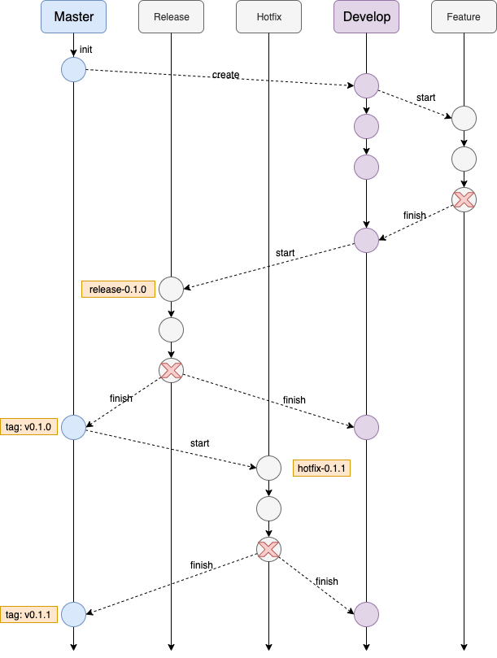

# 概念

- Master
  - 稳定分支
  - <font color=red>长存</font>
  - 只从Hotfix和Release分支合并，不会直接commit
  - 经过测试的分支，但不是最新的
- Develop
  - 开发分支
  - <font color=red>长存</font>
  - 未经过测试的分支，保持最新
- Feature
  - 特性分支
  - 开发特定需求且时间较长时建立，开发完成向Develop分支合并后删除
- Release
  - 发布分支
  - 测试时建立，测试完成合并后删除
  - 从Develop分支，是准备释出的版本，**只修改版本号与Bug**，完成后合并回Develop和Master分支，并在Master上标出版本号的tag
- Hotfix
  - 缺陷分支
  - 修复生产Bug时建立，修复完成合并后删除
  - 从Master分支，处理已释出版本需要立即修改的错误，完成后合并回Develop和Master分支，并在Master上标出版本号的tag


# 流程



# 命令

## create develop branch

```shell
# 以main为基准创建develop分支，并切换到develop分支
git checkout -b develop main
# 本地develop上传到远程分支（如果没有则创建），然后再关联upstream
git push -u origin develop
```


## Start new feature

```shell
# 以develop为基准创建feature分支，并切换到feature分支
git checkout -b some-feature develop
# 可选提交到远程
git push -u origin some-feature

git status
git add some-file
git commit
```


## finish the feature

```shell
# 合并前先更新，保证提交不冲突
git pull origin develop
git checkout develop
# 关闭fast-forward模式，保留分支commit信息
git merge --no-ff some-feature
git push origin develop

# 删除本地feature分支
git branch -d some-feature
# 删除远程feature分支，如有
git push origin --delete some-feature
```


## Start new release

```shell
git checkout -b release-0.1.0 develop
```


## Finish the release

```shell
git pull origin master
git checkout master
git merge --no-ff release-0.1.0
git push

git pull origin develop
git checkout develop
git merge --no-ff release-0.1.0
git push

# 删除本地release分支
git branch -d release-0.1.0
# 删除远程release分支（如有）
git push origin --delete release-0.1.0

# 给当前master版本打上tag（必须输入message版本信息）
git tag -a v0.1.0 master
# 提交到远程
git push --tags
```


## Start new hotfix

```shell
git checkout -b hotfix-0.1.1 master
```


## Finish the hotfix

```shell
git pull origin master
git checkout master
git merge --no-ff hotfix-0.1.1
git push

git pull origin develop
git checkout develop
git merge --no-ff hotfix-0.1.1
git push

# 删除本地hotfix分支
git branch -d hotfix-0.1.1

git tag -a v0.1.1 master
git push --tags
```

